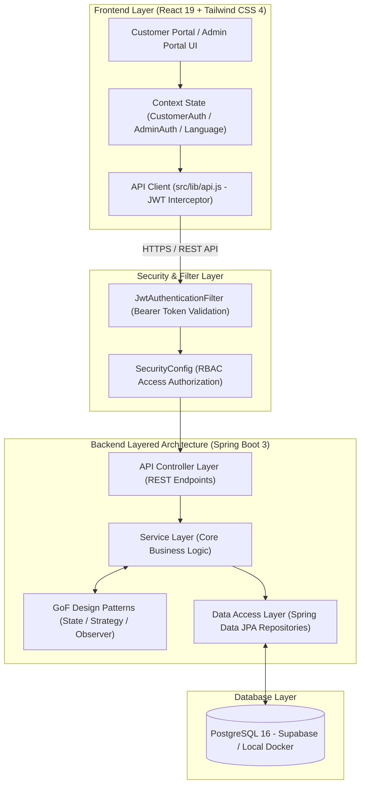
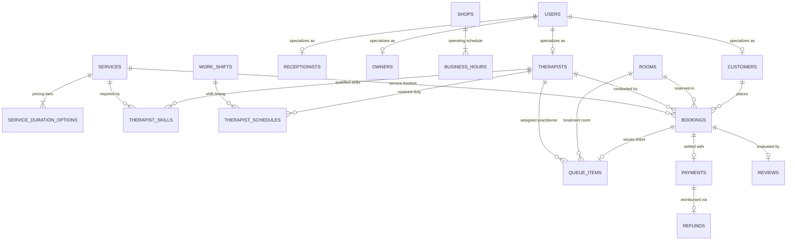

# FIWDEE — Massage Management & Booking System

ระบบบริหารจัดการร้านนวดแผนไทยและสปาแบบครบวงจร (Web-based Application) ที่เชื่อมโยงการจองคิวออนไลน์ของลูกค้าเข้ากับการจัดการคิวสดหน้าร้านแบบ Real-time รองรับการจัดสรรห้องนวดและหมอนวดตามความเชี่ยวชาญ พร้อมระบบทำความสะอาดห้อง 15 นาทีอัตโนมัติ ออกแบบตามสถาปัตยกรรม Layered Architecture บน Spring Boot 3 และ React 19 โดยประยุกต์ใช้ GoF Design Patterns (State, Strategy, Observer) เพื่อประสิทธิภาพ ความถูกต้องของข้อมูล และความปลอดภัยระดับองค์กร

---

## สมาชิกกลุ่ม

| ลำดับ | ชื่อ-นามสกุล | รหัสนักศึกษา | Section | Branch | หน้าที่รับผิดชอบ |
|:---:|---|:---:|:---:|---|---|
| 1 | นายชาคริต พุกมี | 673380265-8 | 2 | `chakrit_673380265-8_sec2` | Authentication, Spring Security (JWT RBAC), User Management (`/admin/users`), Customer Profile & Booking History, Design and Develop Frontend Landing Page For Customer |
| 2 | นายวิภู หิรัญรัศมี | 673380291-7 | 2 | `viphu_673380291-7_sec2` | Core Booking Engine, Availability Engine (Slot & Cleaning Buffer), GoF State Pattern, GoF Strategy Pattern (Payment & Discount), Financial Reports (`/admin/reports/*`), Cloud PaaS Deployment |
| 3 | นายฐิติศักดิ์ บุญมี | 673380035-5 | 2 | `Titisak_673380035-5_sec2` | **Dev 4:** Front-Desk Queue Management, GoF Observer Pattern (Queue & Notifications), Service Execution, Customer Review System (`/reviews`), ปรับแต่งธีม Admin UI (Serene Thai Sanctuary) |
| 4 | นายศุภเชษฐ์ ฤทธิ์คำรพ | 673380063-0 | 2 | `supached_673380063-0_sec2` | **Dev 2:** Shop Catalog (`/services`), Resource Management (Rooms, Therapists, Skills), Work Schedules & Shifts, Data Seeder & Database Migration Script (`schema.sql`, `data.sql`) |
| 5 | นายปิยชยานันท์ ทองดอนพุ่ม | 673380049-4 | 2 | `piyachayanin_673380049-4_sec2` | Automated Testing (36 Unit Tests + 12 Integration Tests), Test Design Documentation (`.xlsx`), Defect Tracking & Verification (DEF-001 ถึง DEF-019), Performance & Bug Fixing |

---

## Tech Stack

### Backend
- **Framework:** Spring Boot 3.x (Java 17)
- **Security:** Spring Security 6 + JJWT (JSON Web Token) สำหรับ Stateless Role-Based Access Control (RBAC)
- **Persistence & ORM:** Spring Data JPA + Hibernate 6
- **Database Engine:** PostgreSQL 16 (Relational Database, Third Normal Form - 3NF)
- **API Documentation:** SpringDoc OpenAPI 3 + Swagger UI (v2.8.5)
- **Build Tool:** Apache Maven (Wrapper `./mvnw`)

### Frontend
- **Framework & Runtime:** React 19 + Vite 8
- **Styling:** Tailwind CSS 4 + Custom Design Tokens (Serene Thai Sanctuary Theme)
- **Animation & Transitions:** Motion / React (AnimatePresence, motion.div)
- **Internationalization (i18n):** ระบบสองภาษา TH/EN แบบไดนามิก (`src/i18n`)
- **Routing:** HashRouter (`#...`) สำหรับ SPA Navigation ไร้ปัญหา 404 บน Static CDN Hosting
- **HTTP Client:** Fetch API Wrapper with Automatic JWT Bearer Token Injection (`src/lib/api.js`)

### DevOps & Cloud Infrastructure
- **Containerization:** Docker Engine + Multi-stage Dockerfile + Docker Compose
- **Database Hosting:** Supabase Cloud Platform (PostgreSQL 16 Serverless, Singapore Region)
- **Backend Hosting:** Render.com (Container Runtime Environment, Singapore Region)
- **Frontend Hosting:** Vercel Global Anycast Edge Network (CDN)

---

## System Architecture

ระบบใช้สถาปัตยกรรม **Client-Server แยกส่วน (Decoupled Architecture)** และฝั่ง Backend พัฒนาตามแนวทาง **Layered Architecture (สถาปัตยกรรมแบบแบ่งชั้น)** และ **Clean Architecture Principles**:



### การประยุกต์ใช้ GoF Design Patterns
1. **State Pattern (`com.fiwdee.pattern.state`):** ควบคุมวงจรชีวิตการจองทั้ง 7 สถานะ (`Pending` → `Confirmed` → `CheckedIn` → `InService` → `Completed`, `Cancelled`, `NoShow`) พร้อม Invariant Guards ป้องกันการเปลี่ยนสถานะผิดกฎ
2. **Strategy Pattern (`com.fiwdee.pattern.strategy`):**
   - **Payment Strategies:** รองรับชำระผ่าน `QRPaymentStrategy` (PromptPay), `CashPaymentStrategy`, และ `CardPaymentStrategy`
   - **Discount Strategies:** คำนวณโปรโมชั่นฝั่ง Server ตามหลัก Open/Closed Principle เช่น `PercentageDiscountStrategy` (`FIWDEE20` ลด 20%)
3. **Observer Pattern (`com.fiwdee.pattern.observer`):** ส่งผ่านเหตุการณ์การเช็คอิน (`BookingStatusChangedEvent`) สู่ `QueueListener` เพื่อออกบัตรคิวสด `Q-XXX` และส่งการแจ้งเตือนอัตโนมัติ

---

## Database Design (ER Diagram)

ฐานข้อมูลได้รับการออกแบบตามมาตรฐาน **Third Normal Form (3NF)** ประกอบด้วย 18 ตาราง โดยใช้กลยุทธ์ **Class Table Inheritance (Joined Strategy)** ในการสืบทอดข้อมูลผู้ใช้งาน (`User` → `Customer`, `Therapist`, `Receptionist`, `Owner`) เพื่อรักษาความสมบูรณ์ของข้อมูล (Data Integrity) สูงสุด



*รายละเอียด Database Schema และ Data Dictionary ฉบับสมบูรณ์:* [doc/er-diagram.md](doc/er-diagram.md)  
*ไฟล์แผนภาพต้นฉบับ:* [img/er-diagram.png](img/er-diagram.png) และ [doc/diagrams/er-diagram.puml](doc/diagrams/er-diagram.puml)

---

## Installation & Setup

### ข้อกำหนดเบื้องต้น (Prerequisites)
- **Java Development Kit (JDK):** Version 17 ขึ้นไป
- **Node.js:** Version 20.x ขึ้นไป และ npm
- **Docker & Docker Compose:** สำหรับรันฐานข้อมูลหรือรันระบบแบบ Containerized
- **Git:** สำหรับ Clone โค้ด

### การดาวน์โหลดโปรเจกต์
```bash
git clone https://github.com/viphu-cs/FIWDEE-CP353002-69_1PrinciplesOfSoftwareDesign.git
cd FIWDEE-CP353002-69_1PrinciplesOfSoftwareDesign
```

### การตั้งค่า Environment Variables
ไฟล์คอนฟิกูเรชันหลักอยู่ที่ Root Directory (`.env`):
```properties
# Database Configuration (PostgreSQL)
SPRING_DATASOURCE_URL=jdbc:postgresql://localhost:5432/fiwdee_db
SPRING_DATASOURCE_USERNAME=postgres
SPRING_DATASOURCE_PASSWORD=postgres

# JWT Security Secret
FIWDEE_JWT_SECRET=404E635266556A586E3272357538782F413F4428472B4B6250645367566B5970
FIWDEE_JWT_EXPIRATION_MS=86400000

# Frontend API URL
VITE_API_URL=http://localhost:8080/api
```

---

## How to Run

### วิธีที่ 1: รันด้วย Docker Compose (แนะนำสำหรับทดสอบทั้งระบบ)
คำสั่งเดียวเพื่อรันทั้งฐานข้อมูล PostgreSQL, Backend Spring Boot และ Frontend React:
```bash
docker compose up -d --build
```
- **Frontend Web Application:** http://localhost:3000
- **Backend REST API:** http://localhost:8080/api
- **Swagger UI:** http://localhost:8080/swagger-ui.html

---

### วิธีที่ 2: รันแบบ Local Development (แยกส่วนพัฒนา)

#### 1. เริ่มต้นฐานข้อมูล PostgreSQL
```bash
docker compose up -d postgres
```

#### 2. รัน Backend (Spring Boot 3)
```bash
cd code/backend
./mvnw spring-boot:run     # บน macOS / Linux
mvnw.cmd spring-boot:run   # บน Windows
```
*Backend จะพร้อมให้บริการที่พอร์ต `8080` พร้อม Seed ข้อมูลเริ่มต้นให้อัตโนมัติ*

#### 3. รัน Frontend (React 19 + Vite)
```bash
cd code/frontend
npm install
npm run dev
```
*Frontend จะพร้อมให้บริการที่ `http://localhost:5173` (หรือตามพอร์ตที่ Vite กำหนด)*

---

### บัญชีผู้ใช้สำหรับทดสอบระบบ (Default Test Accounts)
ระบบมี Data Seeder สร้างบัญชีทดสอบครอบคลุมทุกบทบาทให้อัตโนมัติ:

| บทบาท (Role) | บัญชีผู้ใช้ (Identifier) | รหัสผ่าน | ขอบเขตการทดสอบ |
|---|---|---|---|
| **ผู้จัดการ (OWNER)** | `owner@fiwdee-massage.co.th` | `admin1234` | ดูแดชบอร์ดรายได้รวม, สรุปสถิติผู้ใช้ทั้งหมด, จัดการห้อง/บริการ/หมอนวด |
| **พนักงานต้อนรับ (RECEPTIONIST)** | `reception@fiwdee-massage.co.th` | `recep1234` | เช็คอินลูกค้า, ออกบัตรคิวสดหน้าร้าน, เรียกคิว, สั่งเริ่ม/จบบริการ |
| **หมอนวด (THERAPIST)** | `therapist1@fiwdee-massage.co.th` | `therapist1234` | ดูตารางกะงาน 7 วัน, ดูรายการคิวงานของตนเอง, ดูค่าคอมมิชชันสะสม |
| **ลูกค้า (CUSTOMER)** | `customer@test.com` | `customer1234` | จองคิวออนไลน์, ชำระเงิน, ดูประวัติการจองและใบเสร็จ, รีวิวบริการ |

---

## API Documentation

Backend มีระบบสร้างเอกสาร API แบบ Interactive ผ่าน **SpringDoc OpenAPI 3 / Swagger UI**:

- **Local Swagger UI:** [http://localhost:8080/swagger-ui.html](http://localhost:8080/swagger-ui.html)
- **Production Swagger UI:** [https://fiwdee-backend.onrender.com/swagger-ui.html](https://fiwdee-backend.onrender.com/swagger-ui.html)
- **OpenAPI JSON Specification:** `/v3/api-docs`
- **Postman Collection:** `postman/FIWDEE_ALL_ROLES_MASTER_COLLECTION.postman_collection.json`

### สรุป REST Endpoints หลักแยกตามโมดูล

| หมวดหมู่ | Method | Endpoint | สิทธิ์เข้าถึง | คำอธิบาย |
|---|:---:|---|:---:|---|
| **Auth** | `POST` | `/api/auth/register` | Public | ลงทะเบียนสมาชิกลูกค้าใหม่ (Auto-login) |
| | `POST` | `/api/auth/login` | Public | เข้าสู่ระบบ (รับ email/username/phone คืน JWT) |
| | `GET` | `/api/auth/me` | Authenticated | ดูข้อมูลโปรไฟล์ส่วนตัวของผู้ใช้ปัจจุบัน |
| | `PUT` | `/api/auth/me` | Authenticated | แก้ไขข้อมูลส่วนตัวและเปลี่ยนรหัสผ่าน |
| **Catalog** | `GET` | `/api/services` | Public | รายการบริการนวดพร้อมตัวเลือกระยะเวลาและราคา |
| | `GET` | `/api/therapists` | Public | รายชื่อหมอนวด ประวัติ และทักษะความเชี่ยวชาญ |
| **Booking** | `GET` | `/api/bookings/availability` | Public | คำนวณช่วงเวลาว่าง (Availability + Cleaning Buffer) |
| | `POST` | `/api/bookings` | Customer / Staff | สร้างการจองใหม่ (Optimistic Lock ป้องกันจองชน) |
| | `GET` | `/api/bookings/my` | Authenticated | ประวัติการจองของตนเองทั้งหมด |
| | `PATCH` | `/api/bookings/{id}/cancel` | Customer / Staff | ขอยกเลิกการจอง (ตรวจนโยบายล่วงหน้า $\ge 2$ ชม.) |
| **Front-Desk**| `PATCH` | `/api/bookings/{id}/check-in` | Receptionist | เช็คอินลูกค้าและออกบัตรคิวสดหน้าร้าน |
| | `GET` | `/api/admin/queue` | Receptionist / Owner | ดึงรายการคิวสดประจำวัน |
| | `POST` | `/api/admin/queue/call-next`| Receptionist | เรียกคิวถัดไปเข้ารับบริการ |
| | `PATCH` | `/api/admin/queue/{id}/status`| Receptionist | เปลี่ยนสถานะคิว (`IN_SERVICE`, `COMPLETED`) |
| **Therapist** | `GET` | `/api/therapist/me/schedule` | Therapist | ตารางกะงานและคิวนัดหมายของตนเอง (Read-only) |
| **Payment** | `POST` | `/api/bookings/{id}/payment` | Customer / Staff | ชำระเงิน (PromptPay, Cash, Card) ผ่าน Strategy |
| | `POST` | `/api/payments/promotions/validate` | Public | คำนวณส่วนลดโปรโมชั่นที่ Server ผ่าน Strategy |
| | `GET` | `/api/payments/{id}/receipt`| Customer / Staff | ออกใบเสร็จรับเงินอย่างเป็นทางการ |
| | `POST` | `/api/payments/{id}/refund` | Owner / Receptionist | บันทึกการขอคืนเงิน (Immutable Audit Record) |
| **Review** | `POST` | `/api/bookings/{id}/review` | Customer | ส่งคะแนนรีวิว 5 ดาว 3 ด้าน (เฉพาะงานที่สำเร็จ) |
| **Reports** | `GET` | `/api/admin/reports/dashboard`| Owner | สรุปยอดขาย อัตราการครองห้อง และสถิติภาพรวม |
| | `GET` | `/api/admin/reports/revenue` | Owner | รายงานรายได้แยกตามช่วงเวลา |
| | `GET` | `/api/admin/reports/commissions`| Owner | สรุปยอดค่าคอมมิชชันและค่ามือหมอนวดทุกคน |
| **Users** | `GET` | `/api/admin/users` | Owner | รายชื่อผู้ใช้ทั้งหมด สถิติ Active/Online sessions |
| | `POST` | `/api/admin/users/{id}/force-logout` | Owner | บังคับให้ผู้ใช้งานออกจากระบบทันที |

---

## How to Run Tests

ระบบทดสอบได้รับการออกแบบตามมาตรฐาน **Test-Driven Design (Decision Table & Equivalence Partitioning)** ครอบคลุม Unit Test 36 ชุด และ Integration Test 12 ชุด:

```bash
cd code/backend
```

### 1. รันชุดทดสอบ Unit Test ทั้งหมด (36 Test Classes)
ทดสอบ Business Logic, State Transitions, Strategy Factory, Mappers และ Services แบบ Isolated ด้วย Mockito:
```bash
./mvnw test -Dtest=UT*
```

### 2. รันชุดทดสอบ Integration Test ทั้งหมด (12 Test Classes)
ทดสอบ Data JPA Mapping, Database Constraints, JWT Security Filter, Error Contracts และ End-to-End API Flow:
```bash
./mvnw test -Dtest=IT*
```

### 3. รันการทดสอบทั้งหมดในระบบ (All Tests)
```bash
./mvnw test
```

### 4. เอกสารและรายงานผลการทดสอบ
- **Unit Test Design & Specification:** [`test/FIWDEE_UnitTest_Design.xlsx`](test/FIWDEE_UnitTest_Design.xlsx)
- **Integration Test Design & Defect Report:** [`test/FIWDEE_IntegrationTest_Design.xlsx`](test/FIWDEE_IntegrationTest_Design.xlsx)
- **SOLID & Design Pattern Verification:** [`doc/solid-analysis.md`](doc/solid-analysis.md) และ [`doc/design-patterns.md`](doc/design-patterns.md)

---

## Deployment URL

ระบบได้รับการติดตั้งและเปิดให้เข้าถึงผ่านระบบคลาวด์สาธารณะ (Production Environment):

| ส่วนประกอบของระบบ | ผู้ให้บริการคลาวด์ | Production URL / Host |
|---|---|---|
| **Frontend Web Application** | Vercel Edge CDN | [https://fiwdee.vercel.app](https://fiwdee.vercel.app) |
| **Backend REST API** | Render.com (Singapore) | [https://fiwdee-backend.onrender.com/api](https://fiwdee-backend.onrender.com/api) |
| **Interactive Swagger Documentation** | Render.com | [https://fiwdee-backend.onrender.com/swagger-ui.html](https://fiwdee-backend.onrender.com/swagger-ui.html) |
| **Database Server** | Supabase PostgreSQL 16 | `aws-0-ap-southeast-1.pooler.supabase.com` |

*รายละเอียดสถาปัตยกรรมคลาวด์และการเชื่อมต่อ:* [doc/deployment-diagram.md](doc/deployment-diagram.md)

---

## Project Structure

โครงสร้างไดเรกทอรีของโปรเจกต์จัดวางตามมาตรฐาน Separation of Concerns:

```
FIWDEE-CP353002-69_1PrinciplesOfSoftwareDesign/
├── code/
│   ├── backend/                         # Spring Boot Application (Java 17)
│   │   ├── pom.xml                      # Maven Dependencies (Spring Boot, JJWT, OpenAPI)
│   │   └── src/
│   │       ├── main/
│   │       │   ├── java/com/fiwdee/
│   │       │   │   ├── common/          # ApiResponse, PageDTO
│   │       │   │   ├── config/          # SecurityConfig, JwtTokenProvider, OpenApiConfig, Seeder
│   │       │   │   ├── controller/api/  # REST API Controllers (13 Controllers)
│   │       │   │   ├── domain/
│   │       │   │   │   ├── entity/      # 18 JPA Entities
│   │       │   │   │   └── enums/       # 9 Domain Enums
│   │       │   │   ├── dto/             # Request & Response DTOs
│   │       │   │   ├── exception/       # GlobalExceptionHandler & Business Exceptions
│   │       │   │   ├── mapper/          # Entity <-> DTO Mappers
│   │       │   │   ├── pattern/
│   │       │   │   │   ├── observer/    # GoF Observer (QueueListener, NotificationListener)
│   │       │   │   │   ├── state/       # GoF State (Booking Lifecycle 7 States)
│   │       │   │   │   └── strategy/    # GoF Strategy (Payment & Discount Strategy Engine)
│   │       │   │   ├── repository/      # 18 Spring Data JPA Repositories
│   │       │   │   └── service/         # Service Interfaces & Implementations
│   │       │   └── resources/
│   │       │       ├── application.properties # Spring Boot Configuration
│   │       │       ├── schema.sql       # DDL 18 Tables & Indexes
│   │       │       └── data.sql         # Idempotent Master Data Seeder
│   ├── frontend/                        # React 19 SPA (Vite + Tailwind CSS 4)
│   │   ├── package.json
│   │   ├── vite.config.js
│   │   └── src/
│   │       ├── admin/                   # Admin Portal (Dashboard, Queue, Bookings, Rooms, etc.)
│   │       ├── components/              # UI Components (Navbar, Footer, Modals, Cards)
│   │       ├── context/                 # CustomerAuthContext, AdminAuthContext, LanguageContext
│   │       ├── i18n/                    # TH/EN Localization files
│   │       ├── lib/                     # api.js (Fetch API Wrapper with JWT)
│   │       ├── pages/                   # Landing, Services, Therapists, Booking Wizard, Profile
│   │       ├── services/                # bookingService.js, skillMatcher.js
│   │       └── App.jsx                  # Main Routing & Access Guards
├── doc/                                 # เอกสารการวิเคราะห์และออกแบบระบบทั้งหมด
│   ├── diagrams/                        # ไฟล์นิยาม PlantUML (.puml) ครบทั้ง 9 ไดอะแกรม
│   ├── activity-diagram.md              # Operational Lifecycles
│   ├── class-diagram.md                 # Design Patterns & Package Layout
│   ├── codebase-summary.md              # สรุปภาพรวมโค้ดและคู่มืออธิบายสถาปัตยกรรม
│   ├── component-diagram.md             # Subsystem Components & Dependencies
│   ├── deployment-diagram.md            # Cloud PaaS Architecture
│   ├── design-patterns.md               # GoF Patterns Implementation Report
│   ├── domain-model.md                  # Domain Entities & Business Rules
│   ├── er-diagram.md                    # Database Schema (3NF) Specification
│   ├── sequence-diagram.md              # 3 Core Scenarios Sequences
│   ├── solid-analysis.md                # การวิเคราะห์หลักการ SOLID ทั้ง 5 ด้าน
│   ├── state-diagram.md                 # UML State Machine Specification
│   ├── system-requirements.md           # SRS Document (Customer & Admin Journey)
│   └── use-case.md                      # UC-01 ถึง UC-28 Specifications
├── img/                                 # แผนภาพไดอะแกรมที่ Export เป็นรูปภาพ (.png)
├── postman/                             # Postman Collection สำหรับทดสอบ API
├── test/                                # เอกสารและ Source Code การทดสอบ
│   ├── code/java/com/fiwdee/            # Test Code (36 Unit Tests + 12 Integration Tests)
│   ├── FIWDEE_UnitTest_Design.xlsx      # แผนและผลการทดสอบ Unit Test
│   └── FIWDEE_IntegrationTest_Design.xlsx # แผนและผลการทดสอบ Integration Test
├── docker-compose.yml                   # Docker Compose Configuration
├── Dockerfile                           # Backend Container Build Definition
├── README.md                            # เอกสารแนะนำและสรุปโปรเจกต์ฉบับหลัก
├── TASKS.md                             # แผนการพัฒนาและ Checklist ติดตามความคืบหน้า
├── TEST_ACCOUNTS.md                     # บัญชีทดสอบทุกบทบาท
└── BACKEND_TEAM_ROLES.md                # ข้อตกลงการแบ่งงานและขอบเขตความรับผิดชอบ
```
