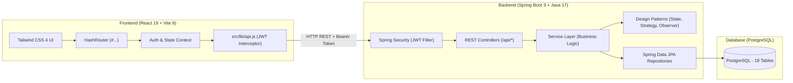
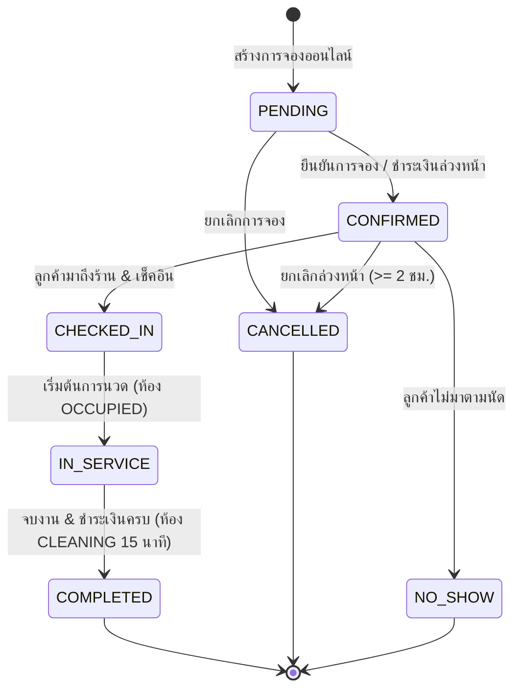

# คู่มือสรุปภาพรวมซอร์สโค้ดระบบ FIWDEE (Codebase Architectural Summary)

> **เอกสารฉบับนี้จัดทำขึ้นเพื่อ:** สรุปโครงสร้าง สถาปัตยกรรม ลำดับการทำงาน และโค้ดทุกส่วนของระบบ **FIWDEE — Massage Management & Booking System** เพื่อให้อ่านเข้าใจง่าย เห็นภาพรวมความเชื่อมโยงทั้งระบบ และสามารถนำไปอธิบายหรือพรีเซนต์ได้อย่างเป็นมืออาชีพ

---

## สารบัญ (Table of Contents)
1. [ภาพรวมของระบบและขอบเขตทางธุรกิจ (Domain & Overview)](#1-ภาพรวมของระบบและขอบเขตทางธุรกิจ)
2. [สถาปัตยกรรมระบบโดยรวม (High-Level Architecture)](#2-สถาปัตยกรรมระบบโดยรวม)
3. [โครงสร้างและซอร์สโค้ดฝั่ง Backend (Spring Boot 3)](#3-โครงสร้างและซอร์สโค้ดฝั่ง-backend)
4. [การประยุกต์ใช้ Design Patterns ในโปรเจกต์](#4-การประยุกต์ใช้-design-patterns-ในโปรเจกต์)
5. [โครงสร้างและซอร์สโค้ดฝั่ง Frontend (React 19 + Tailwind 4)](#5-โครงสร้างและซอร์สโค้ดฝั่ง-frontend)
6. [ลำดับการทำงานหลักของระบบ (End-to-End Key User Journeys)](#6-ลำดับการทำงานหลักของระบบ)
7. [คู่มือการอธิบายและตอบคำถามการออกแบบ (Presentation & Defense Guide)](#7-คู่มือการอธิบายและตอบคำถามการออกแบบ)

---

## 1. ภาพรวมของระบบและขอบเขตทางธุรกิจ

### 1.1 วัตถุประสงค์ของระบบ
**FIWDEE (ฟิวดี)** คือระบบบริหารจัดการร้านนวดแผนไทยและสปาแบบครบวงจร พัฒนาขึ้นภายใต้วิชา **CP353002-69 Principles of Software Design** ครอบคลุมทั้ง:
1. **Customer Self-Service:** การจองคิวออนไลน์ผ่านหน้าเว็บ, ตรวจสอบช่วงเวลาว่าง, เลือกหมอนวดตามความเชี่ยวชาญ, ชำระเงิน (PromptPay/บัตรเครดิต/หน้าร้าน), ดูประวัติการจอง และเขียนรีวิว
2. **Front-Desk Queue Management:** ระบบจัดการคิวสดหน้าร้านสำหรับพนักงานต้อนรับ, เช็คอินลูกค้าที่จองล่วงหน้า, ลงทะเบียน Walk-in/โทรจอง, ออกบัตรคิว, เรียกคิว, และจัดสรรห้องนวด
3. **Operations & Back-Office:** ผังห้องนวดแบบ Real-time พร้อมนับเวลาทำความสะอาดห้อง 15 นาทีอัตโนมัติ, ตารางเวรและค่าคอมมิชชันหมอนวด, และรายงานสถิติรายได้สำหรับผู้จัดการร้าน

### 1.2 ผู้ใช้งาน 4 บทบาท (Role-Based Access Control)
| บทบาท (Role) | สิทธิ์และหน้าที่การทำงาน (Permissions & Scope) |
|---|---|
| **OWNER (เจ้าของร้าน / ผู้จัดการ)** | เข้าถึงระบบหลังบ้านได้ทุกส่วน ดูรายงานรายได้ (`/reports/*`), จัดการข้อมูลผู้ใช้ทั้งหมด (`/admin/users`), แก้ไขเมนูบริการ ห้องนวด และข้อมูลหมอนวด |
| **RECEPTIONIST (พนักงานต้อนรับ)** | จัดการคิวสดหน้าร้าน (`/admin/queue`), เช็คอินลูกค้า, ออกบัตรคิว Walk-in, เรียกคิว, จัดหมอนวดและห้องนวด, สั่งเริ่มบริการและจบงาน (ไม่มีสิทธิ์ดูยอดรายได้รวมของร้านและจัดการผู้ใช้) |
| **THERAPIST (หมอนวดผู้ให้บริการ)** | ดูตารางกะงาน 7 วันของตนเอง (`/admin/therapist-schedule`), ดูรายการนัดหมายที่ได้รับมอบหมายในแต่ละวันแบบ Read-only, และดูยอดรายได้ค่ามือ/คอมมิชชันสะสมของตนเอง (`/admin/therapist-earnings`) |
| **CUSTOMER (ลูกค้าผู้รับบริการ)** | ใช้งานหน้าเว็บหลัก จองคิวออนไลน์ ชำระเงิน จัดการโปรไฟล์ และดูประวัติการจองพร้อมใบเสร็จและส่งรีวิว |

### 1.3 กฎทางธุรกิจสำคัญ (Key Business Invariants)
- **Dynamic Capacity (ห้าม Hard-code):** ร้านมี 6 ห้องนวด และหมอนวด 6-7 คน แต่ขนาดความจุ ราคา ระยะเวลา และเวลาเปิด-ปิดร้านทั้งหมดถูกดึงจากฐานข้อมูลแบบไดนามิก
- **Cleaning Buffer 15 นาที:** เมื่อการนวดเสร็จสิ้น ห้องนวดจะเข้าสู่สถานะ `CLEANING` อัตโนมัติเป็นเวลา 15 นาที เพื่อทำความสะอาดและฆ่าเชื้อ ก่อนจะกลับมาพร้อมใช้งาน (`AVAILABLE`)
- **Optimistic Locking (`@Version`):** เอนทิตี `Booking` มีฟิลด์เวอร์ชัน เพื่อป้องกันปัญหาการจองห้องนวดหรือหมอนวดซ้ำซ้อนในเวลาเดียวกัน (Concurrency Collision)
- **Immutable Financial Audit:** เอนทิตี `Payment` และ `Refund` เป็นบันทึกทางบัญชีแบบไม่แก้ไขทับ (Immutable Audit Trail) บันทึกแล้วไม่มีการ `UPDATE` แต่จะใช้วิธีสร้างรายการหักล้าง (`Refund`) แทน

---

## 2. สถาปัตยกรรมระบบโดยรวม (High-Level Architecture)

ระบบใช้สถาปัตยกรรม **Client-Server แยกส่วน (Decoupled Architecture)** สื่อสารผ่าน RESTful API ด้วยรูปแบบ JSON:



### มาตรฐานการสื่อสาร (API Contract)
- **Base URL:** `/api`
- **Authentication:** `Authorization: Bearer <JWT_TOKEN>`
- **โครงสร้าง Response มาตรฐาน (`ApiResponse<T>`):**
  ```json
  {
    "success": true,
    "message": "ข้อความแสดงผลสำเร็จ",
    "data": { ... }
  }
  ```
  กรณีเกิด Error:
  ```json
  {
    "success": false,
    "message": "ข้อความแจ้งเตือนข้อผิดพลาด",
    "errors": [ "รายละเอียดเพิ่มเติม" ]
  }
  ```

---

## 3. โครงสร้างและซอร์สโค้ดฝั่ง Backend (Spring Boot 3)

Backend วางโครงสร้างแบบ **Layered Architecture (สถาปัตยกรรมแบบแบ่งชั้น)** เพื่อแยกความรับผิดชอบอย่างเคร่งครัดตามหลัก Separation of Concerns:

```
code/backend/src/main/java/com/fiwdee/
├── domain/              # แกนกลางของโดเมน (Domain Entities & Enums)
│   ├── entity/          # 18 JPA Entities (ตารางฐานข้อมูล)
│   └── enums/           # 9 Enums กำหนดสถานะและประเภท
├── repository/          # Data Access Layer (Spring Data JPA 18 Repositories)
├── service/             # Business Logic Interfaces
│   └── impl/            # Implementation ของ Services ต่างๆ
├── controller/api/      # REST API Endpoints (13 คอนโทรลเลอร์)
├── dto/                 # Data Transfer Objects
│   ├── request/         # ข้อมูลที่รับเข้ามา (Payload Input)
│   └── response/        # ข้อมูลที่ตอบกลับออกไป (Payload Output)
├── mapper/              # ตัวแปลง Entity <-> DTO (MapStruct / Manual Mappers)
├── pattern/             # การนำ GoF Design Patterns มาประยุกต์ใช้งาน
│   ├── state/           # State Pattern (วงจรชีวิต Booking 7 สถานะ)
│   ├── strategy/        # Strategy Pattern (ระบบชำระเงิน + ระบบโปรโมชั่น)
│   └── observer/        # Observer Pattern (Event-driven Notification & Queue)
├── config/              # คอนฟิกูเรชัน (Security, JWT, OpenAPI/Swagger, Cors, DB Seed)
├── common/              # คลาสช่วยเหลือส่วนกลาง (ApiResponse, PageDTO)
└── exception/           # Exception Handling กลาง (@RestControllerAdvice)
```

### 3.1 แกนกลางข้อมูล (Domain Entities & Database Tables)
ระบบประกอบด้วย 18 ตารางที่สัมพันธ์กัน:
1. `User` — ตารางผู้ใช้งานหลัก (เก็บ username, email, phone, passwordHash, role, lastLoginAt)
2. `Customer` — ข้อมูลเฉพาะลูกค้า (healthNotes, preferredPressure)
3. `Therapist` — ข้อมูลหมอนวด (bio, commissionRate, rating, imageUrl, status)
4. `Receptionist` & `Owner` — บุคลากรฝั่งร้าน
5. `Shop` & `BusinessHours` — ข้อมูลร้านและเวลาเปิดทำการ 7 วัน
6. `Service` & `ServiceDurationOption` — บริการและตัวเลือกระยะเวลา/ราคา (เช่น นวดไทย 60 นาที 500 บาท, 90 นาที 750 บาท)
7. `Room` — ห้องนวด 6 ห้อง (RoomType: TRADITIONAL_THAI, AROMATHERAPY, VIP_SUITE)
8. `TherapistSkill` — ตารางความสัมพันธ์ทักษะของหมอนวดกับบริการที่ทำได้
9. `WorkShift` & `TherapistSchedule` — ตารางกะงาน (กะเช้า, กะบ่าย, เต็มวัน, วันหยุด)
10. `Booking` — ข้อมูลการจอง (bookingReferenceCode, startDateTime, endDateTime, status, totalPrice, optimistic lock `@Version`)
11. `QueueItem` — คิวสดหน้าร้าน (queueNumber เช่น Q-001, status, checkInTime, room, therapist)
12. `Payment` — บันทึกประวัติการชำระเงิน (paymentMethod, amount, paymentStatus, transactionReference)
13. `Refund` — บันทึกประวัติการคืนเงิน (refundAmount, reason, refundStatus)
14. `Review` — บันทึกรีวิวคะแนนความพึงพอใจ 5 ดาว (overall, therapist, cleanliness)

### 3.2 Services สำคัญ (Core Business Logic)
- **`BookingServiceImpl`:** หัวใจหลักของการจอง ควบคุมการสร้างการจอง ตรวจสอบการจัดสรรหมอนวดและห้องนวดโดยคำนวณ Availability ร่วมกับช่วงทำความสะอาด 15 นาที, การเปลี่ยนสถานะผ่าน State Pattern, และการยกเลิกการจองล่วงหน้า $\ge 2$ ชม.
- **`AvailabilityServiceImpl`:** ตรวจสอบช่วงเวลาที่ว่างจริง โดยคำนวณจากเวลาเปิดร้าน, กะทำงานของหมอนวด, ทักษะที่ตรงกับบริการ, ห้องนวดที่ว่าง, และช่วงเวลาทำความสะอาดห้อง
- **`QueueServiceImpl`:** ระบบออกคิวสด, การเช็คอินลูกค้านัดหมาย, การเรียกคิวถัดไป, และการปรับสถานะคิว
- **`PaymentServiceImpl`:** ประมวลผลการชำระเงินผ่าน GoF Strategy Pattern บันทึกประวัติ Payment แบบ Immutable และอัปเดตสถานะการจองเป็น `COMPLETED`
- **`UserServiceImpl` & `UserSessionService`:** จัดการบัญชีผู้ใช้, การเข้ารหัสรหัสผ่านด้วย BCrypt, การดึงสถิติผู้ใช้ออนไลน์ (In-Memory 15-Minute Window), และคำสั่งบังคับออกจากระบบ (Force Logout)

### 3.3 REST Controllers สำคัญ
- `AuthController`: ล็อกอิน (`/api/auth/login`), ลงทะเบียน (`/api/auth/register`), ข้อมูลโปรไฟล์ตนเอง (`/api/auth/me`)
- `BookingController`: ตรวจสอบช่วงเวลาว่าง (`/api/bookings/availability`), สร้างการจอง (`POST /api/bookings`), ประวัติการจองตนเอง (`GET /api/bookings/my`), ยกเลิกการจอง (`PATCH /api/bookings/{id}/cancel`)
- `FrontDeskController` & `QueueController`: เช็คอินหน้าร้าน (`/api/bookings/{id}/check-in`), คิวประจำวัน (`/api/admin/queue`), เรียกคิว (`/api/admin/queue/call-next`)
- `TherapistSelfController`: ตารางงานของหมอนวด (`/api/therapist/me/schedule`)
- `AdminReportController`: รายงานสถิติแดชบอร์ด (`/api/admin/reports/dashboard`), รายได้รวม (`/revenue`), ค่าคอมมิชชันหมอนวด (`/commissions`)
- `AdminResourceController`: CRUD ห้องนวด บริการ และหมอนวดพร้อมตารางกะงาน

---

## 4. การประยุกต์ใช้ Design Patterns ในโปรเจกต์

โปรเจกต์นี้ปฏิบัติตามหลักการออกแบบซอฟต์แวร์ขั้นสูง โดยนำ Gang of Four (GoF) Design Patterns มาใช้งาน 3 กลุ่มหลัก:

### 4.1 State Pattern (`com.fiwdee.pattern.state`)
ใช้ควบคุมวงจรชีวิตของการจอง (`Booking`) เพื่อป้องกันไม่ให้เกิดสถานะที่ไม่ถูกต้อง (Invalid State Transitions):



- **โครงสร้าง:** มี Interface `BookingState`, คลาสฐาน `AbstractBookingState` (ป้องกัน LSP Violation), คลาสสถานะย่อย 7 สถานะ (`PendingState`, `ConfirmedState`, `CheckedInState`, `InServiceState`, `CompletedState`, `CancelledState`, `NoShowState`), และ `BookingStateFactory`
- **Invariant Guard:** ใน `InServiceState` มีการตรวจสอบเงื่อนไขความถูกต้อง เช่น ลูกค้าต้องชำระเงินเรียบร้อยแล้วจึงจะเปลี่ยนสถานะเป็น `COMPLETED` ได้

### 4.2 Strategy Pattern (`com.fiwdee.pattern.strategy`)
ใช้สำหรับระบบที่มีอัลกอริทึมหลากหลายและต้องการขยายเพิ่มได้ในอนาคต (Open/Closed Principle):
1. **Payment Strategy (`PaymentStrategy`):**
   - `QRPaymentStrategy` — สร้างและยืนยันการชำระเงินผ่าน PromptPay QR Code
   - `CashPaymentStrategy` — บันทึกการชำระเงินสดที่เคาน์เตอร์หน้าร้าน
   - `CardPaymentStrategy` — บันทึกการชำระผ่านบัตรเครดิต
   - บริหารจัดการผ่าน `PaymentStrategyFactory`
2. **Discount Strategy Engine (`pattern.strategy.discount`):**
   - คำนวณส่วนลดโปรโมชั่นที่ฝั่ง Server เป็น Single Source of Truth
   - `PercentageDiscountStrategy` — เช่น โค้ด `FIWDEE20` ลด 20%
   - `FixedAmountDiscountStrategy` — ส่วนลดตามจำนวนเงินคงที่

### 4.3 Observer Pattern (`com.fiwdee.pattern.observer`)
ใช้สำหรับระบบสถาปัตยกรรมแบบ Event-Driven:
- เมื่อสถานะการจองเปลี่ยนผ่าน State Pattern หรือเมื่อมีการเช็คอิน คลาส Service จะกระจายเหตุการณ์ผ่าน Spring `ApplicationEventPublisher`
- **`QueueListener`:** ดักฟังเหตุการณ์การเช็คอิน เพื่อสร้างหมายเลขคิว `Q-XXX` และนำเข้าคิวสดหน้าร้านอัตโนมัติ
- **`NotificationListener`:** ดักฟังเหตุการณ์เพื่อเตรียมส่งการแจ้งเตือนแก่ผู้เกี่ยวข้อง

---

## 5. โครงสร้างและซอร์สโค้ดฝั่ง Frontend (React 19 + Tailwind 4)

Frontend พัฒนาด้วย React 19 และ Vite รองรับระบบสองภาษา (i18n TH/EN) ออกแบบภายใต้แนวคิด **Serene Thai Sanctuary Design System** (เรียบหรู อบอุ่น สงบ):

```
code/frontend/src/
├── pages/                   # หน้าจอหลักฝั่งลูกค้า (Customer Portal)
│   ├── landing/             # หน้าแรก (Hero, Services Highlight, Therapists, Map)
│   ├── services/            # หน้ารายการบริการทั้งหมดและอัตราค่าบริการ
│   ├── therapists/          # หน้ารายชื่อหมอนวดและโปรไฟล์เดี่ยว (#therapists/:id)
│   ├── booking/             # ตัวช่วยจองคิว 3 ขั้นตอน (Wizard) และประวัติการจอง (#my-bookings)
│   ├── profile/             # หน้าแก้ไขข้อมูลส่วนตัวลูกค้า (#profile)
│   └── auth/                # หน้าเข้าสู่ระบบ (#login) และสมัครสมาชิก (#register)
├── admin/                   # หน้าระบบจัดการหลังบ้าน (#admin/*)
│   ├── layouts/             # AdminLayout (Sidebar + Topbar + Route Guard)
│   ├── components/          # QuickActionModal, StatusBadge, AdminTopbar, AdminSidebar
│   └── pages/               # Dashboard, Queue, Bookings, Rooms, Therapists, Services, Users,
│                            # TherapistSchedule, TherapistEarnings
├── context/                 # State กลาง: CustomerAuthContext, AdminAuthContext
├── i18n/                    # ระบบสลับภาษา TH/EN (`locales/th.js`, `locales/en.js`)
├── services/                # bookingService.js, skillMatcher.js (Two-Way Skill Matching)
├── lib/                     # api.js (Fetch wrapper แนบ JWT อัตโนมัติ)
└── App.jsx                  # จุดรวม Routing (HashRouter) และ Role Access Guard
```

### 5.1 ระบบตรวจสอบทักษะหมอนวดสองทาง (Two-Way Skill Matcher)
ไฟล์ [`skillMatcher.js`](file:///Users/chakritpukmee/Coding/Project/FIWDEE-CP353002-69_1PrinciplesOfSoftwareDesign/code/frontend/src/services/skillMatcher.js) ทำหน้าที่ตรวจสอบความเข้ากันได้ระหว่างบริการและหมอนวด:
- **กรณีเลือกหมอนวดก่อน:** บริการที่หมอนวดคนนั้นไม่มีทักษะจะถูก Disable และลด Opacity พร้อมมีป้ายเตือน "หมอนวดท่านนี้ไม่เชี่ยวชาญบริการนี้"
- **กรณีเลือกบริการก่อน:** การ์ดหมอนวดที่มีทักษะตรงกับบริการจะแสดงป้ายเด่น "ตรงตามความเชี่ยวชาญของหมอนวด" พร้อมปุ่มกรองเฉพาะหมอนวดที่ทำบริการนี้ได้

### 5.2 การควบคุมสิทธิ์หน้าจอหลังบ้าน (Admin Role Guard)
ใน [`AdminLayout.jsx`] และ [`App.jsx`]
- **OWNER:** มองเห็นเมนูทั้งหมด 7 เมนู (Dashboard, Queue, Bookings, Rooms, Therapists, Services, Users)
- **RECEPTIONIST:** มองเห็น 6 เมนู (ซ่อน Users และ Dashboard ไม่แสดงยอดเงินรวม)
- **THERAPIST:** มองเห็นเฉพาะ 2 เมนู:
  1. `ตารางกะงานของฉัน` (`#admin/therapist-schedule`) — ดูเวร 7 วัน และคิวนัดหมายวันนี้แบบ Read-only
  2. `รายได้ & ค่าคอมมิชชัน` (`#admin/therapist-earnings`) — ดูยอดค่ามือและค่าคอมมิชชันสะสมของตนเอง
  - **ซ่อนปุ่มเพิ่มคิวใหม่:** ปุ่ม `+ เพิ่มคิวใหม่` บน Topbar จะถูกซ่อนสำหรับบทบาทหมอนวด และหมอนวดไม่มีปุ่มกดเริ่มงาน/จบงาน (พนักงานต้อนรับเป็นผู้จัดการ)

---

## 6. ลำดับการทำงานหลักของระบบ (End-to-End Key User Journeys)

### Journey 1: การจองคิวออนไลน์ของลูกค้า (Customer Online Booking)
1. ลูกค้าเข้าสู่ระบบผ่านหน้าเว็บ เลือกบริการและเลือกระยะเวลา (เช่น นวดไทย 60 นาที)
2. ระบบเรียก `GET /api/bookings/availability` เพื่อดึงช่วงเวลาที่ห้องนวดว่างและมีหมอนวดที่มีทักษะตรงกันเข้าเวรอยู่
3. ลูกค้าเลือกหมอนวดที่ต้องการ หรือเลือกให้ร้านจัดสรรให้ (Any Specialist)
4. ลูกค้าเลือกวิธีการชำระเงิน (PromptPay QR Code หรือ ชำระที่หน้าร้าน)
5. Frontend ส่งคำขอ `POST /api/bookings` -> Backend สร้าง Booking สถานะ `CONFIRMED` พร้อมล็อกคิวด้วย Optimistic Lock

### Journey 2: การเช็คอินและจัดการคิวหน้าร้าน (Front-Desk Check-in & Queue)
1. ลูกค้าเดินทางมาถึงร้าน แจ้งชื่อหรือรหัสการจองแก่พนักงานต้อนรับ
2. พนักงานต้อนรับเปิดหน้า `#admin/queue` พบรายการนัดหมายในแท็บ "รอเช็คอิน (นัดหมายวันนี้)"
3. พนักงานกดปุ่ม "เช็คอินหน้าร้าน" -> ส่งคำขอ `PATCH /api/bookings/{id}/check-in`
4. Backend สลับสถานะ Booking เป็น `CHECKED_IN` และกระจาย Event ให้ `QueueListener` สร้างบัตรคิว `Q-XXX`
5. พนักงานต้อนรับกด "เรียกคิว" (`POST /api/admin/queue/call-next`) และกดเริ่มบริการเมื่อส่งลูกค้าเข้าห้องนวด (`PATCH /api/admin/queue/{id}/status` -> `IN_SERVICE`)
6. สถานะห้องนวดเปลี่ยนเป็น `OCCUPIED` ทันทีบนหน้าผังห้องนวด Real-time

### Journey 3: การจบงานและระบบทำความสะอาดห้องอัตโนมัติ (Completion & Room Sanitization)
1. เมื่อการนวดเสร็จสิ้น พนักงานต้อนรับกดจบบริการ
2. Backend สลับสถานะ Booking เป็น `COMPLETED`
3. ห้องนวดเข้าสู่สถานะ `CLEANING` อัตโนมัติเป็นเวลา 15 นาที พร้อมตัวนับเวลาถอยหลัง (Countdown Timer) บนหน้าจอของพนักงานต้อนรับ
4. ยอดค่าบริการถูกบันทึกเพื่อนำไปรวมคำนวณค่าคอมมิชชันของหมอนวดใน `AdminTherapistEarnings` อัตโนมัติ
5. ลูกค้าสามารถเข้าหน้าประวัติการจองเพื่อดู/พิมพ์ใบเสร็จรับเงิน และกดให้คะแนนรีวิว 5 ดาว 3 ด้านได้

---

## 7. คู่มือการอธิบายและตอบคำถามการออกแบบ (Presentation & Defense Guide)

เมื่อต้องนำเสนอหรืออธิบายโค้ดแก่อาจารย์หรือคณะกรรมการ ข้อแนะนำในการตอบคำถามสำคัญมีดังนี้:

### คำถามที่ 1: "ทำไมถึงเลือกใช้ State Pattern ในการจัดการการจอง?"
> **แนวทางการตอบ:** "เนื่องจากวงจรชีวิตของการจองมีถึง 7 สถานะ และในแต่ละสถานะมีกฎเกณฑ์ทางธุรกิจที่แตกต่างกันมาก หากใช้คำสั่ง `if-else` หรือ `switch-case` ซ้อนกัน จะทำให้โค้ดซับซ้อน เกิดปัญหา Code Smell และละเมิดหลัก Single Responsibility Principle ครับ การใช้ State Pattern ช่วยให้เราแยกตรรกะของแต่ละสถานะออกเป็นคลาสเฉพาะ (`PendingState`, `ConfirmedState`, `InServiceState` ฯลฯ) ทำให้สามารถบังคับใช้ Invariant Guard เช่น ต้องชำระเงินก่อนจบงาน ได้อย่างแม่นยำ และรองรับการเพิ่มสถานะใหม่ได้ง่ายตาม Open/Closed Principle ครับ"

### คำถามที่ 2: "ระบบป้องกันปัญหาการจองซ้อน (Double Booking / Race Condition) อย่างไร?"
> **แนวทางการตอบ:** "เราใช้การป้องกัน 2 ชั้นครับ ชั้นแรกในระดับแอปพลิเคชันผ่าน `AvailabilityServiceImpl` ซึ่งจะตรวจสอบห้องว่าง หมอนวดที่เข้าเวร และกันเวลาทำความสะอาดห้อง 15 นาที และชั้นที่สองในระดับฐานข้อมูลเราใช้ **Optimistic Locking** โดยใส่แอนโนเทชัน `@Version` บนเอนทิตี `Booking` หากมีคำขอจองห้องเดียวกันส่งเข้ามาพร้อมกันในเสี้ยววินาที ระบบจะปฏิเสธคำขอที่มาทีหลังด้วย `OptimisticLockException` และแจ้งให้ลูกค้าเลือกรอบเวลาใหม่ทันทีครับ"

### คำถามที่ 3: "ทำไม Payment และ Refund ถึงไม่มีคำสั่ง Update ในฐานข้อมูล?"
> **แนวทางการตอบ:** "ตามหลักการออกแบบระบบการเงิน (Financial Integrity & Auditability) ข้อมูลธุรกรรมทางการเงินต้องเป็น **Immutable Audit Record** ครับ เราจะไม่แก้ไขทับตัวเลขเงินที่เคยจ่ายไปแล้ว หากเกิดกรณีคืนเงินหรือยกเลิก เราจะสร้างบันทึกในตาราง `Refund` เพื่อเป็นรายการหักล้างทางบัญชี ทำให้สามารถตรวจสอบย้อนหลัง (Audit Trail) ได้อย่างโปร่งใสและถูกต้องตามมาตรฐานครับ"

### คำถามที่ 4: "ระบบแบ่งสิทธิ์ของผู้ใช้งานในแง่ของความปลอดภัยอย่างไร?"
> **แนวทางการตอบ:** "เราใช้ **Role-Based Access Control (RBAC)** ร่วมกับ **JWT (JSON Web Token)** ครับ โดยที่ Backend มี `SecurityConfig` กำหนดสิทธิ์ในระดับ HTTP Request เช่น มีเฉพาะ OWNER ที่เข้าถึงเส้นทาง `/api/admin/reports/*` และ `/api/admin/users/*` ได้ ส่วนหมอนวด (THERAPIST) จะเข้าได้เฉพาะ `/api/therapist/me/schedule` และไม่สามารถเริ่มงานหรือเพิ่มคิวเองได้ ซึ่งฝั่ง Frontend จะมี Route Guard คอยกรองและนำทางผู้ใช้ไปยังหน้าที่ตนเองมีสิทธิ์เท่านั้นครับ"
