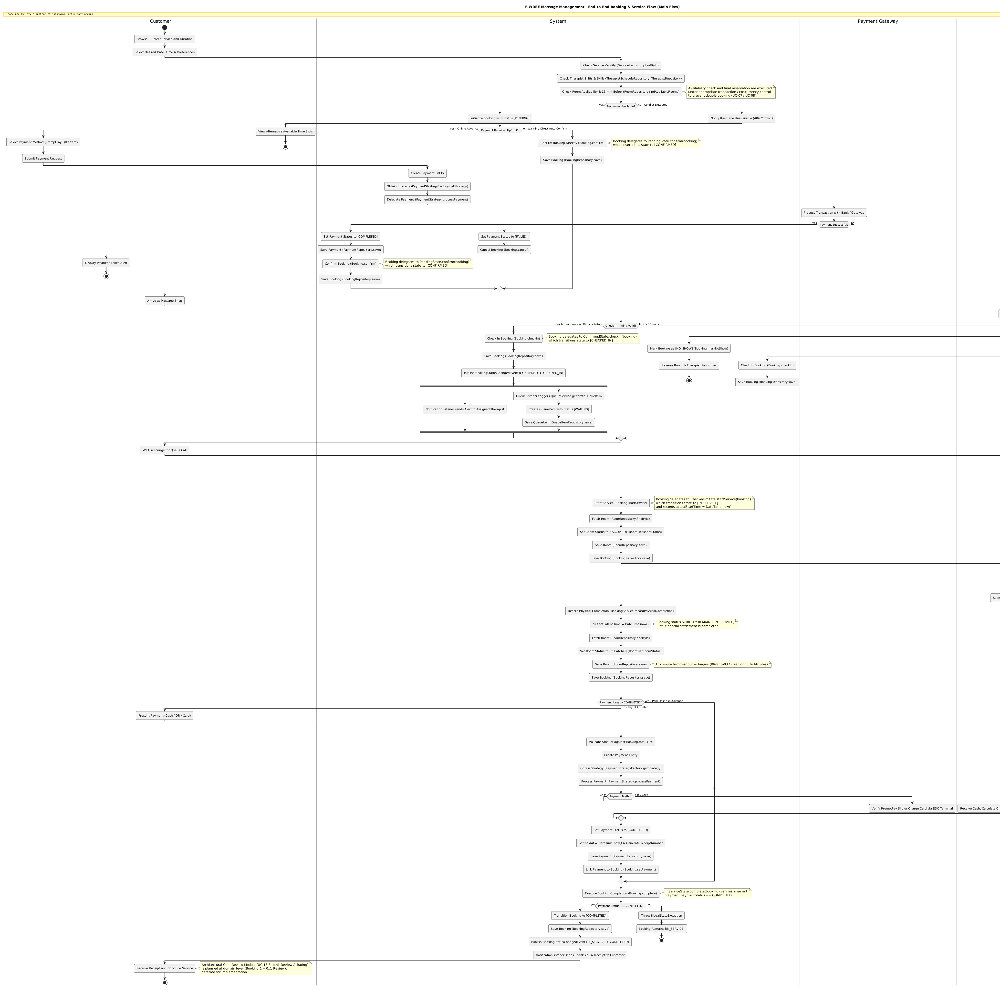
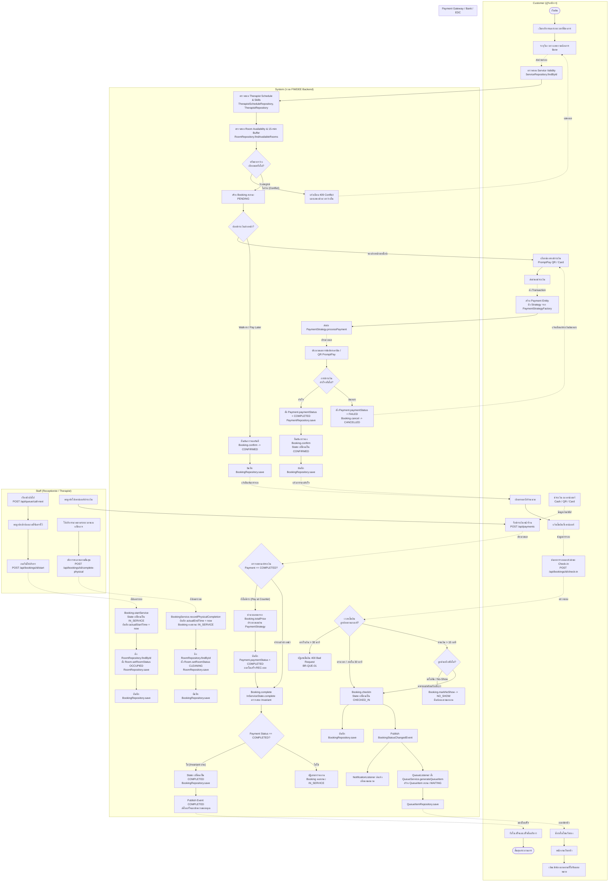
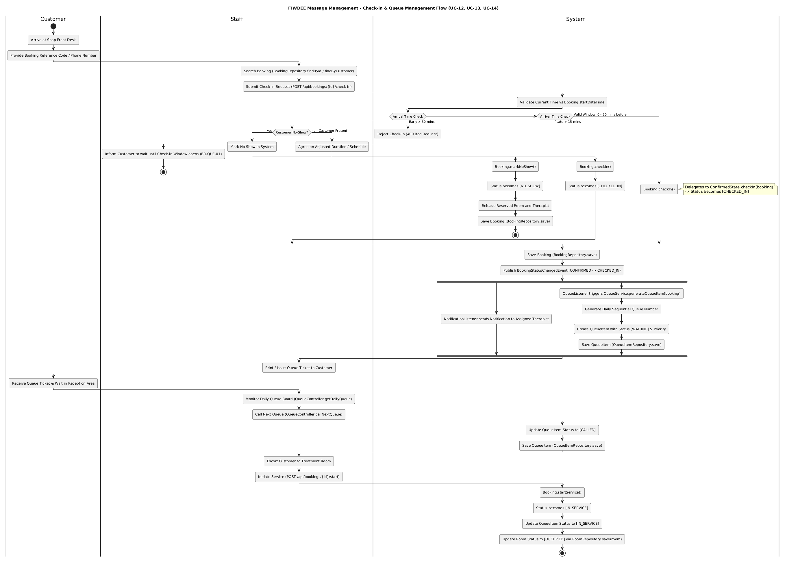
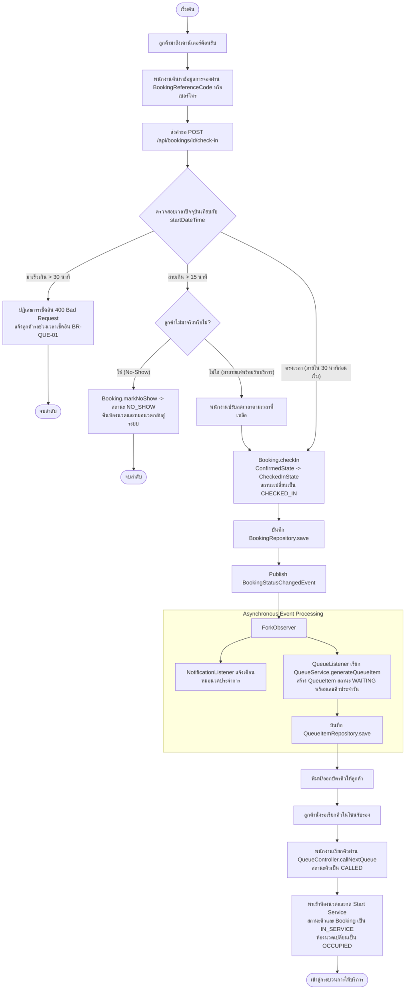
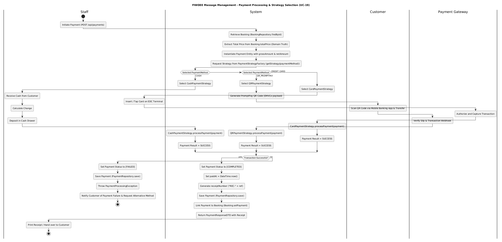
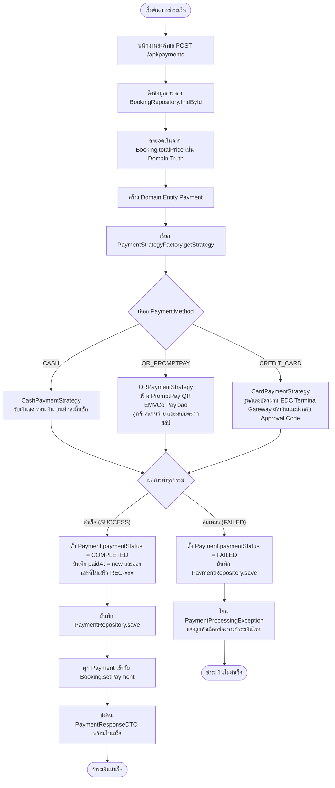
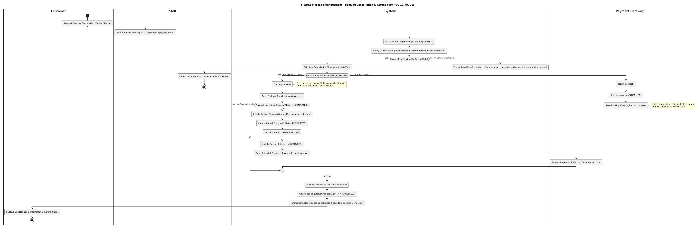

# FIWDEE Massage Management & Booking System
## UML Activity Diagram Specification

---

## 1. Executive Summary & Purpose

เอกสารฉบับนี้จัดทำขึ้นเพื่อนำเสนอ **UML Activity Diagram Specification ฉบับสมบูรณ์ (Design-Level Business & Operational Workflow)** สำหรับระบบ **FIWDEE Massage Management & Booking System** โดยวิเคราะห์และเชื่อมโยงเอกสารสถาปัตยกรรมทั้ง 5 ฉบับของโครงการเข้าด้วยกันอย่างเคร่งครัด:

1. [Domain Model Specification (`doc/domain-model.md`)](file:///C:/Users/Viphu/Desktop/University/PrinciplesOfSoftwareDesign/FIWDEE-CP353002-69_1PrinciplesOfSoftwareDesign/doc/domain-model.md) — **Source of Truth สำหรับ Business Entities (18 Entities), Data Types, Relationships, Multiplicities และ Business Constraints**
2. [Use Case Specification (`doc/use-case.md`)](file:///C:/Users/Viphu/Desktop/University/PrinciplesOfSoftwareDesign/FIWDEE-CP353002-69_1PrinciplesOfSoftwareDesign/doc/use-case.md) — **Source of Truth สำหรับ Actors, Business Flows, Pre/Postconditions, Include/Extend และ Business Rules**
3. [Class Diagram Specification (`doc/class-diagram.md`)](file:///C:/Users/Viphu/Desktop/University/PrinciplesOfSoftwareDesign/FIWDEE-CP353002-69_1PrinciplesOfSoftwareDesign/doc/class-diagram.md) — **Source of Truth สำหรับ Controllers, Services, Repositories, Domain Methods, DTOs, Mappers และ Layer Dependencies**
4. [Sequence Diagram Specification (`doc/sequence-diagram.md`)](file:///C:/Users/Viphu/Desktop/University/PrinciplesOfSoftwareDesign/FIWDEE-CP353002-69_1PrinciplesOfSoftwareDesign/doc/sequence-diagram.md) — **Source of Truth สำหรับ Message Interactions, Parameter Passing และ State Delegation**
5. [Design Patterns Specification (`doc/design-patterns.md`)](file:///C:/Users/Viphu/Desktop/University/PrinciplesOfSoftwareDesign/FIWDEE-CP353002-69_1PrinciplesOfSoftwareDesign/doc/design-patterns.md) — **Source of Truth สำหรับ State Pattern (LSP Compliant), Strategy Pattern, Factory Pattern, Observer Pattern, Repository Pattern และ Clean Architecture**

---

## 2. Activity Diagram หลัก: Booking & Service Lifecycle Flow (End-to-End)

แผนภาพ Activity Diagram หลักครอบคลุมวงจรชีวิตของการจองและการรับบริการนวดตั้งแต่เริ่มต้นจนสิ้นสุดกระบวนการ โดยแบ่ง Swimlanes ออกเป็น 4 ส่วน:
* **Customer:** ผู้รับบริการ (เลือบริการ, ระบุเวลา, ชำระเงิน, เช็คอิน, รับบริการ)
* **Staff (Receptionist / Therapist):** พนักงานต้อนรับและหมอนวดผู้ให้บริการ
* **System (BookingService, PaymentService, QueueService, Repositories):** แกนกลางประมวลผล Business Rules และ State Transitions
* **Payment Gateway / Bank / EDC:** ระบบประมวลผลธุรกรรมทางการเงินภายนอก

### 2.1 Diagram Source & Rendered Image
* **ไฟล์นิยาม PlantUML:** [activity-diagram.puml](file:///C:/Users/Viphu/Desktop/University/PrinciplesOfSoftwareDesign/FIWDEE-CP353002-69_1PrinciplesOfSoftwareDesign/doc/diagrams/activity-diagram.puml)
* **ไฟล์รูปภาพ PNG:** [activity-diagram-main.png](file:///C:/Users/Viphu/Desktop/University/PrinciplesOfSoftwareDesign/FIWDEE-CP353002-69_1PrinciplesOfSoftwareDesign/img/activity-diagram-main.png)



---

### 2.2 Mermaid Diagram Representation



---

## 3. Activity Diagrams ย่อยตาม Use Cases สำคัญ

### 3.1 Check-in & Queue Management Flow (UC-12, UC-13, UC-14)
* **ไฟล์รูปภาพ PNG:** [activity-diagram-checkin-queue.png](file:///C:/Users/Viphu/Desktop/University/PrinciplesOfSoftwareDesign/FIWDEE-CP353002-69_1PrinciplesOfSoftwareDesign/img/activity-diagram-checkin-queue.png)





---

### 3.2 Payment Processing & Strategy Selection Flow (UC-19)
* **ไฟล์รูปภาพ PNG:** [activity-diagram-payment.png](file:///C:/Users/Viphu/Desktop/University/PrinciplesOfSoftwareDesign/FIWDEE-CP353002-69_1PrinciplesOfSoftwareDesign/img/activity-diagram-payment.png)





---

### 3.3 Booking Cancellation & Refund Flow (UC-10, UC-20)
* **ไฟล์รูปภาพ PNG:** [activity-diagram-cancellation.png](file:///C:/Users/Viphu/Desktop/University/PrinciplesOfSoftwareDesign/FIWDEE-CP353002-69_1PrinciplesOfSoftwareDesign/img/activity-diagram-cancellation.png)



```mermaid
flowchart TD
    startCancel([เริ่มต้นการยกเลิก]) --> C1[ลูกค้าร้องขอยกเลิกการจอง]
    C1 --> C2[พนักงานส่งคำขอ POST /api/bookings/id/cancel]
    C2 --> C3[ดึงข้อมูลการจอง BookingRepository.findById]
    C3 --> CheckState{ตรวจสอบสถานะปัจจุบันของ Booking}
    
    CheckState -- IN_SERVICE หรือ COMPLETED --> RejectCancel[ปฏิเสธการยกเลิก<br/>ไม่สามารถยกเลิกระหว่างหรือหลังให้บริการได้] --> endReject([สิ้นสุด])
    
    CheckState -- PENDING / CONFIRMED / CHECKED_IN --> CheckNotice{ระยะเวลายกเลิกล่วงหน้า<br/>เทียบกับ startDateTime}
    
    CheckNotice -- ล่วงหน้า >= 2 ชั่วโมง (BR-BKG-04) --> EligibleRefund[ได้รับสิทธิ์คืนเงินเต็มจำนวน]
    EligibleRefund --> DoCancel1[Booking.cancel -> สถานะเปลี่ยนเป็น CANCELLED<br/>BookingRepository.save]
    DoCancel1 --> CheckPaid{เคยมีการชำระเงินแล้วหรือไม่?}
    
    CheckPaid -- ชำระแล้ว (COMPLETED) --> ProcessRefund[PaymentService.processRefund<br/>สร้าง Refund Entity สถานะ COMPLETED<br/>ปรับ Payment เป็น REFUNDED<br/>Gateway คืนเงินเข้าบัญชีลูกค้า]
    CheckPaid -- ยังไม่ได้ชำระเงิน --> ReleaseRes
    ProcessRefund --> ReleaseRes
    
    CheckNotice -- ล่วงหน้าน้อยกว่า 2 ชั่วโมง --> LateCancel[ไม่ได้รับสิทธิ์คืนเงิน (Non-refundable)<br/>Booking.cancel -> สถานะเป็น CANCELLED<br/>BookingRepository.save]
    LateCancel --> ReleaseRes[คืนห้องนวดและตารางเวลาหมอนวดกลับสู่ระบบ]
    
    ReleaseRes --> PublishCancelEvent[Publish BookingStatusChangedEvent เป็น CANCELLED]
    PublishCancelEvent --> NotifyCancel[NotificationListener ส่งข้อความแจ้งเตือนลูกค้ายืนยันการยกเลิก]
    NotifyCancel --> endCancelSuccess([การยกเลิกเสร็จสมบูรณ์])
```

---

## 4. รายละเอียดกิจกรรมและการแบ่ง Swimlane (Activity Description)

| Swimlane | บทบาทและหน้าที่หลัก | รายการกิจกรรม (Activities) ที่รับผิดชอบ |
| :--- | :--- | :--- |
| **Customer** | ผู้รับบริการ / ลูกค้า | 1. เลือกบริการ แพ็กเกจ และระยะเวลานวด<br/>2. ระบุวัน เวลา หมอนวด และห้องที่ต้องการ<br/>3. เลือกช่องทางชำระเงินและส่งคำขอ<br/>4. เดินทางมาถึงร้านและแจ้งเช็คอินหน้าร้าน<br/>5. รับบัตรคิวและนั่งรอในโซนรับรอง<br/>6. เดินเข้าห้องนวดและรับบริการ<br/>7. ชำระเงินค่าบริการเต็มจำนวน (กรณีเลือกชำระหน้าร้าน / Walk-in) และรับใบเสร็จ |
| **Staff**<br/>*(Receptionist / Therapist)* | พนักงานต้อนรับและหมอนวด | 1. ค้นหาข้อมูลการจองและกด Check-in ลูกค้าหน้าร้าน<br/>2. ออกบัตรคิวและมอนิเตอร์กระดานคิวประจำวัน<br/>3. เรียกคิวถัดไปและพาลูกค้าเข้าห้องนวดที่จัดสรรไว้<br/>4. กดเริ่มให้บริการ (`startService`) เพื่อเริ่มนับเวลา<br/>5. ให้บริการนวดทางกายภาพตามมาตรฐาน<br/>6. กดจบบริการทางกายภาพ (`recordPhysicalCompletion`)<br/>7. รับเงินสด/รูดบัตร ณ เคาน์เตอร์และส่งมอบใบเสร็จ |
| **System**<br/>*(Backend Architecture)* | สถาปัตยกรรมระบบ FIWDEE | 1. ตรวจสอบ Resource Availability (Service, Therapist, Room, 15-min Buffer)<br/>2. ป้องกัน Concurrency Conflict / Double Booking ด้วย Atomic Transaction<br/>3. บังคับใช้วงจรชีวิตการจองตาม GoF State Pattern<br/>4. จัดการ Data Persistence ผ่าน Repository Interfaces<br/>5. จัดการ Event-Driven ผ่าน ApplicationEventPublisher และ Listeners<br/>6. ตรวจสอบ Invariant Rule: `Payment.paymentStatus == COMPLETED` ก่อนเปลี่ยน Booking เป็น `COMPLETED`<br/>7. ปรับสถานะห้องนวด (`AVAILABLE` $\rightarrow$ `OCCUPIED` $\rightarrow$ `CLEANING` $\rightarrow$ `AVAILABLE`) |
| **Payment Gateway**<br/>*(Bank / EDC / QR)* | ระบบประมวลผลธุรกรรมภายนอก | 1. ตรวจสอบความถูกต้องของสลิปโอนเงิน PromptPay QR (EMVCo)<br/>2. สื่อสารกับ EDC Terminal / ธนาคารเพื่อตัดวงเงินบัตรเครดิต<br/>3. ส่งกลับสถานะการทำธุรกรรม (Approval Code / Webhook Success) |

---

## 5. Booking State Lifecycle Alignment & Invariant Rules

### 5.1 ลำดับการเปลี่ยนสถานะการจอง (GoF State Pattern)

```text
[ Initial: PENDING ]
       │
       ▼ (Booking.confirm() -> PendingState.confirm())
[ CONFIRMED ]
       │
       ▼ (Booking.checkIn() -> ConfirmedState.checkIn())
[ CHECKED_IN ]
       │
       ▼ (Booking.startService() -> CheckedInState.startService())
[ IN_SERVICE ]
       │
       ├───────────────────────────────────────────────┐
       │ (recordPhysicalCompletion()                   │ (Payment must be COMPLETED)
       │  -> Room: CLEANING, Booking: IN_SERVICE)      ▼
       └──────────────────────────────────────> [ COMPLETED ]
                                                    │
                                                    ▼
                                          [ Terminal State ]
```

* **กฎการเปลี่ยนสถานะ:**
  1. $\text{PENDING} \rightarrow \text{CONFIRMED}$: เกิดขึ้นเมื่อสร้างการจองและยืนยันชำระเงิน/อนุมัติ
  2. $\text{CONFIRMED} \rightarrow \text{CHECKED_IN}$: เกิดขึ้นเมื่อลูกค้ามาถึงร้านและเช็คอินผ่านเคาน์เตอร์
  3. $\text{CHECKED_IN} \rightarrow \text{IN_SERVICE}$: เกิดขึ้นเมื่อหมอนวดเริ่มให้บริการในห้องนวด
  4. $\text{IN_SERVICE} \rightarrow \text{COMPLETED}$: เกิดขึ้น **หลังจากการนวดเสร็จสิ้นทางกายภาพและสถานะการชำระเงินเป็น `COMPLETED` แล้วเท่านั้น**
  5. **ห้ามข้าม State:** ห้ามเกิด $\text{PENDING} \rightarrow \text{COMPLETED}$ หรือ $\text{CHECKED_IN} \rightarrow \text{COMPLETED}$ โดยเด็ดขาด

### 5.2 Room Status & Cleaning Buffer (BR-RES-03)

```text
[ Room: AVAILABLE ]
       │
       ▼ (startService() -> RoomRepository.save(room))
[ Room: OCCUPIED ]
       │
       ▼ (recordPhysicalCompletion() -> RoomRepository.save(room))
[ Room: CLEANING ] (Turnover Buffer = 15 นาที ตาม cleaningBufferMinutes)
       │
       ▼ (Cleaning Timeout / Inspection Complete)
[ Room: AVAILABLE ]
```

---

## 6. Document Consistency Verification Audit

| มิติการตรวจสอบ (Audit Dimension) | ผลการตรวจ (Status) | รายละเอียดการประเมินความสอดคล้องกับ Source of Truth |
| :--- | :---: | :--- |
| **1. Domain Entity Coverage** | **`PASS`** | ใช้งานเฉพาะ 18 Domain Entities ที่ระบุใน `domain-model.md` (`Shop`, `User`, `Customer`, `Therapist`, `Room`, `Service`, `Booking`, `QueueItem`, `Payment`, `Refund`, ฯลฯ) |
| **2. Use Case Alignment** | **`PASS`** | สอดคล้องกับ Use Case ที่มี Activity Flow รองรับ ได้แก่ UC-07 (Booking), UC-08 (Availability), UC-10 (Cancel), UC-12 (Check-in), UC-13 (Queue), UC-14 (Update Status), UC-16 (Start Service), UC-17 (Complete Service), UC-19 (Payment) และ UC-20 (Refund) ส่วน UC-18 (Review Module) ระบุสถานะเป็น Architectural GAP ตามขอบเขตของระบบ |
| **3. Class Diagram Alignment** | **`PASS`** | เมธอดและคลาสทั้งหมดที่อ้างถึงมีอยู่จริงใน `class-diagram.md`: `RoomRepository.save()`, `Booking.confirm()`, `Booking.checkIn()`, `Booking.startService()`, `Booking.complete()`, `PaymentService.processPayment()` |
| **4. Sequence Diagram Alignment** | **`PASS`** | ลำดับและเงื่อนไขการทำงานตรงกับ `sequence-diagram.md` ทั้ง 3 Scenarios แบบ 1:1 |
| **5. State Pattern (LSP)** | **`PASS`** | รักษาลำดับสถานะ `PENDING` $\rightarrow$ `CONFIRMED` $\rightarrow$ `CHECKED_IN` $\rightarrow$ `IN_SERVICE` $\rightarrow$ `COMPLETED` โดยไม่มีการข้าม State |
| **6. Payment Settlement Rule** | **`PASS`** | บังคับใช้เงื่อนไข `Payment.paymentStatus == COMPLETED` ก่อนที่ Booking จะสามารถเปลี่ยนเป็น `COMPLETED` ได้ |
| **7. Queue / Observer Flow** | **`PASS`** | `QueueItem` ถูกสร้างขึ้นโดยอัตโนมัติเมื่อเกิด Event `CHECKED_IN` ผ่าน `QueueListener` สอดคล้องกับ Observer Pattern |
| **8. Room Repository Usage** | **`PASS`** | ปรับสถานะห้องผ่าน `RoomRepository.findById()` $\rightarrow$ `Room.setRoomStatus()` $\rightarrow$ `RoomRepository.save()` โดยไม่มีการใช้ `update()` เถื่อน |
| **9. Concurrency / Double Booking** | **`PASS`** | มีการระบุ Atomic Check / Concurrency Control ในขั้นตอนตรวจสอบและบันทึกการจอง |
| **10. Review Module (UC-18)** | **`GAP`** | ระบุขอบเขตของ Feedback/Review Module เป็น **Architectural GAP** อย่างชัดเจนตามเอกสารเดิม โดยไม่สร้างคลาสหรือเมธอดปลอม |
