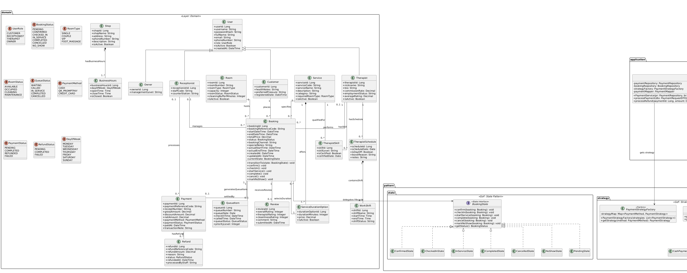

# FIWDEE Massage Management & Booking System
## UML Class Diagram & Design Pattern Architecture Specification

---

## 1. Executive Summary & Purpose

เอกสารฉบับนี้จัดทำขึ้นเพื่อนำเสนอ **UML Class Diagram ฉบับสมบูรณ์ (Design-Level Architecture)** สำหรับระบบ **FIWDEE Massage Management & Booking System** โดยใช้ [domain-model.md](file:///C:/Users/Viphu/Desktop/University/PrinciplesOfSoftwareDesign/FIWDEE-CP353002-69_1PrinciplesOfSoftwareDesign/doc/domain-model.md) และ [use-case.md](file:///C:/Users/Viphu/Desktop/University/PrinciplesOfSoftwareDesign/FIWDEE-CP353002-69_1PrinciplesOfSoftwareDesign/doc/use-case.md) เป็น **Single Source of Truth**

> [!IMPORTANT]
> **หลักการยึดถือ Domain Model เป็นแม่แบบหลัก (Domain Model as Source of Truth):**
> สถาปัตยกรรมซอฟต์แวร์ คลาสไดอะแกรม รูปแบบการออกแบบ (Design Patterns) และการจัดชั้นเลเยอร์ทั้งหมด ได้รับการตรวจสอบและปรับแก้ให้สอดคล้องกับ Domain Model อย่างสมบูรณ์ 100% โดย:
> 1. รักษา Domain Entities ทั้ง 18 คลาส, Attributes, Data Types, Enumerations ทั้ง 9 ชนิด, Generalization Hierarchy และ Associations/Multiplicities ทั้งหมดโดยไม่มีการดัดแปลง Domain Model เพื่อเอื้อต่อเทคนิคการเขียนโค้ด
> 2. บังคับใช้ **Strict Top-Down Layered Architecture** (Presentation $\rightarrow$ Application $\rightarrow$ Domain $\rightarrow$ Infrastructure) โดยไม่มี Dependency ย้อนกลับ (เช่น Application Layer หรือ Strategy ไม่ขึ้นกับ Presentation DTOs)
> 3. ปรับโครงสร้าง **GoF State Pattern** ให้รองรับหลักการ SOLID / Liskov Substitution Principle (LSP) โดยใช้ `AbstractBookingState`
> 4. ปรับโครงสร้าง **GoF Strategy Pattern** ให้ประมวลผลผ่าน Domain Entity (`Payment`) โดยตรง ไม่พึ่งพา Presentation DTO
> 5. บังคับใช้เงื่อนไข **Booking Completion Invariant** ที่การเปลี่ยนสถานะเป็น `COMPLETED` ใน `InServiceState.complete()` ต้องตรวจสอบสถานะการชำระเงินว่า `Payment.paymentStatus == PaymentStatus.COMPLETED` ตามกฎธุรกิจใน Domain Model

---

## PART 1 — Final Class Diagram

### 1.1 Diagram Source & Rendered Image (ไฟล์ต้นฉบับและรูปภาพ)
* ไฟล์นิยาม PlantUML: [class-diagram.puml](file:///C:/Users/Viphu/Desktop/University/PrinciplesOfSoftwareDesign/FIWDEE-CP353002-69_1PrinciplesOfSoftwareDesign/doc/diagrams/class-diagram.puml)
* ไฟล์รูปภาพ PNG Diagram: [class-diagram.png](file:///C:/Users/Viphu/Desktop/University/PrinciplesOfSoftwareDesign/FIWDEE-CP353002-69_1PrinciplesOfSoftwareDesign/img/class-diagram.png)



---

### 1.2 Mermaid Class Diagram

```mermaid
classDiagram
    direction TB

    %% =========================================================================
    %% =========================================================================
    %% CONTROLLER & DTO & MAPPER (<<REST API Layer>>, <<MVC>>, <<DTO + Mapper>>)
    %% =========================================================================
    namespace controller_api {
        class BookingController {
            <<Controller>>
            -BookingService bookingService
            -BookingMapper bookingMapper
            +BookingController(BookingService bookingService, BookingMapper bookingMapper)
            +createBooking(BookingRequestDTO request) ResponseEntity~BookingResponseDTO~
            +confirmBooking(Long bookingId) ResponseEntity~BookingResponseDTO~
            +checkInBooking(Long bookingId) ResponseEntity~BookingResponseDTO~
            +startService(Long bookingId) ResponseEntity~BookingResponseDTO~
            +completePhysicalService(Long bookingId) ResponseEntity~BookingResponseDTO~
            +completeBooking(Long bookingId) ResponseEntity~BookingResponseDTO~
            +cancelBooking(Long bookingId) ResponseEntity~Void~
            +getBookingById(Long bookingId) ResponseEntity~BookingResponseDTO~
        }

        class PaymentController {
            <<Controller>>
            -PaymentService paymentService
            -PaymentMapper paymentMapper
            +PaymentController(PaymentService paymentService, PaymentMapper paymentMapper)
            +processPayment(PaymentRequestDTO request) ResponseEntity~PaymentResponseDTO~
            +getReceipt(Long paymentId) ResponseEntity~PaymentResponseDTO~
        }

        class QueueController {
            <<Controller>>
            -QueueService queueService
            +QueueController(QueueService queueService)
            +getDailyQueue() ResponseEntity~List~QueueItemResponseDTO~~
            +callNextQueue() ResponseEntity~QueueItemResponseDTO~
        }
    }

    namespace dto {
        class BookingRequestDTO {
            <<DTO>>
            +Long customerId
            +Long serviceId
            +Long durationOptionId
            +Long therapistId
            +Long roomId
            +DateTime startDateTime
            +String bookingChannel
            +String specialNotes
        }

        class BookingResponseDTO {
            <<DTO>>
            +Long bookingId
            +String bookingReferenceCode
            +String customerName
            +String serviceName
            +Integer durationMinutes
            +Decimal totalPrice
            +String therapistName
            +String roomNumber
            +DateTime startDateTime
            +DateTime endDateTime
            +BookingStatus status
        }

        class PaymentRequestDTO {
            <<DTO>>
            +Long bookingId
            +Decimal amount
            +PaymentMethod paymentMethod
            +String transactionNote
        }

        class PaymentResponseDTO {
            <<DTO>>
            +Long paymentId
            +String paymentReferenceCode
            +String receiptNumber
            +Decimal netAmount
            +PaymentMethod paymentMethod
            +PaymentStatus paymentStatus
            +DateTime paidAt
        }

        class QueueItemResponseDTO {
            <<DTO>>
            +Long queueId
            +String queueNumber
            +Date queueDate
            +DateTime checkInTime
            +QueueStatus queueStatus
            +Integer priorityLevel
            +String customerName
        }
    }

    namespace mapper {
        class BookingMapper {
            <<Mapper>>
            +toEntity(BookingRequestDTO dto) Booking
            +toResponseDTO(Booking entity) BookingResponseDTO
        }

        class PaymentMapper {
            <<Mapper>>
            +toEntity(PaymentRequestDTO dto, Booking booking) Payment
            +toResponseDTO(Payment entity) PaymentResponseDTO
        }
    }

    %% =========================================================================
    %% SERVICE LAYER (<<Service Layer>>, <<Dependency Injection>>)
    %% =========================================================================
    namespace service {
        class BookingService {
            <<Service>>
            -BookingRepository bookingRepository
            -RoomRepository roomRepository
            -TherapistRepository therapistRepository
            -ServiceRepository serviceRepository
            -TherapistScheduleRepository scheduleRepository
            -ApplicationEventPublisher eventPublisher
            +BookingService(BookingRepository br, RoomRepository rr, TherapistRepository tr, ServiceRepository sr, TherapistScheduleRepository tsr, ApplicationEventPublisher ep)
            +createBooking(Booking booking) Booking
            +confirmBooking(Long bookingId) Booking
            +checkInBooking(Long bookingId) Booking
            +startService(Long bookingId) Booking
            +recordPhysicalCompletion(Long bookingId) Booking
            +completeBooking(Long bookingId) Booking
            +cancelBooking(Long bookingId) void
            +markNoShow(Long bookingId) void
            +getBookingById(Long bookingId) Booking
        }

        class PaymentService {
            <<Service>>
            -PaymentRepository paymentRepository
            -BookingRepository bookingRepository
            -PaymentStrategyFactory strategyFactory
            -ApplicationEventPublisher eventPublisher
            +PaymentService(PaymentRepository pr, BookingRepository br, PaymentStrategyFactory sf, ApplicationEventPublisher ep)
            +processPayment(Long bookingId, PaymentMethod method, String note) Payment
            +processRefund(Long paymentId, Decimal amount, String reason, String staffName) Refund
            +getPaymentById(Long paymentId) Payment
        }

        class QueueService {
            <<Service>>
            -QueueItemRepository queueRepository
            -BookingRepository bookingRepository
            +QueueService(QueueItemRepository qr, BookingRepository br)
            +generateQueueItem(Booking booking) QueueItem
            +callNextQueue() QueueItem
            +updateQueueStatus(Long queueId, QueueStatus status) void
        }

        class TherapistService {
            <<Service>>
            -TherapistRepository therapistRepository
            -TherapistScheduleRepository scheduleRepository
            +TherapistService(TherapistRepository tr, TherapistScheduleRepository sr)
            +calculateEarnings(Long therapistId, Date startDate, Date endDate) Decimal
            +getAvailableTherapists(Date date, Time startTime, Long serviceId) List~Therapist~
        }
    }

    %% =========================================================================
    %% GOF BEHAVIORAL PATTERNS (State, Strategy, Observer)
    %% =========================================================================
    namespace pattern_state {
        class BookingState {
            <<interface>>
            <<State Pattern>>
            +confirm(Booking booking)* void
            +checkIn(Booking booking)* void
            +startService(Booking booking)* void
            +complete(Booking booking)* void
            +cancel(Booking booking)* void
            +markNoShow(Booking booking)* void
            +getStatus()* BookingStatus
        }

        class AbstractBookingState {
            <<abstract>>
            +confirm(Booking booking) void
            +checkIn(Booking booking) void
            +startService(Booking booking) void
            +complete(Booking booking) void
            +cancel(Booking booking) void
            +markNoShow(Booking booking) void
            #throwInvalidTransition(String action) void
        }

        class PendingState {
            <<Concrete State>>
            +confirm(Booking booking) void
            +cancel(Booking booking) void
            +getStatus() BookingStatus
        }

        class ConfirmedState {
            <<Concrete State>>
            +checkIn(Booking booking) void
            +cancel(Booking booking) void
            +markNoShow(Booking booking) void
            +getStatus() BookingStatus
        }

        class CheckedInState {
            <<Concrete State>>
            +startService(Booking booking) void
            +cancel(Booking booking) void
            +getStatus() BookingStatus
        }

        class InServiceState {
            <<Concrete State>>
            +complete(Booking booking) void
            +getStatus() BookingStatus
        }

        class CompletedState {
            <<Terminal State>>
            +getStatus() BookingStatus
        }

        class CancelledState {
            <<Terminal State>>
            +getStatus() BookingStatus
        }

        class NoShowState {
            <<Terminal State>>
            +getStatus() BookingStatus
        }
    }

    namespace pattern_strategy {
        class PaymentStrategy {
            <<interface>>
            <<Strategy Pattern>>
            +processPayment(Payment payment)* Boolean
            +getSupportedMethod()* PaymentMethod
        }

        class CashPaymentStrategy {
            <<Concrete Strategy>>
            +processPayment(Payment payment) Boolean
            +getSupportedMethod() PaymentMethod
        }

        class QRPaymentStrategy {
            <<Concrete Strategy>>
            +processPayment(Payment payment) Boolean
            +generatePromptPayQR(Payment payment) String
            +getSupportedMethod() PaymentMethod
        }

        class CardPaymentStrategy {
            <<Concrete Strategy>>
            +processPayment(Payment payment) Boolean
            +chargeCreditCard(Payment payment) Boolean
            +getSupportedMethod() PaymentMethod
        }

        class PaymentStrategyFactory {
            <<Strategy Factory>>
            -Map~PaymentMethod, PaymentStrategy~ strategyMap
            +PaymentStrategyFactory(List~PaymentStrategy~ strategies)
            +getStrategy(PaymentMethod method) PaymentStrategy
        }
    }

    namespace pattern_observer {
        class BookingStatusChangedEvent {
            <<Event Object>>
            <<Observer Pattern>>
            +Long bookingId
            +BookingStatus oldStatus
            +BookingStatus newStatus
            +DateTime timestamp
            +BookingStatusChangedEvent(Object source, Long bookingId, BookingStatus oldStatus, BookingStatus newStatus)
        }

        class NotificationListener {
            <<Observer / Listener>>
            +onBookingStatusChanged(BookingStatusChangedEvent event) void
            -sendCustomerNotification(BookingStatusChangedEvent event) void
            -sendTherapistNotification(BookingStatusChangedEvent event) void
        }

        class QueueListener {
            <<Observer / Listener>>
            -QueueService queueService
            +QueueListener(QueueService queueService)
            +onBookingStatusChanged(BookingStatusChangedEvent event) void
        }
    }

    %% =========================================================================
    %% DOMAIN LAYER (All 18 Domain Entities + 9 Enums from Source of Truth)
    %% =========================================================================
    namespace domain {
        class Shop {
            +Long shopId
            +String shopName
            +String address
            +String phoneNumber
            +String description
            +Boolean isActive
        }

        class BusinessHours {
            +Long businessHoursId
            +DayOfWeek dayOfWeek
            +Time openTime
            +Time closeTime
            +Boolean isClosed
        }

        class User {
            +Long userId
            +String username
            +String passwordHash
            +String fullName
            +String email
            +String phoneNumber
            +UserRole role
            +Boolean isActive
            +DateTime createdAt
        }

        class Customer {
            +String healthNotes
            +String preferredPressure
            +DateTime registeredDate
        }

        class Therapist {
            +String nickname
            +String bio
            +Decimal commissionRate
            +String employmentStatus
            +Decimal averageRating
        }

        class Receptionist {
            +String staffCode
            +String counterStation
        }

        class Owner {
            +String managementLevel
        }

        class Service {
            +Long serviceId
            +String serviceCode
            +String serviceName
            +String description
            +String category
            +RoomType requiredRoomType
            +Boolean isActive
        }

        class ServiceDurationOption {
            +Long durationOptionId
            +Integer durationMinutes
            +Decimal price
            +Boolean isActive
        }

        class TherapistSkill {
            +Long skillId
            +String skillLevel
            +Boolean isCertified
            +Date certifiedDate
        }

        class Room {
            +Long roomId
            +String roomNumber
            +RoomType roomType
            +Integer capacity
            +RoomStatus roomStatus
            +Integer cleaningBufferMinutes
            +Boolean isActive
            +setRoomStatus(RoomStatus status) void
        }

        class TherapistSchedule {
            +Long scheduleId
            +Date scheduleDate
            +Boolean isDayOff
            +String leaveReason
            +String notes
        }

        class WorkShift {
            +Long shiftId
            +String shiftName
            +Time startTime
            +Time endTime
            +String shiftStatus
        }

        class Booking {
            +Long bookingId
            +String bookingReferenceCode
            +DateTime startDateTime
            +DateTime endDateTime
            +Decimal totalPrice
            +BookingStatus status
            +String bookingChannel
            +String specialNotes
            +DateTime actualStartTime
            +DateTime actualEndTime
            +Long version
            +DateTime createdAt
            +DateTime updatedAt
            -BookingState currentState
            -Payment payment
            +transitionTo(BookingState state) void
            +confirm() void
            +checkIn() void
            +startService() void
            +complete() void
            +cancel() void
            +markNoShow() void
            +setPayment(Payment payment) void
            +getPayment() Payment
            +setTotalPrice(Decimal price) void
            +setActualStartTime(DateTime time) void
            +setActualEndTime(DateTime time) void
        }

        class QueueItem {
            +Long queueId
            +String queueNumber
            +Date queueDate
            +DateTime checkInTime
            +DateTime calledTime
            +QueueStatus queueStatus
            +Integer priorityLevel
        }

        class Payment {
            +Long paymentId
            +String paymentReferenceCode
            +String receiptNumber
            +Decimal grossAmount
            +Decimal discountAmount
            +Decimal netAmount
            +PaymentMethod paymentMethod
            +PaymentStatus paymentStatus
            +DateTime paidAt
            +String transactionNote
            +setPaymentStatus(PaymentStatus status) void
            +setPaidAt(DateTime time) void
            +setReceiptNumber(String number) void
        }

        class Refund {
            +Long refundId
            +String refundReferenceCode
            +Decimal refundAmount
            +String reason
            +RefundStatus status
            +DateTime refundedAt
            +String processedByStaff
        }

        class Review {
            +Long reviewId
            +Integer overallRating
            +Integer therapistRating
            +Integer cleanlinessRating
            +String comment
            +DateTime submittedAt
        }

        %% Enums
        class UserRole {
            <<enumeration>>
            CUSTOMER
            RECEPTIONIST
            THERAPIST
            OWNER
        }

        class BookingStatus {
            <<enumeration>>
            PENDING
            CONFIRMED
            CHECKED_IN
            IN_SERVICE
            COMPLETED
            CANCELLED
            NO_SHOW
        }

        class RoomType {
            <<enumeration>>
            SINGLE
            COUPLE
            VIP
            FOOT_MASSAGE
        }

        class RoomStatus {
            <<enumeration>>
            AVAILABLE
            OCCUPIED
            CLEANING
            MAINTENANCE
        }

        class QueueStatus {
            <<enumeration>>
            WAITING
            CALLED
            IN_SERVICE
            COMPLETED
            CANCELLED
        }

        class PaymentMethod {
            <<enumeration>>
            CASH
            QR_PROMPTPAY
            CREDIT_CARD
        }

        class PaymentStatus {
            <<enumeration>>
            PENDING
            COMPLETED
            REFUNDED
            FAILED
        }

        class RefundStatus {
            <<enumeration>>
            PENDING
            COMPLETED
            FAILED
        }

        class DayOfWeek {
            <<enumeration>>
            MONDAY
            TUESDAY
            WEDNESDAY
            THURSDAY
            FRIDAY
            SATURDAY
            SUNDAY
        }
    }

    %% =========================================================================
    %% REPOSITORY LAYER (<<Repository Pattern>>)
    %% =========================================================================
    namespace repository {
        class BookingRepository {
            <<interface>>
            <<Repository Pattern>>
            +findById(Long id) Optional~Booking~
            +save(Booking booking) Booking
            +findByCustomer(Customer customer) List~Booking~
            +findActiveBookingsByRoomAndPeriod(Long roomId, DateTime start, DateTime end) List~Booking~
            +findActiveBookingsByTherapistAndPeriod(Long therapistId, DateTime start, DateTime end) List~Booking~
        }

        class PaymentRepository {
            <<interface>>
            <<Repository Pattern>>
            +findById(Long id) Optional~Payment~
            +save(Payment payment) Payment
            +findByBooking(Booking booking) Optional~Payment~
        }

        class RoomRepository {
            <<interface>>
            <<Repository Pattern>>
            +findById(Long id) Optional~Room~
            +findAvailableRooms(RoomType type, DateTime start, DateTime end) List~Room~
            +save(Room room) Room
        }

        class TherapistRepository {
            <<interface>>
            <<Repository Pattern>>
            +findById(Long id) Optional~Therapist~
            +findActiveTherapists() List~Therapist~
        }

        class ServiceRepository {
            <<interface>>
            <<Repository Pattern>>
            +findById(Long id) Optional~Service~
            +findByIsActiveTrue() List~Service~
        }

        class QueueItemRepository {
            <<interface>>
            <<Repository Pattern>>
            +findByQueueDateAndStatus(Date date, QueueStatus status) List~QueueItem~
            +save(QueueItem queueItem) QueueItem
        }

        class CustomerRepository {
            <<interface>>
            <<Repository Pattern>>
            +findById(Long id) Optional~Customer~
            +findByPhoneNumber(String phoneNumber) Optional~Customer~
        }

        class TherapistScheduleRepository {
            <<interface>>
            <<Repository Pattern>>
            +findByTherapistAndScheduleDate(Therapist therapist, Date date) Optional~TherapistSchedule~
        }
    }

    %% =========================================================================
    %% DOMAIN MODEL RELATIONSHIPS & MULTIPLICITIES (100% Matching domain-model.md)
    %% =========================================================================
    Shop "1" *-- "1..*" BusinessHours : hasBusinessHours
    User <|-- Customer : Generalizes
    User <|-- Therapist : Generalizes
    User <|-- Receptionist : Generalizes
    User <|-- Owner : Generalizes

    Service "1" *-- "1..*" ServiceDurationOption : offers
    Therapist "1" -- "0..*" TherapistSkill : hasSkill
    Service "1" -- "0..*" TherapistSkill : qualifiedFor

    Therapist "1" -- "0..*" TherapistSchedule : hasSchedule
    TherapistSchedule "1" *-- "0..*" WorkShift : containsShift

    Customer "1" -- "0..*" Booking : places
    Therapist "0..1" -- "0..*" Booking : performs
    Room "1" -- "0..*" Booking : hosts
    Service "1" -- "0..*" Booking : specifies
    Booking "0..*" -- "1" ServiceDurationOption : selectsDuration
    Booking "1" -- "0..1" QueueItem : generatesQueueItem
    Receptionist "0..1" -- "0..*" Booking : manages

    Booking "1" -- "0..1" Payment : settledBy
    Payment "1" -- "0..*" Refund : hasRefund
    Booking "1" -- "0..1" Review : receivesReview
    Receptionist "0..1" -- "0..*" Payment : processes

    %% =========================================================================
    %% ARCHITECTURAL / DESIGN PATTERN RELATIONSHIPS (Strict Top-Down Dependency)
    %% =========================================================================
    BookingController --> BookingService : <<Dependency Injection>>
    BookingController --> BookingMapper : uses
    PaymentController --> PaymentService : <<Dependency Injection>>
    PaymentController --> PaymentMapper : uses
    QueueController --> QueueService : <<Dependency Injection>>

    BookingController ..> BookingRequestDTO : receives
    BookingController ..> BookingResponseDTO : returns
    PaymentController ..> PaymentRequestDTO : receives
    PaymentController ..> PaymentResponseDTO : returns
    QueueController ..> QueueItemResponseDTO : returns

    BookingMapper ..> BookingRequestDTO : maps from
    BookingMapper ..> BookingResponseDTO : maps to
    BookingMapper ..> Booking : creates / reads
    PaymentMapper ..> PaymentRequestDTO : maps from
    PaymentMapper ..> PaymentResponseDTO : maps to
    PaymentMapper ..> Payment : creates / reads

    BookingService --> BookingRepository : <<Dependency Injection>>
    BookingService --> RoomRepository : <<Dependency Injection>>
    BookingService --> TherapistRepository : <<Dependency Injection>>
    BookingService --> ServiceRepository : <<Dependency Injection>>
    BookingService --> TherapistScheduleRepository : <<Dependency Injection>>
    BookingService ..> BookingStatusChangedEvent : publishes event

    PaymentService --> PaymentRepository : <<Dependency Injection>>
    PaymentService --> BookingRepository : <<Dependency Injection>>
    PaymentService --> PaymentStrategyFactory : gets strategy
    PaymentService ..> PaymentStrategy : delegates payment
    PaymentService ..> BookingStatusChangedEvent : publishes event

    QueueService --> QueueItemRepository : <<Dependency Injection>>
    QueueService --> BookingRepository : <<Dependency Injection>>

    TherapistService --> TherapistRepository : <<Dependency Injection>>
    TherapistService --> TherapistScheduleRepository : <<Dependency Injection>>

    %% GoF State Pattern Hierarchy
    BookingState <|.. AbstractBookingState : realizes
    AbstractBookingState <|-- PendingState : extends
    AbstractBookingState <|-- ConfirmedState : extends
    AbstractBookingState <|-- CheckedInState : extends
    AbstractBookingState <|-- InServiceState : extends
    AbstractBookingState <|-- CompletedState : extends
    AbstractBookingState <|-- CancelledState : extends
    AbstractBookingState <|-- NoShowState : extends
    Booking --> BookingState : delegates lifecycle behavior

    %% GoF Strategy Pattern Hierarchy
    PaymentStrategy <|.. CashPaymentStrategy : realizes
    PaymentStrategy <|.. QRPaymentStrategy : realizes
    PaymentStrategy <|.. CardPaymentStrategy : realizes
    PaymentStrategyFactory --> PaymentStrategy : manages strategies

    %% GoF Observer Pattern Wiring
    NotificationListener ..> BookingStatusChangedEvent : observes & notifies
    QueueListener ..> BookingStatusChangedEvent : observes & triggers
    QueueListener --> QueueService : triggers queue creation
```

---

## PART 2 — Pattern Locations & Architectural Roles

| ที่ | Pattern | ประเภท | Components / Classes ในระบบ | ตำแหน่งใน Architecture / Package | บทบาทหน้าที่ทางสถาปัตยกรรม (Architectural Role) |
| :-: | :--- | :--- | :--- | :--- | :--- |
| **1** | **Layered Architecture** | Enterprise / Architectural | `presentation`, `application`, `domain`, `infrastructure` | ภาพรวมโครงสร้าง Class Diagram ทั้ง 4 Layers | บังคับใช้ทิศทางการพึ่งพาจากบนลงล่างอย่างเคร่งครัด (Strict Top-Down Dependency) โดย Application Layer และ Domain ไม่ขึ้นกับ Presentation DTOs |
| **2** | **MVC (Model-View-Controller)** | Enterprise / Architectural | `BookingController`, `PaymentController`, `QueueController`, Domain Entities, Presentation DTOs, Frontend REST Clients | `presentation` + `domain` | แยกการรับส่ง HTTP Request/Response ออกจาก Domain Model โดยให้ Controller ทำงานร่วมกับ Mapper เพื่อแปลง DTO $\leftrightarrow$ Entity |
| **3** | **Repository Pattern** | Enterprise / Architectural | `BookingRepository`, `PaymentRepository`, `RoomRepository`, `TherapistRepository`, `ServiceRepository`, `QueueItemRepository`, `CustomerRepository` | `infrastructure` Layer | ทำหน้าที่เป็น In-Memory Collection เสมือน คั่นกลางระหว่าง Service Layer และ Database ซ่อนรายละเอียด SQL/JPA เพื่อให้ Business Logic ไม่ผูกติดกับ Persistence |
| **4** | **Service Layer Pattern** | Enterprise / Architectural | `BookingService`, `PaymentService`, `QueueService`, `TherapistService` | `application` Layer | เป็น Service Boundary รวบรวม Business Logic, ควบคุม Transaction Boundary (`@Transactional`), ตรวจสอบ Resource Conflicts และประสานงานระหว่าง Entity |
| **5** | **DTO Pattern + Mapper** | Enterprise / Architectural | `BookingRequestDTO`, `BookingResponseDTO`, `PaymentRequestDTO`, `BookingMapper`, `PaymentMapper` | `presentation` Layer | กำหนด Boundary ระหว่าง Presentation และ Application/Domain ป้องกันข้อมูลภายในรั่วไหล (`passwordHash`, `commissionRate`) และแก้ปัญหา Infinite JSON Recursion |
| **6** | **Dependency Injection** | Enterprise / Architectural | Constructors ในทุก Controller, Service, Factory, และ Repository | ข้าม Layers ผ่าน Constructor Injection | ลด Coupling และกำจัดคำสั่ง `new` ภายในคลาส เพื่อให้คลาสคงสภาพ Immutable และรองรับการทำ Unit Testing ด้วย Mockito |
| **7** | **State Pattern (LSP Compliant)** | GoF Behavioral | `BookingState`, `AbstractBookingState`, `PendingState`, `ConfirmedState`, `CheckedInState`, `InServiceState`, `CompletedState`, `CancelledState`, `NoShowState` | `pattern_state` $\rightarrow$ เชื่อมกับ `Booking` ใน `domain` | Encapsulate วงจรชีวิตของ Booking (7 สถานะ) พร้อมโครงสร้าง Base State ที่จัดการ Invalid Transitions อย่างเป็นเอกภาพตามหลัก Liskov Substitution Principle และตรวจสอบเงื่อนไข Payment สำเร็จก่อนจบงาน |
| **8** | **Strategy Pattern** | GoF Behavioral | `PaymentStrategy`, `CashPaymentStrategy`, `QRPaymentStrategy`, `CardPaymentStrategy`, `PaymentStrategyFactory` | `pattern_strategy` $\rightarrow$ เชื่อมกับ `PaymentService` | Encapsulate Algorithm การชำระเงินแต่ละวิธี (`CASH`, `QR_PROMPTPAY`, `CREDIT_CARD`) โดย Strategy รับเฉพาะ Domain Entity (`Payment`) ไม่ผูกติดกับ Presentation DTO |
| **9** | **Observer Pattern** | GoF Behavioral | `BookingStatusChangedEvent`, `NotificationListener`, `QueueListener` | `pattern_observer` $\rightarrow$ รับ Event จาก `BookingService` | ให้ระบบแจ้งเตือนและระบบออกบัตรคิวหน้าร้านตอบสนองต่อการเปลี่ยนสถานะการจองแบบ Event-driven โดย `BookingService` ไม่ต้องผูกติดกับระบบสนับสนุน |
| **10** | **Factory Pattern** | GoF Creational | `PaymentStrategyFactory` | `pattern_strategy` | จัดเตรียมและสร้าง/ดึง Strategy Object ที่สอดคล้องกับ `PaymentMethod` ส่งมอบให้ `PaymentService` ณ Runtime ตามหลัก Open-Closed Principle |

---

## PART 3 — Detailed Architecture & Pattern Alignment

### 3.1 Strict Layered Architecture & DTO/Mapper Boundaries

สถาปัตยกรรมของระบบถูกจัดแบ่งชั้นอย่างเคร่งครัดตามหลักการ Separation of Concerns:

$$\text{Presentation Layer} \longrightarrow \text{Application Layer} \longrightarrow \text{Domain Layer} \longleftarrow \text{Infrastructure Layer}$$

```text
[ Presentation Layer ]
  ├── BookingController, PaymentController, QueueController
  ├── BookingRequestDTO, BookingResponseDTO, PaymentRequestDTO, PaymentResponseDTO
  └── BookingMapper, PaymentMapper
         │
         │ (1. DTO -> Entity via Mapper)
         ▼
[ Application Layer ]
  ├── BookingService, PaymentService, QueueService, TherapistService
  ├── PaymentStrategyFactory, PaymentStrategy (Cash, QR, Card)
  └── NotificationListener, QueueListener
         │
         │ (2. Business Orchestration & Transactions)
         ▼
[ Domain Layer ]
  ├── 18 Domain Entities (Booking, Payment, Room, Therapist, Customer, ...)
  ├── 9 Domain Enums (UserRole, BookingStatus, PaymentMethod, ...)
  └── State Pattern (BookingState, AbstractBookingState, Concrete States)
         ▲
         │ (3. Implements Repository Interfaces)
[ Infrastructure Layer ]
  └── BookingRepository, PaymentRepository, RoomRepository, TherapistRepository, ...
```

* **Data Flow:**
  1. `Controller` รับ `RequestDTO` จาก Client
  2. `Controller` ใช้ `Mapper` แปลง `RequestDTO` $\rightarrow$ `Domain Entity` (หรือส่งต่อ Domain Parameters)
  3. `Service Layer` ประมวลผล Business Rules บน `Domain Entity` และเรียกใช้ `Repository`
  4. `Service Layer` ส่งผลลัพธ์ที่เป็น `Domain Entity` กลับมายัง `Controller`
  5. `Controller` ใช้ `Mapper` แปลง `Domain Entity` $\rightarrow$ `ResponseDTO` ส่งกลับไปเป็น JSON Response

---

### 3.2 State Pattern Refactoring & Liskov Substitution Principle (LSP)

#### ปัญหาเดิม
อินเตอร์เฟซ `BookingState` กำหนดเมธอดของการเปลี่ยนสถานะทั้งหมด (`confirm()`, `checkIn()`, `startService()`, `complete()`, `cancel()`, `markNoShow()`) ทำให้ Concrete State แต่ละตัวที่รองรับเพียงบางเมธอดต้องเลือกว่าจะจัดการกับเมธอดที่ไม่รองรับอย่างไร หากปล่อยว่างไว้หรือโยน `UnsupportedOperationException` แบบไม่เป็นระบบ จะทำให้ฝ่าฝืนข้อกำหนดเชิงพฤติกรรมของ Liskov Substitution Principle (LSP) และทำให้ Client คาดเดาผลลัพธ์ไม่ได้

#### การแก้ไขตามหลัก SOLID / LSP
1. ออกแบบ `abstract class AbstractBookingState implements BookingState` เป็น Base Class
2. กำหนด Contract พฤติกรรมพื้นฐาน: การเรียกเมธอดที่ไม่รองรับในสถานะปัจจุบันจะเรียก `#throwInvalidTransition(action)` ซึ่งโยน Typed Domain Business Exception (`IllegalStateException` หรือ `InvalidStateTransitionException`) พร้อมระบุชื่อสถานะปัจจุบันและ Action ที่พยายามกระทำอย่างชัดเจน
3. Concrete States (`PendingState`, `ConfirmedState`, `CheckedInState`, `InServiceState`, `CompletedState`, `CancelledState`, `NoShowState`) จะ Override **เฉพาะ Valid Transitions** ที่สถานะนั้นอนุญาตตาม Business Rules ของ Domain Model
4. **ทำไมจึงไม่ขัดกับ LSP:**
   * สัญญาระดับสถาปัตยกรรม (Type Contract) ของ `BookingState` ถูกนิยามว่า: *"ทุก State Object จะต้องรักษา Domain Invariants ของ Booking หากมีการร้องขอ State Transition ที่ไม่ถูกต้องสำหรับสถานะปัจจุบัน ระบบจะต้องปฏิเสธด้วย Domain Business Exception อย่างปลอดภัย โดยไม่ทำให้สถานะของ Entity เสียหาย"*
   * ทุก Subclass รักษาสัญญาเดียวกันอย่างสมบูรณ์ Client สามารถเรียกใช้งานผ่านตัวแปร `BookingState` ได้อย่างปลอดภัยโดยไม่ต้องใช้ `instanceof`

#### กฎสำคัญ: Payment Check ก่อนเปลี่ยนเป็น COMPLETED
ใน `InServiceState.complete(Booking booking)`:
```java
public class InServiceState extends AbstractBookingState {
    @Override
    public void complete(Booking booking) {
        // Business Invariant from Domain Model:
        // Booking will be completed ONLY IF Payment is completed
        Payment payment = booking.getPayment();
        if (payment == null || payment.getPaymentStatus() != PaymentStatus.COMPLETED) {
            throw new IllegalStateException("Cannot complete booking: Payment must be settled and COMPLETED first.");
        }
        booking.setActualEndTime(DateTime.now());
        booking.transitionTo(new CompletedState());
    }
}
```

---

### 3.3 Strategy Pattern & Factory Pattern (Decoupled from DTO)

#### ปัญหาเดิม
`PaymentStrategy.processPayment(Payment payment, PaymentRequestDTO dto)` ทำให้ Strategy และ Application Layer ต้อง Import `PaymentRequestDTO` ซึ่งอยู่ใน Presentation Layer ส่งผลให้เกิดการละเมิด Layered Architecture

#### การแก้ไข
1. กำหนดอินเตอร์เฟซ `PaymentStrategy`:
   ```java
   public interface PaymentStrategy {
       Boolean processPayment(Payment payment);
       PaymentMethod getSupportedMethod();
   }
   ```
2. ข้อมูลธุรกรรมการชำระเงิน (เช่น `netAmount`, `paymentReferenceCode`, `transactionNote`) ถูกจัดเตรียมและ Encapsulate อยู่ใน Domain Entity `Payment` เรียบร้อยแล้วตั้งแต่ขั้นตอนที่ Mapper ทำงานใน Presentation Boundary
3. `PaymentStrategyFactory` ทำหน้าที่ถือครอง Map ของ Strategies (`Map<PaymentMethod, PaymentStrategy>`) และส่งมอบ Strategy ที่ถูกต้องให้แก่ `PaymentService`
4. `PaymentService` เรียก `strategy.processPayment(payment)` โดยรับรู้เฉพาะ Domain Entity ส่งผลให้ Strategy เป็นอิสระจากเทคโนโลยี UI/Presentation 100%

---

## PART 4 — Domain Consistency Verification Matrix

| มิติการตรวจสอบ (Dimension) | เกณฑ์การตรวจตาม Domain Model (Source of Truth) | ผลการตรวจ | รายละเอียดการประเมินความถูกต้อง (Verification Details) |
| :--- | :--- | :---: | :--- |
| **1. Domain Entities Coverage** | มีครบทั้ง 18 Entities ห้ามขาดหรือเกิน | **PASS** | ครบทั้ง 18 Entities: `Shop`, `BusinessHours`, `User`, `Customer`, `Therapist`, `Receptionist`, `Owner`, `Service`, `ServiceDurationOption`, `TherapistSkill`, `Room`, `TherapistSchedule`, `WorkShift`, `Booking`, `QueueItem`, `Payment`, `Refund`, `Review` |
| **2. Attribute & Data Type Consistency** | ชื่อ Attribute และ Data Type ตรงกับ Domain Model 100% | **PASS** | ตรงกับ `domain-model.md` ทุกฟิลด์ เช่น `cleaningBufferMinutes: Integer`, `commissionRate: Decimal`, `refundReferenceCode: String` |
| **3. Generalization Hierarchy** | `User` มี 4 Subtypes: `Customer`, `Therapist`, `Receptionist`, `Owner` | **PASS** | โครงสร้างการสืบทอดคุณสมบัติสอดคล้องกับ Domain Model ข้อ 5.1 |
| **4. Relationship & Multiplicity** | ความสัมพันธ์ทั้ง 17 เส้น และ Multiplicities ถูกต้อง 100% | **PASS** | Multiplicities ถูกต้องตาม Domain Model เช่น `Shop 1 -- 1..* BusinessHours`, `Booking 1 -- 0..1 Payment`, `Payment 1 -- 0..* Refund`, `Booking 1 -- 0..1 QueueItem`, `Booking 1 -- 0..1 Review` |
| **5. Domain Enumerations** | ครบทั้ง 9 Enums พร้อม Values ตรงตามมโนทัศน์ | **PASS** | ครบถ้วน: `UserRole`, `BookingStatus`, `RoomType`, `RoomStatus`, `QueueStatus`, `PaymentMethod`, `PaymentStatus`, `RefundStatus`, `DayOfWeek` |
| **6. Booking Lifecycle & Transitions** | รองรับ 7 สถานะตาม Use Case และ Domain Model | **PASS** | `PENDING` $\rightarrow$ `CONFIRMED` $\rightarrow$ `CHECKED_IN` $\rightarrow$ `IN_SERVICE` $\rightarrow$ `COMPLETED` พร้อม `CANCELLED` และ `NO_SHOW` ผ่าน State Pattern |
| **7. Payment Completion Constraint** | `COMPLETED` เกิดขึ้นหลัง `Payment.paymentStatus = COMPLETED` | **PASS** | กำหนดเงื่อนไขตรวจสอบใน `InServiceState.complete()` บังคับให้ตรวจสอบ Payment ก่อนเปลี่ยนสถานะ Booking เป็น `COMPLETED` |
| **8. Dynamic Resource Architecture** | ไม่มีการ Hard-code จำนวนห้องหรือหมอนวด | **PASS** | รองรับการเพิ่ม/ลดห้องนวดและหมอนวดได้อย่างอิสระผ่าน Dynamic Entities |
| **9. Layer Dependency Rule** | Presentation $\rightarrow$ Application $\rightarrow$ Domain $\rightarrow$ Infrastructure | **PASS** | ขจัด Presentation DTO ออกจาก Application Services และ Strategy ทั้งหมด |
| **10. SOLID / LSP Compliance** | ออกแบบ State Pattern และ Strategy Pattern ถูกต้องตาม SOLID | **PASS** | ใช้ `AbstractBookingState` ป้องกัน LSP Violation และใช้ Strategy + Factory ตาม OCP และ DIP |

---

## PART 5 — Spring Boot Implementation Mapping

```text
src/main/java/com/fiwdee/
├── FiwdeeApplication.java
│
├── config/
│   ├── SecurityConfig.java
│   ├── WebConfig.java                        # CORS Configuration สำหรับ React Frontend
│   ├── JpaConfig.java
│   └── OpenApiConfig.java
│
├── controller/
│   └── api/                                  # REST API Controllers (@RestController สำหรับ React)
│       ├── BookingController.java
│       ├── PaymentController.java
│       └── QueueController.java
│
├── service/
│   ├── BookingService.java
│   ├── PaymentService.java
│   ├── QueueService.java
│   ├── TherapistService.java
│   └── impl/
│       ├── BookingServiceImpl.java
│       ├── PaymentServiceImpl.java
│       ├── QueueServiceImpl.java
│       └── TherapistServiceImpl.java
│
├── repository/
│   ├── BookingRepository.java
│   ├── PaymentRepository.java
│   ├── RoomRepository.java
│   ├── TherapistRepository.java
│   ├── ServiceRepository.java
│   ├── QueueItemRepository.java
│   ├── CustomerRepository.java
│   └── TherapistScheduleRepository.java
│
├── domain/
│   ├── entity/
│   │   ├── Shop.java
│   │   ├── BusinessHours.java
│   │   ├── User.java
│   │   ├── Customer.java
│   │   ├── Therapist.java
│   │   ├── Receptionist.java
│   │   ├── Owner.java
│   │   ├── Service.java
│   │   ├── ServiceDurationOption.java
│   │   ├── TherapistSkill.java
│   │   ├── Room.java
│   │   ├── TherapistSchedule.java
│   │   ├── WorkShift.java
│   │   ├── Booking.java
│   │   ├── QueueItem.java
│   │   ├── Payment.java
│   │   ├── Refund.java
│   │   └── Review.java
│   └── enums/
│       ├── UserRole.java
│       ├── BookingStatus.java
│       ├── RoomType.java
│       ├── RoomStatus.java
│       ├── QueueStatus.java
│       ├── PaymentMethod.java
│       ├── PaymentStatus.java
│       ├── RefundStatus.java
│       └── DayOfWeek.java
│
├── dto/
│   ├── request/
│   │   ├── BookingRequestDTO.java
│   │   └── PaymentRequestDTO.java
│   └── response/
│       ├── BookingResponseDTO.java
│       ├── PaymentResponseDTO.java
│       └── QueueItemResponseDTO.java
│
├── mapper/
│   ├── BookingMapper.java
│   └── PaymentMapper.java
│
├── pattern/
│   ├── state/
│   │   ├── BookingState.java
│   │   ├── AbstractBookingState.java
│   │   ├── PendingState.java
│   │   ├── ConfirmedState.java
│   │   ├── CheckedInState.java
│   │   ├── InServiceState.java
│   │   ├── CompletedState.java
│   │   ├── CancelledState.java
│   │   └── NoShowState.java
│   │
│   ├── strategy/
│   │   ├── PaymentStrategy.java
│   │   ├── CashPaymentStrategy.java
│   │   ├── QRPaymentStrategy.java
│   │   ├── CardPaymentStrategy.java
│   │   └── PaymentStrategyFactory.java
│   │
│   └── observer/
│       ├── BookingStatusChangedEvent.java
│       ├── NotificationListener.java
│       └── QueueListener.java
│
├── exception/
│   ├── GlobalExceptionHandler.java
│   ├── ResourceNotFoundException.java
│   ├── BadRequestException.java
│   └── InvalidStateTransitionException.java
│
└── common/
    ├── AppConstants.java
    └── DateTimeUtil.java
```
