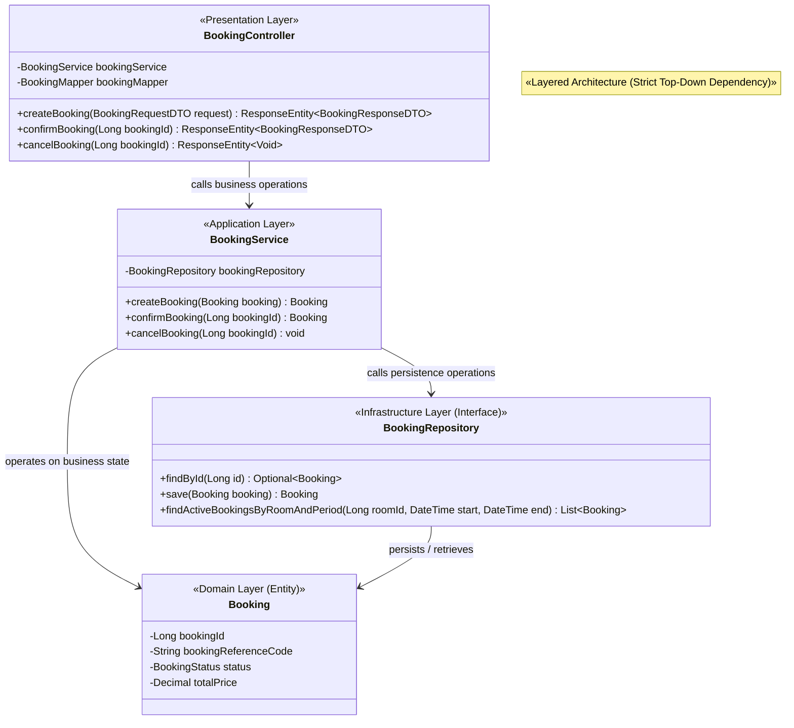
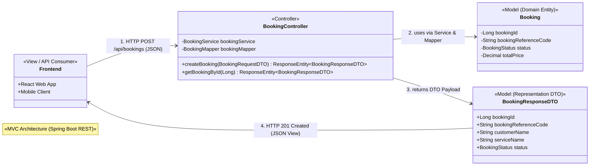
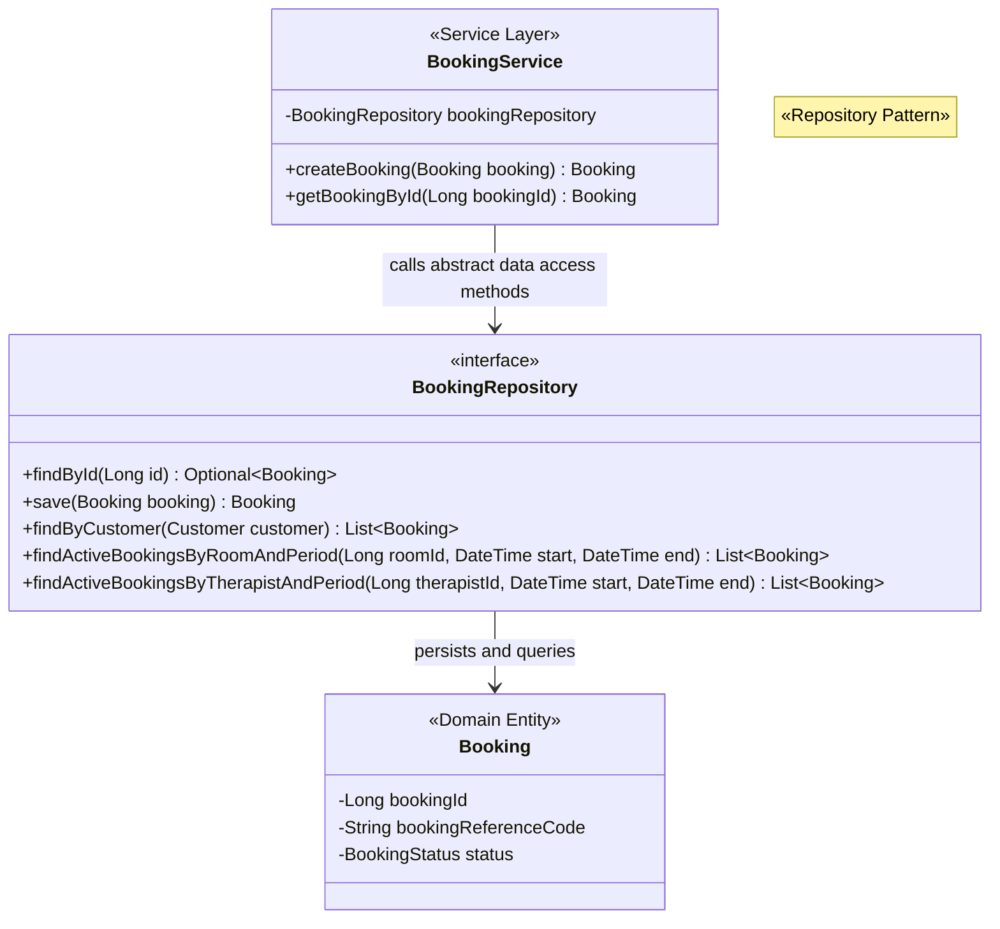
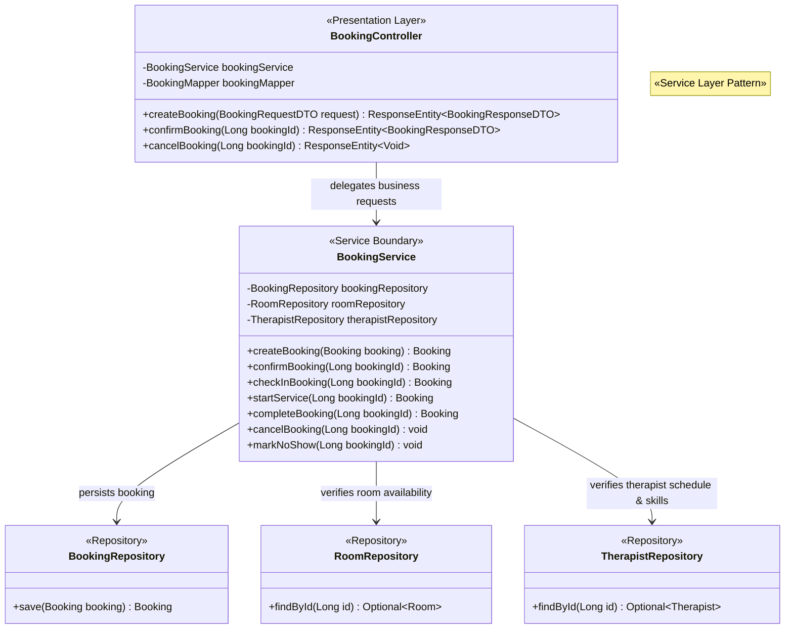
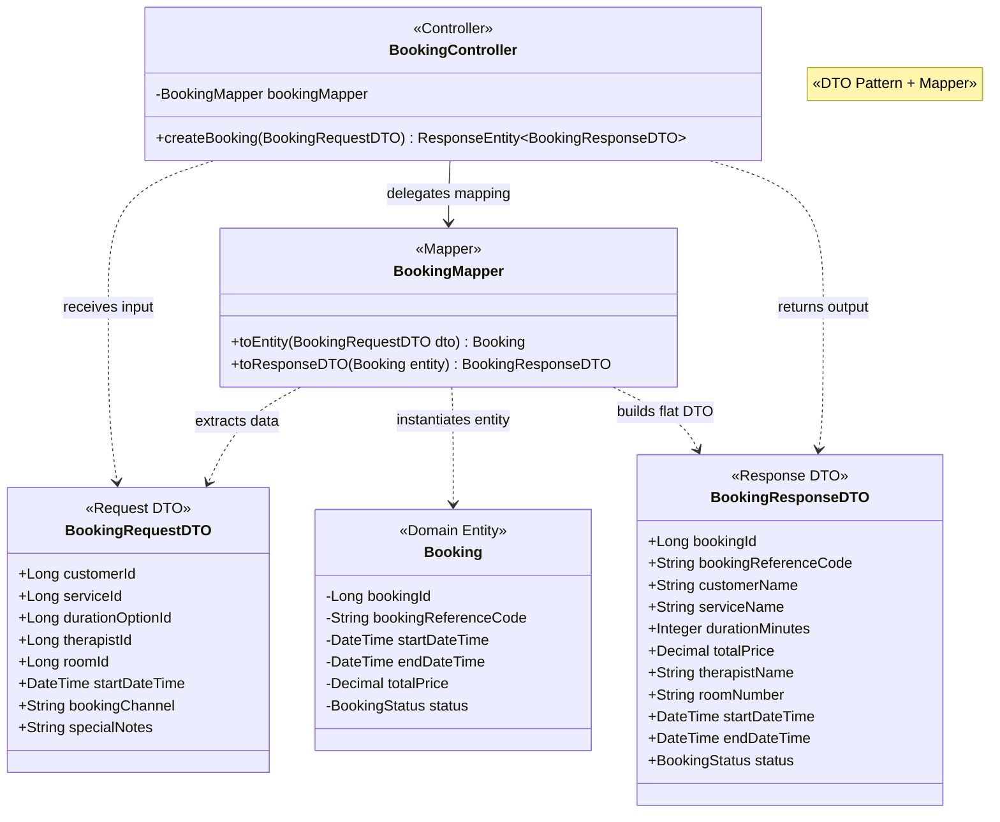
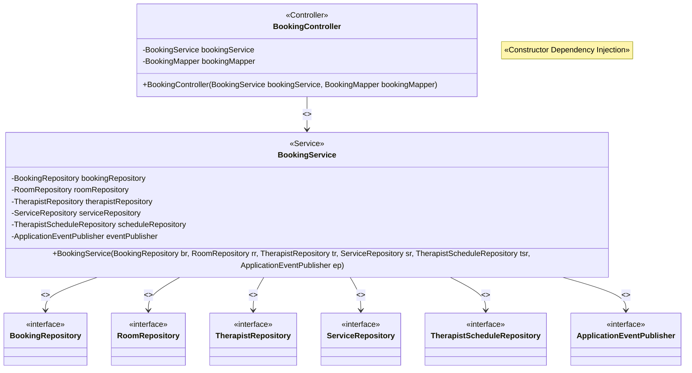
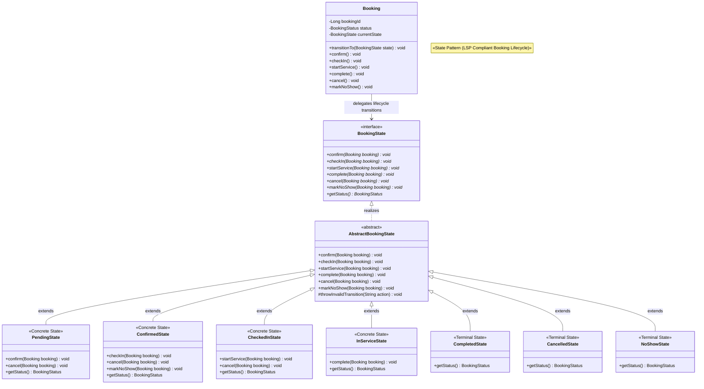
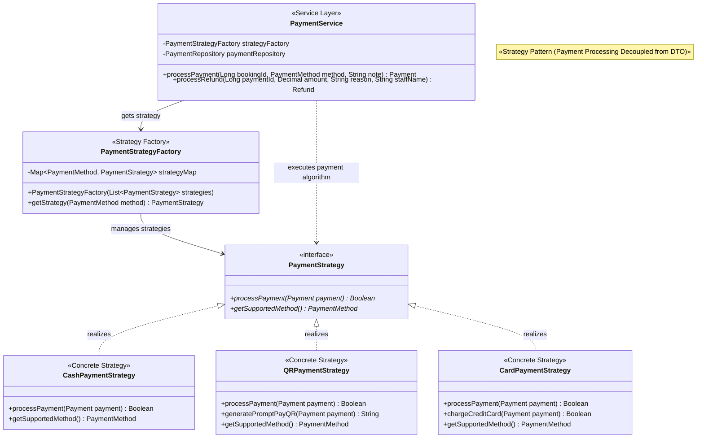
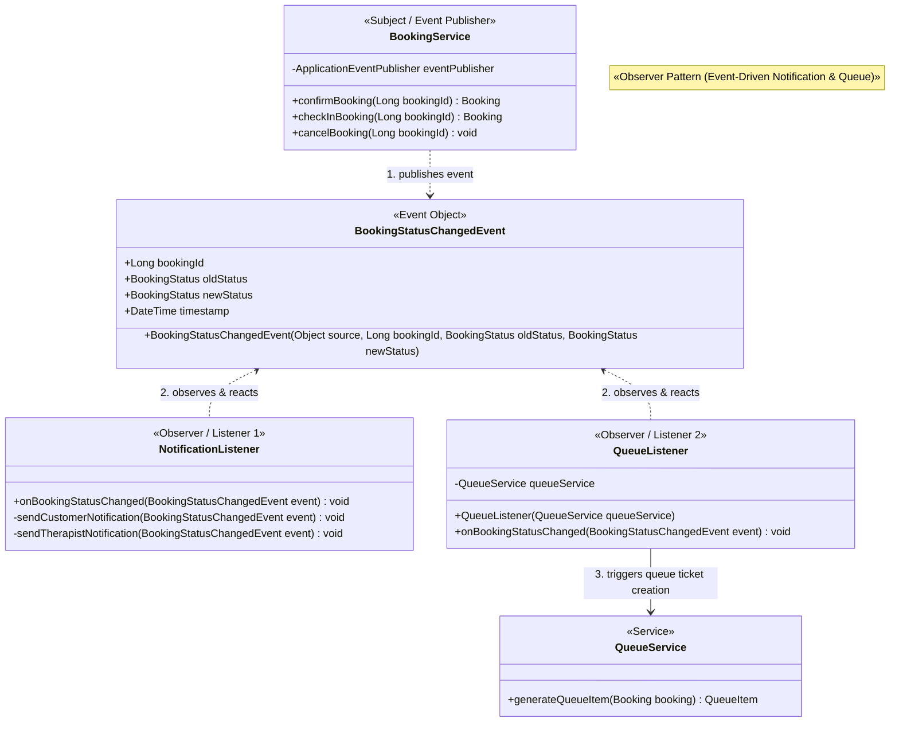

# Design Patterns

## 5. Design Patterns

เอกสารฉบับนี้จัดทำขึ้นเพื่อนำเสนอการออกแบบและประยุกต์ใช้ **Software Design Patterns** ในระบบ **FIWDEE Massage Management & Booking System** โดยใช้ [Domain Model Specification (domain-model.md)](file:///C:/Users/Viphu/Desktop/University/PrinciplesOfSoftwareDesign/FIWDEE-CP353002-69_1PrinciplesOfSoftwareDesign/doc/domain-model.md), [Use Case Specification (use-case.md)](file:///C:/Users/Viphu/Desktop/University/PrinciplesOfSoftwareDesign/FIWDEE-CP353002-69_1PrinciplesOfSoftwareDesign/doc/use-case.md), และ [Class Diagram Architecture Specification (class-diagram.md)](file:///C:/Users/Viphu/Desktop/University/PrinciplesOfSoftwareDesign/FIWDEE-CP353002-69_1PrinciplesOfSoftwareDesign/doc/class-diagram.md) เป็น **Single Source of Truth**

รูปแบบการออกแบบในระบบนี้มุ่งเน้นการแก้ปัญหาที่เกิดขึ้นจริงในการดำเนินงานของร้านนวด FIWDEE เพื่อให้ระบบมีความยืดหยุ่น (Flexibility), ลดความผูกมัดระหว่างส่วนประกอบ (Loose Coupling), เพิ่มความสามารถในการทดสอบ (Testability), ปฏิบัติตามหลักการ **SOLID Principles**, และรองรับการขยายตัวของทรัพยากร (Scalability & Dynamic Resource Principle) โดยครอบคลุมทั้งสิ้น **9 Design Patterns** แบ่งเป็น **6 Enterprise / Architectural Patterns** และ **3 GoF Behavioral Patterns** (พร้อมด้วย **Factory Pattern** ร่วมใน Strategy)

> [!NOTE]
> **สถานะการพัฒนาปัจจุบัน (Current Project Status):**
> โครงการอยู่ในขั้นตอน **การออกแบบเชิงสถาปัตยกรรมและข้อกำหนดเชิงมโนทัศน์ (Design-Level & Specification Phase)** โดยได้ระบุชื่อไฟล์ แพ็กเกจ คลาส อินเตอร์เฟซ และเมธอดทั้งหมดไว้อย่างสมบูรณ์ตามสถาปัตยกรรมเป้าหมายของ Spring Boot ดังนั้นทุก Pattern ในเอกสารฉบับนี้จึงมีสถานะเป็น **Design-level / Planned** โดยไม่มีการแต่งชื่อคลาสหรือไฟล์ที่อยู่นอกเหนือจากสถาปัตยกรรมของโปรเจกต์

---

### ตารางสรุปภาพรวม Design Patterns ทั้ง 9 ตัว

| Pattern | ปัญหาที่แก้ | ไฟล์/คลาสที่ใช้ | Class Diagram ประกอบ |
| :--- | :--- | :--- | :--- |
| **Layered Architecture** | ระบบร้านนวดมี Business Rules ซับซ้อน (เช่น ตรวจสอบความพร้อมห้อง/หมอนวด, เวลาทำความสะอาดห้อง 15 นาที, คำนวณราคา) หากไม่แยกชั้นการทำงาน โค้ดจะปะปนกัน (Spaghetti Code) จึงต้องแยก Presentation, Application, Domain และ Infrastructure ออกจากกันอย่างเด็ดขาดตามแนวทาง Strict Top-Down Dependency โดย Application Layer ไม่ขึ้นกับ Presentation DTO | **Design-level / Planned:**<br>• `presentation/controller/BookingController.java`<br>• `application/service/BookingService.java`<br>• `domain/entity/Booking.java`<br>• `infrastructure/repository/BookingRepository.java` | <code>BookingController</code><br>&emsp;&darr; <i>calls</i><br><code>BookingService</code><br>&emsp;&darr; <i>calls</i><br><code>BookingRepository</code><br>&emsp;&darr; <i>persists / retrieves</i><br><code>Booking (Domain Entity)</code><br><br>[🔍 ดู Class Diagram เต็มในข้อ 5.1](#51-layered-architecture) |
| **MVC** | ในระบบ REST API ต้องแยกความรับผิดชอบด้านการรับส่ง HTTP Request/Response ออกจาก Domain Business Model เพื่อไม่ให้ Controller ต้องจัดการโครงสร้าง Entity ภายในโดยตรง และแยกส่วนแสดงผลหน้าบ้านไปยัง Frontend Client (React/Vue/Mobile) โดยไม่มีการสร้าง View Class ปลอมบน Server | **Design-level / Planned:**<br>• `presentation/controller/BookingController.java`<br>• `domain/entity/Booking.java`<br>• `presentation/dto/BookingResponseDTO.java`<br>• Frontend Client (API Consumer) | <code>Frontend (View)</code><br>&emsp;&darr; <i>1. HTTP Request</i><br><code>BookingController</code><br>&emsp;&darr; <i>2. uses via Mapper</i><br><code>Booking (Model)</code> &rarr; <code>BookingResponseDTO</code><br>&emsp;&darr; <i>3. HTTP JSON Response</i><br><code>Frontend (View)</code><br><br>[🔍 ดู Class Diagram เต็มในข้อ 5.2](#52-mvc-model-view-controller) |
| **Repository Pattern** | Business Logic ไม่ควรผูกติดกับรายละเอียดและการเข้าถึงฐานข้อมูลโดยตรง เช่น การค้นหาห้องว่างที่ปลอดการจองสถานะ Active (`findActiveBookingsByRoomAndPeriod`) หรือการค้นหาประวัติการชำระเงิน จึงแยก Data Access Logic ออกจาก Service ด้วย Repository Interfaces ที่ครอบคลุม Spring Data JPA | **Design-level / Planned:**<br>• `infrastructure/repository/BookingRepository.java`<br>• `infrastructure/repository/PaymentRepository.java`<br>• `infrastructure/repository/RoomRepository.java`<br>• `infrastructure/repository/TherapistRepository.java`<br>• `application/service/BookingService.java` | <code>BookingService</code><br>&emsp;&darr; <i>calls data access</i><br><code>BookingRepository «interface»</code><br>&emsp;&darr; <i>manages persistence</i><br><code>Booking (Domain Entity)</code><br><br>[🔍 ดู Class Diagram เต็มในข้อ 5.3](#53-repository-pattern) |
| **Service Layer Pattern** | หาก Controller เป็นผู้ตรวจสอบเงื่อนไขการจอง, จัดการ Resource Locking ของห้อง/หมอนวด, คำนวณส่วนลด, และจัดการ Transaction (`@Transactional`) จะทำให้ Business Logic กระจัดกระจาย จึงรวบรวม Business Logic ทั้งหมดไว้ใน Service Layer ซึ่งทำงานบน Domain Entities เป็นศูนย์กลางการประมวลผล | **Design-level / Planned:**<br>• `application/service/BookingService.java`<br>• `application/service/PaymentService.java`<br>• `application/service/QueueService.java`<br>• `application/service/TherapistService.java`<br>• `presentation/controller/BookingController.java` | <code>BookingController</code><br>&emsp;&darr; <i>delegates operation</i><br><code>BookingService</code><br>&emsp;&darr; <i>orchestrates</i><br><code>BookingRepository</code> + <code>RoomRepository</code><br><br>[🔍 ดู Class Diagram เต็มในข้อ 5.4](#54-service-layer-pattern) |
| **DTO Pattern + Mapper** | ไม่ควรส่ง JPA Entity ออกเป็น API Contract โดยตรง เพราะจะทำให้ข้อมูลสำคัญรั่วไหล (เช่น `passwordHash` ใน `User`, `commissionRate` ใน `Therapist`) และเกิดปัญหา Infinite Recursion จาก Bi-directional JPA จึงใช้ Request/Response DTO ร่วมกับ Mapper ในการแปลงข้อมูลที่ Presentation Boundary | **Design-level / Planned:**<br>• `presentation/dto/BookingRequestDTO.java`<br>• `presentation/dto/BookingResponseDTO.java`<br>• `presentation/dto/PaymentRequestDTO.java`<br>• `presentation/dto/PaymentResponseDTO.java`<br>• `presentation/mapper/BookingMapper.java`<br>• `presentation/mapper/PaymentMapper.java`<br>• `domain/entity/Booking.java` | <code>BookingController</code> &rarr; <code>BookingRequestDTO</code><br>&emsp;&darr; <i>maps</i><br><code>BookingMapper</code> &harr; <code>Booking (Entity)</code><br>&emsp;&darr; <i>creates</i><br><code>BookingResponseDTO</code><br><br>[🔍 ดู Class Diagram เต็มในข้อ 5.5](#55-dto-pattern--mapper) |
| **Dependency Injection** | Controller และ Service ไม่ควรสร้าง Instance ของ Repository หรือ Service อื่นด้วยคำสั่ง `new` เอง เพราะทำให้เกิด Tight Coupling และไม่สามารถทำ Unit Test ด้วย Mockito ได้ จึงใช้ Constructor Injection ของ Spring Framework ในการฉีด Dependency เข้ามาทั้งหมด | **Design-level / Planned:**<br>• `presentation/controller/BookingController.java`<br>• `application/service/BookingService.java`<br>• `application/service/PaymentService.java`<br>• `infrastructure/repository/BookingRepository.java` | <code>BookingController(BookingService)</code><br>&emsp;&darr; <i>constructor injection</i><br><code>BookingService(BookingRepository, ...)</code><br>&emsp;&darr; <i>constructor injection</i><br><code>BookingRepository</code><br><br>[🔍 ดู Class Diagram เต็มในข้อ 5.6](#56-dependency-injection) |
| **State Pattern** | วงจรชีวิตของ Booking มี 7 สถานะ (`PENDING`, `CONFIRMED`, `CHECKED_IN`, `IN_SERVICE`, `COMPLETED`, `CANCELLED`, `NO_SHOW`) ออกแบบผ่าน `AbstractBookingState` เพื่อให้สอดคล้องกับ Liskov Substitution Principle (LSP) และบังคับใช้กฎธุรกิจว่าการเปลี่ยนเป็น `COMPLETED` ใน `InServiceState` ต้องตรวจสอบว่า Payment มีสถานะ `COMPLETED` ก่อนเสมอ | **Design-level / Planned:**<br>• `pattern/state/BookingState.java`<br>• `pattern/state/AbstractBookingState.java`<br>• `pattern/state/PendingState.java`<br>• `pattern/state/ConfirmedState.java`<br>• `pattern/state/CheckedInState.java`<br>• `pattern/state/InServiceState.java`<br>• `pattern/state/CompletedState.java`<br>• `pattern/state/CancelledState.java`<br>• `pattern/state/NoShowState.java`<br>• `domain/entity/Booking.java` | <code>Booking</code> &rarr; <code>BookingState «interface»</code><br>&emsp;&uarr; <i>implements</i><br><code>AbstractBookingState «abstract»</code><br>&emsp;&uarr; <i>extends</i><br><code>PendingState</code>, <code>ConfirmedState</code>,<br><code>CheckedInState</code>, <code>InServiceState</code>,<br><code>CompletedState</code>, <code>CancelledState</code>, <code>NoShowState</code><br><br>[🔍 ดู Class Diagram เต็มในข้อ 5.7](#57-state-pattern) |
| **Strategy Pattern** | การชำระเงินของร้านรองรับ 3 รูปแบบ (`CASH`, `QR_PROMPTPAY`, `CREDIT_CARD`) ซึ่งมี Algorithm แตกต่างกัน จึงแยก Strategy Classes โดยให้ `PaymentStrategy` รับเฉพาะ Domain Entity `Payment` ไม่ผูกติดกับ Presentation DTO ร่วมกับ `PaymentStrategyFactory` ในการเลือก Strategy ณ Runtime | **Design-level / Planned:**<br>• `pattern/strategy/PaymentStrategy.java`<br>• `pattern/strategy/CashPaymentStrategy.java`<br>• `pattern/strategy/QRPaymentStrategy.java`<br>• `pattern/strategy/CardPaymentStrategy.java`<br>• `pattern/strategy/PaymentStrategyFactory.java`<br>• `application/service/PaymentService.java`<br>• `domain/entity/Payment.java` | <code>PaymentService</code> &rarr; <code>PaymentStrategyFactory</code><br>&emsp;&darr; <i>gets strategy</i><br><code>PaymentStrategy «interface»</code><br>&emsp;&uarr; <i>realizes</i><br><code>CashPaymentStrategy</code>, <code>QRPaymentStrategy</code>,<br><code>CardPaymentStrategy</code><br><br>[🔍 ดู Class Diagram เต็มในข้อ 5.8](#58-strategy-pattern) |
| **Observer Pattern** | เมื่อ Booking เปลี่ยนสถานะ มีหลายคอมโพเนนต์ต้องตอบสนอง (เช่น ส่ง SMS/Email แจ้งเตือนลูกค้า หรือสร้างบัตรคิวหน้าร้านเมื่อ Check-in) หาก `BookingService` เรียกตรงไปยังทุกระบบจะเกิด Tight Coupling จึงใช้ Event Publishing (`BookingStatusChangedEvent`) แยกการทำงานแบบ Event-driven | **Design-level / Planned:**<br>• `pattern/observer/BookingStatusChangedEvent.java`<br>• `pattern/observer/NotificationListener.java`<br>• `pattern/observer/QueueListener.java`<br>• `application/service/BookingService.java`<br>• `application/service/QueueService.java` | <code>BookingService</code><br>&emsp;&darr; <i>publishes</i><br><code>BookingStatusChangedEvent</code><br>&emsp;&darr; <i>observes & reacts</i><br><code>NotificationListener</code> & <code>QueueListener</code><br><br>[🔍 ดู Class Diagram เต็มในข้อ 5.9](#59-observer-pattern) |

---

## 5.1 Layered Architecture

### Status
`Design-level / Planned`

### Problem
ในระบบบริหารจัดการร้านนวด FIWDEE มีกระบวนการทางธุรกิจที่มีความซับซ้อนสูง เช่น การตรวจสอบความพร้อมของห้องนวดและหมอนวด, การกันเวลาทำความสะอาดห้อง 15 นาที (`cleaningBufferMinutes`), การตรวจสอบทักษะความชำนาญของหมอนวด (`TherapistSkill`) ให้ตรงกับบริการที่เลือก, และการบันทึกสถานะการชำระเงิน หากไม่มีการแบ่งชั้นสถาปัตยกรรม (Architecture Layers) ที่ชัดเจน จะเกิดปัญหา **Spaghetti Code** เช่น Controller เขียนคำสั่ง SQL เพื่อเข้าถึงฐานข้อมูลโดยตรง หรือ Application Layer ต้องผูกติดกับ Presentation DTO ทำให้:
1. แต่ละส่วนของระบบเกิดความผูกมัดกันแน่น (Tight Coupling)
2. เมื่อต้องการเปลี่ยนโครงสร้างฐานข้อมูลหรือเปลี่ยน UI จะส่งผลกระทบต่อ Business Logic ทั้งหมด
3. ไม่สามารถทำ Unit Testing แบบแยกส่วนได้อย่างมีประสิทธิภาพ

### Classes / Files
* **Presentation Layer:** `src/main/java/com/fiwdee/presentation/controller/BookingController.java`
* **Application / Service Layer:** `src/main/java/com/fiwdee/application/service/BookingService.java`
* **Domain Layer:** `src/main/java/com/fiwdee/domain/entity/Booking.java`
* **Infrastructure / Persistence Layer:** `src/main/java/com/fiwdee/infrastructure/repository/BookingRepository.java`

### Class Diagram



### How it is applied in FIWDEE
ระบบ FIWDEE กำหนดการแบ่งชั้นสถาปัตยกรรมออกเป็น 4 ชั้นหลัก โดยบังคับใช้ทิศทางการพึ่งพาจากบนลงล่าง (**Strict Top-Down Dependency**) อย่างเคร่งครัด:
1. **Presentation Layer (`presentation`):** รับ HTTP Requests, ตรวจสอบความถูกต้องของ Input Payload (Validation), ใช้ Mapper แปลง Request DTO $\rightarrow$ Domain Entity, เรียก Service Layer และส่ง HTTP Response กลับไปยัง Client
2. **Application Layer (`application`):** รวบรวม Business Logic หลักของระบบ, กำหนดขอบเขต Transaction Boundary (`@Transactional`), ตรวจสอบเงื่อนไขทางธุรกิจข้าม Entities, และประสานงานระหว่างส่วนประกอบต่างๆ โดย **Application Layer จะไม่ขึ้นกับ Presentation DTO**
3. **Domain Layer (`domain`):** จัดเก็บ Domain Entities ทั้ง 18 คลาส (เช่น `Booking`, `Room`, `Therapist`, `Customer`, `Payment`), Business Rules ระดับ Entity, และ Enums ทั้ง 9 ชนิด โดยไม่มีความผูกพันกับ Framework ภายนอก
4. **Infrastructure Layer (`infrastructure`):** จัดการเรื่อง Data Persistence, การติดต่อกับฐานข้อมูลผ่าน Repository Interfaces และ JPA Queries ทำให้การเปลี่ยนแปลงระบบจัดเก็บข้อมูลไม่กระทบต่อ Business Logic ใน Domain หรือ Service Layer

---

## 5.2 MVC (Model-View-Controller)

### Status
`Design-level / Planned`

### Problem
ในระบบ FIWDEE การสื่อสารระหว่างผู้ใช้งาน (ลูกค้าที่จองผ่านเว็บ, พนักงานต้อนรับ Receptionist หน้าร้าน, เจ้าของร้าน Owner) กับระบบหลังบ้าน ต้องมีการจัดการข้อมูลนำเข้าและส่งออกอย่างเป็นระบบ หาก Controller ทำหน้าที่ประมวลผล Business Rules เอง หรือให้ Client ส่งข้อมูลเข้ามาแก้ไข JPA Entity ใน Database โดยตรง จะทำให้เกิดช่องโหว่ด้านความปลอดภัย (Security Vulnerabilities) และเกิดความสับสนระหว่างข้อมูลการแสดงผลกับข้อมูลทางธุรกิจ

### Classes / Files
* **Controller:** `src/main/java/com/fiwdee/presentation/controller/BookingController.java`, `src/main/java/com/fiwdee/presentation/controller/PaymentController.java`
* **Model:** `src/main/java/com/fiwdee/domain/entity/Booking.java`, `src/main/java/com/fiwdee/presentation/dto/BookingResponseDTO.java`
* **View:** Frontend Client Application (React / Vue Web App, Mobile Application สำหรับพนักงานและลูกค้า)

### Class Diagram



### How it is applied in FIWDEE
ระบบประยุกต์ใช้ MVC ในบริบทของ **Spring Boot RESTful API Architecture**:
* **Controller:** ทำหน้าที่เป็น REST Controller (`@RestController`) เช่น `BookingController`, `PaymentController` รับคำขอจากภายนอกผ่าน HTTP Method (GET, POST, PUT, DELETE), ตรวจสอบความถูกต้องของ Input, ใช้ Mapper แปลงข้อมูล, เรียกใช้ Service Layer, และส่ง HTTP Status Code พร้อม JSON Body กลับไป
* **Model:** ประกอบด้วย 2 ส่วนย่อย คือ **Domain Model** (Entities เช่น `Booking`, `Payment` ที่เก็บสถานะและกฎทางธุรกิจจริง) และ **Presentation Model** (DTOs เช่น `BookingResponseDTO` ที่จัดเตรียมข้อมูลสำหรับส่งออก)
* **View:** เนื่องจากระบบทำงานแบบ Headless / API-First Architecture **ระบบจึงไม่มีการสร้าง View Class ปลอมบน Server** แต่บทบาทของ View ในสถาปัตยกรรมนี้คือ **Client / Frontend Application** ที่เชื่อมต่อผ่าน REST API เพื่อนำข้อมูล JSON ไป Render แสดงผลบนหน้าจออุปกรณ์ของผู้ใช้

---

## 5.3 Repository Pattern

### Status
`Design-level / Planned`

### Problem
ในระบบ FIWDEE มีการเข้าถึงข้อมูลที่มีเงื่อนไขเฉพาะทางธุรกิจจำนวนมาก เช่น:
* การตรวจสอบว่าห้องนวดว่างและไม่ติดการจองในสถานะ `PENDING`, `CONFIRMED`, `CHECKED_IN`, `IN_SERVICE` ในช่วงเวลาที่ต้องการ (`findActiveBookingsByRoomAndPeriod`)
* การตรวจสอบว่าหมอนวดว่างและไม่ติดงานนวดอื่น (`findActiveBookingsByTherapistAndPeriod`)
* การค้นหาข้อมูลลูกค้าจากหมายเลขโทรศัพท์ (`findByPhoneNumber`)

หาก Service Layer ต้องเขียนโค้ด SQL หรือใช้งาน JPA `EntityManager` / native query โดยตรงฝังอยู่ใน Business Methods จะทำให้ Service Layer ผูกติดแน่นกับระบบฐานข้อมูล (High Coupling), ทำให้เกิดโค้ดซ้ำซ้อน และยากต่อการทำ Unit Test โดยไม่ต่อฐานข้อมูลจริง

### Classes / Files
* `src/main/java/com/fiwdee/infrastructure/repository/BookingRepository.java`
* `src/main/java/com/fiwdee/infrastructure/repository/PaymentRepository.java`
* `src/main/java/com/fiwdee/infrastructure/repository/RoomRepository.java`
* `src/main/java/com/fiwdee/infrastructure/repository/TherapistRepository.java`
* `src/main/java/com/fiwdee/infrastructure/repository/CustomerRepository.java`
* `src/main/java/com/fiwdee/application/service/BookingService.java`
* `src/main/java/com/fiwdee/domain/entity/Booking.java`

### Class Diagram



### How it is applied in FIWDEE
* `BookingRepository` และ Repository อื่นๆ ถูกออกแบบเป็น **Java Interface ที่ขยายความสามารถมาจาก Spring Data JPA (`JpaRepository`)**
* ทำหน้าที่เป็น In-Memory Collection เสมือน ซ่อนรายละเอียดคำสั่ง SQL/JPQL ไว้เบื้องหลัง
* Service Layer เรียกใช้งาน Data Access ผ่าน Method ที่มีความหมายทางธุรกิจโดยตรง ส่งผลให้ `BookingService` สามารถทดสอบการทำงาน (Unit Testing) ได้อย่างรวดเร็วด้วยการใช้ Mock Repository (Mockito) โดยไม่ต้องเชื่อมต่อกับฐานข้อมูล PostgreSQL/MySQL จริง

---

## 5.4 Service Layer Pattern

### Status
`Design-level / Planned`

### Problem
ในระบบ FIWDEE Use Case ทางธุรกิจหลายรายการต้องอาศัยการตรวจสอบเงื่อนไขข้ามหลาย Entities และต้องทำงานแบบ Atomic (ทั้งหมดหรือไม่มีเลย) ตัวอย่างเช่น Use Case `UC-10: Create Online Booking` และ `UC-11: Create Walk-in Booking`:
1. ต้องตรวจสอบว่าห้องนวดว่างและประเภทห้องตรงกับบริการ (`requiredRoomType`)
2. ต้องตรวจสอบว่าหมอนวดว่างและมีทักษะความชำนาญตรงกับบริการ (`TherapistSkill`)
3. ต้องคำนวณช่วงเวลาทำความสะอาดห้อง 15 นาที (`cleaningBufferMinutes`) ก่อนรับคิวถัดไป
4. ต้องสร้าง Booking ในสถานะ `PENDING` และล็อกห้องกับหมอนวดทันทีเพื่อป้องกันการจองซ้อน (Double Booking)
5. ต้องควบคุมให้ขั้นตอนทั้งหมดทำงานภายใต้ Database Transaction เดียวกัน (`@Transactional`)

หากให้ Controller เป็นผู้ประมวลผล Logic เหล่านี้ จะทำให้เกิดความซ้ำซ้อนระหว่าง Online Controller และ Walk-in Controller, ขาด Transaction Boundary และทำให้ยากต่อการดูแลรักษา

### Classes / Files
* `src/main/java/com/fiwdee/application/service/BookingService.java`
* `src/main/java/com/fiwdee/application/service/PaymentService.java`
* `src/main/java/com/fiwdee/application/service/QueueService.java`
* `src/main/java/com/fiwdee/application/service/TherapistService.java`
* `src/main/java/com/fiwdee/presentation/controller/BookingController.java`
* `src/main/java/com/fiwdee/infrastructure/repository/BookingRepository.java`

### Class Diagram



### How it is applied in FIWDEE
* `BookingService`, `PaymentService`, `QueueService` ทำหน้าที่เป็น **Service Boundary** ที่รวบรวม Business Logic ทั้งหมดของระบบ FIWDEE
* กำหนด `@Transactional` เพื่อควบคุมความถูกต้องของข้อมูล (ACID Transaction)
* ทำหน้าที่เป็น Orchestrator ประสานงานระหว่าง Repositories หลายตัว, ตรวจสอบ Business Invariants, ประมวลผลบน Domain Entities โดยตรง และยิง Events ไปยัง Observer Listeners เมื่อสถานะของ Booking เปลี่ยนแปลง

---

## 5.5 DTO Pattern + Mapper

### Status
`Design-level / Planned`

### Problem
1. **Information Disclosure & Security:** Domain Entities มี Attributes ที่เป็นข้อมูลส่วนบุคคลหรือข้อมูลภายในของร้าน เช่น `passwordHash` ใน `User`, `commissionRate` ใน `Therapist`, หรือข้อมูลประวัติสุขภาพ `healthNotes` ใน `Customer` หากส่ง Entity ออกไปยัง Presentation API โดยตรง ข้อมูลเหล่านี้จะรั่วไหลไปยัง Client
2. **Infinite JSON Recursion:** ความสัมพันธ์แบบ Bi-directional JPA (เช่น `Customer 1 -- 0..* Booking` และ `Booking * -- 1 Customer`) จะทำให้ JSON Serializer เกิดปัญหา `Infinite recursion (StackOverflowError)` เมื่อแปลง Entity เป็น JSON
3. **Database Schema Coupling:** หากโครงสร้างฐานข้อมูลภายในมีการปรับเปลี่ยน จะส่งผลให้ API Contract ที่เชื่อมต่อกับ Mobile App หรือ Frontend Web พังทันที

### Classes / Files
* **Request DTOs:** `src/main/java/com/fiwdee/presentation/dto/BookingRequestDTO.java`, `src/main/java/com/fiwdee/presentation/dto/PaymentRequestDTO.java`
* **Response DTOs:** `src/main/java/com/fiwdee/presentation/dto/BookingResponseDTO.java`, `src/main/java/com/fiwdee/presentation/dto/PaymentResponseDTO.java`, `src/main/java/com/fiwdee/presentation/dto/QueueItemResponseDTO.java`
* **Mappers:** `src/main/java/com/fiwdee/presentation/mapper/BookingMapper.java`, `src/main/java/com/fiwdee/presentation/mapper/PaymentMapper.java`
* **Domain Entities:** `src/main/java/com/fiwdee/domain/entity/Booking.java`, `src/main/java/com/fiwdee/domain/entity/Payment.java`

### Class Diagram



### How it is applied in FIWDEE
กระบวนการรับส่งข้อมูลถูกแยกขาดจาก Entity ผ่าน Data Flow ที่ชัดเจน:
$$\text{HTTP Request} \longrightarrow \text{RequestDTO} \longrightarrow \text{Mapper} \longrightarrow \text{Domain Entity} \longrightarrow \text{Service} \longrightarrow \text{Domain Entity} \longrightarrow \text{Mapper} \longrightarrow \text{ResponseDTO} \longrightarrow \text{HTTP Response}$$
* `BookingRequestDTO` รับเฉพาะข้อมูลที่จำเป็นต่อการสร้างการจอง
* `BookingMapper` ทำหน้าที่แปลง `BookingRequestDTO` เป็น `Booking` Entity และแปลง `Booking` Entity ที่รวมข้อมูลจาก `Customer`, `Service`, `Therapist`, `Room` ให้กลายเป็น `BookingResponseDTO` ที่เป็น Flat Structure ปลอดภัย ไม่มีข้อมูลอ่อนไหว และพร้อมสำหรับ Client นำไปใช้งานทันที โดย Application Service ไม่ต้องนำเข้าหรือผูกติดกับ Presentation DTO

---

## 5.6 Dependency Injection

### Status
`Design-level / Planned`

### Problem
หาก Controller หรือ Service สร้าง Instance ของ Class ที่ตนเองต้องพึ่งพาด้วยคำสั่ง `new` เอง เช่น:
```java
// Anti-pattern: Hard-coded tight coupling
public class BookingController {
    private BookingService bookingService = new BookingServiceImpl();
}
```
จะทำให้เกิด **Tight Coupling** ส่งผลให้:
1. ไม่สามารถสลับเปลี่ยน Implementation ของ Service หรือ Repository ได้
2. ไม่สามารถทำ Unit Testing ด้วยการ Mock Dependencies (เช่น ใช้ Mockito เพื่อจำลองผลลัพธ์ของ `BookingRepository`)
3. การใช้ Field Injection (`@Autowired` ที่ตัวแปรโดยตรง) ทำให้ไม่สามารถสร้าง Object นอก Spring Container ได้

### Classes / Files
* `src/main/java/com/fiwdee/presentation/controller/BookingController.java`
* `src/main/java/com/fiwdee/application/service/BookingService.java`
* `src/main/java/com/fiwdee/application/service/PaymentService.java`
* `src/main/java/com/fiwdee/infrastructure/repository/BookingRepository.java`
* `src/main/java/com/fiwdee/infrastructure/repository/RoomRepository.java`
* `src/main/java/com/fiwdee/infrastructure/repository/TherapistRepository.java`

### Class Diagram



### How it is applied in FIWDEE
* ระบบกำหนดให้ใช้ **Constructor Injection** ในทุก Controller และ Service ของระบบ FIWDEE
* ตัวแปร Dependencies ทั้งหมดจะถูกประกาศเป็น `private final` เพื่อรับประกันความเป็น Immutable Object และป้องกัน NullPointerException
* Spring IoC Container เป็นผู้จัดการวงจรชีวิตของ Beans และฉีด Dependencies ที่จำเป็นเข้ามาผ่าน Constructor โดยอัตโนมัติ ทำให้นักพัฒนาสามารถเขียน Unit Test ได้อย่างสะดวกและรวดเร็วโดยไม่ต้องพึ่งพา Spring Context

---

## 5.7 State Pattern

### Status
`Design-level / Planned`

### Problem
วงจรชีวิตของการจอง (Booking Lifecycle) ในระบบ FIWDEE มีสถานะการทำงาน 7 สถานะตามข้อกำหนดใน [use-case.md](file:///C:/Users/Viphu/Desktop/University/PrinciplesOfSoftwareDesign/FIWDEE-CP353002-69_1PrinciplesOfSoftwareDesign/doc/use-case.md) และ [domain-model.md](file:///C:/Users/Viphu/Desktop/University/PrinciplesOfSoftwareDesign/FIWDEE-CP353002-69_1PrinciplesOfSoftwareDesign/doc/domain-model.md):
$$\text{PENDING} \longrightarrow \text{CONFIRMED} \longrightarrow \text{CHECKED\_IN} \longrightarrow \text{IN\_SERVICE} \longrightarrow \text{COMPLETED}$$
พร้อมสถานะปลายทางเพิ่มเติมคือ `CANCELLED` (ยกเลิกการจอง) และ `NO_SHOW` (ลูกค้าไม่มาตามนัด)

ในแต่ละสถานะมีข้อกำหนดและข้อจำกัดในการเปลี่ยนสถานะ (State Transition Rules) ที่แตกต่างกันอย่างสิ้นเชิง:
* การกดยกเลิก (`cancel()`) กระทำได้ในสถานะ `PENDING`, `CONFIRMED` และ `CHECKED_IN` ส่วนการบันทึกไม่มาตามนัด (`markNoShow()`) กระทำได้เฉพาะในสถานะ `CONFIRMED`
* เมื่อเริ่มนวดแล้ว (`IN_SERVICE`) **ไม่อนุญาต** ให้บันทึก `markNoShow()` หรือยกเลิกการจอง
* **กฎสำคัญทางธุรกิจ (Domain Invariant):** การเปลี่ยนสถานะเป็น `COMPLETED` จะกระทำได้ใน `InServiceState` ก็ต่อเมื่อ **การชำระเงินได้รับการบันทึกว่าสำเร็จแล้ว (`Payment.paymentStatus == PaymentStatus.COMPLETED`)**
* สถานะ `COMPLETED`, `CANCELLED`, และ `NO_SHOW` เป็น Terminal States ที่ไม่อนุญาตให้เปลี่ยนสถานะใดๆ ต่อไปได้อีก

หากออกแบบ State Interface รวมทุก Operation แล้วปล่อยให้ Subclass โยน `UnsupportedOperationException` แบบไม่เป็นระเบียบ จะฝ่าฝืนหลักการ **Liskov Substitution Principle (LSP)**

### Classes / Files
* **State Interface:** `src/main/java/com/fiwdee/pattern/state/BookingState.java`
* **Abstract Base State (LSP Compliant):** `src/main/java/com/fiwdee/pattern/state/AbstractBookingState.java`
* **Concrete State Classes:**
  * `src/main/java/com/fiwdee/pattern/state/PendingState.java`
  * `src/main/java/com/fiwdee/pattern/state/ConfirmedState.java`
  * `src/main/java/com/fiwdee/pattern/state/CheckedInState.java`
  * `src/main/java/com/fiwdee/pattern/state/InServiceState.java`
  * `src/main/java/com/fiwdee/pattern/state/CompletedState.java`
  * `src/main/java/com/fiwdee/pattern/state/CancelledState.java`
  * `src/main/java/com/fiwdee/pattern/state/NoShowState.java`
* **Context Entity:** `src/main/java/com/fiwdee/domain/entity/Booking.java`
* **Domain Enum:** `src/main/java/com/fiwdee/domain/enums/BookingStatus.java`

### Class Diagram



### How it is applied in FIWDEE
1. **การปฏิบัติตาม Liskov Substitution Principle (LSP):**
   * กำหนด `AbstractBookingState` ให้มี Default Implementation ที่จัดการ Invalid State Transitions อย่างเป็นเอกภาพผ่าน Typed Domain Exception (`IllegalStateException("Cannot execute action '" + action + "' from status " + getStatus())`)
   * Subclasses ทุกตัวคงสัญญา (Contract) เดียวกัน คือ *"อนุญาตเฉพาะ Valid Transitions ตามกฎธุรกิจ และปฏิเสธ Invalid Transitions ด้วย Domain Business Exception อย่างปลอดภัยโดยไม่ทำลายสถานะข้อมูล"*
   * Client Code สามารถเรียกใช้งานออบเจกต์ `BookingState` ใดๆ ได้โดยไม่ต้องกังวลเรื่องพฤติกรรมที่ไม่พึงประสงค์
2. **การบังคับใช้ Payment Pre-condition ใน `InServiceState.complete()`:**
   * เมื่อพนักงานเรียกจบงาน เมธอด `complete()` ใน `InServiceState` จะตรวจสอบว่า `booking.getPayment()` ต้องมีอยู่จริง และมีสถานะ `Payment.paymentStatus == PaymentStatus.COMPLETED` หากยังไม่ได้ชำระเงิน ระบบจะไม่อนุญาตให้เปลี่ยนสถานะเป็น `COMPLETED`
3. **การทำงานร่วมกับ Domain Enum:**
   * สถานะยังคงถูก Map เข้ากับ `BookingStatus` (Enum) สำหรับการบันทึกลงฐานข้อมูลและส่งออก API ตามปกติ

---

## 5.8 Strategy Pattern

### Status
`Design-level / Planned`

### Problem
ใน Use Case `UC-19: Process Payment` ระบบร้านนวด FIWDEE รองรับวิธีการชำระเงิน 3 รูปแบบตามที่ระบุไว้ใน `domain-model.md` และ `use-case.md`:
1. **เงินสด (`CASH`):** รับเงินสด คำนวณเงินทอน บันทึกจำนวนเงิน และออกใบเสร็จ
2. **QR PromptPay (`QR_PROMPTPAY`):** สร้าง Dynamic PromptPay QR Code ตามยอดเงินสุทธิ และตรวจสอบ Slip Verification
3. **บัตรเครดิต (`CREDIT_CARD`):** ประมวลผลผ่านเครื่องรูดบัตร EDC / Payment Gateway และบันทึกหมายเลข Transaction Reference

หากรวมตรรกะการประมวลผลการชำระเงินทุกวิธีไว้ใน `PaymentService` เพียงคลาสเดียว หรือให้ Strategy รับ Presentation DTO จะทำให้เกิด Tight Coupling ข้าม Layer และฝ่าฝืนหลักการ **Dependency Inversion Principle (DIP)** และ **Open-Closed Principle (OCP)**

### Classes / Files
* **Strategy Interface:** `src/main/java/com/fiwdee/pattern/strategy/PaymentStrategy.java`
* **Concrete Strategies:**
  * `src/main/java/com/fiwdee/pattern/strategy/CashPaymentStrategy.java`
  * `src/main/java/com/fiwdee/pattern/strategy/QRPaymentStrategy.java`
  * `src/main/java/com/fiwdee/pattern/strategy/CardPaymentStrategy.java`
* **Strategy Factory (GoF Factory Pattern):** `src/main/java/com/fiwdee/pattern/strategy/PaymentStrategyFactory.java`
* **Service:** `src/main/java/com/fiwdee/application/service/PaymentService.java`
* **Domain Entity & Enum:** `src/main/java/com/fiwdee/domain/entity/Payment.java`, `src/main/java/com/fiwdee/domain/enums/PaymentMethod.java`

### Class Diagram



### How it is applied in FIWDEE
* อินเตอร์เฟซ `PaymentStrategy` กำหนด Signature เมธอดเป็น `processPayment(Payment payment)` โดยทำงานร่วมกับ **Domain Entity `Payment`** โดยตรง ทำให้ Strategy ไม่ผูกติดกับ Presentation DTO
* `PaymentRequestDTO` จะถูกแปลงเป็นข้อมูลธุรกรรมโดย Mapper ตั้งแต่ Presentation Layer และยอดชำระสุทธิ (`netAmount`) จะถูกคำนวณและตรวจสอบจาก `Booking.totalPrice` ตาม Business Rules ของร้านเพื่อป้องกันการแก้ไขตัวเลขจาก Client
* `PaymentStrategyFactory` (Factory Pattern) ทำหน้าที่รวบรวม Spring Beans ของทุก Strategy เข้าใน Map และส่งมอบ Strategy ที่ตรงกับ `PaymentMethod` ให้แก่ `PaymentService` ในขณะ Runtime ตามหลัก Open-Closed Principle

---

## 5.9 Observer Pattern

### Status
`Design-level / Planned`

### Problem
เมื่อเกิดเหตุการณ์เปลี่ยนแปลงสถานะของการจอง (Booking Status Transition) ในระบบ FIWDEE จะมีหลายระบบย่อยและคอมโพเนนต์สนับสนุนที่ต้องตอบสนองต่อเหตุการณ์ดังกล่าวพร้อมกัน เช่น:
1. เมื่อสถานะเปลี่ยนเป็น `CONFIRMED` $\rightarrow$ ระบบแจ้งเตือนต้องส่ง SMS/Email ยืนยันไปยังลูกค้า และแจ้งเตือนตารางงานไปยังหมอนวด
2. เมื่อลูกค้า Check-in หน้าร้าน (`CHECKED_IN` ตาม `UC-12`) $\rightarrow$ ระบบคิวต้องสร้างบัตรคิว (`QueueItem`) เข้าระบบคิวประจำวันโดยอัตโนมัติ
3. เมื่อสถานะเปลี่ยนเป็น `CANCELLED` หรือ `NO_SHOW` $\rightarrow$ ระบบต้องส่งแจ้งเตือนและปลดล็อกตารางเวลาของห้องนวดและหมอนวด

หาก `BookingService` ต้องเรียกไปยัง `NotificationService`, `QueueService`, และระบบสนับสนุนอื่นๆ โดยตรง จะทำให้ `BookingService` เกิด **Tight Coupling** สูงมาก และหากระบบแจ้งเตือนภายนอกเกิดความล่าช้าหรือข้อผิดพลาด จะส่งผลกระทบให้กระบวนการจองหลักของลูกค้าทำงานล้มเหลวไปด้วย

### Classes / Files
* **Event Object:** `src/main/java/com/fiwdee/pattern/observer/BookingStatusChangedEvent.java`
* **Listeners / Observers:**
  * `src/main/java/com/fiwdee/pattern/observer/NotificationListener.java`
  * `src/main/java/com/fiwdee/pattern/observer/QueueListener.java`
* **Publisher & Service:** `src/main/java/com/fiwdee/application/service/BookingService.java`, `src/main/java/com/fiwdee/application/service/QueueService.java`

### Class Diagram



### How it is applied in FIWDEE
* ระบบประยุกต์ใช้ Observer Pattern ผ่านกลไก **Spring Event-Driven Architecture (`ApplicationEventPublisher` และ `@EventListener`)**
* เมื่อ `BookingService` ดำเนินการเปลี่ยนสถานะการจองสำเร็จ จะสร้างและ Publish `BookingStatusChangedEvent` ออกไปยัง Spring Application Event Bus โดยไม่ต้องรับรู้ว่ามี Listener ใดคอยรับฟังอยู่บ้าง
* `NotificationListener` (Observer ตัวที่ 1) คอยดักฟัง Event เพื่อส่งข้อความแจ้งเตือนลูกค้าและหมอนวดแบบ Asynchronous (`@Async`) ทำให้ไม่บล็อกการทำงานของ Request หลัก
* `QueueListener` (Observer ตัวที่ 2) คอยดักฟัง Event เมื่อสถานะเปลี่ยนเป็น `CHECKED_IN` เพื่อส่งต่อให้ `QueueService` สร้างออบเจกต์ `QueueItem` บันทึกลงฐานข้อมูลหน้าร้านโดยอัตโนมัติ สอดคล้องกับ Domain Model และ Use Case `UC-12`
* การออกแบบนี้รักษาความสัมพันธ์ `Booking 1 -- 0..1 QueueItem` ตาม Domain Model โดยใช้ Event-Driven Architecture เป็นกลไกขับเคลื่อนการทำงาน
