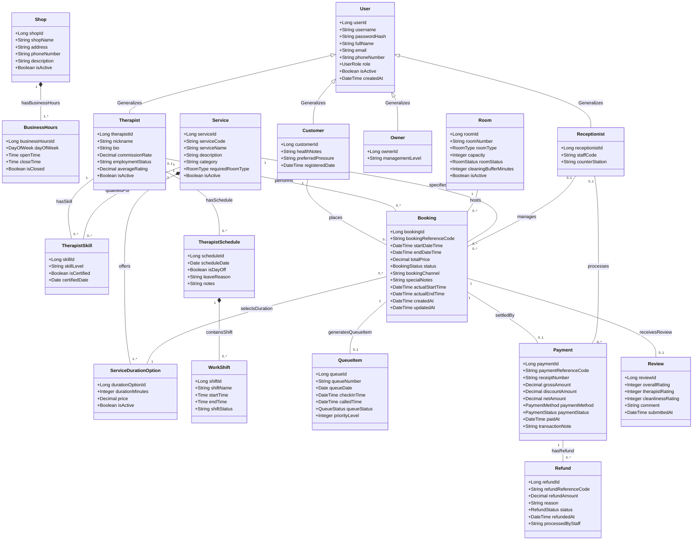
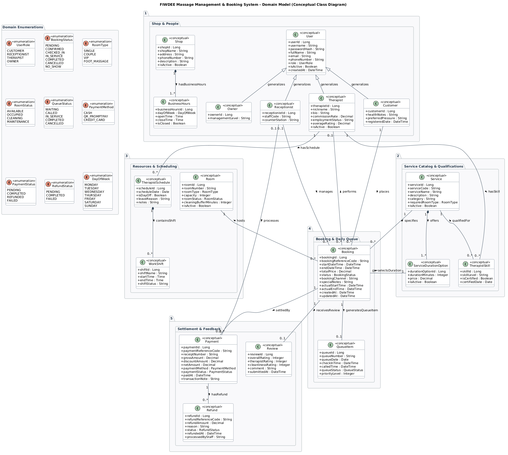

# FIWDEE Massage Management & Booking System
## Domain Model (Conceptual Class Diagram) Specification

---

## 1. Executive Summary & Purpose (บทนำและวัตถุประสงค์ของแบบจำลองโดเมน)

เอกสารฉบับนี้จัดทำขึ้นเพื่อนำเสนอ **Domain Model (Conceptual Class Diagram)** สำหรับระบบ **FIWDEE Massage Management & Booking System** โดยใช้เอกสารข้อกำหนดความต้องการ Use Case Specification ([use-case.md](file:///C:/Users/Viphu/Desktop/University/PrinciplesOfSoftwareDesign/FIWDEE-CP353002-69_1PrinciplesOfSoftwareDesign/doc/use-case.md)) เป็น **Single Source of Truth**

### 1.1 วัตถุประสงค์และขอบเขตเชิงมโนทัศน์ (Conceptual Boundary)
แบบจำลองโดเมน (Domain Model) นี้มุ่งเน้นการจำลอง **แนวคิดเชิงธุรกิจ (Domain Concepts / Real-World Entities)**, คุณลักษณะสำคัญ (Attributes), ความสัมพันธ์ (Associations), และจำนวนความสัมพันธ์ (Multiplicities) ของระบบบริหารจัดการร้านนวด โดย:
* **ไม่รวมองค์ประกอบเชิงสถาปัตยกรรมซอฟต์แวร์และการเขียนโปรแกรม (No Implementation Details):** ไม่มี Controller, Service, Repository, DTO, Mapper, REST API, Database Table Spec, Java/Spring Annotations หรือ Design Pattern Classes
* **ไม่ระบุ Operation/Method:** มุ่งเน้นโครงสร้างข้อมูลและความหมายทางธุรกิจ (Structural & Semantic Domain Modeling)
* **สะท้อนหลักการ Dynamic Resource:** รองรับการขยายตัวของห้องนวด (Room) และหมอนวด (Therapist) ได้อย่างยืดหยุ่น โดยไม่มีการ Hard-code จำนวนคงที่
* **รักษาความสอดคล้องกับ Use Case:** จำลองข้อมูลร้าน (Shop & BusinessHours), ประวัติการคืนเงิน (Refund Transaction Audit), ตารางงานและวันลา (TherapistSchedule & WorkShift) อย่างถูกต้อง

---

## 2. Conceptual Class Diagram (แผนภาพคลาสเชิงมโนทัศน์)

### 2.1 Mermaid Diagram



### 2.2 ไฟล์ต้นฉบับและรูปภาพแผนภาพ (Diagram Source & Image)
* ไฟล์นิยาม PlantUML: [domain-model.puml](file:///C:/Users/Viphu/Desktop/University/PrinciplesOfSoftwareDesign/FIWDEE-CP353002-69_1PrinciplesOfSoftwareDesign/doc/diagrams/domain-model.puml)
* ไฟล์รูปภาพ PNG Diagram: [domain-model.png](file:///C:/Users/Viphu/Desktop/University/PrinciplesOfSoftwareDesign/FIWDEE-CP353002-69_1PrinciplesOfSoftwareDesign/img/domain-model.png)



---

## 3. Detailed Class Descriptions (รายละเอียดคลาสเชิงมโนทัศน์)

### 3.1 กลุ่ม Shop & Operating Hours (ข้อมูลร้านและเวลาทำการ)

| ชื่อคลาส (Class Name) | บทบาทเชิงมโนทัศน์ (Domain Concept & Role) | คุณลักษณะสำคัญ (Key Conceptual Attributes) |
| :--- | :--- | :--- |
| **`Shop`** | ข้อมูลโปรไฟล์ร้านนวด FIWDEE (ที่อยู่, ข้อมูลติดต่อ, คำอธิบาย) ตาม `UC-04` และ `UC-23` | `shopId`, `shopName`, `address`, `phoneNumber`, `description`, `isActive` |
| **`BusinessHours`** | เวลาเปิด-ปิดทำการของร้านในแต่ละวันของสัปดาห์ ใช้คำนวณช่วงเวลาเปิดให้บริการใน `UC-08` | `businessHoursId`, `dayOfWeek` (`DayOfWeek`), `openTime`, `closeTime`, `isClosed` |

---

### 3.2 กลุ่ม People & Accounts (ผู้ใช้งานและบทบาท)

| ชื่อคลาส (Class Name) | บทบาทเชิงมโนทัศน์ (Domain Concept & Role) | คุณลักษณะสำคัญ (Key Conceptual Attributes) |
| :--- | :--- | :--- |
| **`User`** | ตัวแทนบัญชีผู้ใช้งานพื้นฐานส่วนกลางของระบบ จัดเก็บข้อมูลการพิสูจน์ตัวตนและการติดต่อ | `userId`, `username`, `passwordHash`, `fullName`, `email`, `phoneNumber`, `role`, `isActive`, `createdAt` |
| **`Customer`** | ผู้รับบริการนวด (Subtype ของ `User`) จัดเก็บประวัติสุขภาพและข้อควรระวังเฉพาะบุคคล | `customerId`, `healthNotes` (เช่น ข้อควรระวัง สตรีมีครรภ์ หรือบริเวณที่ต้องการเน้น), `preferredPressure`, `registeredDate` |
| **`Therapist`** | ผู้ให้บริการนวด (Subtype ของ `User`) จัดเก็บข้อมูลส่วนแบ่งรายได้ สถานะความพร้อม และคะแนนความพึงพอใจ | `therapistId`, `nickname`, `bio`, `commissionRate`, `employmentStatus`, `averageRating`, `isActive` |
| **`Receptionist`** | พนักงานต้อนรับหน้าร้าน (Subtype ของ `User`) ผู้ดูแลคิว การเช็คอิน และการรับชำระเงิน | `receptionistId`, `staffCode`, `counterStation` |
| **`Owner`** | เจ้าของร้าน/ผู้บริหารระบบ (Subtype ของ `User`) ผู้มีสิทธิ์สูงสุดในการกำหนดนโยบายร้านและดูภาพรวมการเงิน | `ownerId`, `managementLevel` |

---

### 3.3 กลุ่ม Service Catalog & Qualifications (รายการบริการและทักษะ)

| ชื่อคลาส (Class Name) | บทบาทเชิงมโนทัศน์ (Domain Concept & Role) | คุณลักษณะสำคัญ (Key Conceptual Attributes) |
| :--- | :--- | :--- |
| **`Service`** | เมนูบริการนวดที่ร้านเปิดให้บริการ (เช่น นวดแผนไทย, นวดอโรมา, นวดเท้า) | `serviceId`, `serviceCode`, `serviceName`, `description`, `category`, `requiredRoomType`, `isActive` |
| **`ServiceDurationOption`** | ตัวเลือกระยะเวลาและราคาของบริการแต่ละประเภท (เช่น 60 นาที 400 บาท, 90 นาที 550 บาท, 120 นาที 700 บาท) | `durationOptionId`, `durationMinutes`, `price`, `isActive` |
| **`TherapistSkill`** | Association Class บันทึกความเชี่ยวชาญ/ใบรับรองระหว่างหมอนวดกับบริการนวดที่ตนมีสิทธิ์ให้บริการ | `skillId`, `skillLevel`, `isCertified`, `certifiedDate` |

---

### 3.4 กลุ่ม Resources & Scheduling (ทรัพยากรห้องและการจัดตารางงาน)

| ชื่อคลาส (Class Name) | บทบาทเชิงมโนทัศน์ (Domain Concept & Role) | คุณลักษณะสำคัญ (Key Conceptual Attributes) |
| :--- | :--- | :--- |
| **`Room`** | ห้องนวดที่เป็น Dynamic Resource จัดสรรตามประเภทบริการ พร้อมรองรับเวลาทำความสะอาดหลังใช้งาน | `roomId`, `roomNumber`, `roomType`, `capacity`, `roomStatus`, `cleaningBufferMinutes` (ค่าเริ่มต้น 15 นาที), `isActive` |
| **`TherapistSchedule`** | ตารางบันทึกการทำงาน/วันลาของหมอนวดในแต่ละวันปฏิทิน | `scheduleId`, `scheduleDate`, `isDayOff`, `leaveReason`, `notes` |
| **`WorkShift`** | ช่วงเวลากะการทำงานย่อยภายในตารางวัน (เช่น กะเช้า 10:00-19:00, กะบ่าย 13:00-22:00, เต็มวัน 10:00-22:00) | `shiftId`, `shiftName`, `startTime`, `endTime`, `shiftStatus` |

---

### 3.5 กลุ่ม Booking & Daily Queue (การจองและคิวประจำวัน)

| ชื่อคลาส (Class Name) | บทบาทเชิงมโนทัศน์ (Domain Concept & Role) | คุณลักษณะสำคัญ (Key Conceptual Attributes) |
| :--- | :--- | :--- |
| **`Booking`** | ธุรกรรมหลักของระบบ เชื่อมโยงลูกค้า, บริการ, ระยะเวลา, ห้อง, และหมอนวด พร้อมติดตามวงจรชีวิตของการให้บริการ | `bookingId`, `bookingReferenceCode`, `startDateTime`, `endDateTime`, `totalPrice`, `status`, `bookingChannel`, `specialNotes`, `actualStartTime`, `actualEndTime`, `createdAt`, `updatedAt` |
| **`QueueItem`** | บัตรคิวประจำวันหน้าร้านที่สร้างขึ้นเมื่อลูกค้าเดินทางมาถึงและเช็คอิน เพื่อติดตามลำดับการเรียกเข้ารับบริการ | `queueId`, `queueNumber`, `queueDate`, `checkInTime`, `calledTime`, `queueStatus`, `priorityLevel` |

---

### 3.6 กลุ่ม Settlement, Refund & Feedback (การชำระเงิน คืนเงิน และรีวิว)

| ชื่อคลาส (Class Name) | บทบาทเชิงมโนทัศน์ (Domain Concept & Role) | คุณลักษณะสำคัญ (Key Conceptual Attributes) |
| :--- | :--- | :--- |
| **`Payment`** | บันทึกธุรกรรมการเงินที่ชำระค่าบริการเสร็จสิ้น มีคุณสมบัติเป็น Audit Record ที่ไม่สามารถแก้ไขข้อมูลย้อนหลังได้ | `paymentId`, `paymentReferenceCode`, `receiptNumber`, `grossAmount`, `discountAmount`, `netAmount`, `paymentMethod`, `paymentStatus`, `paidAt`, `transactionNote` |
| **`Refund`** | บันทึกธุรกรรมการคืนเงิน (Audit Trail) ในกรณีที่มีการยกเลิกการจองหรือคืนเงิน โดยแยกตารางออกจาก Payment | `refundId`, `refundReferenceCode`, `refundAmount`, `reason`, `status` (`RefundStatus`), `refundedAt`, `processedByStaff` |
| **`Review`** | การประเมินความพึงพอใจและข้อเสนอแนะของลูกค้าหลังการให้บริการเสร็จสมบูรณ์ (`COMPLETED`) | `reviewId`, `overallRating` (1-5), `therapistRating` (1-5), `cleanlinessRating` (1-5), `comment`, `submittedAt` |

---

## 4. Domain Enumerations (ชุดค่าคงที่เชิงโดเมน)

* **`UserRole`:** `CUSTOMER`, `RECEPTIONIST`, `THERAPIST`, `OWNER`
* **`BookingStatus`:** `PENDING`, `CONFIRMED`, `CHECKED_IN`, `IN_SERVICE`, `COMPLETED`, `CANCELLED`, `NO_SHOW`
* **`RoomType`:** `SINGLE`, `COUPLE`, `VIP`, `FOOT_MASSAGE`
* **`RoomStatus`:** `AVAILABLE`, `OCCUPIED`, `CLEANING`, `MAINTENANCE`
* **`QueueStatus`:** `WAITING`, `CALLED`, `IN_SERVICE`, `COMPLETED`, `CANCELLED`
* **`PaymentMethod`:** `CASH`, `QR_PROMPTPAY`, `CREDIT_CARD`
* **`PaymentStatus`:** `PENDING`, `COMPLETED`, `REFUNDED`, `FAILED`
* **`RefundStatus`:** `PENDING`, `COMPLETED`, `FAILED`
* **`DayOfWeek`:** `MONDAY`, `TUESDAY`, `WEDNESDAY`, `THURSDAY`, `FRIDAY`, `SATURDAY`, `SUNDAY`

---

## 5. Relationships & Multiplicity (ความสัมพันธ์และจำนวนภาวะ)

### 5.1 Generalization Hierarchy (ลำดับชั้นการสืบทอดคุณสมบัติ)
ความสัมพันธ์แบบการสืบทอดคุณสมบัติ (Generalization / Inheritance) ใน UML เป็นการกำหนดความสัมพันธ์ระหว่าง Superclass กับ Subtypes จึงไม่มี Multiplicity เชิงตัวเลข:

```text
User (Base Class / Common Account)
├── Customer (ผู้รับบริการ / ข้อมูลสุขภาพ)
├── Receptionist (พนักงานต้อนรับหน้าร้าน)
├── Therapist (ผู้ให้บริการนวด / ค่าคอมมิชชัน)
└── Owner (เจ้าของร้าน / สิทธิ์บริหารสูงสุด)
```
* **คำอธิบาย:** `User` เป็นคลาสพื้นฐานจัดเก็บข้อมูลระบุตัวตนกลาง (`userId`, `username`, `passwordHash`, `fullName`, `email`, `phoneNumber`, `role`, `isActive`) โดยมีบทบาทเฉพาะตาม `UserRole` แยกเป็น Subclasses เพื่อจัดเก็บคุณลักษณะ (attributes) เฉพาะทางของแต่ละบทบาท

### 5.2 Association & Multiplicity Matrix (ตารางความสัมพันธ์เชิงเชื่อมโยง)

| คลาสต้นทาง (Source) | Multiplicity | ชื่อความสัมพันธ์ (Association Name) | Multiplicity | คลาสปลายทาง (Target) | คำอธิบายความหมายทางธุรกิจ (Business Semantic & Rationale) |
| :--- | :---: | :---: | :---: | :---: | :--- |
| **`Shop`** | `1` | `hasBusinessHours` (Composition) | `1..*` | **`BusinessHours`** | ร้านมีตารางเวลาเปิด-ปิดทำการ 1 ชุดขึ้นไปครอบคลุมวันในสัปดาห์ |
| **`Customer`** | `1` | `places` | `0..*` | **`Booking`** | ลูกค้า 1 คน สามารถสร้างการจองได้หลายรายการ (0 ถึง หลายครั้ง) โดยแต่ละ Booking ต้องเป็นของลูกค้า 1 คนเสมอ |
| **`Therapist`** | `0..1` | `performs` | `0..*` | **`Booking`** | หมอนวด 1 คน ให้บริการได้หลาย Booking โดย Booking หนึ่งจะมีหมอนวดที่ได้รับมอบหมายได้ 0 ถึง 1 คน (0 ในกรณีระบบรอจัดสรรอัตโนมัติ) |
| **`Room`** | `1` | `hosts` | `0..*` | **`Booking`** | ห้องนวด 1 ห้อง รองรับการจองได้หลายช่วงเวลาตลอดวัน โดยแต่ละ Booking ถูกจัดสรรให้ใช้งานใน 1 ห้องนวดที่เหมาะสม |
| **`Service`** | `1` | `specifies` | `0..*` | **`Booking`** | บริการ 1 รายการ ถูกเลือกในการจองได้หลายครั้ง โดย 1 Booking เป็นการรับบริการหลัก 1 รายการ |
| **`Service`** | `1` | `offers` (Composition) | `1..*` | **`ServiceDurationOption`** | บริการ 1 รายการ ต้องมีตัวเลือกระยะเวลา/ราคาอย่างน้อย 1 ตัวเลือกขึ้นไป (เช่น 60, 90, 120 นาที) และหากบริการถูกลบ ตัวเลือกราคาจะหมดสภาพไปด้วย |
| **`Booking`** | `0..*` | `selectsDuration` | `1` | **`ServiceDurationOption`** | แต่ละ Booking ต้องระบุตัวเลือกระยะเวลาและราคาที่แน่นอน 1 ตัวเลือก |
| **`Therapist`** | `1` | `hasSkill` | `0..*` | **`TherapistSkill`** | หมอนวด 1 คน สามารถมีทักษะ/ใบรับรองความชำนาญได้หลายบริการ |
| **`Service`** | `1` | `qualifiedFor` | `0..*` | **`TherapistSkill`** | บริการ 1 รายการ สามารถมีหมอนวดที่ผ่านคุณสมบัติได้หลายคน |
| **`Therapist`** | `1` | `hasSchedule` | `0..*` | **`TherapistSchedule`** | หมอนวด 1 คน มีตารางงานรายวันได้หลายวัน |
| **`TherapistSchedule`** | `1` | `containsShift` (Composition) | `0..*` | **`WorkShift`** | ตารางงาน 1 วัน มีกะการทำงาน 0 ถึง หลายกะ (0 กะในกรณีเป็นวันหยุด/วันลา `isDayOff = true`, $\ge 1$ กะในวันทำงาน) |
| **`Booking`** | `1` | `generatesQueueItem` | `0..1` | **`QueueItem`** | เมื่อลูกค้ามาถึงร้านและกดเช็คอิน Booking จะสร้างบัตรคิวในระบบ 1 รายการสำหรับการจัดลำดับหน้าร้าน |
| **`Booking`** | `1` | `settledBy` | `0..1` | **`Payment`** | Booking ที่ให้บริการเสร็จสิ้นจะถูกชำระเงินและเกิดเป็นใบเสร็จรับเงิน 1 รายการ (Payment เป็น Audit Trail ที่แก้ไขไม่ได้) |
| **`Payment`** | `1` | `hasRefund` | `0..*` | **`Refund`** | รายการชำระเงินสามารถมีประวัติธุรกรรมการคืนเงินได้ 0 ถึง หลายครั้ง (Audit Trail แยกตาราง) |
| **`Booking`** | `1` | `receivesReview` | `0..1` | **`Review`** | Booking ที่มีสถานะ `COMPLETED` สามารถได้รับการประเมินรีวิวจากลูกค้าได้ไม่เกิน 1 ครั้ง |
| **`Receptionist`** | `0..1` | `manages` | `0..*` | **`Booking`** | พนักงานหน้าร้านสามารถสร้าง/จัดการ Booking ให้แก่ลูกค้า Walk-in หรือลูกค้าทางโทรศัพท์ได้ |
| **`Receptionist`** | `0..1` | `processes` | `0..*` | **`Payment`** | พนักงานหน้าร้านเป็นผู้รับเงินและบันทึกธุรกรรมการชำระเงินของลูกค้า |

---

## 6. Key Business Constraints Reflected in Domain Model (กฎเกณฑ์ทางธุรกิจที่แบบจำลองสะท้อน)

1. **การจัดสรรทรัพยากรแบบไม่ทับซ้อน (Strict Non-overlapping Constraint):**
   * หมอนวด 1 คน ไม่สามารถให้บริการมากกว่า 1 Booking ในช่วงเวลาเดียวกันได้ โดยตรวจสอบ Active Bookings ในสถานะ `PENDING`, `CONFIRMED`, `CHECKED_IN`, `IN_SERVICE`
   * ห้องนวด 1 ห้อง ไม่สามารถรองรับมากกว่า 1 Booking ในช่วงเวลาเดียวกันได้ โดยตรวจสอบ Active Bookings ในสถานะ `PENDING`, `CONFIRMED`, `CHECKED_IN`, `IN_SERVICE`
   * สถานะ `PENDING` ถือเป็น Active Booking ที่ล็อกทรัพยากรไว้แล้ว (Reserved/Locked) เพื่อป้องกันการจองซ้อน ส่วน `COMPLETED`, `CANCELLED`, `NO_SHOW` ไม่ถือเป็น Active Booking สำหรับ Resource Conflict
2. **ระยะเวลาทำความสะอาดห้อง (Room Turnover Buffer):**
   * ห้องนวดแต่ละห้องมีคุณลักษณะ `cleaningBufferMinutes` (15 นาที) เพื่อกันเวลาทำความสะอาดก่อนจะเริ่ม Booking ถัดไปในห้องเดิม
3. **ความพร้อมและทักษะของหมอนวด (Therapist Availability & Skill Match):**
   * การจัดสรรหมอนวดพิจารณาจาก `Therapist.isActive = true`, มีตารางงานใน `TherapistSchedule`/`WorkShift` ตรงกับช่วงเวลา, และมีเรคคอร์ด `TherapistSkill` ตรงกับ `Service` ที่ลูกค้าเลือก
4. **ความสามารถในการขยายระบบ (Scalability & Dynamic Resources):**
   * `Room` และ `Therapist` ถูกจำลองเป็น Dynamic Entities ในระบบ ไม่มีการจำกัดจำนวนคงที่ (No Hardcoded 6 Rooms / 6 Therapists)
5. **ความสัมพันธ์ของวงจรชีวิตการจอง (Booking Lifecycle Progression):**
   * การจองดำเนินไปตามสถานะ: `PENDING` $\rightarrow$ `CONFIRMED` $\rightarrow$ `CHECKED_IN` $\rightarrow$ `IN_SERVICE` $\rightarrow$ `COMPLETED` (โดยมี `CANCELLED` / `NO_SHOW` เป็น Terminal States)
   * ขั้นตอนการชำระเงิน (`UC-19 Process Payment`) เกิดขึ้นขณะ Booking มีสถานะ `IN_SERVICE` (เมื่อการบริการเสร็จสิ้นทางกายภาพ) และเมื่อชำระเงินสำเร็จ `Payment.paymentStatus` จะเป็น `COMPLETED` ระบบจึงเปลี่ยนสถานะ Booking เป็น `COMPLETED` และปลดล็อคสิทธิ์การส่งรีวิว (`UC-18`)
6. **เงื่อนไขการส่งรีวิว (Review Prerequisite):**
   * `Review` มีความสัมพันธ์ `0..1` กับ `Booking` และจะเกิดขึ้นได้เฉพาะเมื่อ Booking มีสถานะเป็น `COMPLETED` แล้วเท่านั้น
7. **ความคงสภาพของบันทึกการชำระเงินและการคืนเงิน (Payment & Refund Audit Integrity):**
   * `Payment` และ `Refund` ถูกออกแบบเป็นธุรกรรมบันทึกการเงินที่ไม่สามารถแก้ไขหรือลบย้อนหลังได้ เพื่อความโปร่งใสทางบัญชีตามมาตรฐาน Audit Log
8. **การคำนวณรายได้หมอนวด (Derived Therapist Earnings):**
   * รายได้และส่วนแบ่งค่าคอมมิชชันของหมอนวด (`Therapist Earnings`) คำนวณแบบ Dynamic จากรายการ Booking ที่เสร็จสิ้นและชำระเงินแล้ว (`Booking.status = COMPLETED`, `Payment.paymentStatus = COMPLETED`) คูณกับ `Therapist.commissionRate` โดยไม่มีความจำเป็นต้องสร้าง Entity จัดเก็บผลลัพธ์แยกต่างหาก
9. **ภาพรวมและการออกรายงานเชิงบริหาร (Derived Dashboard & Reports):**
   * รายงานสถิติ ยอดขาย อัตราการใช้งานห้อง (`Room Utilization`) และคะแนนประเมินใน `UC-22` ถูกประมวลผลสรุป (Aggregated View) จาก `Booking`, `Payment`, `Refund`, `Room`, `Therapist`, และ `Review` โดยไม่สร้าง Entity พิเศษขึ้นมาจำลอง

---

## 7. Cross-Document Traceability Matrix (ตารางเชื่อมโยง Use Case และ Domain Concepts)

ตารางนี้แสดงความเชื่อมโยงระหว่าง Functional Use Cases ทั้ง 28 Use Cases ใน Use Case Specification กับ Conceptual Domain Entities ใน Domain Model:

| Use Case ID & Name | Domain Concepts ที่เกี่ยวข้อง (Related Domain Entities) |
| :--- | :--- |
| **UC-01: Register Account** | `User`, `Customer`, `UserRole` |
| **UC-02: Authenticate / Login** | `User`, `UserRole` |
| **UC-03: View / Update Profile** | `User`, `Customer`, `Therapist`, `Receptionist`, `Owner` |
| **UC-04: View Shop Information** | `Shop`, `BusinessHours`, `DayOfWeek` |
| **UC-05: View Services & Pricing** | `Service`, `ServiceDurationOption`, `RoomType` |
| **UC-06: View Therapist Profiles** | `Therapist`, `TherapistSkill`, `Service` |
| **UC-07: Create Booking** | `Customer`, `Booking`, `Service`, `ServiceDurationOption`, `Room`, `Therapist`, `BookingStatus` |
| **UC-08: Check Resource Availability** | `Shop`, `BusinessHours`, `Room`, `Therapist`, `TherapistSchedule`, `WorkShift`, `Booking`, `TherapistSkill` |
| **UC-09: View Bookings / History** | `Booking`, `Customer`, `Therapist`, `Room`, `Service` |
| **UC-10: Cancel Booking** | `Booking`, `Refund`, `Payment`, `BookingStatus` |
| **UC-11: Search Customer** | `Customer`, `User`, `Booking` |
| **UC-12: Check-in Customer** | `Booking`, `QueueItem`, `Receptionist`, `BookingStatus`, `QueueStatus` |
| **UC-13: Manage Daily Queue** | `QueueItem`, `Booking`, `Room`, `Therapist`, `QueueStatus`, `RoomStatus` |
| **UC-14: Update Booking Status** | `Booking`, `BookingStatus` |
| **UC-15: View Customer Service Notes** | `Booking`, `Customer` |
| **UC-16: Start Service** | `Booking`, `Therapist`, `Room`, `BookingStatus`, `RoomStatus` |
| **UC-17: Complete Service** | `Booking`, `Therapist`, `Room`, `BookingStatus`, `RoomStatus` |
| **UC-18: Submit Review & Rating** | `Review`, `Booking`, `Customer`, `Therapist` |
| **UC-19: Process Payment** | `Payment`, `Booking`, `Receptionist`, `PaymentMethod`, `PaymentStatus` |
| **UC-20: View Payment History & Receipts**| `Payment`, `Refund`, `Booking`, `Customer`, `Receptionist` |
| **UC-21: View Therapist Earnings** | `Therapist`, `Booking`, `Payment` *(Derived via `Therapist.commissionRate`)* |
| **UC-22: View Business Dashboard & Reports**| `Booking`, `Payment`, `Refund`, `Therapist`, `Room`, `Review` *(Derived Aggregation)* |
| **UC-23: Manage Shop Profile & Hours** | `Shop`, `BusinessHours`, `DayOfWeek`, `Owner` |
| **UC-24: Manage Rooms (Add/Edit/Disable)** | `Room`, `RoomType`, `RoomStatus`, `Owner` |
| **UC-25: Manage Services & Pricing** | `Service`, `ServiceDurationOption`, `RoomType`, `Owner` |
| **UC-26: Manage Therapist Profiles & Skills**| `Therapist`, `TherapistSkill`, `Service`, `Owner` |
| **UC-27: Manage Therapist Work Schedules**| `Therapist`, `TherapistSchedule`, `WorkShift`, `Owner` |
| **UC-28: Manage Staff Accounts & Roles** | `User`, `Receptionist`, `Therapist`, `Owner`, `UserRole` |

---

## 8. Traceability to Subsequent Architecture Artifacts (ความเชื่อมโยงสู่การออกแบบระบบขั้นตอนถัดไป)

แบบจำลองมโนทัศน์นี้ได้รับการจัดเตรียมให้สอดคล้องเพื่อนำไปพัฒนาต่อใน:
* **Spring Boot Class Diagram:** แปลง Entities ไปเป็น JPA `@Entity`, ออกแบบ `@Service`, `@Repository`, และ `@RestController`
* **Database ER Diagram (Physical Schema):** ถ่ายทอดตาราง ความสัมพันธ์ Primary Key/Foreign Key และ Index สำหรับระบบฐานข้อมูล PostgreSQL
* **Security & RBAC Architecture:** กำหนดสิทธิ์การเข้าถึงข้อมูลตาม `UserRole` (`ROLE_CUSTOMER`, `ROLE_RECEPTIONIST`, `ROLE_THERAPIST`, `ROLE_OWNER`)
