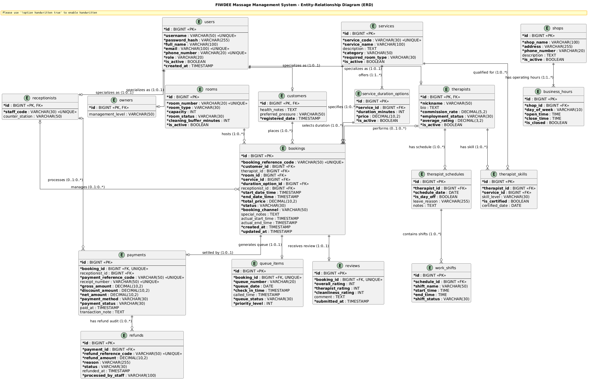
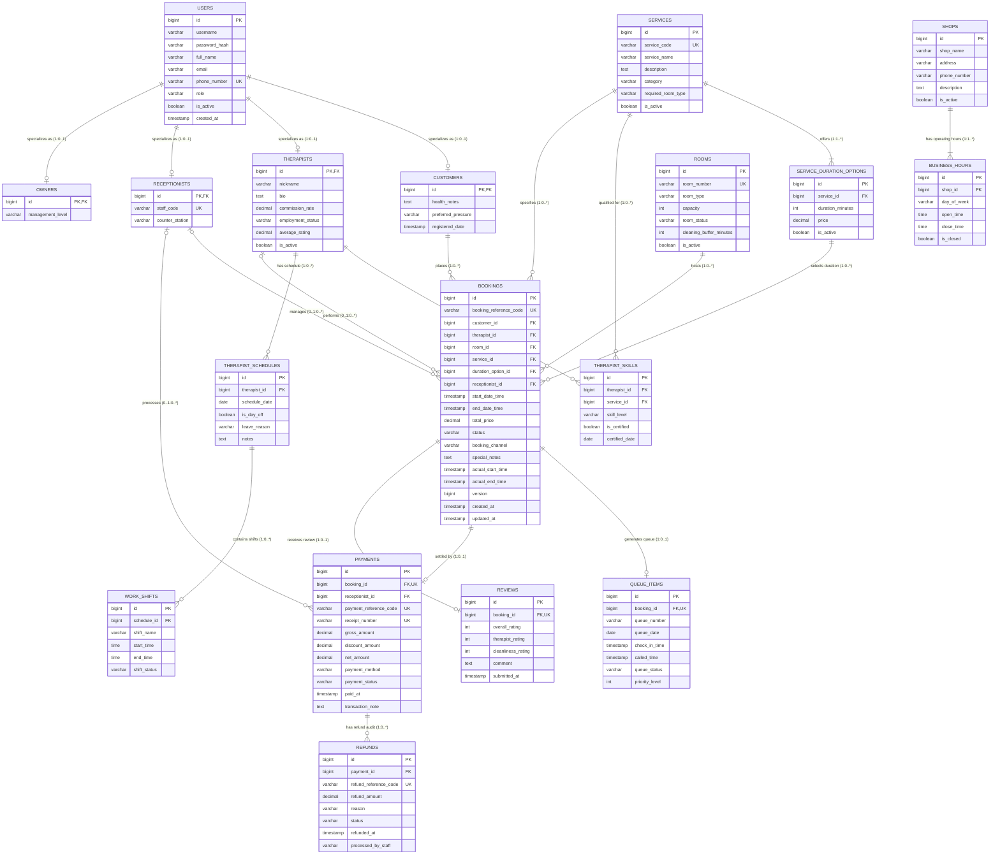

# FIWDEE Massage Management & Booking System
## Entity-Relationship (ER) Diagram & Database Schema Specification

---

## 1. Executive Summary & Database Architecture Overview

เอกสารฉบับนี้จัดทำขึ้นเพื่อนำเสนอ **Entity-Relationship Diagram (ERD) และ Database Schema Specification ฉบับสมบูรณ์ (3NF Relational Database Design)** สำหรับระบบ **FIWDEE Massage Management & Booking System** โดยใช้เอกสารสถาปัตยกรรมทั้ง 5 ฉบับของโครงการเป็น **Single Source of Truth** ร่วมกันอย่างเคร่งครัด:

1. [Domain Model Specification (`doc/domain-model.md`)](file:///C:/Users/Viphu/Desktop/University/PrinciplesOfSoftwareDesign/FIWDEE-CP353002-69_1PrinciplesOfSoftwareDesign/doc/domain-model.md) — **Source of Truth หลัก สำหรับ Business Entities ทั้ง 18 คลาส, Data Types, Relationships, Multiplicities และ Business Constraints**
2. [Use Case Specification (`doc/use-case.md`)](file:///C:/Users/Viphu/Desktop/University/PrinciplesOfSoftwareDesign/FIWDEE-CP353002-69_1PrinciplesOfSoftwareDesign/doc/use-case.md) — **Source of Truth สำหรับ Actors, Business Rules (BR-BKG, BR-RES, BR-QUE), Pre/Postconditions และ Functional Scenarios**
3. [Class Diagram Specification (`doc/class-diagram.md`)](file:///C:/Users/Viphu/Desktop/University/PrinciplesOfSoftwareDesign/FIWDEE-CP353002-69_1PrinciplesOfSoftwareDesign/doc/class-diagram.md) — **Source of Truth สำหรับ Domain Entities, JPA Repositories, Attributes, Mappers และ Layered Boundaries**
4. [Sequence Diagram Specification (`doc/sequence-diagram.md`)](file:///C:/Users/Viphu/Desktop/University/PrinciplesOfSoftwareDesign/FIWDEE-CP353002-69_1PrinciplesOfSoftwareDesign/doc/sequence-diagram.md) — **Source of Truth สำหรับ Data Access Sequences, Queries และ Transactional Boundaries**
5. [Activity Diagram Specification (`doc/activity-diagram.md`)](file:///C:/Users/Viphu/Desktop/University/PrinciplesOfSoftwareDesign/FIWDEE-CP353002-69_1PrinciplesOfSoftwareDesign/doc/activity-diagram.md) — **Source of Truth สำหรับ Operational Lifecycle, Swimlane Data Transitions และ Invariant Rules**
6. [Design Patterns Specification (`doc/design-patterns.md`)](file:///C:/Users/Viphu/Desktop/University/PrinciplesOfSoftwareDesign/FIWDEE-CP353002-69_1PrinciplesOfSoftwareDesign/doc/design-patterns.md) — **Source of Truth สำหรับ GoF State Pattern (7 สถานะ), Repository Pattern, Strategy Pattern และ Clean Architecture**

---

### 1.1 หลักการและมาตรฐานการออกแบบฐานข้อมูล (Database Design Principles)

1. **Relational Database Model:** ออกแบบสำหรับระบบจัดการฐานข้อมูลเชิงสัมพันธ์มาตรฐานอุตสาหกรรม (เช่น PostgreSQL 15+ / MySQL 8.0+)
2. **Third Normal Form (3NF Normalization):**
   * **1NF:** ทุกคอลัมน์เก็บค่าเชิงอะตอม (Atomic Values) ไม่มี Repeating Groups หรือ Comma-separated Strings
   * **2NF:** ทุกคอลัมน์ที่ไม่ใช่คีย์หลักขึ้นตรงกับ Primary Key ทั้งหมดอย่างสมบูรณ์ (Full Functional Dependency)
   * **3NF:** ไม่มี Transitive Dependency โดยแยกตารางลูกและ Lookup Entities อย่างเป็นอิสระ เช่น แยก `service_duration_options`, `business_hours`, `therapist_skills`, `work_shifts`
3. **Generalization Hierarchy Mapping (Joined Table Strategy):**
   * สืบทอดคุณสมบัติของ `User` ไปยัง `Customer`, `Therapist`, `Receptionist`, `Owner` ด้วยกลยุทธ์ **Class Table Inheritance (Joined Strategy)** โดยตารางลูกใช้ `id BIGINT PK` ที่เป็น Foreign Key ชี้ตรงไปยัง `users(id)` ช่วยให้เกิด Data Integrity สูงสุดและไม่มีคอลัมน์ `NULL` สิ้นเปลือง
4. **Primary Key & Naming Conventions:**
   * ตารางและคอลัมน์ทั้งหมดใช้รูปแบบ `snake_case`
   * ทุกตารางใช้คอลัมน์ `id` ชนิด `BIGINT` เป็น Primary Key แบบ Auto-increment / Identity Sequence (ยกเว้นตาราง Subtype ที่ `id` เป็นทั้ง PK และ FK)
5. **Dynamic Resource Architecture:**
   * ตาราง `rooms` และ `therapists` ถูกจำลองเป็น Dynamic Rows ในฐานข้อมูล ไม่มีการจำกัดจำนวนตายตัว (No Hardcoded Limits)
6. **Audit Trail & Financial Non-Destructive Integrity:**
   * ตาราง `payments` และ `refunds` ถูกออกแบบเป็น Immutable Financial Records พร้อมรหัสอ้างอิงเฉพาะ `payment_reference_code` และ `refund_reference_code`

---

## 2. Entity-Relationship (ER) Diagram

### 2.1 แผนภาพและไฟล์ต้นฉบับ (Diagram Source & Rendered Image)
* **ไฟล์นิยาม PlantUML:** [er-diagram.puml](file:///C:/Users/Viphu/Desktop/University/PrinciplesOfSoftwareDesign/FIWDEE-CP353002-69_1PrinciplesOfSoftwareDesign/doc/diagrams/er-diagram.puml)
* **ไฟล์รูปภาพ PNG:** [er-diagram.png](file:///C:/Users/Viphu/Desktop/University/PrinciplesOfSoftwareDesign/FIWDEE-CP353002-69_1PrinciplesOfSoftwareDesign/img/er-diagram.png)



---

### 2.2 Mermaid ER Diagram Representation



---

## 3. Entity & Table List (รายการตารางทั้ง 18 ตาราง)

| ลำดับ | ชื่อตาราง (Table Name) | Domain Entity ที่สอดคล้อง | หมวดหมู่การทำงาน (Functional Module) | บทบาทหน้าที่ทางสถาปัตยกรรม |
| :-: | :--- | :--- | :--- | :--- |
| **1** | `users` | `User` | Authentication & Identity | บัญชีผู้ใช้ส่วนกลาง (Superclass Account) จัดเก็บ Auth & Profile |
| **2** | `customers` | `Customer` | Customer Management | ข้อมูลผู้รับบริการ ประวัติสุขภาพ และความพึงพอใจเฉพาะตัว |
| **3** | `therapists` | `Therapist` | Therapist Management | ข้อมูลหมอนวด อัตราคอมมิชชัน และคะแนนประเมินเฉลี่ย |
| **4** | `receptionists` | `Receptionist` | Staff & Front-Desk | พนักงานต้อนรับหน้าร้าน รหัสพนักงาน และจุดประจำการ |
| **5** | `owners` | `Owner` | Administration | บัญชีเจ้าของร้านและระดับสิทธิ์การบริหาร |
| **6** | `shops` | `Shop` | Shop Profile & Info | ข้อมูลรายละเอียดร้านนวด ที่อยู่ และการติดต่อ |
| **7** | `business_hours` | `BusinessHours` | Shop Scheduling | เวลาเปิด-ปิดทำการในแต่ละวันของสัปดาห์ |
| **8** | `services` | `Service` | Service Catalog | รายการบริการนวด ประเภทห้องที่ต้องการ และหมวดหมู่ |
| **9** | `service_duration_options` | `ServiceDurationOption` | Service Catalog & Pricing | ตัวเลือกระยะเวลา (นาที) และโครงสร้างราคาของแต่ละบริการ |
| **10** | `therapist_skills` | `TherapistSkill` | Therapist Qualification | ตาราง Junction เชื่อมหมอนวดกับบริการ พร้อมระดับทักษะและใบรับรอง |
| **11** | `rooms` | `Room` | Resource Management | ห้องนวด ประเภทห้อง สถานะการใช้งาน และเวลาทำความสะอาด |
| **12** | `therapist_schedules` | `TherapistSchedule` | Shift Scheduling | ตารางการทำงานรายวัน วันหยุด และวันลาของหมอนวด |
| **13** | `work_shifts` | `WorkShift` | Shift Scheduling | กะการทำงานย่อยภายในตารางวันของหมอนวด |
| **14** | `bookings` | `Booking` | Core Booking Transaction | ธุรกรรมการจองหลัก ติดตามวงจรชีวิต 7 สถานะ และ Resource Allocation |
| **15** | `queue_items` | `QueueItem` | Front-Desk Queue | บัตรคิวประจำวันหน้าร้าน สร้างเมื่อ Check-in สำหรับจัดลำดับคิว |
| **16** | `payments` | `Payment` | Settlement & Billing | บันทึกธุรกรรมการชำระเงินที่แก้ไขไม่ได้ (Immutable Audit Record) |
| **17** | `refunds` | `Refund` | Refund Management | บันทึกประวัติการคืนเงิน Audit Trail แยกจาก Payment |
| **18** | `reviews` | `Review` | Quality & Feedback | คะแนนประเมินและความคิดเห็นของลูกค้าหลังจบงาน (`GAP`) |

---

## 4. Detailed Database Schema (รายละเอียดโครงสร้างตารางเชิงลึก)

---

### 4.1 ตาราง: `users` (บัญชีผู้ใช้งานระบบ)
* **คำอธิบาย:** ตารางแม่ (Superclass) สำหรับเก็บข้อมูลการยืนยันตัวตนและการติดต่อกลางของผู้ใช้ทุกคนในระบบ

| Column Name | Data Type | Key | Nullable | Constraints / Defaults | Description |
| :--- | :--- | :---: | :---: | :--- | :--- |
| `id` | `BIGINT` | **PK** | NO | `AUTO_INCREMENT / IDENTITY` | รหัสผู้ใช้งาน (Primary Key) |
| `username` | `VARCHAR(50)` | | YES | `UNIQUE (เมื่อไม่เป็น NULL)` | ชื่อบัญชีผู้ใช้สำหรับ Login (Nullable สำหรับลูกค้า Walk-in แบบ Guest) |
| `password_hash` | `VARCHAR(255)` | | YES | | รหัสผ่านที่ผ่านการแฮชด้วย BCrypt/Argon2 (Nullable สำหรับลูกค้า Walk-in แบบ Guest) |
| `full_name` | `VARCHAR(100)` | | NO | | ชื่อ-นามสกุลจริง |
| `email` | `VARCHAR(100)` | | YES | `UNIQUE (เมื่อไม่เป็น NULL)` | อีเมลสำหรับการติดต่อและการแจ้งเตือน (Nullable สำหรับลูกค้า Walk-in แบบ Guest) |
| `phone_number` | `VARCHAR(20)` | | NO | `UNIQUE` | หมายเลขโทรศัพท์ (ใช้ค้นหา/ระบุตัวตน/Check-in) |
| `role` | `VARCHAR(20)` | | NO | `CHECK (role IN ('CUSTOMER', 'RECEPTIONIST', 'THERAPIST', 'OWNER'))` | บทบาทผู้ใช้งานตาม `UserRole` Enum |
| `is_active` | `BOOLEAN` | | NO | `DEFAULT TRUE` | สถานะการเปิดใช้งานบัญชี |
| `last_login_at` | `TIMESTAMP` | | YES | | วันเวลาที่เข้าสู่ระบบครั้งล่าสุด (อัปเดตโดย Auth Service ตอน Login — ใช้แสดงในหน้า Admin Users summary) |
| `created_at` | `TIMESTAMP` | | NO | `DEFAULT CURRENT_TIMESTAMP` | วันเวลาที่สร้างบัญชี |

---

### 4.2 ตาราง: `customers` (ข้อมูลเฉพาะของผู้รับบริการ)
* **คำอธิบาย:** ตาราง Subtype สืบทอดจาก `users` จัดเก็บประวัติสุขภาพและข้อควรระวังเฉพาะบุคคล

| Column Name | Data Type | Key | Nullable | Constraints / Defaults | Description |
| :--- | :--- | :---: | :---: | :--- | :--- |
| `id` | `BIGINT` | **PK, FK** | NO | `REFERENCES users(id) ON DELETE CASCADE` | รหัสลูกค้า เชื่อมกับ `users.id` |
| `health_notes` | `TEXT` | | YES | | ข้อมูลสุขภาพ/ข้อควรระวัง (เช่น สตรีมีครรภ์, เน้นบ่าไหล่) |
| `preferred_pressure` | `VARCHAR(50)` | | YES | | น้ำหนักการนวดที่ชอบ (เช่น เบา, ปานกลาง, หนัก) |
| `registered_date` | `TIMESTAMP` | | NO | `DEFAULT CURRENT_TIMESTAMP` | วันที่ลงทะเบียนเป็นลูกค้า |

---

### 4.3 ตาราง: `therapists` (ข้อมูลเฉพาะของหมอนวด)
* **คำอธิบาย:** ตาราง Subtype สืบทอดจาก `users` จัดเก็บข้อมูลวิชาชีพ อัตราส่วนแบ่ง และคะแนนประเมิน

| Column Name | Data Type | Key | Nullable | Constraints / Defaults | Description |
| :--- | :--- | :---: | :---: | :--- | :--- |
| `id` | `BIGINT` | **PK, FK** | NO | `REFERENCES users(id) ON DELETE CASCADE` | รหัสหมอนวด เชื่อมกับ `users.id` |
| `nickname` | `VARCHAR(50)` | | NO | | ชื่อเล่นของหมอนวดสำหรับแสดงผลหน้าร้าน |
| `bio` | `TEXT` | | YES | | ประวัติและคำแนะนำตัว |
| `commission_rate` | `DECIMAL(5,2)` | | NO | `DEFAULT 0.00 CHECK (commission_rate >= 0.00)` | อัตราส่วนแบ่งค่าคอมมิชชัน (เช่น 40.00%) |
| `employment_status` | `VARCHAR(30)` | | NO | `DEFAULT 'ACTIVE'` | สถานะการจ้างงาน (เช่น ACTIVE, ON_LEAVE, RESIGNED) |
| `average_rating` | `DECIMAL(3,2)` | | NO | `DEFAULT 0.00 CHECK (average_rating BETWEEN 0.00 AND 5.00)` | คะแนนรีวิวเฉลี่ยสะสม |
| `is_active` | `BOOLEAN` | | NO | `DEFAULT TRUE` | สถานะพร้อมรับงานนวด |

---

### 4.4 ตาราง: `receptionists` (ข้อมูลเฉพาะของพนักงานต้อนรับ)
* **คำอธิบาย:** ตาราง Subtype สืบทอดจาก `users` จัดเก็บรหัสพนักงานและจุดประจำการ

| Column Name | Data Type | Key | Nullable | Constraints / Defaults | Description |
| :--- | :--- | :---: | :---: | :--- | :--- |
| `id` | `BIGINT` | **PK, FK** | NO | `REFERENCES users(id) ON DELETE CASCADE` | รหัสพนักงานต้อนรับ เชื่อมกับ `users.id` |
| `staff_code` | `VARCHAR(30)` | | NO | `UNIQUE` | รหัสประจำตัวพนักงาน (เช่น `REC-001`) |
| `counter_station` | `VARCHAR(50)` | | YES | | หมายเลขหรือชื่อเคาน์เตอร์ประจำการ |

---

### 4.5 ตาราง: `owners` (ข้อมูลเฉพาะของเจ้าของร้าน)
* **คำอธิบาย:** ตาราง Subtype สืบทอดจาก `users` จัดเก็บระดับการบริหารจัดการ

| Column Name | Data Type | Key | Nullable | Constraints / Defaults | Description |
| :--- | :--- | :---: | :---: | :--- | :--- |
| `id` | `BIGINT` | **PK, FK** | NO | `REFERENCES users(id) ON DELETE CASCADE` | รหัสเจ้าของร้าน เชื่อมกับ `users.id` |
| `management_level` | `VARCHAR(50)` | | YES | `DEFAULT 'EXECUTIVE'` | ระดับการบริหาร (เช่น OWNER, GENERAL_MANAGER) |

---

### 4.6 ตาราง: `shops` (ข้อมูลโปรไฟล์ร้านนวด)
* **คำอธิบาย:** ข้อมูลทั่วไปของร้านนวด FIWDEE ตาม `UC-04` และ `UC-23`

| Column Name | Data Type | Key | Nullable | Constraints / Defaults | Description |
| :--- | :--- | :---: | :---: | :--- | :--- |
| `id` | `BIGINT` | **PK** | NO | `AUTO_INCREMENT / IDENTITY` | รหัสร้านค้า (Primary Key) |
| `shop_name` | `VARCHAR(100)` | | NO | | ชื่อร้านนวด (เช่น FIWDEE Massage) |
| `address` | `VARCHAR(255)` | | NO | | ที่ตั้งของร้าน |
| `phone_number` | `VARCHAR(20)` | | NO | | เบอร์โทรศัพท์ติดต่อของร้าน |
| `description` | `TEXT` | | YES | | คำอธิบายและรายละเอียดการให้บริการ |
| `is_active` | `BOOLEAN` | | NO | `DEFAULT TRUE` | สถานะเปิดดำเนินกิจการ |

---

### 4.7 ตาราง: `business_hours` (เวลาทำการของร้านรายวัน)
* **คำอธิบาย:** บันทึกเวลาเปิด-ปิดร้านในแต่ละวันของสัปดาห์ ใช้คำนวณช่วงเวลาให้บริการใน `UC-08`

| Column Name | Data Type | Key | Nullable | Constraints / Defaults | Description |
| :--- | :--- | :---: | :---: | :--- | :--- |
| `id` | `BIGINT` | **PK** | NO | `AUTO_INCREMENT / IDENTITY` | รหัสเวลาทำการ |
| `shop_id` | `BIGINT` | **FK** | NO | `REFERENCES shops(id) ON DELETE CASCADE` | รหัสร้านค้าที่อ้างอิง |
| `day_of_week` | `VARCHAR(10)` | | NO | `CHECK (day_of_week IN ('MONDAY', 'TUESDAY', 'WEDNESDAY', 'THURSDAY', 'FRIDAY', 'SATURDAY', 'SUNDAY'))` | วันในสัปดาห์ตาม `DayOfWeek` Enum |
| `open_time` | `TIME` | | NO | | เวลาเปิดทำการ (เช่น 10:00:00) |
| `close_time` | `TIME` | | NO | | เวลาปิดทำการ (เช่น 22:00:00) |
| `is_closed` | `BOOLEAN` | | NO | `DEFAULT FALSE` | ตัวระบุวันหยุดประจำสัปดาห์ |

* **Table Constraint:** `UNIQUE (shop_id, day_of_week)` — ป้องกันการบันทึกวันซ้ำซ้อนในร้านเดียวกัน

---

### 4.8 ตาราง: `services` (เมนูบริการนวด)
* **คำอธิบาย:** รายการบริการนวดที่ร้านเปิดให้บริการ (เช่น นวดแผนไทย, นวดอโรมา, นวดเท้า)

| Column Name | Data Type | Key | Nullable | Constraints / Defaults | Description |
| :--- | :--- | :---: | :---: | :--- | :--- |
| `id` | `BIGINT` | **PK** | NO | `AUTO_INCREMENT / IDENTITY` | รหัสบริการนวด (Primary Key) |
| `service_code` | `VARCHAR(30)` | | NO | `UNIQUE` | รหัสบริการ (เช่น `THAI-MASSAGE`) |
| `service_name` | `VARCHAR(100)` | | NO | | ชื่อบริการนวด |
| `description` | `TEXT` | | YES | | คำอธิบายรายละเอียดและสรรพคุณของบริการ |
| `category` | `VARCHAR(50)` | | NO | | หมวดหมู่บริการ (เช่น TRADITIONAL, SPA, FOOT) |
| `required_room_type` | `VARCHAR(30)` | | NO | `CHECK (required_room_type IN ('SINGLE', 'COUPLE', 'VIP', 'FOOT_MASSAGE'))` | ประเภทห้องนวดที่จำเป็นต้องใช้ตาม `RoomType` |
| `is_active` | `BOOLEAN` | | NO | `DEFAULT TRUE` | สถานะเปิดให้บริการ |

---

### 4.9 ตาราง: `service_duration_options` (ตัวเลือกระยะเวลาและราคา)
* **คำอธิบาย:** ตัวเลือกระยะเวลาและราคาของแต่ละบริการ (Composition: `Service 1 *-- 1..* ServiceDurationOption`)

| Column Name | Data Type | Key | Nullable | Constraints / Defaults | Description |
| :--- | :--- | :---: | :---: | :--- | :--- |
| `id` | `BIGINT` | **PK** | NO | `AUTO_INCREMENT / IDENTITY` | รหัสตัวเลือกระยะเวลาและราคา |
| `service_id` | `BIGINT` | **FK** | NO | `REFERENCES services(id) ON DELETE CASCADE` | รหัสบริการที่สังกัด |
| `duration_minutes` | `INT` | | NO | `CHECK (duration_minutes > 0)` | ระยะเวลานวด (นาที) เช่น 60, 90, 120 |
| `price` | `DECIMAL(10,2)` | | NO | `CHECK (price >= 0.00)` | ราคาค่าบริการ (บาท) |
| `is_active` | `BOOLEAN` | | NO | `DEFAULT TRUE` | สถานะเปิดใช้งานตัวเลือกราคานี้ |

* **Table Constraint:** `UNIQUE (service_id, duration_minutes)` — ป้องกันการตั้งระยะเวลาซ้ำในบริการเดียวกัน

---

### 4.10 ตาราง: `therapist_skills` (ทักษะและความชำนาญของหมอนวด)
* **คำอธิบาย:** Junction Table เชื่อมโยงความสัมพันธ์ Many-to-Many ระหว่าง `Therapist` กับ `Service`

| Column Name | Data Type | Key | Nullable | Constraints / Defaults | Description |
| :--- | :--- | :---: | :---: | :--- | :--- |
| `id` | `BIGINT` | **PK** | NO | `AUTO_INCREMENT / IDENTITY` | รหัสทักษะ (Surrogate PK ตาม `skillId`) |
| `therapist_id` | `BIGINT` | **FK** | NO | `REFERENCES therapists(id) ON DELETE CASCADE` | รหัสหมอนวด |
| `service_id` | `BIGINT` | **FK** | NO | `REFERENCES services(id) ON DELETE CASCADE` | รหัสบริการที่เชี่ยวชาญ |
| `skill_level` | `VARCHAR(30)` | | YES | `DEFAULT 'STANDARD'` | ระดับความชำนาญ (เช่น STANDARD, ADVANCED, MASTER) |
| `is_certified` | `BOOLEAN` | | NO | `DEFAULT FALSE` | ผ่านการรับรอง/มีใบประกาศนียบัตร |
| `certified_date` | `DATE` | | YES | | วันที่ได้รับใบรับรองความชำนาญ |

* **Table Constraint:** `UNIQUE (therapist_id, service_id)` — ป้องกันการผูกทักษะซ้ำ

---

### 4.11 ตาราง: `rooms` (ห้องนวด - Dynamic Resource)
* **คำอธิบาย:** ห้องนวดที่เป็น Dynamic Resource รองรับการขยายตัว พร้อมเก็บเวลาทำความสะอาดห้อง

| Column Name | Data Type | Key | Nullable | Constraints / Defaults | Description |
| :--- | :--- | :---: | :---: | :--- | :--- |
| `id` | `BIGINT` | **PK** | NO | `AUTO_INCREMENT / IDENTITY` | รหัสห้องนวด (Primary Key) |
| `room_number` | `VARCHAR(20)` | | NO | `UNIQUE` | หมายเลขห้องนวด (เช่น `RM-101`) |
| `room_type` | `VARCHAR(30)` | | NO | `CHECK (room_type IN ('SINGLE', 'COUPLE', 'VIP', 'FOOT_MASSAGE'))` | ประเภทห้องนวดตาม `RoomType` Enum |
| `capacity` | `INT` | | NO | `DEFAULT 1 CHECK (capacity >= 1)` | ความจุผู้รับบริการสูงสุดในห้อง |
| `room_status` | `VARCHAR(30)` | | NO | `DEFAULT 'AVAILABLE' CHECK (room_status IN ('AVAILABLE', 'OCCUPIED', 'CLEANING', 'MAINTENANCE'))` | สถานะห้องนวดตาม `RoomStatus` Enum |
| `cleaning_buffer_minutes` | `INT` | | NO | `DEFAULT 15 CHECK (cleaning_buffer_minutes >= 0)` | เวลาทำความสะอาดห้องหลังบริการ (BR-RES-03 = 15 นาที) |
| `is_active` | `BOOLEAN` | | NO | `DEFAULT TRUE` | สถานะเปิดใช้งานห้องนวด |

---

### 4.12 ตาราง: `therapist_schedules` (ตารางงานรายวันของหมอนวด)
* **คำอธิบาย:** บันทึกตารางงาน วันหยุด และวันลาของหมอนวดในแต่ละวันปฏิทิน

| Column Name | Data Type | Key | Nullable | Constraints / Defaults | Description |
| :--- | :--- | :---: | :---: | :--- | :--- |
| `id` | `BIGINT` | **PK** | NO | `AUTO_INCREMENT / IDENTITY` | รหัสตารางงานรายวัน |
| `therapist_id` | `BIGINT` | **FK** | NO | `REFERENCES therapists(id) ON DELETE CASCADE` | รหัสหมอนวด |
| `schedule_date` | `DATE` | | NO | | วันที่ของตารางงาน |
| `is_day_off` | `BOOLEAN` | | NO | `DEFAULT FALSE` | ตัวระบุวันหยุด/วันลา |
| `leave_reason` | `VARCHAR(255)` | | YES | | เหตุผลการลาหยุด |
| `notes` | `TEXT` | | YES | | หมายเหตุเพิ่มเติม |

* **Table Constraint:** `UNIQUE (therapist_id, schedule_date)` — ป้องกันตารางงานซ้ำในวันเดียวกัน

---

### 4.13 ตาราง: `work_shifts` (กะการทำงานย่อย)
* **คำอธิบาย:** กะการทำงานย่อยภายในตารางวัน (Composition: `TherapistSchedule 1 *-- 0..* WorkShift`)

| Column Name | Data Type | Key | Nullable | Constraints / Defaults | Description |
| :--- | :--- | :---: | :---: | :--- | :--- |
| `id` | `BIGINT` | **PK** | NO | `AUTO_INCREMENT / IDENTITY` | รหัสกะการทำงาน |
| `schedule_id` | `BIGINT` | **FK** | NO | `REFERENCES therapist_schedules(id) ON DELETE CASCADE` | รหัสตารางงานวันที่สังกัด |
| `shift_name` | `VARCHAR(50)` | | NO | | ชื่อกะ (เช่น กะเช้า 10:00-19:00, กะบ่าย 13:00-22:00) |
| `start_time` | `TIME` | | NO | | เวลาเริ่มกะ |
| `end_time` | `TIME` | | NO | | เวลาสิ้นสุดกะ |
| `shift_status` | `VARCHAR(30)` | | NO | `DEFAULT 'ACTIVE'` | สถานะกะการทำงาน |

---

### 4.14 ตาราง: `bookings` (ธุรกรรมการจองบริการหลัก)
* **คำอธิบาย:** ธุรกรรมหลักของระบบ จัดการวงจรชีวิตการให้บริการ และเชื่อมโยงทรัพยากรทั้งหมด

| Column Name | Data Type | Key | Nullable | Constraints / Defaults | Description |
| :--- | :--- | :---: | :---: | :--- | :--- |
| `id` | `BIGINT` | **PK** | NO | `AUTO_INCREMENT / IDENTITY` | รหัสการจอง (Primary Key) |
| `booking_reference_code` | `VARCHAR(50)` | | NO | `UNIQUE` | รหัสอ้างอิงการจอง (เช่น `BK-20260927-XXXXXX`) |
| `customer_id` | `BIGINT` | **FK** | NO | `REFERENCES customers(id)` | รหัสลูกค้าผู้จอง |
| `therapist_id` | `BIGINT` | **FK** | YES | `REFERENCES therapists(id)` | รหัสหมอนวดที่ได้รับมอบหมาย (`0..1`) |
| `room_id` | `BIGINT` | **FK** | NO | `REFERENCES rooms(id)` | รหัสห้องนวดที่จัดสรรให้ |
| `service_id` | `BIGINT` | **FK** | NO | `REFERENCES services(id)` | รหัสบริการนวดหลัก |
| `duration_option_id` | `BIGINT` | **FK** | NO | `REFERENCES service_duration_options(id)` | รหัสตัวเลือกระยะเวลาและราคา |
| `receptionist_id` | `BIGINT` | **FK** | YES | `REFERENCES receptionists(id)` | พนักงานต้อนรับผู้สร้าง/ดูแล (`0..1`) |
| `start_date_time` | `TIMESTAMP` | | NO | | วันเวลาเริ่มต้นนัดหมาย |
| `end_date_time` | `TIMESTAMP` | | NO | | วันเวลาสิ้นสุดนัดหมายตามระยะเวลาบริการ |
| `total_price` | `DECIMAL(10,2)` | | NO | `CHECK (total_price >= 0.00)` | ราคาสุทธิของการจอง (Domain Truth) |
| `status` | `VARCHAR(30)` | | NO | `CHECK (status IN ('PENDING', 'CONFIRMED', 'CHECKED_IN', 'IN_SERVICE', 'COMPLETED', 'CANCELLED', 'NO_SHOW'))` | สถานะการจองตาม State Pattern |
| `booking_channel` | `VARCHAR(50)` | | NO | | ช่องทางการจอง (ONLINE, WALK_IN, PHONE) |
| `special_notes` | `TEXT` | | YES | | ความต้องการพิเศษหรือข้อควรระวัง |
| `actual_start_time` | `TIMESTAMP` | | YES | | เวลาเริ่มให้บริการจริง (บันทึกเมื่อ IN_SERVICE) |
| `actual_end_time` | `TIMESTAMP` | | YES | | เวลาสิ้นสุดบริการจริง (บันทึกเมื่อจบกายภาพ) |
| `version` | `BIGINT` | | NO | `DEFAULT 0` | หมายเลขเวอร์ชันสำหรับ Optimistic Concurrency Control (`@Version`) |
| `created_at` | `TIMESTAMP` | | NO | `DEFAULT CURRENT_TIMESTAMP` | วันเวลาที่สร้างการจอง |
| `updated_at` | `TIMESTAMP` | | NO | `DEFAULT CURRENT_TIMESTAMP` | วันเวลาที่อัปเดตข้อมูลล่าสุด |

* **Table Constraint:** `CHECK (start_date_time < end_date_time)` — เวลาเริ่มต้องมาก่อนเวลาสิ้นสุด

---

### 4.15 ตาราง: `queue_items` (บัตรคิวประจำวันหน้าร้าน)
* **คำอธิบาย:** บัตรคิวหน้าร้าน สร้างเมื่อลูกค้า Check-in (`Booking 1 -- 0..1 QueueItem`)

| Column Name | Data Type | Key | Nullable | Constraints / Defaults | Description |
| :--- | :--- | :---: | :---: | :--- | :--- |
| `id` | `BIGINT` | **PK** | NO | `AUTO_INCREMENT / IDENTITY` | รหัสบัตรคิว |
| `booking_id` | `BIGINT` | **FK** | NO | `UNIQUE REFERENCES bookings(id) ON DELETE CASCADE` | รหัสการจอง (1:1 Multiplicity) |
| `queue_number` | `VARCHAR(20)` | | NO | | หมายเลขคิวประจำวัน (เช่น `Q-001`) |
| `queue_date` | `DATE` | | NO | | วันที่ออกบัตรคิว |
| `check_in_time` | `TIMESTAMP` | | NO | `DEFAULT CURRENT_TIMESTAMP` | เวลาที่เช็คอิน |
| `called_time` | `TIMESTAMP` | | YES | | เวลาที่พนักงานกดเรียกคิว |
| `queue_status` | `VARCHAR(30)` | | NO | `DEFAULT 'WAITING' CHECK (queue_status IN ('WAITING', 'CALLED', 'IN_SERVICE', 'COMPLETED', 'CANCELLED'))` | สถานะคิวตาม `QueueStatus` Enum |
| `priority_level` | `INT` | | NO | `DEFAULT 0` | ลำดับความสำคัญของคิว |

* **Table Constraint:** `UNIQUE (queue_date, queue_number)` — ป้องกันหมายเลขคิวซ้ำในวันเดียวกัน

---

### 4.16 ตาราง: `payments` (บันทึกธุรกรรมการชำระเงิน - Audit Record)
* **คำอธิบาย:** บันทึกการชำระเงินที่แก้ไขไม่ได้ (`Booking 1 -- 0..1 Payment`)

| Column Name | Data Type | Key | Nullable | Constraints / Defaults | Description |
| :--- | :--- | :---: | :---: | :--- | :--- |
| `id` | `BIGINT` | **PK** | NO | `AUTO_INCREMENT / IDENTITY` | รหัสการชำระเงิน (Primary Key) |
| `booking_id` | `BIGINT` | **FK** | NO | `UNIQUE REFERENCES bookings(id)` | รหัสการจองที่ชำระ (1:1 Multiplicity) |
| `receptionist_id` | `BIGINT` | **FK** | YES | `REFERENCES receptionists(id)` | พนักงานผู้รับเงิน (`0..1`) |
| `payment_reference_code` | `VARCHAR(50)` | | NO | `UNIQUE` | รหัสอ้างอิงธุรกรรม (เช่น `PAY-20260927-XXXX`) |
| `receipt_number` | `VARCHAR(50)` | | YES | `UNIQUE` | เลขที่ใบเสร็จรับเงิน (เช่น `REC-20260927-001`) |
| `gross_amount` | `DECIMAL(10,2)` | | NO | `CHECK (gross_amount >= 0.00)` | ยอดเงินรวมก่อนหักส่วนลด |
| `discount_amount` | `DECIMAL(10,2)` | | NO | `DEFAULT 0.00 CHECK (discount_amount >= 0.00)` | ส่วนลด (ถ้ามี) |
| `net_amount` | `DECIMAL(10,2)` | | NO | `CHECK (net_amount >= 0.00)` | ยอดเงินสุทธิที่ต้องชำระจริง |
| `payment_method` | `VARCHAR(30)` | | NO | `CHECK (payment_method IN ('CASH', 'QR_PROMPTPAY', 'CREDIT_CARD'))` | วิธีการชำระเงินตาม `PaymentMethod` |
| `payment_status` | `VARCHAR(30)` | | NO | `DEFAULT 'PENDING' CHECK (payment_status IN ('PENDING', 'COMPLETED', 'REFUNDED', 'FAILED'))` | สถานะการชำระเงินตาม `PaymentStatus` |
| `paid_at` | `TIMESTAMP` | | YES | | วันเวลาที่ชำระเงินสำเร็จ |
| `transaction_note` | `TEXT` | | YES | | หมายเหตุธุรกรรม/รหัสสลิปโอนเงิน |

* **Table Constraint:** `CHECK (net_amount = gross_amount - discount_amount)` — ความถูกต้องของยอดเงิน

---

### 4.17 ตาราง: `refunds` (ประวัติธุรกรรมการคืนเงิน - Audit Trail)
* **คำอธิบาย:** บันทึกประวัติการคืนเงิน (`Payment 1 -- 0..* Refund`) แยกตารางเพื่อคงสภาพ Audit Trail

| Column Name | Data Type | Key | Nullable | Constraints / Defaults | Description |
| :--- | :--- | :---: | :---: | :--- | :--- |
| `id` | `BIGINT` | **PK** | NO | `AUTO_INCREMENT / IDENTITY` | รหัสการคืนเงิน (Primary Key) |
| `payment_id` | `BIGINT` | **FK** | NO | `REFERENCES payments(id)` | รหัสการชำระเงินต้นทาง |
| `refund_reference_code` | `VARCHAR(50)` | | NO | `UNIQUE` | รหัสอ้างอิงการคืนเงิน (เช่น `RFD-20260927-XXXX`) |
| `refund_amount` | `DECIMAL(10,2)` | | NO | `CHECK (refund_amount > 0.00)` | จำนวนเงินที่คืน (ต้องมากกว่า 0) |
| `reason` | `VARCHAR(255)` | | NO | | เหตุผลการคืนเงิน (เช่น ยกเลิกล่วงหน้าตามเกณฑ์) |
| `status` | `VARCHAR(30)` | | NO | `DEFAULT 'PENDING' CHECK (status IN ('PENDING', 'COMPLETED', 'FAILED'))` | สถานะการคืนเงินตาม `RefundStatus` |
| `refunded_at` | `TIMESTAMP` | | YES | | วันเวลาที่ดำเนินการคืนเงินสำเร็จ |
| `processed_by_staff` | `VARCHAR(100)` | | NO | | ชื่อ/รหัสพนักงานผู้ดำเนินการคืนเงิน |

---

### 4.18 ตาราง: `reviews` (การประเมินความพึงพอใจและรีวิว - GAP)
* **คำอธิบาย:** บันทึกรีวิวจากลูกค้า (`Booking 1 -- 0..1 Review`) โดยมีสถานะเป็น Architectural GAP ในชั้น Presentation/Service/Repository

| Column Name | Data Type | Key | Nullable | Constraints / Defaults | Description |
| :--- | :--- | :---: | :---: | :--- | :--- |
| `id` | `BIGINT` | **PK** | NO | `AUTO_INCREMENT / IDENTITY` | รหัสรีวิว (Primary Key) |
| `booking_id` | `BIGINT` | **FK** | NO | `UNIQUE REFERENCES bookings(id) ON DELETE CASCADE` | รหัสการจอง (1:1 Multiplicity) |
| `overall_rating` | `INT` | | NO | `CHECK (overall_rating BETWEEN 1 AND 5)` | คะแนนภาพรวม (1 ถึง 5 ดาว) |
| `therapist_rating` | `INT` | | NO | `CHECK (therapist_rating BETWEEN 1 AND 5)` | คะแนนความพึงพอใจหมอนวด (1 ถึง 5 ดาว) |
| `cleanliness_rating` | `INT` | | NO | `CHECK (cleanliness_rating BETWEEN 1 AND 5)` | คะแนนความสะอาดห้องนวด (1 ถึง 5 ดาว) |
| `comment` | `TEXT` | | YES | | ข้อคิดเห็นและข้อเสนอแนะเพิ่มเติม |
| `submitted_at` | `TIMESTAMP` | | NO | `DEFAULT CURRENT_TIMESTAMP` | วันเวลาที่ส่งรีวิว |

---

## 5. Primary Key & Foreign Key Relationships Summary

| ตารางต้นทาง (Source Table) | Foreign Key Column | ตารางปลายทาง (Referenced Table) | Referenced Column | Cardinality | Cascade Action |
| :--- | :--- | :--- | :--- | :---: | :--- |
| `customers` | `id` | `users` | `id` | `1 : 0..1` | `ON DELETE CASCADE` |
| `therapists` | `id` | `users` | `id` | `1 : 0..1` | `ON DELETE CASCADE` |
| `receptionists` | `id` | `users` | `id` | `1 : 0..1` | `ON DELETE CASCADE` |
| `owners` | `id` | `users` | `id` | `1 : 0..1` | `ON DELETE CASCADE` |
| `business_hours` | `shop_id` | `shops` | `id` | `1 : 1..*` | `ON DELETE CASCADE` |
| `service_duration_options` | `service_id` | `services` | `id` | `1 : 1..*` | `ON DELETE CASCADE` |
| `therapist_skills` | `therapist_id` | `therapists` | `id` | `1 : 0..*` | `ON DELETE CASCADE` |
| `therapist_skills` | `service_id` | `services` | `id` | `1 : 0..*` | `ON DELETE CASCADE` |
| `therapist_schedules` | `therapist_id` | `therapists` | `id` | `1 : 0..*` | `ON DELETE CASCADE` |
| `work_shifts` | `schedule_id` | `therapist_schedules` | `id` | `1 : 0..*` | `ON DELETE CASCADE` |
| `bookings` | `customer_id` | `customers` | `id` | `1 : 0..*` | `ON DELETE RESTRICT` |
| `bookings` | `therapist_id` | `therapists` | `id` | `0..1 : 0..*` | `ON DELETE SET NULL` |
| `bookings` | `room_id` | `rooms` | `id` | `1 : 0..*` | `ON DELETE RESTRICT` |
| `bookings` | `service_id` | `services` | `id` | `1 : 0..*` | `ON DELETE RESTRICT` |
| `bookings` | `duration_option_id` | `service_duration_options` | `id` | `1 : 0..*` | `ON DELETE RESTRICT` |
| `bookings` | `receptionist_id` | `receptionists` | `id` | `0..1 : 0..*` | `ON DELETE SET NULL` |
| `queue_items` | `booking_id` | `bookings` | `id` | `1 : 0..1` | `ON DELETE CASCADE` |
| `payments` | `booking_id` | `bookings` | `id` | `1 : 0..1` | `ON DELETE RESTRICT` |
| `payments` | `receptionist_id` | `receptionists` | `id` | `0..1 : 0..*` | `ON DELETE SET NULL` |
| `refunds` | `payment_id` | `payments` | `id` | `1 : 0..*` | `ON DELETE RESTRICT` |
| `reviews` | `booking_id` | `bookings` | `id` | `1 : 0..1` | `ON DELETE CASCADE` |

---

## 6. Database Constraints & Business Invariant Enforcement

### 6.1 Booking Integrity Constraints
1. **Referential Integrity:** ทุก Booking ต้องอ้างถึง `Customer`, `Service`, `ServiceDurationOption`, และ `Room` เสมอ (`NOT NULL`)
2. **Nullable Therapist (`0..1`):** `therapist_id` สามารถเป็น `NULL` ได้ในช่วงแรกของการจองกรณีลูกค้าเลือกไม่ระบุหมอนวด และรอให้ระบบหรือพนักงานจัดสรรอัตโนมัติ
3. **Temporal Sanity Constraint:** `CHECK (start_date_time < end_date_time)` บังคับให้เวลาเริ่มต้องมาก่อนเวลาสิ้นสุดเสมอ
4. **State Machine Alignment:** `status` ถูกจำกัดด้วย `CHECK` constraint ให้มีเฉพาะ 7 ค่าที่สอดคล้องกับ State Pattern: `PENDING`, `CONFIRMED`, `CHECKED_IN`, `IN_SERVICE`, `COMPLETED`, `CANCELLED`, `NO_SHOW`
5. **Non-negative Price:** `CHECK (total_price >= 0.00)`
6. **Room Turnover Buffer & Non-overlapping Invariant:**
   * ตรวจสอบว่าไม่มีการจองในสถานะ Active (`PENDING`, `CONFIRMED`, `CHECKED_IN`, `IN_SERVICE`) ในห้องเดียวกันในช่วง $[t_{start}, t_{end} + 15\text{ mins}]$ โดยอาศัย Database Index และ Concurrency Control

### 6.2 Payment & Settlement Constraints
1. **One-to-One Settlement Cardinality:** คอลัมน์ `payments.booking_id` มี `UNIQUE` constraint บังคับให้แต่ละ Booking มีรายการชำระเงินได้สูงสุด 1 รายการ
2. **Strategy Alignment:** `payment_method` ถูกจำกัดเฉพาะ 3 วิธีตาม GoF Strategy Pattern: `CASH`, `QR_PROMPTPAY`, `CREDIT_CARD`
3. **Payment State Lifecycle:** `payment_status` ถูกจำกัดเฉพาะ: `PENDING`, `COMPLETED`, `REFUNDED`, `FAILED`
4. **Booking Completion Invariant:**
   * ใน Application Service Layer และ State Pattern (`InServiceState.complete()`) บังคับใช้กฎ Invariant ว่า `Payment.paymentStatus == COMPLETED` ก่อนที่ `Booking.status` จะเปลี่ยนเป็น `COMPLETED` ได้

### 6.3 Refund Constraints
1. **One-to-Many Audit Trail:** แต่ละ `Payment` สามารถมี `Refund` ได้หลายรายการ (รองรับ Partial Refund หรือ Retry)
2. **Positive Refund Value:** `CHECK (refund_amount > 0.00)`
3. **Refund Ceiling Invariant:** ผลรวมของ `refund_amount` ทั้งหมดของ Payment ใดๆ ต้องไม่เกินยอดเงินสุทธิที่ชำระจริง:
   $$\sum \text{refund\_amount} \le \text{payments.net\_amount}$$

### 6.4 Queue Constraints
1. **One-to-One Queue Generation:** คอลัมน์ `queue_items.booking_id` มี `UNIQUE` constraint
2. **Queue Lifecycle Alignment:** `queue_status` ถูกจำกัดเฉพาะ: `WAITING`, `CALLED`, `IN_SERVICE`, `COMPLETED`, `CANCELLED`
3. **Daily Sequential Numbering:** `UNIQUE (queue_date, queue_number)` บังคับให้เลขคิวไม่ซ้ำกันในวันเดียวกัน

### 6.5 Review Constraints (Architectural GAP)
1. **One-to-One Feedback:** คอลัมน์ `reviews.booking_id` มี `UNIQUE` constraint ป้องกันการส่งรีวิวซ้ำ
2. **Rating Bounds:** `CHECK (overall_rating BETWEEN 1 AND 5)`, `CHECK (therapist_rating BETWEEN 1 AND 5)`, `CHECK (cleanliness_rating BETWEEN 1 AND 5)`
3. **Prerequisite Rule:** อนุญาตให้สร้างเรคคอร์ดในตาราง `reviews` ได้เฉพาะเมื่อ `Booking.status == 'COMPLETED'`

---

## 7. State & Enum Mapping Strategy

ในระบบ FIWDEE มี Enumerations ทั้งหมด 9 ตัวที่กำหนดไว้ใน [Domain Model (`domain-model.md`)](file:///C:/Users/Viphu/Desktop/University/PrinciplesOfSoftwareDesign/FIWDEE-CP353002-69_1PrinciplesOfSoftwareDesign/doc/domain-model.md)

### 7.1 ตารางชุดค่าคงที่และการจัดเก็บในฐานข้อมูล

| Domain Enum | ค่าคงที่ในระบบ (Enum Values) | ชนิดข้อมูลใน Database | กลยุทธ์การจัดเก็บ (Storage Strategy) | เหตุผลทางสถาปัตยกรรม (Architectural Rationale) |
| :--- | :--- | :---: | :--- | :--- |
| **`UserRole`** | `CUSTOMER`, `RECEPTIONIST`, `THERAPIST`, `OWNER` | `VARCHAR(20)` | `VARCHAR` + `CHECK` constraint | รองรับ Spring Security RBAC และ JPA `@Enumerated(EnumType.STRING)` ได้ทันที |
| **`BookingStatus`** | `PENDING`, `CONFIRMED`, `CHECKED_IN`, `IN_SERVICE`, `COMPLETED`, `CANCELLED`, `NO_SHOW` | `VARCHAR(30)` | `VARCHAR` + `CHECK` constraint | สอดคล้องกับ GoF State Pattern ทั้ง 7 คลาส อ่านง่ายใน SQL Audit และไม่เกิดข้อจำกัดเรื่อง Migration ของ Database Native ENUM |
| **`RoomType`** | `SINGLE`, `COUPLE`, `VIP`, `FOOT_MASSAGE` | `VARCHAR(30)` | `VARCHAR` + `CHECK` constraint | ยืดหยุ่นต่อการเพิ่มประเภทห้องนวดใหม่ในอนาคต |
| **`RoomStatus`** | `AVAILABLE`, `OCCUPIED`, `CLEANING`, `MAINTENANCE` | `VARCHAR(30)` | `VARCHAR` + `CHECK` constraint | รองรับการเปลี่ยนสถานะของห้องแบบเรียลไทม์ตาม State Machine |
| **`QueueStatus`** | `WAITING`, `CALLED`, `IN_SERVICE`, `COMPLETED`, `CANCELLED` | `VARCHAR(30)` | `VARCHAR` + `CHECK` constraint | สอดคล้องกับวงจรชีวิตคิวหน้าร้าน |
| **`PaymentMethod`** | `CASH`, `QR_PROMPTPAY`, `CREDIT_CARD` | `VARCHAR(30)` | `VARCHAR` + `CHECK` constraint | สอดคล้องกับ GoF Strategy Pattern ทั้ง 3 คลาส |
| **`PaymentStatus`** | `PENDING`, `COMPLETED`, `REFUNDED`, `FAILED` | `VARCHAR(30)` | `VARCHAR` + `CHECK` constraint | บันทึกสถานะธุรกรรมทางการเงินอย่างโปร่งใส |
| **`RefundStatus`** | `PENDING`, `COMPLETED`, `FAILED` | `VARCHAR(30)` | `VARCHAR` + `CHECK` constraint | ติดตามสถานะการคืนเงินในระบบ |
| **`DayOfWeek`** | `MONDAY`, `TUESDAY`, `WEDNESDAY`, `THURSDAY`, `FRIDAY`, `SATURDAY`, `SUNDAY` | `VARCHAR(10)` | `VARCHAR` + `CHECK` constraint | สอดคล้องกับมาตรฐาน `java.time.DayOfWeek` ของ ISO-8601 |

### 7.2 เหตุผลที่เลือกใช้ `VARCHAR` + `CHECK` Constraint แทน Database Native `ENUM`
1. **Portability & DBMS Independence:** ใช้งานได้บนทุก Relational Database (PostgreSQL, MySQL, Oracle, H2 In-Memory for Testing) โดยไม่ต้องเขียน Script DDL เฉพาะค่าย
2. **Zero-Downtime Migration:** การเพิ่มค่า Enum ใหม่ในอนาคตสามารถทำได้ง่ายผ่านการปรับปรุง `CHECK` constraint โดยไม่ต้อง `ALTER TYPE` หรือสร้าง Type ใหม่ที่เสี่ยงต่อการล็อกตาราง
3. **JPA Compatibility:** ทำงานร่วมกับ Spring Data JPA ผ่าน `@Enumerated(EnumType.STRING)` ได้อย่างไร้รอยต่อ ป้องกันปัญหาหมายเลข Ordinal สลับตำแหน่งเมื่อมีการแก้ไขโค้ด

---

## 8. Many-to-Many Relationship Design (`therapist_skills`)

ความสัมพันธ์ระหว่าง **`Therapist` (หมอนวด)** และ **`Service` (บริการนวด)** เป็นความสัมพันธ์แบบ Many-to-Many ($N:M$) โดยหมอนวด 1 คนสามารถมีทักษะได้หลายบริการ และบริการ 1 อย่างสามารถมีหมอนวดที่ผ่านคุณสมบัติได้หลายคน

```text
+---------------+                 +--------------------+                 +---------------+
|   therapists  | 1             * |  therapist_skills  | *             1 |    services   |
+---------------+-----------------+--------------------+-----------------+---------------+
| id (PK)       |                 | id (PK)            |                 | id (PK)       |
| nickname      |                 | therapist_id (FK)  |                 | service_code  |
| ...           |                 | service_id (FK)    |                 | service_name  |
+---------------+                 | skill_level        |                 | ...           |
                                  | is_certified       |                 +---------------+
                                  | certified_date     |
                                  +--------------------+
```

### การออกแบบ Junction Table:
1. **Surrogate Primary Key:** ใช้ `id BIGINT AUTO_INCREMENT` เป็น Primary Key หลัก สอดคล้องกับคุณลักษณะ `skillId` ใน Domain Model และลดความซับซ้อนของ Composite Key ใน JPA
2. **Composite Unique Constraint:** กำหนด `UNIQUE (therapist_id, service_id)` เพื่อป้องกันการบันทึกทักษะบริการเดียวกันซ้ำให้แก่หมอนวดคนเดิม
3. **Payload Attributes:** มี Attributes เสริมตาม Domain Model ได้แก่ `skill_level` (ระดับความชำนาญ), `is_certified` (มีใบรับรอง), และ `certified_date` (วันที่ได้รับใบรับรอง)
4. **Cascade Behavior:** กำหนด `ON DELETE CASCADE` ทั้งสองฝั่ง เพื่อให้เมื่อมีการลบหมอนวดหรือบริการ ข้อมูลทักษะที่เกี่ยวข้องจะถูกลบออกโดยอัตโนมัติ

---

## 9. Database Indexes & Performance Optimization (ดัชนีฐานข้อมูล)

ดัชนีฐานข้อมูล (Database Indexes) ได้รับการออกแบบเพื่อเพิ่มประสิทธิภาพในการประมวลผลคำสั่ง Query ที่เกิดขึ้นบ่อยในระบบ FIWDEE โดยเฉพาะการค้นหาประวัติการจอง, การตรวจสอบความพร้อมของห้องนวดและหมอนวดแบบเรียลไทม์ (UC-08), การดึงข้อมูลกระดานคิวประจำวันหน้าร้าน (UC-13), และการป้องกันปัญหาการจองซ้ำซ้อน (Double-Booking Conflict Prevention):

### 9.1 Single-Column & Foreign Key Lookup Indexes

| Index Name | Target Table (Column) | วัตถุประสงค์และการสนับสนุน Query / Business Workflow |
| :--- | :--- | :--- |
| `idx_bookings_customer_id` | `bookings(customer_id)` | เร่งความเร็วการค้นหาประวัติการจองของลูกค้า (`UC-09 View Booking History` / `findByCustomer`) |
| `idx_bookings_therapist_id` | `bookings(therapist_id)` | เร่งความเร็วการดึงตารางงานและประวัติงานของหมอนวด (`UC-09`, `UC-21 View Therapist Earnings`) |
| `idx_bookings_room_id` | `bookings(room_id)` | เร่งความเร็วการค้นหาประวัติและสถานะการใช้งานของแต่ละห้องนวด (`UC-22 Room Utilization`) |
| `idx_bookings_service_id` | `bookings(service_id)` | เร่งความเร็วการสรุปสถิติความนิยมของแต่ละบริการนวด (`UC-22 Business Dashboard`) |
| `idx_bookings_start_date_time` | `bookings(start_date_time)` | เร่งความเร็วการกรองการจองตามช่วงวันที่และเวลา (`findBookingsByDateRange`) |
| `idx_bookings_status` | `bookings(status)` | เร่งความเร็วการดึง Active Bookings (`PENDING`, `CONFIRMED`, `CHECKED_IN`, `IN_SERVICE`) |
| `idx_therapist_schedules_therapist_date` | `therapist_schedules(therapist_id, schedule_date)` | เร่งความเร็วการตรวจสอบตารางงานและกะของหมอนวดในวันที่กำหนด (`UC-08b Check Therapist Availability` / `findByTherapistAndScheduleDate`) |
| `idx_queue_items_queue_date_status` | `queue_items(queue_date, queue_status)` | เร่งความเร็วการดึงกระดานคิวประจำวันหน้าร้านแยกตามสถานะ (`UC-13 Manage Daily Queue` / `findByQueueDateAndStatus`) |
| `idx_payments_payment_status` | `payments(payment_status)` | เร่งความเร็วการตรวจสอบสถานะการชำระเงินและรายงานการเงินประจำวัน (`UC-19`, `UC-20`) |

---

### 9.2 Composite Indexes สำหรับ Availability Check & Double Booking Prevention

เพื่อรองรับการทำงานของ `BookingService` ในการตรวจสอบช่วงเวลาว่างและการป้องกัน Race Condition ในระดับ Database Lock/Index Scan ได้กำหนด Composite Indexes สองชุดดังนี้:

```sql
-- Composite Index สำหรับตรวจสอบความพร้อมของห้องนวด และป้องกันการจองห้องซ้อน
CREATE INDEX idx_bookings_room_availability
ON bookings(room_id, start_date_time, end_date_time, status);

-- Composite Index สำหรับตรวจสอบความพร้อมของหมอนวด และป้องกันการจัดสรรหมอนวดซ้อน
CREATE INDEX idx_bookings_therapist_availability
ON bookings(therapist_id, start_date_time, end_date_time, status);
```

#### ประโยชน์ทางสถาปัตยกรรมของ Composite Indexes:
1. **Index Scan สำหรับ `findActiveBookingsByRoomAndPeriod`:**
   * ตรวจสอบช่วงเวลาทับซ้อน $[t_{start}, t_{end} + 15\text{ mins}]$ พร้อมกรองเฉพาะสถานะ Active (`status IN ('PENDING', 'CONFIRMED', 'CHECKED_IN', 'IN_SERVICE')`) ได้อย่างรวดเร็วผ่าน B-Tree Index
2. **Index Scan สำหรับ `findActiveBookingsByTherapistAndPeriod`:**
   * ช่วยให้การตรวจสอบความพร้อมของหมอนวดตามกะเวลาใน `UC-08b` ทำงานได้รวดเร็วในระดับมิลลิวินาที
3. **Double Booking Prevention Under High Concurrency:**
   * ช่วยให้คำสั่งตรวจสอบความขัดแย้งก่อนการบันทึกการจองในขั้นตอน Transaction / Concurrency Control สามารถตรวจจับ Conflict ได้อย่างมีประสิทธิภาพสูงสุด

---

## 10. Cross-Artifact Traceability Matrix

ตารางตรวจสอบความสอดคล้องข้ามเอกสารสถาปัตยกรรมทั้ง 6 ฉบับ:

| Database Table | Domain Entity (`domain-model.md`) | Class Diagram Component (`class-diagram.md`) | Use Case (`use-case.md`) | Sequence / Activity Diagram | Status |
| :--- | :--- | :--- | :--- | :--- | :---: |
| `shops` | `Shop` | `Shop` (Domain) | UC-04, UC-23 | Availability Check | **`PASS`** |
| `business_hours`| `BusinessHours` | `BusinessHours` (Domain) | UC-04, UC-08, UC-23 | UC-08a, UC-08b | **`PASS`** |
| `users` | `User` | `User` (Domain) | UC-01, UC-02, UC-03, UC-28 | Authentication Flow | **`PASS`** |
| `customers` | `Customer` | `Customer` (Domain), `CustomerRepository` | UC-01, UC-03, UC-07, UC-11 | S1 (Msg 1), Check-in Flow | **`PASS`** |
| `therapists` | `Therapist` | `Therapist` (Domain), `TherapistRepository` | UC-06, UC-07, UC-08b, UC-16, UC-26 | S1 (Msg 9), S3 (Msg 1) | **`PASS`** |
| `receptionists` | `Receptionist` | `Receptionist` (Domain) | UC-07, UC-12, UC-13, UC-19 | S2 (Msg 1), S3 (Msg 20) | **`PASS`** |
| `owners` | `Owner` | `Owner` (Domain) | UC-22, UC-23, UC-24, UC-25, UC-28 | Administration & Dashboard | **`PASS`** |
| `services` | `Service` | `Service` (Domain), `ServiceRepository` | UC-05, UC-07, UC-08, UC-25 | S1 (Msg 6), Main Activity | **`PASS`** |
| `service_duration_options` | `ServiceDurationOption` | `ServiceDurationOption` (Domain) | UC-05, UC-07, UC-25 | S1 (Msg 7), Main Activity | **`PASS`** |
| `therapist_skills` | `TherapistSkill` | `TherapistSkill` (Domain) | UC-06, UC-08b, UC-26 | S1 (Msg 9), UC-08 Check | **`PASS`** |
| `rooms` | `Room` | `Room` (Domain), `RoomRepository` | UC-07, UC-08a, UC-16, UC-17, UC-24 | S1 (Msg 8), S3 (Msg 10, 18) | **`PASS`** |
| `therapist_schedules` | `TherapistSchedule` | `TherapistSchedule`, `TherapistScheduleRepository` | UC-08b, UC-27 | S1 (Msg 11), Main Activity | **`PASS`** |
| `work_shifts` | `WorkShift` | `WorkShift` (Domain) | UC-08b, UC-27 | S1 (Msg 11), Schedule Check | **`PASS`** |
| `bookings` | `Booking` | `Booking` (Domain), `BookingRepository`, `BookingService` | UC-07, UC-08, UC-10, UC-12, UC-14, UC-16, UC-17 | S1, S2, S3, All Activity Flows | **`PASS`** |
| `queue_items` | `QueueItem` | `QueueItem` (Domain), `QueueItemRepository`, `QueueService` | UC-12, UC-13 | S2 (Msg 12-14), Activity 3.1 | **`PASS`** |
| `payments` | `Payment` | `Payment` (Domain), `PaymentRepository`, `PaymentService` | UC-19, UC-19a, UC-19b, UC-20 | S3 (Msg 20-30), Activity 3.2 | **`PASS`** |
| `refunds` | `Refund` | `Refund` (Domain), `PaymentService.processRefund()` | UC-10, UC-20 | Activity 3.3 (Cancellation) | **`PASS`** |
| `reviews` | `Review` | `Review` (Domain) *(No Controller/Service/Repo)* | UC-18 (`<<extend>>` UC-17) | S3 (Phase E - Gap Note) | **`GAP`** |

---

## 11. Final Consistency Audit

| มิติการตรวจสอบ (Audit Dimension) | ผลการตรวจ (Status) | รายละเอียดการประเมินเทียบกับ Source of Truth |
| :--- | :---: | :--- |
| **1. Entity Coverage** | **`PASS`** | ครอบคลุมครบถ้วนทั้ง **18 Domain Entities** จาก `domain-model.md` โดยไม่มี Entity ตกหล่นและไม่สร้าง Entity เถื่อน |
| **2. PK / FK Consistency** | **`PASS`** | ทุกตารางมี Primary Key ชัดเจน (`id BIGINT`) และ Foreign Key มีความสอดคล้องกันตามความสัมพันธ์ใน Domain Model |
| **3. Relationship Consistency** | **`PASS`** | สะท้อนความสัมพันธ์ครบทุกเส้น เช่น `Shop 1 -- 1..* BusinessHours`, `Service 1 -- 1..* DurationOption`, `Therapist N -- M Service` |
| **4. Cardinality Consistency** | **`PASS`** | บังคับใช้ Cardinality ตรงตาม Domain Model 100%: `Booking 1 -- 0..1 QueueItem` (UNIQUE FK), `Booking 1 -- 0..1 Payment` (UNIQUE FK), `Payment 1 -- 0..* Refund` |
| **5. Database Normalization** | **`PASS`** | ผ่านเกณฑ์การ Normalization ในระดับ **Third Normal Form (3NF)** ปราศจาก Repeating Groups, Partial Dependencies และ Transitive Dependencies |
| **6. Enum Consistency** | **`PASS`** | รองรับชุดค่าคงที่ครบทั้ง **9 Domain Enums** โดยจัดเก็บผ่าน `VARCHAR` ร่วมกับ `CHECK` constraint ที่ตรงกับค่าใน Domain Model |
| **7. Booking State Consistency** | **`PASS`** | ตาราง `bookings` รองรับครบทั้ง **7 สถานะ** ของ GoF State Pattern: `PENDING`, `CONFIRMED`, `CHECKED_IN`, `IN_SERVICE`, `COMPLETED`, `CANCELLED`, `NO_SHOW` |
| **8. Payment / Refund Consistency** | **`PASS`** | รองรับโครงสร้าง Audit Trail ทางการเงิน แยกตาราง `refunds` ออกจาก `payments` และบังคับใช้ Invariant ยอดเงินไม่ติดลบ |
| **9. Queue Consistency** | **`PASS`** | ตาราง `queue_items` มีความสัมพันธ์แบบ 1-to-1 กับ `bookings` ผ่าน `UNIQUE(booking_id)` และสร้างขึ้นเมื่อ Check-in ตาม Observer Pattern |
| **10. Review Module (UC-18)** | **`GAP`** | ตาราง `reviews` ถูกออกแบบรองรับในระดับฐานข้อมูลตาม Domain Model (`Booking 1 -- 0..1 Review`) แต่ระบุสถานะเป็น **Architectural GAP** เนื่องจากใน Class Diagram ยังไม่มี Presentation/Service/Repository |
| **11. Class Diagram $\leftrightarrow$ Database** | **`PASS`** | Attributes และ Data Types ของ JPA Entities ใน `class-diagram.md` ตรงกับ Columns และ Types ใน Database Schema แบบ 1:1 |
| **12. Sequence Diagram $\leftrightarrow$ Operations** | **`PASS`** | คำสั่ง Data Access ใน Sequence Diagram (`findById`, `save`, `findActiveBookingsByRoomAndPeriod`) แมปกับ Schema ได้อย่างสมบูรณ์ |
| **13. Activity Diagram $\leftrightarrow$ Operations** | **`PASS`** | Activity Diagram ระบุ Transaction / Concurrency Control สอดคล้องกับการใช้งาน Optimistic Locking (`version BIGINT`) ในตาราง `bookings` อย่างสมบูรณ์ |

---

## 12. GAPs & Architectural Decisions Required

### GAP #1: ขอบเขตของ Feedback & Review Module (UC-18)
* **สถานะปัจจุบันในเอกสาร:**
  * `domain-model.md`: มี Entity `Review` (`reviewId`, `overallRating`, `therapistRating`, `cleanlinessRating`, `comment`, `submittedAt`) และความสัมพันธ์ `Booking 1 -- 0..1 Review`
  * `use-case.md`: ระบุ `UC-18 Submit Review & Rating` เป็น `<<extend>>` ของ `UC-17 Complete Service`
  * `class-diagram.md` & `sequence-diagram.md`: ระบุว่า Review Module ยังไม่มี `ReviewController`, `ReviewService`, หรือ `ReviewRepository` ในโค้ดหลัก (บันทึกเป็น Architectural GAP)
* **การออกแบบใน Database Schema:**
  * สร้างตาราง `reviews` รองรับไว้ในระดับฐานข้อมูลตาม Domain Model เพื่อให้ Schema มีความสมบูรณ์และพร้อมรองรับการขยายระบบ
  * กำหนด `UNIQUE(booking_id)` เพื่อคงกฎ Invariant ว่า 1 Booking รีวิวได้ไม่เกิน 1 ครั้ง
* **ข้อเสนอแนะสำหรับการ Implementation (Recommended Action):**
  * เมื่อเข้าสู่เฟสการพัฒนาส่วน Customer Feedback ให้สร้าง `ReviewController`, `ReviewService`, และ `ReviewRepository` เพิ่มเติมในสถาปัตยกรรม Spring Boot โดยเชื่อมต่อกับตาราง `reviews` นี้ได้ทันทีโดยไม่ต้องแก้ไขโครงสร้างฐานข้อมูล

### Decision #1: กลยุทธ์การแปลง Generalization Hierarchy ของ `User` ลงฐานข้อมูล
* **การตัดสินใจ (Architectural Decision):** เลือกใช้ **Class Table Inheritance (Joined Strategy)**
* **เหตุผล:**
  1. `Customer`, `Therapist`, `Receptionist`, `Owner` มี Attributes เฉพาะทางที่แตกต่างกันอย่างชัดเจน (เช่น `commission_rate`, `staff_code`, `health_notes`)
  2. หากใช้ Single Table จะเกิดคอลัมน์ `NULL` จำนวนมาก และไม่สามารถใส่ `NOT NULL` constraint ให้กับข้อมูลเฉพาะบทบาทได้
  3. Joined Strategy ช่วยให้รักษา Data Integrity สูงสุดและเป็นไปตามหลัก 3NF

### Decision #2: การป้องกันการจองซ้อน (Concurrency Control & Double-Booking Prevention)
* **การตัดสินใจ (Architectural Decision):** บังคับใช้การตรวจสอบแบบ Atomic ร่วมกับ Optimistic Locking (`@Version` column ใน Booking Entity) หรือ Pessimistic Locking ในขั้นตอน `BookingService.createBooking()` เพื่อป้องกัน Race Condition เมื่อมีคำขอจองห้องหรือหมอนวดเดียวกันเข้ามาพร้อมกันในระดับมิลลิวินาที
