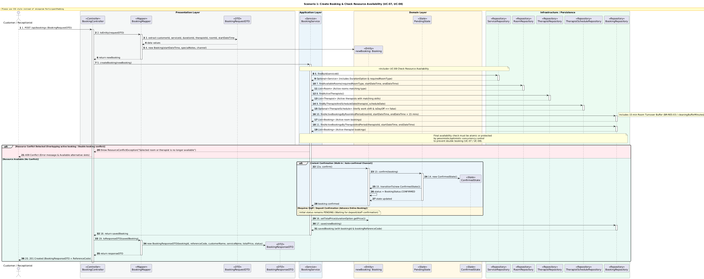
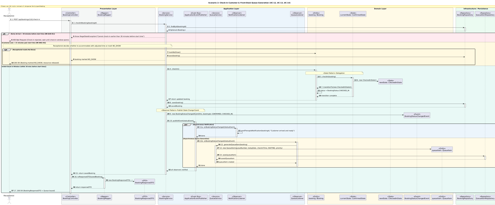
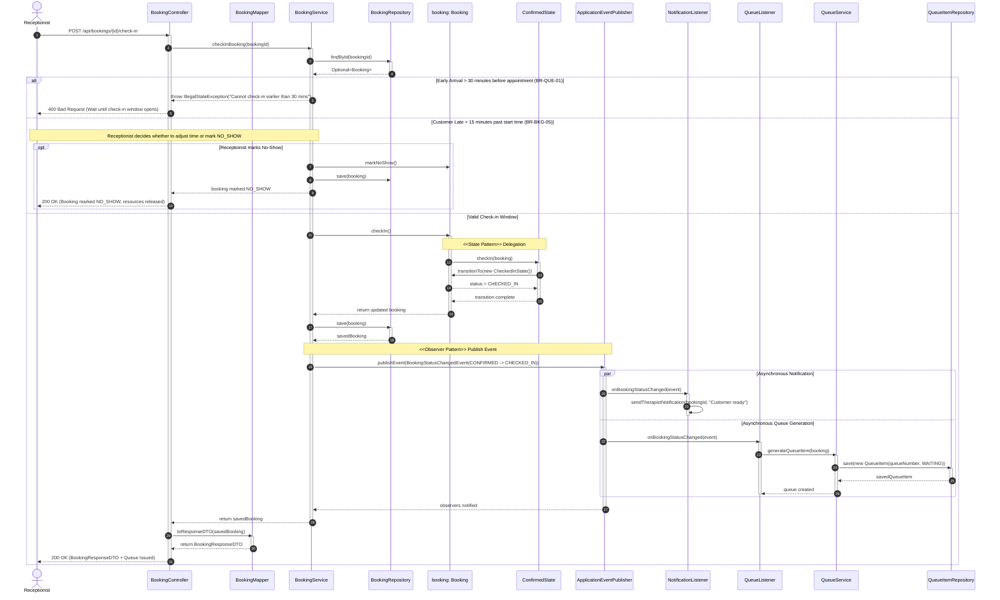
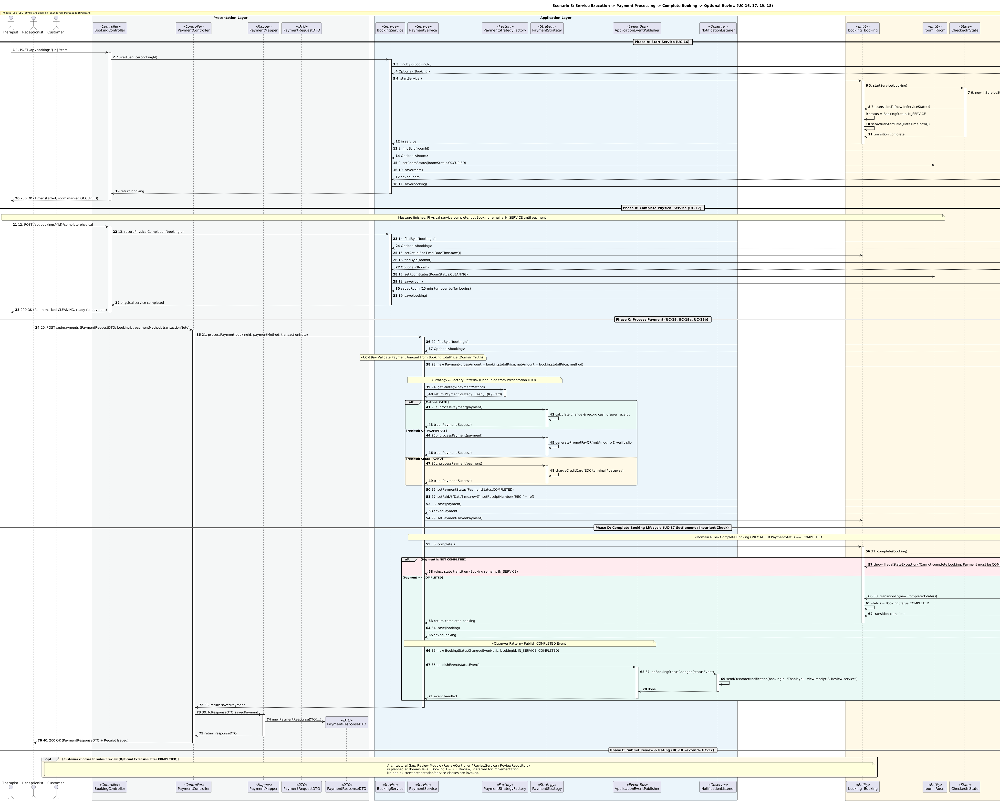

# FIWDEE Massage Management & Booking System
## UML Sequence Diagram Specification

---

## 1. Executive Summary & Purpose

เอกสารฉบับนี้จัดทำขึ้นเพื่อนำเสนอ **UML Sequence Diagrams ฉบับสมบูรณ์ (Design-Level Behavioral Specification)** สำหรับระบบ **FIWDEE Massage Management & Booking System** โดยวิเคราะห์และเชื่อมโยงเอกสารสถาปัตยกรรมทั้ง 4 ฉบับของโครงการเข้าด้วยกันอย่างไร้รอยต่อ:
1. [Domain Model Specification (`doc/domain-model.md`)](file:///C:/Users/Viphu/Desktop/University/PrinciplesOfSoftwareDesign/FIWDEE-CP353002-69_1PrinciplesOfSoftwareDesign/doc/domain-model.md) — **Source of Truth สำหรับ Business Entities, Relationships, Multiplicities และ Business Constraints**
2. [Class Diagram Specification (`doc/class-diagram.md`)](file:///C:/Users/Viphu/Desktop/University/PrinciplesOfSoftwareDesign/FIWDEE-CP353002-69_1PrinciplesOfSoftwareDesign/doc/class-diagram.md) — **Source of Truth สำหรับ Classes, Methods, Parameters, Return Types และ Layer Boundaries**
3. [Design Patterns Specification (`doc/design-patterns.md`)](file:///C:/Users/Viphu/Desktop/University/PrinciplesOfSoftwareDesign/FIWDEE-CP353002-69_1PrinciplesOfSoftwareDesign/doc/design-patterns.md) — **Source of Truth สำหรับ State, Strategy, Factory, Observer, Repository, Service Layer, MVC, DTO+Mapper, DI**
4. [Use Case Specification (`doc/use-case.md`)](file:///C:/Users/Viphu/Desktop/University/PrinciplesOfSoftwareDesign/FIWDEE-CP353002-69_1PrinciplesOfSoftwareDesign/doc/use-case.md) — **Source of Truth สำหรับ Actors, Main Flows, Alternative/Exception Flows, Pre/Postconditions, `<<include>>`, `<<extend>>`**

* ไฟล์นิยาม PlantUML: [sequence-diagram.puml](file:///C:/Users/Viphu/Desktop/University/PrinciplesOfSoftwareDesign/FIWDEE-CP353002-69_1PrinciplesOfSoftwareDesign/doc/diagrams/sequence-diagram.puml)

---

## 2. Scenario Selection

| Scenario | Use Cases ที่เกี่ยวข้อง | Actors ตาม Use Case | Design Patterns ที่ประยุกต์ใช้ |
| :--- | :--- | :--- | :--- |
| **Scenario 1: Create Booking** | **UC-07** (Create Booking),<br>**UC-08** (Check Resource Availability: 08a, 08b, 08c) | `Customer` (Online),<br>`Receptionist` (Walk-in/Phone) | Layered Architecture, MVC, DTO Pattern + Mapper, Service Layer, Repository Pattern, Dependency Injection |
| **Scenario 2: Check-in Customer + Queue** | **UC-12** (Check-in Customer),<br>**UC-13** (Manage Daily Queue),<br>**UC-14** (Update Booking Status) | `Receptionist` | State Pattern (`ConfirmedState` $\rightarrow$ `CheckedInState`), Observer Pattern (`BookingStatusChangedEvent`), Service Layer, Repository Pattern |
| **Scenario 3: Service $\rightarrow$ Complete Physical $\rightarrow$ Payment $\rightarrow$ Complete Booking** | **UC-16** (Start Service),<br>**UC-17** (Complete Service),<br>**UC-19** (Process Payment: 19a, 19b),<br>**UC-14** (Update Status),<br>**UC-18** (Submit Review - `<<extend>>`) | `Therapist`,<br>`Receptionist`,<br>`Customer` | State Pattern (`InServiceState` $\rightarrow$ `CompletedState`), Strategy Pattern (Cash, QR, Card), Factory Pattern (`PaymentStrategyFactory`), Observer Pattern, Repository Pattern |

---

## 3. Sequence Diagrams

### 3.1 Scenario 1: Create Booking & Check Resource Availability (UC-07, UC-08)



```mermaid
sequenceDiagram
    autonumber
    actor Actor as Customer / Receptionist
    participant Controller as BookingController
    participant Mapper as BookingMapper
    participant Service as BookingService
    participant SrvRepo as ServiceRepository
    participant RoomRepo as RoomRepository
    participant ThRepo as TherapistRepository
    participant SchRepo as TherapistScheduleRepository
    participant BkRepo as BookingRepository
    participant Booking as newBooking: Booking
    participant PendingState as PendingState
    participant ConfirmedState as ConfirmedState

    Actor->>Controller: POST /api/bookings (BookingRequestDTO)
    activate Controller
    Controller->>Mapper: toEntity(requestDTO)
    activate Mapper
    create Booking
    Mapper->>Booking: new Booking(startDateTime, notes, channel)
    Mapper-->>Controller: return newBooking
    deactivate Mapper

    Controller->>Service: createBooking(newBooking)
    activate Service

    Note over Service, SrvRepo: <<include>> UC-08 Check Resource Availability
    Service->>SrvRepo: findById(serviceId)
    activate SrvRepo
    SrvRepo-->>Service: Optional<Service> (DurationOption & requiredRoomType)
    deactivate SrvRepo

    Service->>RoomRepo: findAvailableRooms(requiredRoomType, startDateTime, endDateTime)
    activate RoomRepo
    RoomRepo-->>Service: List<Room> (Active matching rooms)
    deactivate RoomRepo

    Service->>ThRepo: findActiveTherapists()
    activate ThRepo
    ThRepo-->>Service: List<Therapist> (Active therapists with skills)
    deactivate ThRepo

    Service->>SchRepo: findByTherapistAndScheduleDate(therapist, scheduleDate)
    activate SchRepo
    SchRepo-->>Service: Optional<TherapistSchedule> (Verify work shift & isDayOff == false)
    deactivate SchRepo

    Service->>BkRepo: findActiveBookingsByRoomAndPeriod(roomId, startDateTime, endDateTime + 15 mins)
    activate BkRepo
    Note right of BkRepo: Includes 15-min Room Cleaning Buffer (BR-RES-03 / cleaningBufferMinutes)
    BkRepo-->>Service: List<Booking> (Active room bookings)
    deactivate BkRepo

    Service->>BkRepo: findActiveBookingsByTherapistAndPeriod(therapistId, startDateTime, endDateTime)
    activate BkRepo
    BkRepo-->>Service: List<Booking> (Active therapist bookings)
    deactivate BkRepo

    Note over Service, BkRepo: Final availability check must be atomic or protected<br/>by pessimistic/optimistic concurrency control<br/>to prevent double booking (UC-07 / UC-08).

    alt Resource Conflict (Overlapping Active Booking / Double booking conflict)
        Service-->>Controller: throw ResourceConflictException("Selected room or therapist is unavailable")
        Controller-->>Actor: 409 Conflict (Error & Alternative slots)
    else Resource Available (No Conflict)
        alt Instant Confirmation (Walk-in / Auto-confirmed Channel)
            Service->>Booking: confirm()
            activate Booking
            Booking->>PendingState: confirm(booking)
            activate PendingState
            create ConfirmedState
            PendingState->>ConfirmedState: new ConfirmedState()
            PendingState->>Booking: transitionTo(new ConfirmedState())
            Booking-->>PendingState: status = CONFIRMED
            PendingState-->>Booking: confirmed
            deactivate PendingState
            Booking-->>Service: booking confirmed
            deactivate Booking
        else Online Advance Booking (Pending Payment)
            Note over Service, Booking: Initial status remains PENDING (Waiting for online full payment or counter confirmation)
        end

        Service->>Booking: setTotalPrice(durationOption.getPrice())
        Service->>BkRepo: save(newBooking)
        activate BkRepo
        BkRepo-->>Service: savedBooking (with bookingId & ReferenceCode)
        deactivate BkRepo
        Service-->>Controller: return savedBooking
        deactivate Service

        Controller->>Mapper: toResponseDTO(savedBooking)
        activate Mapper
        Mapper-->>Controller: return BookingResponseDTO
        deactivate Mapper
        Controller-->>Actor: 201 Created (BookingResponseDTO + ReferenceCode)
    end
    deactivate Controller
```

---

### 3.2 Scenario 2: Check-in Customer & Front-Desk Queue Generation (UC-12, UC-13, UC-14)





---

### 3.3 Scenario 3: Complete Physical Service $\rightarrow$ Process Payment $\rightarrow$ Complete Booking $\rightarrow$ Optional Review (UC-16, UC-17, UC-19, UC-18)



```mermaid
sequenceDiagram
    autonumber
    actor Therapist
    actor Receptionist
    actor Customer
    participant BkController as BookingController
    participant PayController as PaymentController
    participant PayMapper as PaymentMapper
    participant BkService as BookingService
    participant PayService as PaymentService
    participant DiscountFactory as DiscountStrategyFactory
    participant DiscountStrategy as DiscountStrategy
    participant Factory as PaymentStrategyFactory
    participant Strategy as PaymentStrategy
    participant Booking as booking: Booking
    participant Room as room: Room
    participant CheckedInState as CheckedInState
    participant InServiceState as InServiceState
    participant CompletedState as CompletedState
    participant Payment as payment: Payment
    participant BkRepo as BookingRepository
    participant RoomRepo as RoomRepository
    participant PayRepo as PaymentRepository
    participant EventPublisher as ApplicationEventPublisher
    participant NotiObserver as NotificationListener
    participant QueueObserver as QueueListener

    %% Phase A
    Note over Therapist, BkController: == Phase A: Start Service (UC-16) ==
    Therapist->>BkController: POST /api/bookings/{id}/start
    activate BkController
    BkController->>BkService: startService(bookingId)
    activate BkService
    BkService->>BkRepo: findById(bookingId)
    activate BkRepo
    BkRepo-->>BkService: Optional<Booking>
    deactivate BkRepo

    BkService->>Booking: startService()
    activate Booking
    Booking->>CheckedInState: startService(booking)
    activate CheckedInState
    create InServiceState
    CheckedInState->>InServiceState: new InServiceState()
    CheckedInState->>Booking: transitionTo(new InServiceState())
    Booking->>Booking: status = IN_SERVICE, setActualStartTime(now)
    CheckedInState-->>Booking: transition complete
    deactivate CheckedInState
    Booking-->>BkService: in service
    deactivate Booking

    BkService->>RoomRepo: findById(roomId)
    activate RoomRepo
    RoomRepo-->>BkService: Optional<Room>
    deactivate RoomRepo
    BkService->>Room: setRoomStatus(OCCUPIED)
    BkService->>RoomRepo: save(room)
    activate RoomRepo
    RoomRepo-->>BkService: savedRoom
    deactivate RoomRepo

    BkService->>BkRepo: save(booking)
    BkService-->>BkController: return booking
    deactivate BkService
    BkController-->>Therapist: 200 OK (Timer started, room OCCUPIED)
    deactivate BkController

    %% Phase B
    Note over Therapist, RoomRepo: == Phase B: Complete Physical Service (UC-17) ==
    Therapist->>BkController: POST /api/bookings/{id}/complete-physical
    activate BkController
    BkController->>BkService: recordPhysicalCompletion(bookingId)
    activate BkService
    BkService->>BkRepo: findById(bookingId)
    activate BkRepo
    BkRepo-->>BkService: Optional<Booking>
    deactivate BkRepo

    BkService->>Booking: setActualEndTime(now) (Booking remains IN_SERVICE)

    BkService->>RoomRepo: findById(roomId)
    activate RoomRepo
    RoomRepo-->>BkService: Optional<Room>
    deactivate RoomRepo
    BkService->>Room: setRoomStatus(CLEANING)
    BkService->>RoomRepo: save(room)
    activate RoomRepo
    RoomRepo-->>BkService: savedRoom (15-min buffer begins)
    deactivate RoomRepo

    BkService->>BkRepo: save(booking)
    BkService-->>BkController: physical completed
    deactivate BkService
    BkController-->>Therapist: 200 OK (Room CLEANING, ready for payment)
    deactivate BkController

    %% Phase C
    Note over Receptionist, PayRepo: == Phase C: Process Payment with Discount Strategy (UC-19, UC-19a) ==
    Receptionist->>PayController: POST /api/payments (PaymentRequestDTO: method, promoCode)
    activate PayController
    PayController->>PayService: processPayment(bookingId, paymentMethod, promoCode, note)
    activate PayService
    PayService->>BkRepo: findById(bookingId)
    activate BkRepo
    BkRepo-->>PayService: Optional<Booking>
    deactivate BkRepo

    Note over PayService, DiscountStrategy: <<Strategy Pattern>> 1. Extensible Promotion / Discount
    opt Promo Code Provided (e.g., FIWDEE20)
        PayService->>DiscountFactory: findStrategy(promoCode)
        activate DiscountFactory
        DiscountFactory-->>PayService: Optional<DiscountStrategy>
        deactivate DiscountFactory
        alt Valid Strategy & Applicable
            PayService->>DiscountStrategy: calculateDiscount(booking.totalPrice)
            activate DiscountStrategy
            DiscountStrategy-->>PayService: discountAmount
            deactivate DiscountStrategy
        end
    end

    create Payment
    PayService->>Payment: new Payment(grossAmount = booking.totalPrice, discountAmount, netAmount = gross - discount)
    
    Note over PayService, Strategy: <<Strategy Pattern>> 2. Settlement Execution
    PayService->>Factory: getStrategy(paymentMethod)
    activate Factory
    Factory-->>PayService: return PaymentStrategy (Cash / QR / Card)
    deactivate Factory

    alt Method: CASH
        PayService->>Strategy: processPayment(payment)
    else Method: QR_PROMPTPAY
        PayService->>Strategy: processPayment(payment) [verify QR]
    else Method: CREDIT_CARD
        PayService->>Strategy: processPayment(payment) [charge card]
    end
    Strategy-->>PayService: true (Payment Success)

    PayService->>Payment: setPaymentStatus(COMPLETED), setPaidAt(now), setReceiptNumber("REC-" + ref)
    PayService->>PayRepo: save(payment)
    activate PayRepo
    PayRepo-->>PayService: savedPayment
    deactivate PayRepo
    PayService->>Booking: setPayment(savedPayment)

    %% Phase D
    Note over PayService, EventPublisher: == Phase D: Complete Booking & Invariant Check ==
    PayService->>Booking: complete()
    activate Booking
    Booking->>InServiceState: complete(booking)
    activate InServiceState
    
    alt Payment is NOT COMPLETED
        InServiceState-->>Booking: throw IllegalStateException("Payment must be COMPLETED first")
        Booking-->>PayService: reject state transition (Booking remains IN_SERVICE)
    else Payment == COMPLETED
        create CompletedState
        InServiceState->>CompletedState: new CompletedState()
        InServiceState->>Booking: transitionTo(new CompletedState())
        Booking-->>InServiceState: status = COMPLETED
        InServiceState-->>Booking: transition complete
        deactivate InServiceState
        Booking-->>PayService: return completed booking
        deactivate Booking
        PayService->>BkRepo: save(booking)
        PayService->>EventPublisher: publishEvent(BookingStatusChangedEvent(IN_SERVICE -> COMPLETED))
        activate EventPublisher
        par Customer Notification
            EventPublisher->>NotiObserver: onBookingStatusChanged(event)
        and Queue Completion
            EventPublisher->>QueueObserver: onBookingStatusChanged(event)
        end
        deactivate EventPublisher
    end

    PayService-->>PayController: return savedPayment
    deactivate PayService
    PayController->>PayMapper: toResponseDTO(savedPayment)
    activate PayMapper
    PayMapper-->>PayController: return PaymentResponseDTO
    deactivate PayMapper
    PayController-->>Receptionist: 200 OK (PaymentResponseDTO + Receipt Issued)
    deactivate PayController

    %% Phase E
    Note over Customer, BkRepo: == Phase E: Optional Review (UC-18 <<extend>> UC-17) ==
    opt Customer chooses to submit review
        Note over Customer, Booking: Architectural Gap: Review Module (ReviewController / ReviewService / ReviewRepository)<br/>is planned at domain level (Booking 1 -- 0..1 Review), deferred for implementation.<br/>No non-existent presentation/service classes are invoked.
    end
```

---

## 4. Flow Explanation (คำอธิบายลำดับขั้นตอน)

### Scenario 1 — Create Booking & Check Resource Availability (UC-07, UC-08)
1. **การรับคำขอและการแปลงข้อมูล:** `Customer` หรือ `Receptionist` ส่ง `BookingRequestDTO` ผ่าน HTTP POST $\rightarrow$ `BookingController` เรียก `BookingMapper.toEntity()` เพื่อแปลง DTO เป็น Domain Entity `Booking`
2. **การตรวจสอบทรัพยากรแบบไดนามิก (UC-08):** `BookingService` ประสานงานกับ `ServiceRepository`, `RoomRepository`, `TherapistRepository`, และ `TherapistScheduleRepository` ดึงข้อมูลจริงจากฐานข้อมูล (ไม่มีการ Hard-code ค่า 6 ห้อง หรือ 6 คน)
3. **การตรวจสอบเวลาทับซ้อนและเวลาทำความสะอาดห้อง 15 นาที (UC-08c):**
   * ตรวจสอบว่าห้องนวดไม่ติดการจองสถานะ Active (`PENDING`, `CONFIRMED`, `CHECKED_IN`, `IN_SERVICE`) ในช่วงเวลาดังกล่าว รวมเวลาทำความสะอาด $t_{buffer} = 15$ นาที (`cleaningBufferMinutes`)
   * ตรวจสอบว่าหมอนวดไม่ติดงานอื่นและมีกะทำงานใน `TherapistSchedule`/`WorkShift`
4. **Final Availability Re-check & Concurrency Control:**
   * ก่อนการบันทึกการจอง `BookingService` ทำการตรวจสอบ Overlap ซ้ำอีกครั้งภายใต้ Concurrency Control (Optimistic / Pessimistic Locking) เพื่อป้องกัน Double Booking
5. **การจัดการสถานะเริ่มต้น (PENDING vs CONFIRMED):**
   * **Instant Confirmation (Walk-in / Auto-confirmed Channel):** `BookingService` เรียก `booking.confirm()` ซึ่ง Aggregate Root ส่งต่อคำสั่งไปยัง `PendingState.confirm(booking)` เพื่อเปลี่ยน State เป็น `ConfirmedState` (`BookingStatus.CONFIRMED`)
   * **Online Advance Booking (Pending Payment):** คงสถานะเริ่มต้นไว้ที่ `BookingStatus.PENDING` รอการชำระเงินเต็มจำนวนผ่านระบบออนไลน์ หรือรอการยืนยันชำระเงินหน้าร้านจากเจ้าหน้าที่
6. **Alternative / Exception Handling:** หากพบช่วงเวลาชนกัน ระบบโยน `ResourceConflictException` และส่งรหัส HTTP `409 Conflict` หากไม่มีข้อขัดแย้ง ระบบบันทึก `BookingRepository.save(newBooking)` และส่งคืน `BookingResponseDTO`

---

### Scenario 2 — Check-in Customer & Front-Desk Queue (UC-12, UC-13, UC-14)
1. **การตรวจสอบเงื่อนไขเวลา Check-in (BR-QUE-01):** เมื่อลูกค้ามาถึงร้าน `Receptionist` ส่งคำขอ Check-in $\rightarrow$ `BookingService` ตรวจสอบเวลาปัจจุบัน:
   * **มาเร็วเกิน 30 นาที:** ปฏิเสธการ Check-in (ส่ง HTTP `400 Bad Request`) และยังไม่สร้างคิว
   * **มาสายเกิน 15 นาที:** เปิดทางเลือกให้ `Receptionist` ตัดสินใจปรับลดเวลานวดหรือปรับสถานะเป็น `NO_SHOW` (ยกเลิกและคืนทรัพยากร)
2. **การเปลี่ยนสถานะผ่าน State Pattern:** `booking.checkIn()` ส่งต่อคำสั่งไปยัง `ConfirmedState.checkIn(booking)` ซึ่งเปลี่ยนสถานะเป็น `CheckedInState` (`BookingStatus.CHECKED_IN`) ตามหลัก LSP
3. **การทำงานแบบ Event-Driven ผ่าน Observer Pattern:**
   * `BookingService` Publish `BookingStatusChangedEvent`
   * `NotificationListener` (Observer 1) ส่งข้อความแจ้งเตือน Therapist แบบ Asynchronous
   * `QueueListener` (Observer 2) ดักจับสถานะ `CHECKED_IN` และสั่งให้ `QueueService.generateQueueItem()` สร้างออบเจกต์ `QueueItem` บันทึกลง `QueueItemRepository` สอดคล้องกับความสัมพันธ์ `Booking 1 -- 0..1 QueueItem`

---

### Scenario 3 — Service Execution $\rightarrow$ Payment $\rightarrow$ Completion $\rightarrow$ Review (UC-16, UC-17, UC-19, UC-18)
1. **Phase A (Start Service - UC-16):** `Therapist` กดเริ่มงาน $\rightarrow$ `BookingService.startService()` เรียก `booking.startService()` ซึ่งส่งต่อให้ `CheckedInState.startService()` เปลี่ยนสถานะเป็น `InServiceState` (`IN_SERVICE`), บันทึก `actualStartTime = now`, และปรับสถานะห้องเป็น `OCCUPIED` ผ่าน Repository Pattern (`RoomRepository.findById` $\rightarrow$ `Room.setRoomStatus` $\rightarrow$ `RoomRepository.save`)
2. **Phase B (Complete Physical Service - UC-17):** การนวดสิ้นสุดลงทางกายภาพ $\rightarrow$ `BookingService.recordPhysicalCompletion()` บันทึก `actualEndTime = now` และปรับสถานะห้องเป็น `CLEANING` ผ่าน `RoomRepository.save(room)` แต่ **สถานะของ Booking ยังคงเป็น `IN_SERVICE`** เพื่อรอการชำระเงิน
3. **Phase C (Process Payment - UC-19):**
   * `Receptionist` รับชำระเงิน $\rightarrow$ `PaymentService` คำนวณยอดเงินจาก `Booking.totalPrice` (Domain Truth)
   * `PaymentStrategyFactory` ส่งมอบ Strategy ตาม `PaymentMethod` (`CashPaymentStrategy`, `QRPaymentStrategy`, `CardPaymentStrategy`)
   * Strategy ประมวลผลบน Domain Entity `Payment` (Decoupled จาก Presentation DTO) $\rightarrow$ บันทึก `Payment.paymentStatus = COMPLETED`, ออกเลขที่ใบเสร็จ, และบันทึกลง `PaymentRepository.save(payment)`
4. **Phase D (Complete Booking & Invariant Check):**
   * `PaymentService` เรียก `booking.complete()` ซึ่งส่งต่อให้ `InServiceState.complete(booking)`
   * `InServiceState` ตรวจสอบ Invariant Rule ว่า `booking.getPayment().getPaymentStatus() == PaymentStatus.COMPLETED`
   * หากชำระเงินสำเร็จ จะเปลี่ยนสถานะเป็น `CompletedState` (`COMPLETED`), บันทึกลง `BookingRepository.save(booking)`, และ Publish `BookingStatusChangedEvent` แจ้งเตือนลูกค้า
5. **Phase E (Submit Review - UC-18 `<<extend>>` UC-17):**
   * ลูกค้าสามารถเลือกส่งรีวิวให้คะแนนบริการได้หลังสถานะเป็น `COMPLETED`
   * **Architectural Gap:** ขอบเขต Review Module (`ReviewController`, `ReviewService`, `ReviewRepository`) ได้รับการระบุเป็น Gap ทางสถาปัตยกรรมที่วางแผนไว้ในระดับ Domain Model (`Booking 1 -- 0..1 Review`) และไม่มีการเรียก method ปลอมใน Sequence Diagram

---

## 5. Design Pattern Mapping

| หมายเลข Message ใน Sequence Diagram | Design Pattern ที่ใช้ | บทบาทหน้าที่ทางสถาปัตยกรรม (Architectural Role) |
| :--- | :--- | :--- |
| **S1: Msg 1-4, 19-20; S2: Msg 1, 16-17; S3: Msg 20, 39-40** | **MVC + DTO Pattern & Mapper** | Controller รับส่งข้อมูลกับ Actor ผ่าน DTOs และใช้ Mappers แปลงข้อมูลที่ Presentation Boundary โดยไม่ให้ Presentation DTO หลุดเข้าไปใน Application/Domain |
| **S1: Msg 5-18; S2: Msg 2-15; S3: Msg 2, 8, 13, 21, 30, 38** | **Service Layer + Dependency Injection** | Service รวบรวม Business Logic, Transaction Boundaries (`@Transactional`) และได้รับการฉีด Dependencies ผ่าน Constructor |
| **S1: Msg 6-11, 17; S2: Msg 3, 8, 14; S3: Msg 3, 8, 10, 11, 14, 16, 18, 19, 22, 28, 34** | **Repository Pattern** | จัดการ Data Persistence ผ่าน Interface เสมือน In-Memory Collection (`save`, `findById`, `findAvailableRooms`) ซ่อนคำสั่ง SQL/JPA |
| **S1: Msg 12-15; S2: Msg 4-7; S3: Msg 4-7, 30-33** | **GoF State Pattern (LSP Compliant)** | จัดการ State Transitions (`PendingState`, `ConfirmedState`, `CheckedInState`, `InServiceState`, `CompletedState`) โดยมี `AbstractBookingState` คุม Invariant และป้องกัน Invalid Transitions |
| **S3: Msg 24** | **GoF Factory Pattern** | `PaymentStrategyFactory` ค้นหาและส่งมอบ Strategy ที่ตรงกับ `PaymentMethod` ในขณะ Runtime ตามหลัก Open-Closed Principle |
| **S3: Msg 25a, 25b, 25c** | **GoF Strategy Pattern** | Encapsulate Algorithm การชำระเงิน (`Cash`, `QR`, `Card`) บน Domain Entity `Payment` โดยไม่มี Presentation DTO ปะปน |
| **S2: Msg 9-14; S3: Msg 35-37** | **GoF Observer Pattern** | Decouple ระบบหลักออกจากระบบสนับสนุน โดย Service เผยแพร่ `BookingStatusChangedEvent` ให้ `NotificationListener` และ `QueueListener` ทำงานแบบ Event-driven |

---

## 6. Final Consistency Audit

| มิติการตรวจสอบ (Dimension) | Status | รายละเอียดการประเมินเทียบกับเอกสารทั้ง 4 ฉบับ |
| :--- | :---: | :--- |
| **1. Use Case Actor** | **PASS** | Actor ตรงตาม Actor-Use Case Matrix: `Customer` (UC-07, 18), `Receptionist` (UC-07, 12, 19), `Therapist` (UC-16, 17) |
| **2. Main Success Flow** | **PASS** | ลำดับขั้นตอนใน Sequence Diagram ครอบคลุม Main Success Flow ของ UC-07, 08, 12, 13, 14, 16, 17, 18, 19 ครบถ้วน |
| **3. Alternative Flow** | **PASS** | แสดง Alternative Flows ครบถ้วน เช่น การเลือกช่องทางชำระเงิน (Cash/QR/Card) ใน UC-19, การสร้างการจองแบบ PENDING vs CONFIRMED ใน UC-07, และการมาถึงก่อนเวลาใน UC-12 |
| **4. Exception Flow** | **PASS** | มี `alt` บล็อกจัดการ Exception ครบถ้วน เช่น Resource Conflict / Double Booking ใน UC-07, Early Check-in / Late No-Show ใน UC-12, และ Unsettled Payment ใน UC-17 |
| **5. Domain Entity** | **PASS** | ใช้งานเฉพาะ 18 Entities ที่มีอยู่ใน `domain-model.md` (`Booking`, `Room`, `Therapist`, `Customer`, `Service`, `QueueItem`, `Payment`, ฯลฯ) |
| **6. Domain Relationship** | **PASS** | รักษาความสัมพันธ์ตรงตาม Domain Model เช่น `Booking 1 -- 0..1 QueueItem`, `Booking 1 -- 0..1 Payment`, `Booking 1 -- 0..1 Review`, `Room 1 -- 0..* Booking` |
| **7. Class / Method Consistency** | **PASS** | เมธอดทั้งหมดที่เรียกใน Sequence Diagram มีอยู่จริงใน `class-diagram.md` แบบ 1:1 เช่น `RoomRepository.save()`, `Booking.confirm()`, `Booking.startService()`, `BookingService.recordPhysicalCompletion()` |
| **8. DTO + Mapper** | **PASS** | การแปลงข้อมูลเกิดขึ้นเฉพาะใน Presentation Layer ผ่าน `BookingMapper` และ `PaymentMapper` |
| **9. Service Layer** | **PASS** | Business Logic, Invariant Validation, และ Resource Allocation ถูกรวมไว้ใน Service Layer ทั้งหมด |
| **10. Repository Pattern** | **PASS** | Data Access ทั้งหมดเรียกผ่าน Repository Interfaces (`BookingRepository`, `PaymentRepository`, `RoomRepository`, `ServiceRepository`, `TherapistRepository`, `TherapistScheduleRepository`, `QueueItemRepository`) |
| **11. State Pattern** | **PASS** | การเปลี่ยนสถานะถูก Delegate ภายใน Domain Entity ไปยัง State Object ตามวงจรชีวิต และ Service ไม่แทรกแซง State Object โดยตรง |
| **12. Strategy Pattern** | **PASS** | `PaymentStrategy` รับเฉพาะ Domain Entity `Payment` ไม่ขึ้นกับ `PaymentRequestDTO` ตามหลัก DIP และ Clean Architecture |
| **13. Factory Pattern** | **PASS** | ใช้ `PaymentStrategyFactory` ในการเลือก Strategy สำหรับชำระเงิน ณ Runtime |
| **14. Observer Pattern** | **PASS** | ใช้ `BookingStatusChangedEvent` แยกการทำงานของ `NotificationListener` และ `QueueListener` จาก Transaction หลัก |
| **15. Payment Settlement Rule** | **PASS** | การเปลี่ยนสถานะเป็น `COMPLETED` ถูกบังคับให้เกิดขึ้น **หลังจาก** `Payment.paymentStatus == COMPLETED` เท่านั้น |
| **16. Booking Lifecycle** | **PASS** | ลำดับสถานะเป็นไปตามกฎธุรกิจ: `PENDING`/`CONFIRMED` $\rightarrow$ `CHECKED_IN` $\rightarrow$ `IN_SERVICE` $\rightarrow$ `COMPLETED` โดยไม่มีการข้าม State |
| **17. Layered Architecture** | **PASS** | Presentation $\rightarrow$ Application $\rightarrow$ Domain โดยมี Infrastructure ทำหน้าที่ Implement Repository Interfaces (Dependency Inversion) และ Domain ไม่ขึ้นกับ Infrastructure |
| **18. Review Module (UC-18)** | **GAP** | Domain Model และ Use Case รองรับ `Review` และ `Booking 1 -- 0..1 Review` ครบถ้วน แต่ `ReviewController`, `ReviewService`, `ReviewRepository` ยังไม่ได้กำหนดใน Class Diagram หลัก (ระบุเป็น Architectural Gap ชัดเจน) |

---

## 7. Document Conflicts & Architectural Gaps

### Conflict & Gap #1: ขอบเขตของ Feedback Module (UC-18 Submit Review & Rating)
* **Use Case (`use-case.md`):** ระบุ `UC-18 Submit Review & Rating` เป็นความสัมพันธ์แบบ `<<extend>>` กับ `UC-17 Complete Service` โดยลูกค้าสามารถส่งคะแนน 1-5 ดาวและข้อคิดเห็นได้หลังจาก Booking มีสถานะเป็น `COMPLETED`
* **Domain Model (`domain-model.md`):** มี Entity `Review` (`reviewId`, `overallRating`, `therapistRating`, `cleanlinessRating`, `comment`, `submittedAt`) และความสัมพันธ์ `Booking 1 -- 0..1 Review`
* **Class Diagram (`class-diagram.md`):** มี Entity `Review` ใน Domain Layer แต่ใน Presentation และ Service Layer **ยังไม่มี `ReviewController`, `ReviewService`, หรือ `ReviewRepository`** ปรากฏอยู่ในไดอะแกรมหลัก
* **สถานะการจัดการ (Resolution):**
  * ใน Sequence Diagram Scenario 3 (Phase E) ได้ระบุว่าส่วนของ Review เป็น Optional Extension (`opt`) ที่แสดงเป็น Architectural Gap Note และไม่มีการเรียก method หรือ class ที่ไม่มีอยู่จริง
  * **Architectural Gap (GAP):** บันทึกเป็น Gap ชัดเจนว่าเมื่อเข้าสู่ Phase การ Implementation ส่วน Feedback & Review ให้สร้าง `ReviewController`, `ReviewService`, และ `ReviewRepository` เพิ่มเติมตามโครงสร้างของ Domain Model โดยไม่กระทบต่อ Core Booking Engine

### Conflict & Gap #2: ความสอดคล้องของระยะเวลาทำความสะอาดห้อง (Room Turnover Buffer)
* **Use Case (`use-case.md`):** กฎ `BR-RES-03` และ `UC-17` ระบุว่าหลังจบบริการทางกายภาพ ห้องนวดต้องเข้าสู่สถานะทำความสะอาด 15 นาที
* **Domain Model (`domain-model.md`):** Entity `Room` มี Attribute `cleaningBufferMinutes: Integer` (ค่าเริ่มต้น 15 นาที)
* **Class Diagram & Sequence Diagram:** ใน Scenario 1 (Message 10) และ Scenario 3 (Message 16-18) ระบบได้นำ `cleaningBufferMinutes` ไปคำนวณช่วงเวลาห้ามจองทับซ้อน (`endDateTime + 15 mins`) และปรับ `Room.roomStatus = CLEANING` บันทึกลง `RoomRepository.save(room)` อย่างสอดคล้องกันสมบูรณ์ 100% (PASS)
