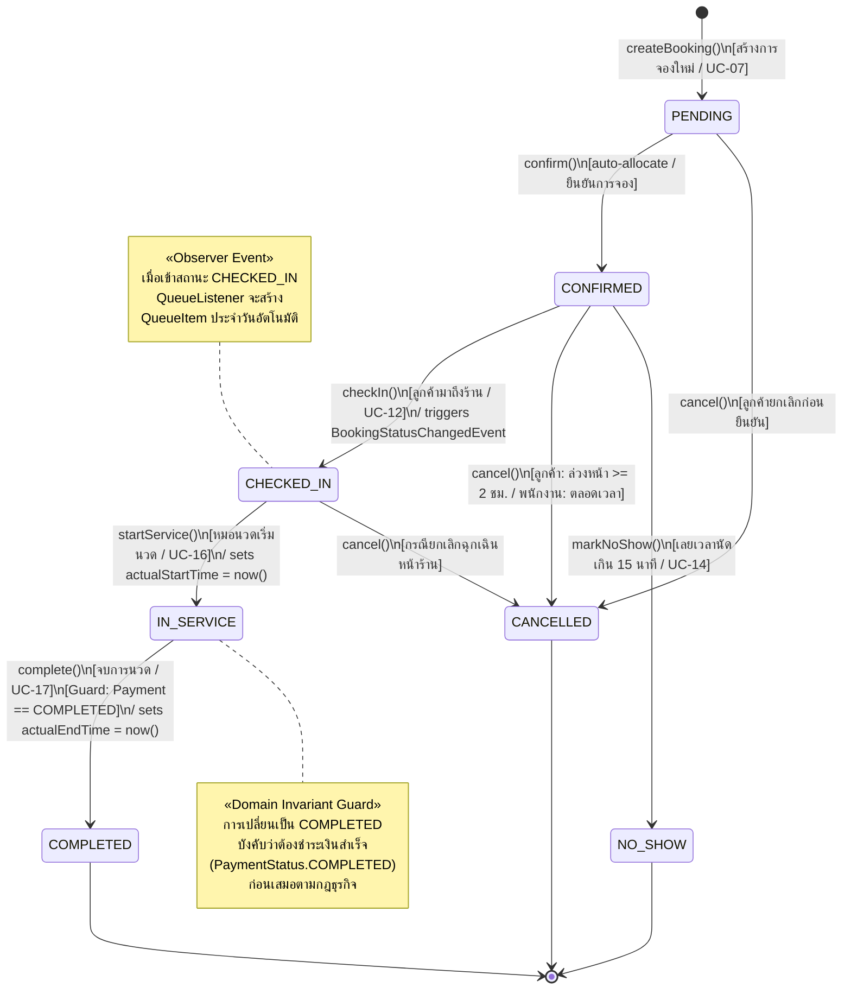

# FIWDEE Massage Management & Booking System
## UML State Machine Diagram Specification

---

## 1. Executive Summary & Purpose

เอกสารฉบับนี้จัดทำขึ้นเพื่อนำเสนอ **UML State Machine Diagram Specification ฉบับสมบูรณ์** สำหรับระบบ **FIWDEE Massage Management & Booking System** เพื่ออธิบายถึงวงจรชีวิต (Lifecycle), สถานะที่เป็นไปได้ทั้งหมด (States), เหตุการณ์หรือคำสั่งที่กระตุ้นให้เกิดการเปลี่ยนสถานะ (Triggers / Events), เงื่อนไขบังคับก่อนเปลี่ยนสถานะ (Guards / Invariants), และผลลัพธ์หลังการเปลี่ยนสถานะ (Actions / Effects)

โดยมีจุดศูนย์กลางอยู่ที่ **Booking Lifecycle State Machine** ซึ่งได้รับการพัฒนาขึ้นจริงด้วย **GoF State Pattern** ร่วมกับ **Abstract Base State Pattern** เพื่อให้สอดคล้องกับหลักการ **Liskov Substitution Principle (LSP)** และสอดรับกับสถานะของทรัพยากรที่เกี่ยวข้อง (Room Status, Queue Status, Payment Status)

โดยเชื่อมโยงกับเอกสารสถาปัตยกรรมหลักของโครงการ:
1. [Domain Model Specification (`doc/domain-model.md`)](file:///C:/Users/Viphu/Desktop/University/PrinciplesOfSoftwareDesign/FIWDEE-CP353002-69_1PrinciplesOfSoftwareDesign/doc/domain-model.md) — นิยาม Enumerations และ Entity Lifecycle
2. [Class Diagram Architecture (`doc/class-diagram.md`)](file:///C:/Users/Viphu/Desktop/University/PrinciplesOfSoftwareDesign/FIWDEE-CP353002-69_1PrinciplesOfSoftwareDesign/doc/class-diagram.md) — โครงสร้างคลาส `pattern.state.*`
3. [Design Patterns Specification (`doc/design-patterns.md`)](file:///C:/Users/Viphu/Desktop/University/PrinciplesOfSoftwareDesign/FIWDEE-CP353002-69_1PrinciplesOfSoftwareDesign/doc/design-patterns.md) — ข้อ 5.7 GoF State Pattern
4. [SOLID Principles Analysis (`doc/solid-analysis.md`)](file:///C:/Users/Viphu/Desktop/University/PrinciplesOfSoftwareDesign/FIWDEE-CP353002-69_1PrinciplesOfSoftwareDesign/doc/solid-analysis.md) — การวิเคราะห์ LSP Compliance ใน `AbstractBookingState`

* ไฟล์นิยาม PlantUML: [state-diagram.puml](file:///C:/Users/Viphu/Desktop/University/PrinciplesOfSoftwareDesign/FIWDEE-CP353002-69_1PrinciplesOfSoftwareDesign/doc/diagrams/state-diagram.puml)

---

## 2. วงจรชีวิตหลักของการจอง (Core Booking State Machine)

การจอง (`Booking`) ในระบบ FIWDEE มีสถานะการทำงานทั้งสิ้น **7 สถานะ (`BookingStatus`)**:
- **สถานะเริ่มต้น (Initial / Active States):**
  1. `PENDING`: สร้างคำขอจองแล้ว อยู่ระหว่างรอการยืนยันหรือตรวจสอบ
  2. `CONFIRMED`: การจองได้รับการยืนยัน จัดสรรห้องนวดและหมอนวดเรียบร้อยแล้ว
  3. `CHECKED_IN`: ลูกค้าเดินทางมาถึงร้านและเช็คอินที่เคาน์เตอร์ต้อนรับแล้ว (สร้างบัตรคิว)
  4. `IN_SERVICE`: หมอนวดเริ่มให้บริการนวดแก่ลูกค้าภายในห้องนวด
- **สถานะสิ้นสุด (Terminal / Final States):**
  5. `COMPLETED`: การให้บริการนวดและชำระเงินเสร็จสิ้นสมบูรณ์
  6. `CANCELLED`: การจองถูกยกเลิก (โดยลูกค้าล่วงหน้า $\ge 2$ ชม. หรือโดยพนักงาน)
  7. `NO_SHOW`: ลูกค้าไม่มาแสดงตัวตามเวลานัดหมายเกินระยะเวลาผ่อนผัน

---

## 3. UML State Diagram (Mermaid)



---

## 4. ตารางเมทริกซ์การเปลี่ยนสถานะ (State Transition Matrix & Rules)

| สถานะปัจจุบัน (Current State) | Event / Method Trigger | เงื่อนไขบังคับ (Guard Condition) | สถานะถัดไป (Target State) | สิทธิ์ผู้กระทำ (Allowed Roles) | พฤติกรรมข้างเคียง (Side Effects / Actions) |
| :--- | :--- | :--- | :--- | :--- | :--- |
| **`[*]` (None)** | `createBooking` | มีห้องว่าง, หมอนวดมีทักษะตรง, ไม่ทับซ้อนเวลาทำความสะอาด 15 นาที | `PENDING` หรือ `CONFIRMED` | `CUSTOMER`, `RECEPTIONIST`, `OWNER` | ออกรหัส `BK-yyyyMMdd-XXXXXX`, ล็อค Resource ด้วย `@Version` |
| **`PENDING`** | `confirm` | ทรัพยากรได้รับการยืนยัน | `CONFIRMED` | `RECEPTIONIST`, `OWNER`, System | ส่งแจ้งเตือนยืนยันการจอง |
| **`PENDING`** | `cancel` | - | `CANCELLED` | `CUSTOMER`, `RECEPTIONIST`, `OWNER` | ปลดล็อกเวลาห้องและหมอนวด |
| **`CONFIRMED`** | `checkIn` | ลูกค้ามาถึงร้านในวันและเวลานัด | `CHECKED_IN` | `RECEPTIONIST`, `OWNER` | ยิง Event `BookingStatusChangedEvent` $\rightarrow$ สร้างบัตรคิว |
| **`CONFIRMED`** | `cancel` | ลูกค้า: ต้องทำก่อนเวลานัด $\ge 2$ ชม.<br>พนักงาน: ทำได้ตลอดเวลา | `CANCELLED` | `CUSTOMER` (ตามเงื่อนไข), `RECEPTIONIST`, `OWNER` | คืนสิทธิ์ทรัพยากร, บันทึกหมายเหตุการยกเลิก |
| **`CONFIRMED`** | `markNoShow` | ลูกค้าไม่มาแสดงตัวตามนัด | `NO_SHOW` | `RECEPTIONIST`, `OWNER` | ปลดล็อกห้องและหมอนวด, บันทึกประวัติลูกค้า |
| **`CHECKED_IN`** | `startService` | ห้องนวดและหมอนวดพร้อมเริ่มบริการ | `IN_SERVICE` | `THERAPIST`, `RECEPTIONIST`, `OWNER` | บันทึก `actualStartTime = now()`, ปรับสถานะห้องเป็น `OCCUPIED` |
| **`CHECKED_IN`** | `cancel` | สิทธิการยกเลิกกรณีพิเศษหน้าร้าน | `CANCELLED` | `RECEPTIONIST`, `OWNER` | ยกเลิกบัตรคิว |
| **`IN_SERVICE`** | `complete` | ⚠️ **`booking.getPayment() != null && PaymentStatus == COMPLETED`** | `COMPLETED` | `THERAPIST`, `RECEPTIONIST`, `OWNER` | บันทึก `actualEndTime = now()`, ปรับสถานะห้องเป็น `CLEANING` (15 นาที) |
| **`COMPLETED`** | *(Terminal)* | ไม่อนุญาตให้เปลี่ยนสถานะ | - | - | โยน `ValidationException` |
| **`CANCELLED`** | *(Terminal)* | ไม่อนุญาตให้เปลี่ยนสถานะ | - | - | โยน `ValidationException` |
| **`NO_SHOW`** | *(Terminal)* | ไม่อนุญาตให้เปลี่ยนสถานะ | - | - | โยน `ValidationException` |

---

## 5. การสอดประสานระหว่าง State Machines ย่อย (Inter-State Synchronization)

ในระบบ FIWDEE เมื่อการจองเปลี่ยนสถานะ จะส่งผลให้ State Machine ของ Entity อื่นๆ เปลี่ยนแปลงไปตามเงื่อนไขทางธุรกิจที่สัมพันธ์กัน:

```mermaid
graph TD
    subgraph BookingLifecycle ["Booking State Machine"]
        B_CONFIRMED["CONFIRMED"]
        B_CHECKEDIN["CHECKED_IN"]
        B_INSERVICE["IN_SERVICE"]
        B_COMPLETED["COMPLETED"]
    end

    subgraph QueueLifecycle ["Queue Item State Machine"]
        Q_WAITING["WAITING (ในคิวรอเรียก)"]
        Q_INSERVICE["IN_SERVICE (กำลังรับบริการ)"]
        Q_COMPLETED["COMPLETED (จบคิว)"]
    end

    subgraph RoomLifecycle ["Room State Machine"]
        R_AVAILABLE["AVAILABLE (ว่าง)"]
        R_OCCUPIED["OCCUPIED (มีลูกค้าใช้งาน)"]
        R_CLEANING["CLEANING (ทำความสะอาด 15 นาที)"]
    end

    subgraph PaymentLifecycle ["Payment State Machine"]
        P_PENDING["PENDING (รอชำระเงิน)"]
        P_COMPLETED["COMPLETED (ชำระเงินสำเร็จ)"]
    end

    B_CONFIRMED -->|1. Customer check-in| B_CHECKEDIN
    B_CHECKEDIN -.->|triggers QueueListener| Q_WAITING

    B_CHECKEDIN -->|2. Therapist startService()| B_INSERVICE
    B_INSERVICE -.->|syncs| Q_INSERVICE
    B_INSERVICE -.->|locks room| R_OCCUPIED

    P_PENDING -->|3. Payment Processed| P_COMPLETED
    P_COMPLETED -.->|Prerequisite Guard| B_COMPLETED

    B_INSERVICE -->|4. Therapist completeService()| B_COMPLETED
    B_COMPLETED -.->|syncs| Q_COMPLETED
    B_COMPLETED -.->|triggers cleaningBuffer| R_CLEANING
    R_CLEANING -->|after 15 minutes buffer| R_AVAILABLE
```

---

## 6. การปฏิบัติตามหลักการออกแบบ (Design & SOLID Compliance)

1. **Liskov Substitution Principle (LSP):**
   - ทุกคลาสสถานะ (`PendingState`, `ConfirmedState`, `CheckedInState`, `InServiceState`, `CompletedState`, `CancelledState`, `NoShowState`) สืบทอดจาก [`AbstractBookingState`](file:///C:/Users/Viphu/Desktop/University/PrinciplesOfSoftwareDesign/FIWDEE-CP353002-69_1PrinciplesOfSoftwareDesign/code/backend/src/main/java/com/fiwdee/pattern/state/AbstractBookingState.java)
   - หากมีการเรียกใช้งานเมธอดที่ไม่รองรับในสถานะปัจจุบัน ระบบจะไม่คืนค่า `null` หรือเกิดพฤติกรรมที่ไม่แน่นอน แต่จะเรียก `#throwInvalidTransition(action)` ซึ่งโยน `ValidationException` ที่มีข้อความชัดเจนและสม่ำเสมอ
2. **Business Invariant Guard:**
   - คลาส [`InServiceState`](file:///C:/Users/Viphu/Desktop/University/PrinciplesOfSoftwareDesign/FIWDEE-CP353002-69_1PrinciplesOfSoftwareDesign/code/backend/src/main/java/com/fiwdee/pattern/state/InServiceState.java) บังคับใช้เงื่อนไขตรวจสอบยอดเงิน `payment.paymentStatus == PaymentStatus.COMPLETED` ก่อนอนุมัติให้จบงาน ป้องกันการสูญเสียรายได้ของร้าน
3. **Decoupled Event Reaction (Observer Pattern):**
   - การเปลี่ยนสถานะเป็น `CHECKED_IN` ไม่มีการเรียกตรงไปยังระบบคิว แต่ใช้การกระจาย `BookingStatusChangedEvent` เพื่อให้ `QueueListener` เป็นผู้สร้างบัตรคิวอย่างอิสระ
