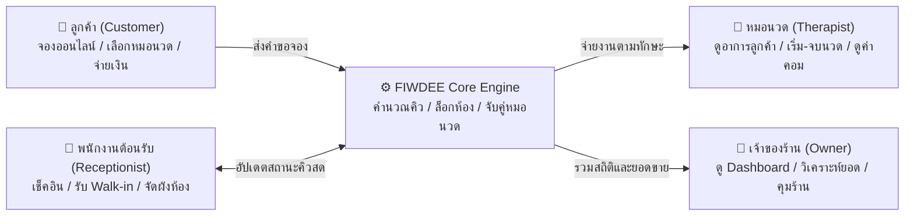
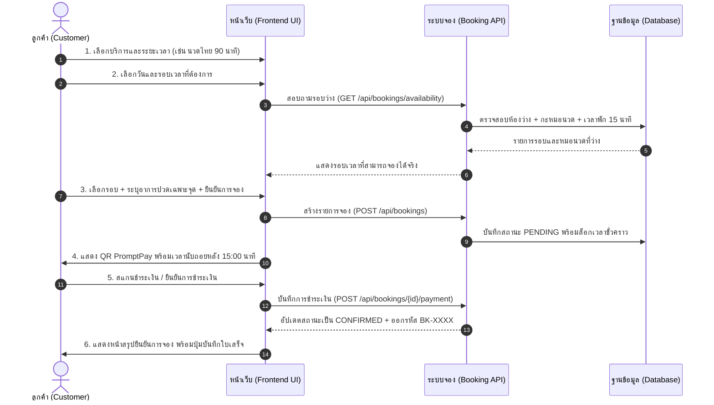
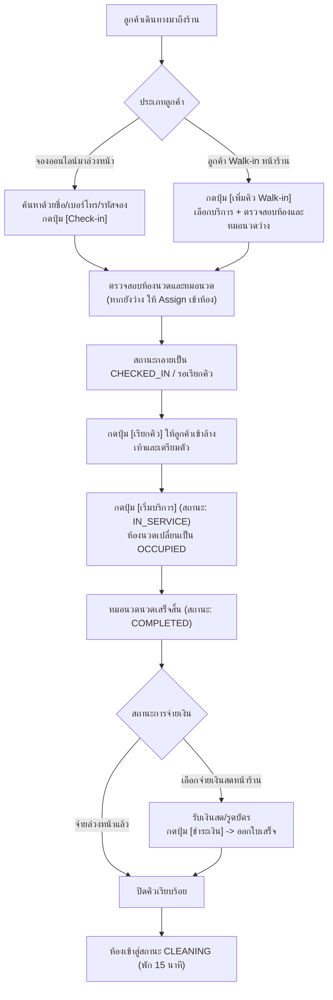
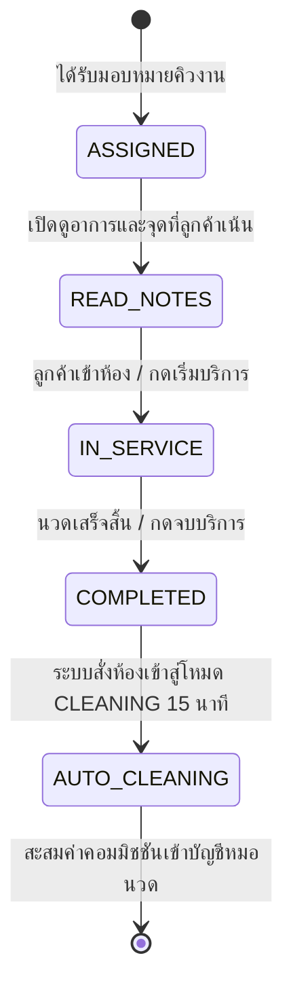
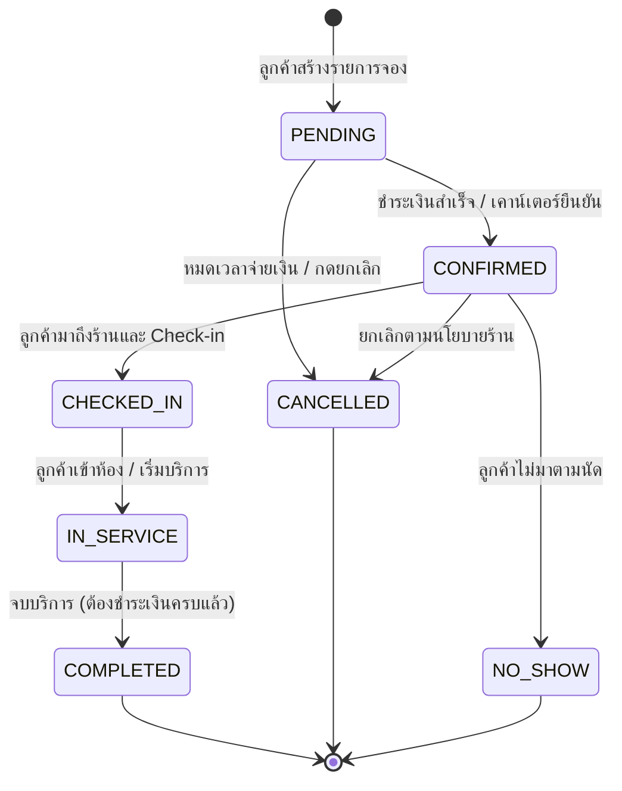

# เอกสารข้อกำหนดระบบและฟังก์ชันการทำงาน (System Requirements Specification)
# FIWDEE — Massage Management & Booking System

> **วิชา:** CP353002-69 Principles of Software Design  
> **สถานะเอกสาร:** ฉบับสมบูรณ์ (Official Specification)  
> **กลุ่มเป้าหมาย:** ทีมพัฒนา, ผู้บริหารร้าน, อาจารย์ประจำวิชา และผู้ประเมินระบบ  
> **ภาษา:** ภาษาไทย (พร้อมคำศัพท์เทคนิคมาตรฐานสากล)

---

## สารบัญ (Table of Contents)
1. [บทนำและภาพรวมของระบบ (Executive Summary & Philosophy)](#1-บทนำและภาพรวมของระบบ-executive-summary--philosophy)
2. [อัตลักษณ์ ดีไซน์ และบรรยากาศหน้าตาเว็บ (UI/UX Design Language)](#2-อัตลักษณ์-ดีไซน์-และบรรยากาศหน้าตาเว็บ-uiux-design-language)
3. [Customer Journey: ประสบการณ์ของผู้รับบริการ (ลูกค้า)](#3-customer-journey-ประสบการณ์ของผู้รับบริการ-ลูกค้า)
4. [Receptionist Journey: การบริหารคิวและงานต้อนรับหน้าร้าน (พนักงานต้อนรับ)](#4-receptionist-journey-การบริหารคิวและงานต้อนรับหน้าร้าน-พนักงานต้อนรับ)
5. [Therapist Journey: การจัดการคิวงานและให้บริการ (หมอนวด)](#5-therapist-journey-การจัดการคิวงานและให้บริการ-หมอนวด)
6. [Owner Journey: แดชบอร์ดผู้บริหารและการจัดการร้าน (เจ้าของร้าน)](#6-owner-journey-แดชบอร์ดผู้บริหารและการจัดการร้าน-เจ้าของร้าน)
7. [การทำงานเบื้องหลัง สถาปัตยกรรม และความปลอดภัย (Backend & Architecture)](#7-การทำงานเบื้องหลัง-สถาปัตยกรรม-และความปลอดภัย-backend--architecture)
8. [เมทริกซ์สิทธิ์การใช้งานและดัชนี Use Case (Role Matrix & Mapping)](#8-เมทริกซ์สิทธิ์การใช้งานและดัชนี-use-case-role-matrix--mapping)

---

## 1. บทนำและภาพรวมของระบบ (Executive Summary & Philosophy)

### 1.1 ที่มาและเป้าหมายของระบบ (Background & Objective)
ร้านนวดและสปาไทย **FIWDEE (ฟิวดิ)** เป็นสถานประกอบการสุขภาพที่มีเอกลักษณ์โดดเด่นในด้านศาสตร์การนวดเพื่อความผ่อนคลายและการบำบัดกล้ามเนื้อ อย่างไรก็ตาม การดำเนินงานของร้านนวดทั่วไปมักพบปัญหาคอขวดสำคัญ:
* **ปัญหาการจัดตารางเวลาชนกัน (Double Booking):** ลูกค้าจองเวลาเดียวกัน หรือห้องนวด/หมอนวดที่มีทักษะเฉพาะด้านถูกจัดซ้ำซ้อน
* **ปัญหาการบริหารคิวหน้าร้าน (Front-Desk Chaos):** การประสานงานระหว่างลูกค้า Walk-in กับลูกค้าที่จองล่วงหน้าเกิดความสับสนเมื่อมีคนมาช้าหรือยกเลิกกะทันหัน
* **ปัญหาการทำความสะอาดห้อง:** ขาดการนับเวลาพักทำความสะอาด เปลี่ยนผ้าปู และระบายอากาศระหว่างรอบบริการ (Sanitization & Cleaning Buffer)
* **ปัญหาความโปร่งใสของรายได้และค่าคอมมิชชัน:** หมอนวดไม่สามารถตรวจสอบรอบบริการและยอดค่ามือของตนเองได้แบบโปร่งใส

ระบบ **FIWDEE Massage Management & Booking System** จึงถูกสร้างขึ้นเป็น **Single Integrated Platform** ที่เชื่อมโยงลูกค้า, พนักงานต้อนรับหน้าร้าน, หมอนวดผู้ให้บริการ และเจ้าของร้านเข้าด้วยกันแบบไร้รอยต่อ



---

### 1.2 กฎเหล็กด้านความยืดหยุ่น: Dynamic Resource Principle
> [!IMPORTANT]
> **ระบบไม่มีการ Hard-code จำนวนห้องและหมอนวดในโค้ดโดยเด็ดขาด**
> ในการดำเนินงานเริ่มต้น ร้านมี **6 ห้องนวด** และมีหมอนวดต่อวันประมาณ **6 คน** แต่สถาปัตยกรรมของระบบถูกออกแบบให้ตัวเลขเหล่านี้ดึงมาจากฐานข้อมูล (Database-Driven) ตลอดเวลา ร้านสามารถขยายเป็น 10 ห้อง หรือเพิ่มหมอนวดเป็น 15 คนได้ผ่านระบบจัดการของ Owner โดยไม่ต้องแก้ไขโค้ดโปรแกรมแม้แต่บรรทัดเดียว

---

## 2. อัตลักษณ์ ดีไซน์ และบรรยากาศหน้าตาเว็บ (UI/UX Design Language)

หน้าตาและประสบการณ์การใช้งานของ FIWDEE ได้รับการออกแบบภายใต้แนวคิด **"Boutique Thai Wellness & Luxury Serenity"** เพื่อให้ผู้ใช้สัมผัสได้ถึงความสงบ ผ่อนคลาย ประณีต และเป็นมืออาชีพตั้งแต่วินาทีแรกที่เข้าสู่เว็บไซต์

### 2.1 โทนสีหลักของระบบ (Color Palette & Tokens)
ทุกหน้าจอเลือกใช้ชุดสีที่สะท้อนถึงองค์ประกอบธรรมชาติของสปาไทย (ไม้สัก, ผ้าลินิน, ดินเผา, และสมุนไพร):

| โทนสี (Design Token) | โค้ดสี HEX | อารมณ์และความหมาย | การนำไปใช้ในหน้าจอ |
|:---|:---:|:---|:---|
| **Linen Canvas / Surface** | `#FBF9F4` | พื้นผิวผ้าลินินสีครีมอบอุ่น อ่อนโยน สบายตา | พื้นหลังหลักของหน้าเว็บทุกหน้า (Background) |
| **Deep Teak Wood (Primary)** | `#110703` / `#2B1E16` | เนื้อไม้สักเข้ม สะท้อนความมั่นคง หรูหรา เงียบสงบ | แถบนำทาง (Navbar), หัวข้อหลัก, ปุ่มกดสำคัญ (Primary CTA) |
| **Terracotta Clay (Secondary)** | `#914B2F` | ดินเผาสีส้มอิฐ อบอุ่น มีชีวิตชีวา ผ่อนคลาย | ไฮไลต์ราคา, ปุ่มกดรอง, เส้นแถบแสดงขั้นตอน (Active Stepper) |
| **Herbal Jade / Sage (Tertiary)**| `#366666` | หยกสมุนไพร เย็นสบาย สดชื่น สื่อถึงการฟื้นฟูสุขภาพ | ป้ายสถานะพร้อมใช้งาน (Available), ตราสัญลักษณ์สุขอนามัย |
| **Warm Sand / Outline** | `#D8D0C5` / `#D2C4BD`| ทรายนวล เส้นสายกลมกลืนเป็นธรรมชาติ | เส้นแบ่งกรอบการ์ด (Borders), กล่องข้อความกรอกข้อมูล |

---

### 2.2 การจัดรูปแบบตัวอักษรและระดับชั้นสายตา (Typography Hierarchy)
* **หัวข้อและข้อความเน้นอารมณ์ (Headlines & Display):** ใช้ฟอนต์ตระกูล Serif คือ `Noto Serif` และ `Noto Serif Thai` เพื่อมอบความรู้สึกประณีต อ่อนช้อย หรูหรา สง่างาม
* **ข้อความเนื้อหาและการควบคุม (Body & Controls):** ใช้ฟอนต์ Sans-serif ทันสมัยคือ `Inter` และ `Noto Sans Thai` เพื่อให้อ่านข้อมูล ตัวเลข เวลา และชื่อเมนูได้อย่างชัดเจน ไม่เมื่อยล้าสายตา
* **ข้อความกำกับขนาดเล็ก (Caps & Metadata):** ใช้ `Manrope` เพื่อให้ตัวเลขวันที่ รหัสอ้างอิงการจอง และสถิติมีความกระชับ คมชัด สวยงาม

---

### 2.3 ภาพร่างโครงสร้างหน้าจอหลัก (Master Layout Blueprint)

```
+-----------------------------------------------------------------------------------+
|  [FIWDEE Logo]     หน้าแรก   บริการของเรา   หมอนวดของเรา   เกี่ยวกับร้าน    [TH | EN]  [จองคิว / เข้าสู่ระบบ] |
+-----------------------------------------------------------------------------------+
|                                                                                   |
|  [ Hero Banner: ภาพบรรยากาศสปาไทยอันเงียบสงบ + แสงธรรมชาติอันอบอุ่น ]            |
|  "ศาสตร์แห่งการผ่อนคลาย คืนสมดุลสู่ร่างกายและจิตใจอย่างประณีต"                   |
|  [ เลือกดูบริการนวด ]     [ จองคิวนวดออนไลน์ทันที ]                              |
|                                                                                   |
+-----------------------------------------------------------------------------------+
|  [ Services Carousel / Grid: แสดงการ์ดบริการยอดนิยม พร้อมระยะเวลาและราคา ]         |
+-----------------------------------------------------------------------------------+
|  [ Therapist Spotlight: โปรไฟล์หมอนวดผู้เชี่ยวชาญ ทักษะเฉพาะทาง และรีวิวเฉลี่ย ]  |
+-----------------------------------------------------------------------------------+
|  Footer: ข้อมูลร้าน เวลาเปิดทำการ (10:00 - 21:00 น.) แผนที่ และมาตรฐานสุขอนามัย    |
+-----------------------------------------------------------------------------------+
```

---

## 3. Customer Journey: ประสบการณ์ของผู้รับบริการ (ลูกค้า)

ลูกค้าคือหัวใจสำคัญของระบบ กระบวนการของผู้รับบริการได้รับการออกแบบให้ตรงไปตรงมา ไม่สับสน สามารถจองและชำระเงินได้สำเร็จภายใน 3 นาที



---

### 3.1 หน้าแรกและแนะนำบริการ (Landing & Services Pages)

#### วัตถุประสงค์ (Purpose)
สร้างความประทับใจแรก ให้ข้อมูลบริการและอัตราค่าบริการอย่างโปร่งใส และกระตุ้นให้ลูกค้ากดจองคิว (Call-to-Action)

#### องค์ประกอบบนหน้าจอ (UI Components Breakdown)
1. **Sticky Top Navigation Bar:**
   * โลโก้ FIWDEE ทำจากไม้สีเข้มและสีทอง
   * เมนูนำทาง: หน้าแรก, บริการ, หมอนวด, เกี่ยวกับเรา
   * ปุ่มสลับภาษา: `TH` / `EN` (กดแล้วข้อความทั้งเว็บเปลี่ยนทันทีแบบไร้รอยต่อ)
   * ปุ่มเข้าสู่ระบบ / ข้อมูลผู้ใช้ (ถ้าล็อกอินแล้วจะแสดงชื่อลูกค้าและเมนูประวัติการจอง)
   * ปุ่มหลัก CTA: `"จองคิวออนไลน์"` (กดแล้วนำเข้าสู่ระบบจองทันที)
2. **Hero Presentation Banner:**
   * สโลแกนหลักฟอนต์ Serif ขนาดใหญ่
   * ข้อความบรรยายแนวคิดสปาแบบองค์รวม
   * ป้ายการันตี: หมอนวดมีใบรับรองมาตรฐานวิชาชีพ 100%, ห้องนวดส่วนตัวสะอาดผ่านการฆ่าเชื้อทุกรอบ
3. **Services Catalog Section:**
   * การ์ดบริการแต่ละประเภท ประกอบด้วย:
     * รูปภาพบรรยากาศการให้บริการคุณภาพสูง
     * ชื่อบริการ (เช่น นวดแผนไทยราชสำนัก, นวดอโรมาเธอราพีน้ำมันหอมระเหย, นวดน้ำมันอุ่นคลายกล้ามเนื้อ, นวดกดจุดสะท้อนฝ่าเท้า)
     * คำอธิบายสรรพคุณและจุดเด่นของการนวด
     * แท็บเลือกระยะเวลา: `[60 นาที]`, `[90 นาที]`, `[120 นาที]`
     * การแสดงราคาที่เปลี่ยนตามระยะเวลาที่เลือกอย่างชัดเจน (เช่น 60 นาที = 500 บาท, 90 นาที = 750 บาท)
     * ปุ่ม `"เลือกจองบริการนี้"` ที่จะพาส่งต่อไปยังหน้าจองคิวพร้อมเลือกบริการนั้นไว้ให้อัตโนมัติ

---

### 3.2 หน้ารายชื่อและโปรไฟล์หมอนวด (Therapists Page)

#### วัตถุประสงค์ (Purpose)
สร้างความมั่นใจแก่ลูกค้าด้วยการเปิดเผยข้อมูล ความชำนาญ และรีวิวของหมอนวดแต่ละท่าน

#### องค์ประกอบบนหน้าจอ (UI Components Breakdown)
* **การ์ดโปรไฟล์หมอนวดแต่ละคน (Therapist Card):**
  * รูปถ่ายหมอนวดในชุดเครื่องแบบสุภาพ อบอุ่น
  * ชื่อและฉายาความเชี่ยวชาญ (เช่น "ครูแก้ว — ผู้เชี่ยวชาญการแก้อาการคอบ่าไหล่และไมเกรน")
  * ประสบการณ์การทำงาน (เช่น "ประสบการณ์ 8 ปี, ใบรับรองกระทรวงสาธารณสุข")
  * ป้ายทักษะเฉพาะทาง (Skill Badges): `[นวดไทย]`, `[นวดอโรมา]`, `[นวดแก้อาการ]`, `[นวดน้ำมันอุ่น]`
  * คะแนนรีวิวเฉลี่ย (เช่น ⭐ 4.9 จาก 128 รีวิว)
  * สถานะการทำงานวันนี้: `พร้อมให้บริการวันนี้` หรือ `หยุดทำการ`
  * ปุ่ม `"จองกับหมอท่านนี้"`

---

### 3.3 ระบบการจองคิวออนไลน์ 3 ขั้นตอน (Booking Wizard)

หน้าจองคิวออกแบบเป็น **Progressive Stepper Wizard** ช่วยลดความสับสนและแบ่งการตัดสินใจออกเป็นขั้นตอนที่ชัดเจน

```
=====================================================================================
  [1] เลือกบริการและระยะเวลา   ----->   [2] เลือกรอบและระบุอาการ   ----->   [3] ชำระเงิน
=====================================================================================
```

#### Step 1: เลือกบริการและระยะเวลา (Service & Duration Selection)
* **สิ่งที่ลูกค้าเห็นและทำได้:**
  * รายการประเภทการนวดในรูปแบบ Interactive Card เมื่อคลิกจะเกิดแถบไฮไลต์สีไม้สักทอง
  * ตัวเลือกระยะเวลา: ให้เลือก 60, 90 หรือ 120 นาที พร้อมคำนวณราคาให้เห็นทันที
  * สรุปราคาด้านข้าง (Booking Summary Panel): อัปเดตรายการที่เลือกแบบ Real-time
  * ปุ่ม `"ถัดไป: เลือกรอบเวลา"`

#### Step 2: เลือกวัน เวลา หมอนวด และระบุอาการเฉพาะจุด (Slot, Therapist & Health Notes)
* **สิ่งที่ลูกค้าเห็นและทำได้:**
  * **ปฏิทินเลือกวัน (Date Picker):** สามารถเลือกจองล่วงหน้าได้สูงสุด 14 วัน (วันที่มีรอบว่างจะขึ้นเป็นสีปกติ วันที่เต็มจะขึ้นเป็นสีเทา)
  * **ตัวเลือกหมอนวด (Therapist Preference):**
    * ตัวเลือกที่ 1: `"ไม่ระบุหมอนวด (ระบบจัดสรรผู้ว่างที่ชำนาญบริการนี้ให้)"`
    * ตัวเลือกที่ 2: ระบุชื่อหมอนวดที่ต้องการเจาะจง (ระบบจะแสดงเฉพาะรอบที่หมอนวดท่านนั้นว่าง)
  * **ตารางรอบเวลาที่เปิดให้บริการ (Time Slot Grid):**
    * แสดงปุ่มช่วงเวลา เช่น `[10:00]`, `[11:30]`, `[13:00]`, `[15:00]`, `[17:00]`, `[19:00]`
    * รอบที่ถูกจองไปแล้วจะถูก Disable และมีข้อความระบุว่า `"เต็มแล้ว"`
  * **แบบฟอร์มบันทึกอาการและข้อจำกัดทางสุขภาพ (Customer Service Notes):**
    * เลือกระดับน้ำหนักการนวด: `เบา (Relaxing)`, `ปานกลาง (Medium - แนะนำ)`, `หนัก (Firm / Deep Tissue)`
    * จุดที่ต้องการให้เน้นเป็นพิเศษ: (เช่น สะบัก คอ บ่า ไหล่ เอว ฝ่าเท้า)
    * ข้อควรระวังด้านสุขภาพ: (เช่น มีแผลผ่าตัด, กำลังตั้งครรภ์, มีโรคความดัน, มีกระดูกสันหลังคด)
  * ปุ่ม `"ถัดไป: สรุปและชำระเงิน"`

```
+-----------------------------------------------------------------------------------+
|  ขั้นตอนที่ 2 จาก 3: เลือกรอบเวลาและระบุอาการ                                       |
+-----------------------------------------------------------------------------------+
|  เลือกวันที่:  [ วันนี้ 7 ต.ค. ]  [ พรุ่งนี้ 8 ต.ค. ]  [ ศุกร์ 9 ต.ค. ]  [ อื่นๆ... ]|
|                                                                                   |
|  หมอนวด:     (o) หมอนวดท่านใดก็ได้ที่ว่าง     ( ) เลือกเจาะจง: [ ครูแก้ว ▼ ]      |
|                                                                                   |
|  รอบเวลาว่าง: [ 10:00 ]   [ 11:30 ]   [ 13:00 (เต็ม) ]   [ 15:00 ]   [ 17:00 ]    |
|                                                                                   |
|  น้ำหนักการนวด: ( ) เบา          (o) ปานกลาง          ( ) หนัก                    |
|  อาการ/จุดเน้น: [ ปวดสะบักซ้ายตึงขึ้นคอจากการนั่งทำงานหน้าคอมพิวเตอร์          ]  |
|                                                                                   |
|  [ < ย้อนกลับ ]                                            [ ถัดไป: ไปหน้าชำระเงิน > ] |
+-----------------------------------------------------------------------------------+
```

#### Step 3: ชำระเงินและยืนยันการจอง (Payment & Checkout)
* **สิ่งที่ลูกค้าเห็นและทำได้:**
  * **แผงสรุปยอดเงิน (Order Summary):** แสดงชื่อบริการ, ระยะเวลา, หมอนวด, วันที่, เวลา, ราคารวม, และช่องกรอก Promo Code สำหรับรับส่วนลด
  * **ตัวเลือกวิธีการชำระเงิน (Payment Method Tabs):**
    * **ตัวเลือกหลัก: QR PromptPay:**
      * ระบบจะแสดงรหัส QR Code มาตรฐานพร้อมยอดเงินตรงตามใบเสร็จ
      * มีแถบเวลานับถอยหลังความปลอดภัย: `⏱️ กรุณาชำระเงินภายใน 14:59 นาที`
      * ข้อแนะนำการสแกนผ่าน Mobile Banking ทุกธนาคาร
    * **ตัวเลือกที่สอง: ชำระเงินสดที่หน้าร้าน (Cash at Counter):**
      * มีเงื่อนไขระบุชัดเจนว่าต้องเดินทางมาถึงร้านก่อนเวลานัดหมายอย่างน้อย 15 นาที
  * ปุ่ม `"ยืนยันการชำระเงิน / ส่งหลักฐาน"`

#### หน้าจอเมื่อการจองสำเร็จ (Booking Confirmation Screen)
* ระบบแสดงตราสัญลักษณ์ความสำเร็จสีทองปนเขียวมรกต
* **รหัสอ้างอิงการจอง (Booking Reference):** ตัวอักษรขนาดใหญ่ เช่น `BK-20261007-0042`
* รายละเอียดการนัดหมายครบถ้วน: วันที่ เวลา ห้องนวด และชื่อหมอนวด
* ปุ่มกดสำคัญ:
  * `"บันทึกรูปภาพบัตรนัดหมาย / QR สำหรับเช็คอิน"`
  * `"ดูรายการจองของฉัน"`
  * `"กลับสู่หน้าแรก"`

---

### 3.4 ประวัติการจองและระบบรีวิว (Booking History & Reviews)
* **การดูประวัติ (My Bookings):** ลูกค้าสามารถตรวจสอบรายการจองที่ผ่านมา แยกสถานะเป็น `รอรับบริการ`, `เสร็จสิ้นแล้ว`, และ `ยกเลิกแล้ว`
* **การยกเลิกการจอง (Cancellation):** สามารถกดยกเลิกได้ด้วยตนเองหากยังไม่ถึงกำหนดเวลาขั้นต่ำที่ร้านอนุญาต (เช่น ล่วงหน้าอย่างน้อย 2 ชั่วโมง)
* **การให้คะแนนและรีวิว (Review & Rating):**
  * ปุ่ม `"เขียนรีวิวบริการ"` จะปรากฏเฉพาะรายการจองที่มีสถานะ **`COMPLETED`** เท่านั้น
  * ให้คะแนนรูปดาว 1 - 5 ดาว
  * เขียนความคิดเห็น ความประทับใจ หรือข้อเสนอแนะในการพัฒนา
  * รีวิวที่ส่งจะปรากฏบนหน้าโปรไฟล์ของหมอนวดและคะแนนเฉลี่ยของร้านโดยอัตโนมัติ

---

## 4. Receptionist Journey: การบริหารคิวและงานต้อนรับหน้าร้าน (พนักงานต้อนรับ)

พนักงานต้อนรับหน้าร้าน (Receptionist) มีหน้าที่ดูแลความราบรื่นบริเวณเคาน์เตอร์ จัดสรรห้องนวด รับลูกค้า Walk-in เช็คอิน และรับชำระเงิน



---

### 4.1 กระดานจัดการคิวสดหน้าร้าน (Live Queue Board)

#### วัตถุประสงค์ (Purpose)
เป็นหน้าจอหลักที่พนักงานต้อนรับเปิดไว้บนหน้าจอเคาน์เตอร์ตลอดทั้งวัน เพื่อเห็นภาพรวมว่าใครกำลังนวด ใครกำลังรอ และมีห้องไหนว่างอยู่บ้าง

#### โครงร่างหน้าจอ (UI Layout Blueprint)

```
+---------------------------------------------------------------------------------------------+
|  [FIWDEE Admin]    กระดานคิวสด    ผังห้องนวด    รายการจอง    หมอนวด    [+ เพิ่มคิว Walk-in]  |
+---------------------------------------------------------------------------------------------+
|  ตัวกรองสถานะ: [ ทั้งหมด (12) ]  [ รอเรียกคิว (3) ]  [ กำลังนวด (4) ]  [ เสร็จสิ้น (5) ]      |
|  ค้นหาด่วน:    [ 🔍 ค้นหาด้วยชื่อลูกค้า, เบอร์โทร, หรือรหัสคิว...                        ]  |
+---------------------------------------------------------------------------------------------+
|  [ การ์ดคิวที่ 1 ]                   [ การ์ดคิวที่ 2 ]                  [ การ์ดคิวที่ 3 ]     |
|  คิว #Q-04 (14:30 น.)               คิว #Q-05 (15:00 น.)              คิว #Q-06 (15:00 น.)   |
|  ลูกค้า: คุณปิยะดา (081-xxx-xxxx)    ลูกค้า: คุณกิตติ (Walk-in)         ลูกค้า: คุณมาริสา      |
|  บริการ: นวดอโรมา 90 นาที           บริการ: นวดไทยราชสำนัก 60 นาที    บริการ: นวดเท้า 60 นาที|
|  ห้อง: ห้อง 2 (Single)              ห้อง: ยังไม่ได้กำหนด ⚠️            ห้อง: ห้อง 5 (Foot)    |
|  หมอนวด: ครูแก้ว                    หมอนวด: หมอพร                     หมอนวด: หมอนก          |
|  สถานะ: [ กำลังนวด (IN_SERVICE) ]   สถานะ: [ เช็คอินแล้ว (CHECKED_IN)] สถานะ: [ รอนัดหมาย ]   |
|  เวลาที่เหลือ: 35 นาที              [ มอบหมายห้อง ] [ เรียกคิว ]      [ เช็คอิน ] [ ยกเลิก ] |
+---------------------------------------------------------------------------------------------+
```

#### ฟังก์ชันการควบคุมในกระดานคิวสด:
1. **แท็บแยกสถานะคิว (Status Filter Tabs):**
   * `ทั้งหมด (ALL)`: ดูรายการคิวทั้งหมดของวัน
   * `รอเรียก/เช็คอิน (WAITING / CHECKED_IN)`: คิวที่ลูกค้ามาถึงแล้ว นั่งรอในห้องรับรอง
   * `กำลังให้บริการ (IN_SERVICE)`: ลูกค้าอยู่ในห้องนวด มีตัวเลขนับเวลาถอยหลัง
   * `เสร็จสิ้น (COMPLETED)`: บริการเสร็จเรียบร้อย ชำระเงินแล้ว
   * `ยกเลิก (CANCELLED / NO-SHOW)`: ลูกค้าโทรยกเลิก หรือไม่มาตามนัด
2. **ปุ่มการกระทำด่วนบนการ์ดคิว (Action Buttons):**
   * **ปุ่ม `[เช็คอิน (Check-in)]`:** ยืนยันว่าลูกค้ามาถึงร้านแล้ว
   * **ปุ่ม `[มอบหมายห้อง / หมอนวด]`:** เปิดหน้าต่างป๊อปอัปให้เลือกห้องว่างและหมอนวดที่ว่างตรงกับบริการ
   * **ปุ่ม `[เริ่มนวด (Start Service)]`:** ส่งสัญญาณว่าลูกค้าเข้าห้องนวดแล้ว ห้องจะถูกล็อกเป็น `OCCUPIED`
   * **ปุ่ม `[เสร็จสิ้น (Complete)]`:** บันทึกจบงาน พร้อมเปิดหน้าต่างชำระเงินทันทีหากยังค้างจ่าย

---

### 4.2 การรับลูกค้าหน้าร้าน (Walk-in Booking Modal)
เมื่อมีลูกค้าเดินเข้ามาที่ร้านโดยไม่ได้จองล่วงหน้า พนักงานจะกดปุ่ม **`[+ เพิ่มคิว Walk-in ใหม่]`**:
* หน้าต่างแบบ Modal จะเปิดขึ้นมาให้กรอกข้อมูลสั้นๆ:
  * ชื่อและเบอร์โทรศัพท์ของลูกค้า
  * เลือกบริการและระยะเวลาที่ลูกค้าต้องการ
  * ระบบจะดึงห้องที่ว่างอยู่ ณ ขณะนั้น และหมอนวดที่มีทักษะตรงกับบริการและไม่ได้ติดคิวอื่นมาให้เลือกทันที
  * บันทึกอาการเบื้องต้น
  * เลือกวิธีชำระเงิน (จ่ายสดทันที / โอนสแกน / จ่ายหลังนวดเสร็จ)
* เมื่อกดบันทึก คิวจะถูกบรรจุเข้าสู่ Live Queue Board พร้อมพิมพ์บัตรคิวให้ลูกค้าทันที

---

### 4.3 การจัดการผังห้องนวดแบบ Real-time (Rooms Management)
พนักงานต้อนรับสามารถสลับมาดูหน้า **ผังห้องนวด (Rooms View)** ซึ่งจำลองแผนผังห้องทั้งหมดของร้าน:
* การ์ดห้องแต่ละห้องจะแสดงสีตามสถานะ:
  * 🟢 **เขียว (AVAILABLE):** ห้องว่าง พร้อมรับลูกค้าทันที
  * 🔴 **แดง (OCCUPIED):** กำลังมีลูกค้านวดอยู่ (แสดงชื่อลูกค้า หมอนวด และเวลาที่จะเสร็จ)
  * 🟡 **เหลือง (CLEANING):** กำลังทำความสะอาด/เปลี่ยนผ้าปู มีเวลานับถอยหลัง 15 นาที เมื่อครบเวลาจะเปลี่ยนเป็นสีเขียวอัตโนมัติ
  * ⚪ **เทา (MAINTENANCE):** ปิดปรับปรุง (เช่น แอร์เสีย ซ่อมเตียง)
* พนักงานสามารถกดปุ่ม **`[เสร็จสิ้นการทำความสะอาด]`** เพื่อปลดล็อกห้องให้ว่างก่อนเวลาได้หากแม่บ้านทำความสะอาดเสร็จเร็วกว่ากำหนด

---

## 5. Therapist Journey: การจัดการคิวงานและให้บริการ (หมอนวด)

หมอนวดสามารถเข้าใช้งานระบบผ่านแท็บเล็ตประจำร้าน หรือโทรศัพท์มือถือ เพื่อจัดการคิวงานและดูแลลูกค้าของตนเองได้อย่างมีมาตรฐาน



---

### 5.1 หน้าตารางงานและคิวงานตนเอง (Therapist My Schedule)
* **สิ่งที่หมอนวดมองเห็น:**
  * ข้อมูลกะการทำงานของตนเองในวันนี้ (เช่น กะเช้า 10:00 - 19:00 น.)
  * ลำดับรายการคิวลูกค้าที่ตนได้รับมอบหมายตลอดทั้งวัน
  * ข้อมูลห้องนวดที่ต้องเข้าปฏิบัติงาน
* **การเปิดดูข้อมูลสุขภาพลูกค้า (Customer Service Notes):**
  * ก่อนเริ่มนวด หมอนวดจะกดดูโน้ตความต้องการของลูกค้าได้:
    * ระดับน้ำหนักที่ลูกค้าขอ (เช่น "ปานกลาง")
    * จุดที่ลูกค้าเน้นเป็นพิเศษ (เช่น "สะบักซ้ายตึงมาก ไมเกรนขึ้นตา")
    * ข้อควรระวัง (เช่น "ห้ามกดบริเวณกระดูกสันหลังส่วนล่าง เคยผ่าตัดเมื่อ 6 เดือนก่อน")
  * ข้อมูลส่วนนี้ช่วยยกระดับความปลอดภัยและสร้างความประทับใจระดับพรีเมียมแก่ลูกค้า

---

### 5.2 การควบคุมสถานะการให้บริการ (Service Execution Controls)
1. **ปุ่ม `[เริ่มให้บริการ (Start Service)]`:**
   * เมื่อลูกค้าเปลี่ยนชุดพร้อมบนเตียงนวด หมอนวดจะกดปุ่มนี้
   * ระบบจะเริ่มนับเวลาให้บริการจริง
   * สถานะการจองเปลี่ยนเป็น **`IN_SERVICE`** และผังห้องเปลี่ยนเป็นสีแดง **`OCCUPIED`**
2. **ปุ่ม `[ให้บริการเสร็จสิ้น (Complete Service)]`:**
   * เมื่อนวดเสร็จสิ้นและลูกค้าเปลี่ยนชุดเรียบร้อย หมอนวดจะกดปุ่มนี้
   * สถานะการจองเปลี่ยนเป็น **`COMPLETED`**
   * **Trigger อัตโนมัติ:** ระบบจะปรับสถานะของห้องนวดเข้าสู่ **`CLEANING` (ทำความสะอาด 15 นาที)** โดยอัตโนมัติ เพื่อเตือนให้แม่บ้านเข้าเปลี่ยนผ้าปูและเติมน้ำมันหอม

---

### 5.3 หน้าสรุปค่ามือและค่าคอมมิชชัน (Therapist Earnings)
* หมอนวดสามารถกดดูสรุปผลงานส่วนตัว:
  * จำนวนรอบการนวดในวันนี้ และสะสมในเดือนนี้
  * ยอดเงินค่าคอมมิชชันที่ได้รับตามอัตราส่วนแบ่งของตนเอง (Commission Rate)
  * คะแนนรีวิวเฉลี่ยและข้อความชื่นชมจากลูกค้า เพื่อเป็นขวัญกำลังใจในการปฏิบัติงาน

---

## 6. Owner Journey: แดชบอร์ดผู้บริหารและการจัดการร้าน (เจ้าของร้าน)

เจ้าของร้าน (Owner) คือผู้มีสิทธิ์สูงสุดในระบบ เข้าถึงข้อมูลเชิงลึก การเงิน การตั้งค่าระบบ และการควบคุมความปลอดภัยของร้านทั้งหมด

```
+-----------------------------------------------------------------------------------------------+
|  👑 FIWDEE Executive Portal                                               [ สถิติเดือน ตุลาคม ▼ ] |
+-----------------------------------------------------------------------------------------------+
|  [ ฿148,500 ]              [ 182 ครั้ง ]            [ 78.5% ]              [ 4.92 / 5.0 ]     |
|  ยอดขายรวมเดือนนี้          จำนวนรอบบริการทั้งหมด    อัตราการใช้ห้องนวด     คะแนนความพึงพอใจ   |
|  (+14% จากเดือนก่อน)       (+8% จากเดือนก่อน)       (เฉลี่ย 5.2 ชม./ห้อง)  (จาก 140 รีวิว)    |
+-----------------------------------------------------------------------------------------------+
|  [ กราฟยอดขายรายวัน / รายสัปดาห์ ]                | [ สัดส่วนบริการยอดนิยม ]                   |
|   |   ▄       ▄                                   |  - นวดอโรมาน้ำมันหอม: 42% (฿62,370)       |
|   | ▄ █ ▄   ▄ █ ▄                                 |  - นวดแผนไทยราชสำนัก: 35% (฿51,975)       |
|   +----------------                               |  - นวดน้ำมันอุ่น:     15% (฿22,275)       |
|     จ อ พ พฤ ศ ส อา                               |  - นวดกดจุดฝ่าเท้า:    8% (฿11,880)       |
+-----------------------------------------------------------------------------------------------+
|  เมนูการจัดการหลัก:                                                                           |
|  [ 🛏️ จัดการห้องนวด ]  [ 💆 จัดการหมอนวด/กะ ]  [ 📋 จัดการบริการ/ราคา ]  [ 👥 จัดการผู้ใช้/สิทธิ์ ]  |
+-----------------------------------------------------------------------------------------------+
```

---

### 6.1 แดชบอร์ดธุรกิจและการเงิน (Executive Dashboard & Analytics)
* **การ์ดสรุปตัวชี้วัดสำคัญ (Key Performance Indicators):**
  * รายได้รวม (Total Revenue) ประจำวัน / สัปดาห์ / เดือน
  * จำนวนรอบบริการที่สำเร็จ (Completed Bookings)
  * อัตราการใช้งานห้องนวด (Room Occupancy Rate): แสดงเปอร์เซ็นต์ว่าห้องนวดถูกใช้งานคุ้มค่าเพียงใด
  * ค่าคอมมิชชันหมอนวดที่ต้องจ่าย (Therapist Commissions Payable)
* **กราฟวิเคราะห์แนวโน้ม:**
  * กราฟแท่งแสดงรายได้เปรียบเทียบตามช่วงเวลา
  * แผนภูมิวงกลมแสดงสัดส่วนยอดขายแยกตามประเภทบริการ เพื่อใช้วางแผนการตลาดและจัดซื้อวัตถุดิบ (เช่น สั่งน้ำมันนวดกลิ่นยอดนิยม)

---

### 6.2 การจัดการห้องนวด (Room Management - Dynamic)
* เพิ่มห้องนวดใหม่ หรือแก้ไขข้อมูลห้องเดิม:
  * กำหนดหมายเลขห้อง (เช่น Room 101, VIP Room 1)
  * กำหนดประเภทห้อง: `SINGLE` (ห้องเดี่ยว), `COUPLE` (ห้องคู่), `VIP` (ห้องพิเศษ), `FOOT_MASSAGE` (เก้าอี้นวดเท้า)
  * สวิตช์เปิด/ปิดการใช้งานห้อง (`isActive`): กรณีต้องการปิดซ่อมแซมระยะยาว โดยห้องที่ปิดใช้งานจะไม่ถูกนำไปคำนวณในรอบจองออนไลน์

---

### 6.3 การจัดการบริการและโครงสร้างราคา (Service & Pricing Catalog)
* เพิ่มบริการใหม่ แก้ไขคำอธิบาย และอัปโหลดรูปภาพตัวอย่าง
* **จัดการตัวเลือกระยะเวลาและราคา (Dynamic Duration Options):**
  * เพิ่มหรือลบตัวเลือก เช่น กำหนดให้บริการหนึ่งมีเฉพาะ 60 นาที และ 120 นาที หรือมีครบทั้ง 60, 90, 120 นาที
  * กำหนดราคาสำหรับแต่ละช่วงเวลาได้อย่างอิสระ ไม่มีการคำนวณราคาแบบคงที่ตายตัว

---

### 6.4 การจัดการหมอนวด ทักษะ และตารางกะ (Therapists & Shift Scheduling)
* จัดการประวัติหมอนวด รายละเอียดใบประกอบวิชาชีพ
* **กำหนดทักษะเฉพาะทาง (Skill Mapping):** ติ๊กเลือกว่าหมอนวดท่านใดสามารถให้บริการประเภทใดได้บ้าง (เช่น หมอ A นวดไทยและนวดเท้าได้ แต่นวดอโรมาไม่ได้) เพื่อให้ระบบจองคิวออนไลน์จับคู่บริการกับหมอนวดได้อย่างถูกต้องแม่นยำ 100%
* **การจัดกะการทำงาน (Work Shifts):** กำหนดวันทำงาน วันหยุด และช่วงเวลาเข้างานประจำสัปดาห์

---

### 6.5 การตรวจสอบผู้ใช้งานและเซสชันออนไลน์ (Users & Active Sessions)
* หน้าต่างตรวจสอบผู้ใช้งานทั้งหมดในระบบ (Customers, Receptionists, Therapists, Owners)
* **แผงผู้ใช้งานที่กำลังออนไลน์ (Active Online Sessions):**
  * แสดงรายชื่อบัญชีที่มีการเชื่อมต่ออยู่ในปัจจุบัน
  * ปุ่ม **`[Force Logout]` (บังคับออกจากระบบ):** สำหรับระงับสิทธิ์หรือตัดการเชื่อมต่อกรณีพนักงานลาออก หรือมีพฤติกรรมผิดปกติ เพื่อความปลอดภัยสูงสุดของร้าน

---

## 7. การทำงานเบื้องหลัง สถาปัตยกรรม และความปลอดภัย (Backend & Architecture)

เพื่อให้ระบบทำงานได้อย่างถูกต้อง ปลอดภัย และมีประสิทธิภาพสูงสุดตามหลักวิศวกรรมซอฟต์แวร์ เบื้องหลังของระบบประกอบด้วยกลไกทางเทคนิคที่สำคัญดังนี้:

### 7.1 วงจรสถานะของการจอง (Booking Lifecycle & State Pattern)
การเปลี่ยนสถานะของรายการจองได้รับการควบคุมด้วย **State Pattern** เพื่อป้องกันการข้ามขั้นตอนที่ผิดกฎธุรกิจ:



* **กฎเหล็กของสถานะ:**
  * จะไม่สามารถเปลี่ยนสถานะเป็น `COMPLETED` ได้ หากยอดชำระเงินของ Booking นั้นยังไม่เป็น `COMPLETED`
  * รายการที่ถูกยกเลิก (`CANCELLED`) หรือไม่มาตามนัด (`NO_SHOW`) จะไม่สามารถย้อนกลับมาเปิดใช้งานใหม่ได้ ต้องสร้างรายการใหม่เท่านั้น

---

### 7.2 อัลกอริทึมการคำนวณรอบเวลาว่าง (Availability & Conflict Prevention Engine)
เมื่อลูกค้าหรือพนักงานค้นหารอบเวลาว่าง ระบบจะนำเงื่อนไข 4 ประการมาคำนวณพร้อมกันแบบ Real-time:
1. **เวลาเปิด-ปิดร้าน:** อยู่ในช่วงเวลาทำการของร้านในวันนั้นๆ
2. **ความพร้อมของห้องนวด (Room Availability):**
   * ห้องนวดประเภทที่รองรับบริการนั้น ต้องไม่มีการจองอื่นทับซ้อน
   * **การบวกเวลาพักทำความสะอาด 15 นาที (`Cleaning Buffer`):**  
     $$\text{ช่วงเวลาที่ห้องถูกจอง} = [\text{StartTime}, \text{EndTime} + 15 \text{ นาที}]$$
3. **ความพร้อมของหมอนวด (Therapist Availability):**
   * หมอนวดต้องมีกะการทำงาน (Work Shift) ในวันและเวลานั้น
   * หมอนวดต้องมีทักษะ (`TherapistSkill`) ตรงกับบริการที่เลือก
   * หมอนวดต้องไม่มีคิวการนวดอื่นทับซ้อนในช่วงเวลาดังกล่าว
4. **การป้องกันการจองชนกันด้วย Optimistic Locking:**
   * ตาราง Booking มีฟิลด์ `@Version` ในระดับฐานข้อมูล หากมีลูกค้า 2 คนกดจองห้องเดียวกันในเสี้ยววินาทีเดียวกัน ระบบจะอนุญาตให้คำขอแรกบันทึกสำเร็จ ส่วนคำขอที่สองจะได้รับแจ้งเตือนอย่างสุภาพว่า "รอบเวลานี้เพิ่งถูกจองไป กรุณาเลือกรอบใหม่" โดยที่ข้อมูลในฐานข้อมูลไม่เสียหาย

---

### 7.3 ระบบการชำระเงินแบบตรวจสอบย้อนกลับได้ (Immutable Payment Audit)
* **กลยุทธ์การชำระเงิน (Strategy Pattern):** แยกการประมวลผลระหว่าง `CashPaymentStrategy`, `QRPaymentStrategy`, และ `CardPaymentStrategy` ทำให้รองรับช่องทางการเงินใหม่ๆ ในอนาคตได้ง่าย
* **ความถูกต้องทางบัญชี (Audit Immutability):** ตารางบันทึกการชำระเงิน (`Payment`) และการคืนเงิน (`Refund`) เป็น **Immutable Record (ห้ามแก้ไขย้อนหลังโดยเด็ดขาด)** หากมีการยกเลิกหรือจ่ายผิด ระบบจะใช้วิธีสร้างรายการ Refund หรือบันทึกธุรกรรมใหม่ เพื่อให้ตรวจสอบเส้นทางการเงินย้อนหลังได้ 100%

---

### 7.4 ความปลอดภัยและการยืนยันตัวตน (JWT Authentication & Security)
* รหัสผ่านของผู้ใช้งานทุกคนถูกเข้ารหัสด้วย **BCrypt Hashing Algorithm**
* การสื่อสารระหว่างหน้าเว็บและเซิร์ฟเวอร์ใช้ **JSON Web Token (JWT Bearer Token)** โดย Token จะระบุบทบาท (Role) ของผู้ใช้อย่างชัดเจน
* ระบบไม่อนุญาตให้ผู้ใช้เข้าถึงข้อมูลข้ามบทบาท (เช่น ลูกค้าไม่สามารถดูรายการจองของผู้อื่น, หมอนวดไม่สามารถดูรายได้รวมของร้าน, พนักงานต้อนรับไม่สามารถแก้ไขเงินเดือนหมอนวดได้)

---

## 8. เมทริกซ์สิทธิ์การใช้งานและดัชนี Use Case (Role Matrix & Mapping)

ตารางสรุปสิทธิ์การเข้าถึงฟังก์ชันทั้งหมดของระบบตามบทบาทผู้ใช้งาน (Role-Based Access Control):

| รหัส Use Case | ชื่อฟังก์ชันการทำงาน | ลูกค้า (Customer) | พนักงานต้อนรับ (Receptionist) | หมอนวด (Therapist) | เจ้าของร้าน (Owner) |
|:---|:---|:---:|:---:|:---:|:---:|
| **UC-01** | สมัครสมาชิก (Register) |  (ตนเอง) |  (Walk-in) | ❌ | ❌ |
| **UC-02** | เข้าสู่ระบบ (Login) |  |  |  |  |
| **UC-04 - 06** | ดูข้อมูลร้าน, บริการ, และหมอนวด |  |  |  |  |
| **UC-07 - 08** | จองคิวออนไลน์ & ตรวจสอบรอบว่าง |  |  (หน้าร้าน) | ❌ |  (คุมระบบ) |
| **UC-09** | ตรวจสอบรายการจองและตารางเวลา |  (ของตนเอง) |  (ของทั้งร้านวันนี้) |  (เฉพาะคิวตนเอง) |  (ทั้งหมด) |
| **UC-10** | ขอยกเลิกการจอง |  (ตามเงื่อนไข) |  | ❌ |  |
| **UC-11 - 13** | ค้นหาลูกค้า, เช็คอิน, จัดการคิวสด | ❌ |  (หน้าที่หลัก) | ❌ |  (ควบคุม) |
| **UC-15** | ดูโน้ตอาการและสุขภาพของลูกค้า | ❌ |  |  (หน้าที่หลัก) |  |
| **UC-16 - 17** | กดเริ่มบริการ / กดเสร็จสิ้นบริการ | ❌ |  (ช่วยกดยืนยัน) |  (หน้าที่หลัก) |  |
| **UC-18** | เขียนรีวิวและให้คะแนนบริการ |  (เมื่อนวดเสร็จ) | ❌ | ❌ | ❌ (ดูสรุป) |
| **UC-19 - 20** | รับชำระเงินและออกใบเสร็จ |  (จ่ายเงิน) |  (รับชำระ/ออกบิล) | ❌ |  |
| **UC-21** | ดูค่าคอมมิชชันและสรุปรายได้ | ❌ | ❌ |  (เฉพาะตนเอง) |  (ทุกคน) |
| **UC-22** | ดูแดชบอร์ดบริหารและสถิติยอดขาย | ❌ | ❌ | ❌ |  (หน้าที่หลัก) |
| **UC-23 - 27** | จัดการห้อง, บริการ, หมอนวด, กะงาน | ❌ | ❌ | ❌ |  (หน้าที่หลัก) |
| **UC-28** | จัดการบัญชีผู้ใช้และ Force Logout | ❌ | ❌ | ❌ |  (หน้าที่หลัก) |

---

## 9. สรุปคุณค่าที่ระบบส่งมอบ (Business Value Delivered)

ระบบ **FIWDEE Massage Management & Booking System** ช่วยเปลี่ยนผ่านการดำเนินงานของร้านสปาไทยเข้าสู่ระบบดิจิทัลยุคใหม่อย่างสมบูรณ์:
1. **สำหรับลูกค้า:** ได้รับความสะดวกสบาย จองเวลาและเลือกหมอนวดได้ดั่งใจ ไม่ต้องกลัวการไปรอเก้อ มั่นใจในมาตรฐานความสะอาดและการดูแลเฉพาะบุคคล
2. **สำหรับพนักงานต้อนรับ:** ลดภาระงานเอกสาร ลดความผิดพลาดในการรับคิวหน้าร้าน จัดสรรห้องนวดได้อย่างรวดเร็วและเป็นระเบียบ
3. **สำหรับหมอนวด:** ทราบข้อมูลความต้องการและจุดปวดเมื่อยของลูกค้าล่วงหน้า นวดได้อย่างตรงจุด และตรวจสอบยอดรายได้ค่าคอมมิชชันของตนเองได้อย่างโปร่งใส
4. **สำหรับเจ้าของร้าน:** มองเห็นตัวเลขผลประกอบการและสถิติเชิงลึกได้แบบ Real-time ตัดสินใจทางธุรกิจบนพื้นฐานข้อมูล และมีระบบที่มีความยืดหยุ่นสูง พร้อมรองรับการเติบโตของสาขาในอนาคตได้อย่างไร้ขีดจำกัด
