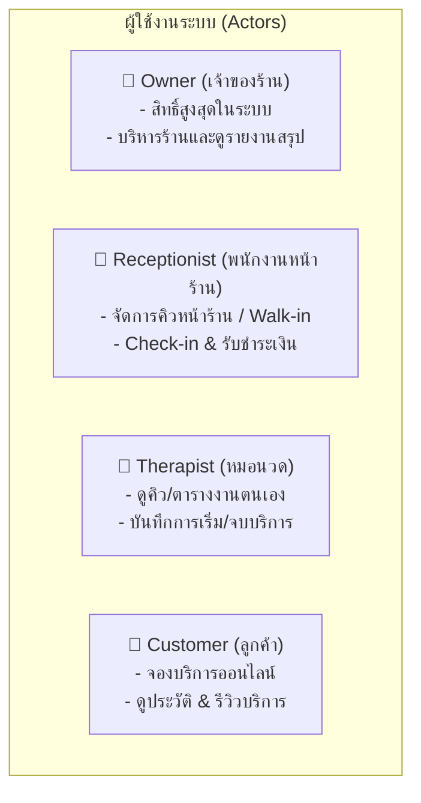
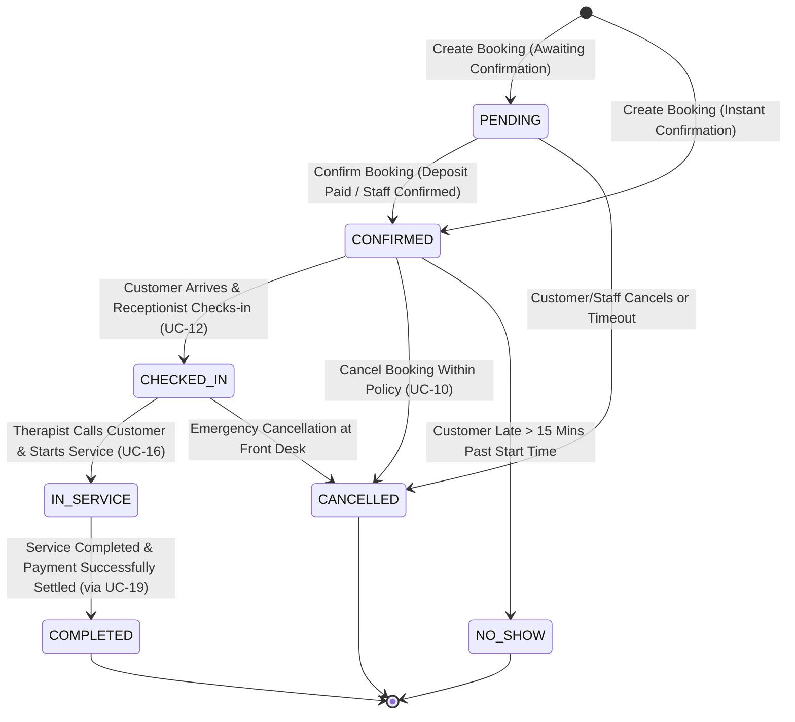
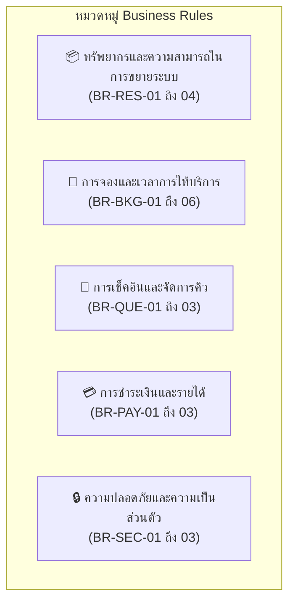

# FIWDEE Massage Management & Booking System
## Use Case Specification & Diagram Document

---

## 1. System Scope & Context (บริบทและขอบเขตของระบบ)

### 1.1 บทนำและบริบทของระบบ (Background & Context)
ระบบ **FIWDEE Massage Management & Booking System** เป็นระบบบริหารจัดการร้านนวดและระบบจองคิวออนไลน์ ออกแบบมาเพื่อเพิ่มประสิทธิภาพในการดำเนินงานของร้านนวด **FIWDEE Massage** ครอบคลุมกระบวนการตั้งแต่การจองบริการล่วงหน้าผ่านช่องทางออนไลน์, การรับลูกค้าหน้าร้าน (Walk-in), การจัดสรรคิวและทรัพยากร (ห้องนวดและหมอนวด), การติดตามสถานะการให้บริการ, การชำระเงิน, ไปจนถึงการประเมินความพึงพอใจและรายงานผลประกอบการ

> [!IMPORTANT]
> **หลักการออกแบบการขยายระบบ (Scalability & Dynamic Resource Principle):**
> ปัจจุบันร้าน FIWDEE Massage มี 6 ห้องนวด และมีหมอนวด Standby ต่อวันไม่เกิน 6 คน **ตัวเลขดังกล่าวเป็นเพียงข้อมูลเริ่มต้นของการดำเนินงานในปัจจุบันเท่านั้น** ระบบได้รับการออกแบบให้ทรัพยากร (ห้องนวด, หมอนวด, พนักงาน, บริการ) เป็น **Dynamic Resource Entities** ที่สามารถเพิ่ม ลด แก้ไข หรือปรับเปลี่ยนสถานะการเปิด/ปิดใช้งานได้ตลอดเวลา โดย**ไม่มีการ Hard-code** ค่าคงที่ (เช่น `MAX_ROOM = 6` หรือ `MAX_THERAPIST = 6`) ใน Business Logic หรือโครงสร้าง Use Case ใดๆ ทั้งสิ้น

---

### 1.2 ขอบเขตฟังก์ชันของระบบ (System Scope)
ระบบครอบคลุมฟังก์ชันการทำงานหลักดังต่อไปนี้:
1. **การจองบริการนวด (Booking Management):** จองออนไลน์ล่วงหน้า และจองหน้าร้าน/ทางโทรศัพท์ ตรวจสอบเวลาว่างแบบเรียลไทม์
2. **การจัดการทรัพยากรห้องนวด (Room Management):** จัดการสถานะห้องนวด (Active / Maintenance / Inactive) และจัดสรรห้องให้สอดคล้องกับประเภทบริการ
3. **การจัดการหมอนวดและตารางงาน (Therapist & Schedule Management):** จัดการโปรไฟล์ ทักษะความเชี่ยวชาญ (Skills/Services) กะการทำงาน (Work Shifts) และวันลา
4. **การจัดการคิวและลูกค้าหน้าร้าน (Queue & Front-Desk Management):** การ Check-in, เรียกคิว, จัดการคิวแทรก, และการโอนย้ายคิว
5. **การดำเนินงานระหว่างให้บริการ (In-Service Lifecycle):** การบันทึกอาการ/ข้อควรระวังของลูกค้า, การเริ่มบริการ (Start Service), และการจบบริการ (Complete Service)
6. **การคิดเงินและชำระเงิน (Payment & Billing):** รองรับเงินสด, QR PromptPay, บัตรเครดิต, การออกใบเสร็จรับเงิน และบันทึกประวัติธุรกรรม
7. **การจัดการลูกค้าและข้อมูลส่วนบุคคล (Customer Management):** จัดเก็บข้อมูลลูกค้า ประวัติการรับบริการ ข้อจำกัดทางสุขภาพ/ตำแหน่งที่เน้นเป็นพิเศษ
8. **การประเมินและการรีวิว (Review & Rating):** ให้คะแนนและข้อเสนอแนะหลังรับบริการเสร็จสิ้น
9. **การบริหารสิทธิ์และผู้ใช้งาน (User & Role Management):** ควบคุมสิทธิ์การเข้าถึงข้อมูลตามบทบาท (RBAC)
10. **รายงานและภาพรวมเชิงธุรกิจ (Dashboard & Reports):** แสดงยอดขาย รายได้รวม ค่าคอมมิชชันหมอนวด สถิติการใช้งานห้อง และรายงานสรุปสำหรับเจ้าของร้าน

---

## 2. Actors & Roles (บทบาทและสิทธิ์ของผู้ใช้งาน)

ระบบกำหนด Actor ออกเป็น 4 กลุ่มหลักที่มีขอบเขตหน้าที่ (Responsibilities) และขอบเขตการเข้าถึงข้อมูล (Data Access Boundaries) ที่ชัดเจน:

### 2.1 Owner (เจ้าของร้าน)
* **บทบาท:** ผู้บริหารสูงสุดของร้าน (Super Administrator)
* **ความรับผิดชอบ:**
  * เข้าถึง Dashboard สรุปผลประกอบการ ยอดขาย และตัวชี้วัดประสิทธิภาพของร้าน
  * จัดการข้อมูลร้าน เวลาเปิด-ปิด และนโยบายการให้บริการ
  * จัดการห้องนวด (เพิ่ม, แก้ไข, ปิดปรับปรุงห้อง)
  * จัดการรายการบริการนวดและโครงสร้างราคา (Service Catalog & Pricing)
  * จัดการข้อมูลหมอนวด ทักษะความเชี่ยวชาญ และตารางกะการทำงาน (Shift Scheduling)
  * จัดการบัญชีผู้ใช้งาน สิทธิ์การเข้าถึง (Roles & Permissions) ของพนักงานทุกคน
  * เรียกดูและจัดการ Booking ทั้งหมดในระบบ (รวมถึงการ Override/Reassign ห้องหรือหมอนวด)
  * ดูรายงานสรุปรายได้ รายงานภาษี และค่าคอมมิชชันของหมอนวด

### 2.2 Receptionist (พนักงานหน้าร้าน)
* **บทบาท:** ผู้ปฏิบัติการหน้าร้านและประสานงานคิวบริการ (Front-Desk Operator)
* **ความรับผิดชอบ:**
  * ค้นหาและลงทะเบียนข้อมูลลูกค้าใหม่ (Walk-in / Phone In)
  * สร้าง Booking สำหรับลูกค้า Walk-in หรือลูกค้าที่โทรมาจอง
  * ตรวจสอบสถานะความพร้อมของห้องนวดและหมอนวดประจำวันแบบเรียลไทม์
  * ดำเนินการ Check-in ลูกค้าเมื่อมาถึงร้าน และจัดลำดับคิวเข้ารับบริการ
  * เปลี่ยนสถานะการจองตามขั้นตอนที่ได้รับอนุญาต (Confirmed, Checked-in, No-show, Cancelled)
  * รับชำระเงิน (Process Payment) และออกใบเสร็จรับเงิน/หลักฐานการชำระเงิน
  * ดูประวัติการจองและธุรกรรมการชำระเงินเฉพาะที่เกี่ยวข้องกับงานหน้าร้าน
* **ข้อจำกัดความปลอดภัย:** ไม่สามารถเข้าถึงข้อมูลการตั้งค่าระบบ บัญชีผู้ใช้ของพนักงาน หรือรายงานการเงินระดับบริหารของ Owner ได้

### 2.3 Therapist (หมอนวด)
* **บทบาท:** ผู้ให้บริการนวดแก่ลูกค้า (Service Provider)
* **ความรับผิดชอบ:**
  * ดูข้อมูลโปรไฟล์และสถานะการทำงานของตนเอง
  * ดูตารางงาน (Work Schedule), กะการทำงาน และวันหยุดของตนเอง
  * ดูรายการ Booking และลำดับคิวบริการที่ตนเองได้รับมอบหมาย
  * ดูข้อมูลความต้องการของลูกค้าและข้อควรระวังทางสุขภาพ (Customer Service Notes) ที่จำเป็นต่อการนวด
  * อัปเดตสถานะการให้บริการ: เริ่มบริการ (`IN_SERVICE`) และจบบริการ (`COMPLETED`)
  * ดูประวัติการให้บริการและสถิติรายได้/ค่าคอมมิชชันของตนเอง
* **ข้อจำกัดความปลอดภัย:** ไม่สามารถดูข้อมูลลูกค้าของ Therapist ท่านอื่น ไม่สามารถดูยอดรายได้รวมของร้าน และไม่สามารถแก้ไขข้อมูลเชิงบริหารได้

### 2.4 Customer (ลูกค้า)
* **บทบาท:** ผู้รับบริการ (End Customer)
* **ความรับผิดชอบ:**
  * สมัครสมาชิกและเข้าสู่ระบบ (Self Registration & Login)
  * เรียกดูข้อมูลร้าน รายการบริการนวด รายละเอียด ระยะเวลา และราคา
  * เรียกดูโปรไฟล์หมอนวด และตรวจสอบช่วงเวลาว่าง (Available Time Slots)
  * สร้างรายการจองบริการ (Create Booking) ด้วยตนเอง
  * ตรวจสอบสถานะการจอง และยกเลิกการจองตามเงื่อนไขเวลาที่ร้านกำหนด (Cancellation Policy)
  * ดูประวัติการจอง ประวัติการรับบริการ และหลักฐานการชำระเงินของตนเอง
  * เขียนรีวิวและให้คะแนนความพึงพอใจหลังรับบริการเสร็จสิ้น (`Submit Review`)
* **ข้อจำกัดความปลอดภัย:** เข้าถึงได้เฉพาะข้อมูลส่วนตัวและประวัติของตนเองเท่านั้น ไม่สามารถเห็นข้อมูลของลูกค้ารายอื่นได้โดยเด็ดขาด

---

## 3. Actor–Use Case Relationship Matrix (ตารางความสัมพันธ์ Actor และ Use Case)

| รหัส Use Case | ชื่อ Use Case (Use Case Name) | Customer | Receptionist | Therapist | Owner | ประเภทความสัมพันธ์ |
| :--- | :--- | :---: | :---: | :---: | :---: | :--- |
| **UC-01** | Register Account | **Primary** | **Primary (Walk-in)** | - | - | - |
| **UC-02** | Authenticate / Login | **Primary** | **Primary** | **Primary** | **Primary** | - |
| **UC-03** | View / Edit Profile | **Primary** | **Primary** | **Primary** | **Primary** | - |
| **UC-04** | View Shop Information | **Primary** | Supporting | Supporting | Supporting | - |
| **UC-05** | View Services & Pricing | **Primary** | Supporting | Supporting | Supporting | - |
| **UC-06** | View Therapist Profiles | **Primary** | Supporting | Supporting | Supporting | - |
| **UC-07** | Create Booking | **Primary** | **Primary** | - | Supporting | `<<include>>` UC-08 |
| **UC-08** | Check Resource Availability | Supporting | Supporting | - | Supporting | `<<include>>` UC-08a, 08b, 08c |
| **UC-08a**| Check Room Availability | Supporting | Supporting | - | Supporting | Included by UC-08 |
| **UC-08b**| Check Therapist Availability | Supporting | Supporting | - | Supporting | Included by UC-08 |
| **UC-08c**| Validate Booking Time & Overlap | Supporting | Supporting | - | Supporting | Included by UC-08 |
| **UC-09** | View Bookings & Schedule | **Primary (My)** | **Primary (Daily)**| **Primary (My)** | **Primary (All)** | - |
| **UC-10** | Cancel Booking | **Primary** | **Primary** | - | **Primary** | `<<include>>` UC-14 |
| **UC-11** | Search Customer | - | **Primary** | - | Supporting | - |
| **UC-12** | Check-in Customer | - | **Primary** | - | Supporting | `<<include>>` UC-14 |
| **UC-13** | Manage Daily Queue | - | **Primary** | - | Supporting | - |
| **UC-14** | Update Booking Status | - | **Primary** | Supporting | **Primary** | Included by UC-10, UC-12 |
| **UC-15** | View Customer Service Notes | - | Supporting | **Primary** | Supporting | - |
| **UC-16** | Start Service | - | Supporting | **Primary** | Supporting | - |
| **UC-17** | Complete Service | - | Supporting | **Primary** | Supporting | - |
| **UC-18** | Submit Review & Rating | **Primary** | - | - | - | `<<extend>>` UC-17 |
| **UC-19** | Process Payment | Supporting | **Primary** | - | **Primary** | `<<include>>` UC-19a, 19b |
| **UC-19a**| Validate Payment Amount | Supporting | Supporting | - | Supporting | Included by UC-19 |
| **UC-19b**| Record Payment Transaction | Supporting | Supporting | - | Supporting | Included by UC-19 |
| **UC-20** | View Payment History / Receipts | **Primary (My)** | **Primary (Shop)** | - | **Primary (All)** | - |
| **UC-21** | View Therapist Earnings | - | - | **Primary** | Supporting | - |
| **UC-22** | View Business Dashboard & Reports | - | - | - | **Primary** | - |
| **UC-23** | Manage Shop Profile & Hours | - | - | - | **Primary** | - |
| **UC-24** | Manage Rooms (Add/Edit/Disable) | - | - | - | **Primary** | - |
| **UC-25** | Manage Services & Pricing | - | - | - | **Primary** | - |
| **UC-26** | Manage Therapist Profiles & Skills | - | - | - | **Primary** | - |
| **UC-27** | Manage Therapist Work Schedules | - | - | - | **Primary** | - |
| **UC-28** | Manage Staff Accounts & Roles | - | - | - | **Primary** | - |

---

## 4. Use Case Diagram (แผนภาพ Use Case)

### 4.1 แผนภาพ Use Case แบบ Mermaid

```mermaid
graph LR
    subgraph "FIWDEE Massage Management & Booking System"
        subgraph "1. Authentication & Account"
            UC_Reg["UC-01: Register Account"]
            UC_Log["UC-02: Authenticate / Login"]
            UC_Prof["UC-03: View / Edit Profile"]
        end

        subgraph "2. Service Catalog & Shop Info"
            UC_Shop["UC-04: View Shop Information"]
            UC_Srv["UC-05: View Services & Pricing"]
            UC_ThProf["UC-06: View Therapist Profiles"]
        end

        subgraph "3. Core Booking & Availability"
            UC_Bk["UC-07: Create Booking"]
            UC_Avail["UC-08: Check Resource Availability"]
            UC_RmAvail["UC-08a: Check Room Availability"]
            UC_ThAvail["UC-08b: Check Therapist Availability"]
            UC_TimeVal["UC-08c: Validate Booking Time"]
            UC_VwBk["UC-09: View Bookings & Schedule"]
            UC_Cancel["UC-10: Cancel Booking"]
        end

        subgraph "4. Front-Desk Operations & Queue"
            UC_Search["UC-11: Search Customer"]
            UC_CheckIn["UC-12: Check-in Customer"]
            UC_Queue["UC-13: Manage Daily Queue"]
            UC_UpStatus["UC-14: Update Booking Status"]
        end

        subgraph "5. Service Execution"
            UC_Notes["UC-15: View Customer Service Notes"]
            UC_Start["UC-16: Start Service"]
            UC_Comp["UC-17: Complete Service"]
            UC_Rev["UC-18: Submit Review & Rating"]
        end

        subgraph "6. Billing & Payment Management"
            UC_Pay["UC-19: Process Payment"]
            UC_ValPay["UC-19a: Validate Payment Amount"]
            UC_RecPay["UC-19b: Record Payment Transaction"]
            UC_VwPay["UC-20: View Payment History / Receipts"]
            UC_Earn["UC-21: View Therapist Earnings"]
        end

        subgraph "7. Administration & Configuration"
            UC_Dash["UC-22: View Dashboard & Reports"]
            UC_MShop["UC-23: Manage Shop Profile & Hours"]
            UC_MRoom["UC-24: Manage Rooms (Add/Edit/Disable)"]
            UC_MSrv["UC-25: Manage Services & Pricing"]
            UC_MTh["UC-26: Manage Therapist Profiles & Skills"]
            UC_MSch["UC-27: Manage Therapist Work Schedules"]
            UC_MUser["UC-28: Manage Staff Accounts & Roles"]
        end
    end

    %% Includes & Extends
    UC_Bk -.->|<<include>>| UC_Avail
    UC_Avail -.->|<<include>>| UC_RmAvail
    UC_Avail -.->|<<include>>| UC_ThAvail
    UC_Avail -.->|<<include>>| UC_TimeVal
    UC_CheckIn -.->|<<include>>| UC_UpStatus
    UC_Cancel -.->|<<include>>| UC_UpStatus
    UC_Pay -.->|<<include>>| UC_ValPay
    UC_Pay -.->|<<include>>| UC_RecPay
    UC_Rev -.->|<<extend>>| UC_Comp

    %% Actors
    Customer((Customer))
    Receptionist((Receptionist))
    Therapist((Therapist))
    Owner((Owner))

    %% Customer Connections
    Customer --- UC_Reg
    Customer --- UC_Log
    Customer --- UC_Prof
    Customer --- UC_Shop
    Customer --- UC_Srv
    Customer --- UC_ThProf
    Customer --- UC_Bk
    Customer --- UC_VwBk
    Customer --- UC_Cancel
    Customer --- UC_Rev
    Customer --- UC_VwPay

    %% Receptionist Connections
    Receptionist --- UC_Log
    Receptionist --- UC_Prof
    Receptionist --- UC_Reg
    Receptionist --- UC_Search
    Receptionist --- UC_Bk
    Receptionist --- UC_VwBk
    Receptionist --- UC_CheckIn
    Receptionist --- UC_Queue
    Receptionist --- UC_UpStatus
    Receptionist --- UC_Pay
    Receptionist --- UC_VwPay
    Receptionist --- UC_Cancel

    %% Therapist Connections
    Therapist --- UC_Log
    Therapist --- UC_Prof
    Therapist --- UC_VwBk
    Therapist --- UC_Notes
    Therapist --- UC_Start
    Therapist --- UC_Comp
    Therapist --- UC_Earn

    %% Owner Connections
    Owner --- UC_Log
    Owner --- UC_Dash
    Owner --- UC_MShop
    Owner --- UC_MRoom
    Owner --- UC_MSrv
    Owner --- UC_MTh
    Owner --- UC_MSch
    Owner --- UC_MUser
    Owner --- UC_VwBk
    Owner --- UC_VwPay
```

### 4.2 ไฟล์ต้นฉบับและรูปภาพ Diagram
* ไฟล์นิยาม PlantUML: [use-case-diagram.puml](file:///C:/Users/Viphu/Desktop/University/PrinciplesOfSoftwareDesign/FIWDEE-CP353002-69_1PrinciplesOfSoftwareDesign/doc/diagrams/use-case-diagram.puml)
* ไฟล์รูปภาพ UML Diagram: [use-case-diagram.png](file:///C:/Users/Viphu/Desktop/University/PrinciplesOfSoftwareDesign/FIWDEE-CP353002-69_1PrinciplesOfSoftwareDesign/img/use-case-diagram.png)

---

### 4.3 เหตุผลความสัมพันธ์ `<<include>>` และ `<<extend>>`

1. **`UC-07 Create Booking` `<<include>>` `UC-08 Check Resource Availability`**
   * **เหตุผล:** ในทุกครั้งที่มีการสร้าง Booking ระบบจำเป็นต้องตรวจสอบความพร้อมของทรัพยากร (ห้อง, หมอนวด, เวลาทำการ) เสมออย่างหลีกเลี่ยงไม่ได้ หากไม่ตรวจสอบจะไม่สามารถสร้าง Booking ที่ถูกต้องได้
2. **`UC-08 Check Resource Availability` `<<include>>` `UC-08a, 08b, 08c`**
   * **เหตุผล:** การตรวจสอบความพร้อมของระบบประกอบด้วย 3 มิติที่เป็นอิสระต่อกัน (ห้องว่าง, หมอนวดว่างและมีทักษะตรง, เวลาเปิดทำการและไม่ทับซ้อน) ซึ่งต้องประมวลผลร่วมกัน
3. **`UC-12 Check-in Customer` `<<include>>` `UC-14 Update Booking Status`**
   * **เหตุผล:** เมื่อลูกค้ามาถึงและพนักงานกด Check-in ระบบต้องเปลี่ยนสถานะ Booking จาก `CONFIRMED` เป็น `CHECKED_IN` เสมอ เพื่อนำเข้าคิวรอรับบริการ
4. **`UC-19 Process Payment` `<<include>>` `UC-19a Validate Payment Amount` และ `UC-19b Record Payment Transaction`**
   * **เหตุผล:** การตัดยอดชำระเงินทุกครั้งต้องมีการตรวจสอบความถูกต้องของยอดเงินตามราคาบริการ และบันทึกหลักฐานการทำธุรกรรม (Payment Transaction Audit Log) เสมอ
5. **`UC-18 Submit Review & Rating` `<<extend>>` `UC-17 Complete Service`**
   * **เหตุผล:** การรีวิวเป็นพฤติกรรมเสริม (Optional Extension) ที่จะเกิดขึ้นได้ก็ต่อเมื่อ Booking นั้นมีสถานะเป็น `COMPLETED` เท่านั้น (Extension Point: After Service Completed) ลูกค้าอาจเลือกรีวิวหรือไม่รีวิวก็ได้
6. **`UC-10 Cancel Booking` `<<include>>` `UC-14 Update Booking Status`**
   * **เหตุผล:** ในการยกเลิกการจองทุกครั้ง ระบบจำเป็นต้องเรียกใช้ `UC-14` เพื่อตรวจสอบเงื่อนไขและเปลี่ยนสถานะของ Booking เป็น `CANCELLED` อย่างสมบูรณ์และปลดล็อกทรัพยากรกลับคืนระบบ จึงเป็นความสัมพันธ์แบบ `<<include>>` ที่เป็นพฤติกรรมบังคับและนำกลับมาใช้ซ้ำ (Required reusable behavior)

---

## 5. Booking Lifecycle & Status State Transitions (วงจรชีวิตและสถานะของ Booking)

สถานะของ Booking ในระบบถูกออกแบบตามหลัก Business Logic ของร้านนวดจริง โดยมี 7 สถานะดังนี้:

### 5.1 ตารางนิยามสถานะและสิทธิ์การเปลี่ยนสถานะ (Booking State Transition Table)

| สถานะ (Status) | คำอธิบายความหมายทางธุรกิจ | สถานะถัดไปที่เป็นไปได้ | ผู้มีสิทธิ์เปลี่ยนสถานะ (Authorized Actors) | เงื่อนไขทางธุรกิจ (Business Rules) |
| :--- | :--- | :--- | :--- | :--- |
| **`PENDING`** | การจองถูกสร้างขึ้นแล้วและทรัพยากร (ห้อง/หมอนวด) ถูกล็อก (Reserved/Locked) เพื่อรอการยืนยันหรือมัดจำ | `CONFIRMED`, `CANCELLED` | Customer, Receptionist, Owner, System | • **เปลี่ยนเป็น `CONFIRMED`:** เมื่อลูกค้าชำระเงินมัดจำล่วงหน้าสำเร็จ หรือ พนักงาน (Receptionist/Owner) ตรวจสอบและกดยืนยันการจองในระบบ • **เปลี่ยนเป็น `CANCELLED`:** เมื่อลูกค้า/พนักงานกดยกเลิก หรือหมดเวลาชำระมัดจำ (Timeout) • ถือเป็น Active Booking สำหรับตรวจสอบ Resource Conflict |
| **`CONFIRMED`** | การจองได้รับการยืนยัน จัดสรรห้องและหมอนวดในระบบแล้ว | `CHECKED_IN`, `CANCELLED`, `NO_SHOW` | Receptionist, Customer (Cancel only), Owner | ลูกค้ายกเลิกได้ล่วงหน้าอย่างน้อย 2 ชั่วโมงก่อนเวลาเริ่ม |
| **`CHECKED_IN`** | ลูกค้ามาถึงหน้าร้านแล้ว กำลังรอเรียกเข้าห้องนวดตามคิว | `IN_SERVICE`, `CANCELLED` | Receptionist, Therapist, Owner | หมอนวดหรือพนักงานกดเริ่มบริการเมื่อพร้อม |
| **`IN_SERVICE`** | ลูกค้ากำลังรับบริการนวดอยู่ในห้องนวด | `COMPLETED` | Therapist, Receptionist, Owner | ห้องนวดและหมอนวดอยู่ในสถานะ Busy |
| **`COMPLETED`** | การให้บริการเสร็จสิ้นและชำระเงินเรียบร้อยแล้ว (Payment Settled) | *End State* | Receptionist, Owner | ปลดล็อกห้องและหมอนวด, เปิดสิทธิ์ให้ลูกค้ารีวิวผ่าน UC-18 |
| **`CANCELLED`** | การจองถูกยกเลิกก่อนเริ่มบริการ | *End State* | Customer, Receptionist, Owner | ปลดล็อกเวลาของห้องและหมอนวดกลับคืนสู่ระบบ |
| **`NO_SHOW`** | ลูกค้าไม่มาแสดงตัวตามนัดหมายเกินเวลาที่กำหนด | *End State* | Receptionist, Owner, System Auto | เลยเวลานัด 15 นาทีโดยไม่มีการติดต่อ |

---

## 6. Dynamic Resource & Scalability Architecture (สถาปัตยกรรมการจัดการทรัพยากร)

### 6.1 ทรัพยากรห้องนวด (Room as a Scalable Resource)
* ห้องนวดแต่ละห้องเป็นแถวข้อมูลในตารางทรัพยากร (Entity) ประกอบด้วย:
  * `roomId`, `roomNumber`, `roomType` (Single, Couple, VIP, Foot Massage Area), `capacity`, `isActive`, `status` (Available, Occupied, Cleaning/Maintenance)
* **กฎการคำนวณความพร้อมของห้อง (Room Availability Logic):**
  $$\text{RoomAvailable}(r, t_{start}, t_{end}) \iff r.isActive = \text{true} \land \nexists b \in \text{Bookings}(r) : \text{Overlap}(b.timeSlot, [t_{start}, t_{end} + t_{buffer}])$$
  โดยที่ $t_{buffer}$ คือเวลาทำความสะอาดห้องหลังบริการ (ค่าเริ่มต้น 15 นาที ตามคุณลักษณะ `Room.cleaningBufferMinutes`)

### 6.2 ทรัพยากรหมอนวด (Therapist as a Scalable Resource)
* หมอนวดแต่ละคนเป็น Entity ประกอบด้วย:
  * `therapistId`, `fullName`, `specialties` (รายการ Service ที่มีความชำนาญ), `isActive`, `workSchedule` (ตารางกะรายวัน)
* **กฎการคำนวณความพร้อมของหมอนวด (Therapist Availability Logic):**
  $$\text{TherapistAvailable}(th, s, t_{start}, t_{end}) \iff th.isActive = \text{true} \land s \in th.specialties \land \text{IsOnDuty}(th, t_{start}, t_{end}) \land \nexists b \in \text{Bookings}(th) : \text{Overlap}(b.timeSlot, [t_{start}, t_{end}])$$

### 6.3 กลไกป้องกันการจองซ้อน (Concurrency & Conflict Prevention)
* การจัดสรรช่วงเวลา (Slot Booking) ต้องผ่านการตรวจสอบแบบ Atomic / Database Lock หรือ Optimistic Concurrency Control เพื่อป้องกันกรณีที่ลูกค้าสองคนกดจองหมอนวดหรือห้องเดียวกันในเสี้ยววินาทีเดียวกัน

---

## 7. Detailed Use Case Descriptions (รายละเอียด Use Case ที่สำคัญ)

---

### UC-01: Register Account (การลงทะเบียนบัญชีผู้ใช้งาน)

**Primary Actor:** Customer, Receptionist (ลงทะเบียนให้ลูกค้า Walk-in)  
**Supporting Actor:** System  
**Goal:** สร้างบัญชีผู้ใช้งานใหม่ในระบบเพื่อเข้าถึงการจองและประวัติบริการ  
**Preconditions:** ผู้ใช้มีอุปกรณ์เชื่อมต่อเครือข่ายอินเทอร์เน็ต  
**Trigger:** ผู้ใช้เลือก "Register Account" หรือ Receptionist เลือก "Register Customer"  

**Main Success Flow:**
1. ผู้ใช้ (หรือ Receptionist) เข้าสู่หน้าลงทะเบียน
2. ระบบแสดงแบบฟอร์มลงทะเบียน (ชื่อ-นามสกุล, เบอร์โทรศัพท์, อีเมล, รหัสผ่าน, ข้อมูลสุขภาพเบื้องต้น/ข้อควรระวัง)
3. ผู้ใช้กรอกข้อมูลครบถ้วนและกดยืนยัน
4. ระบบตรวจสอบความถูกต้องของข้อมูล (รูปแบบอีเมล, เบอร์โทรศัพท์ไม่ซ้ำในระบบ)
5. ระบบบันทึกข้อมูลผู้ใช้ใหม่ กำหนด Role เป็น `CUSTOMER`
6. ระบบนำผู้ใช้เข้าสู่ระบบพร้อมใช้งาน

**Alternative Flows:**
* **A1. Receptionist ลงทะเบียนให้ลูกค้า Walk-in แบบเร่งด่วน:** Receptionist กรอกเพียงชื่อและเบอร์โทรศัพท์ -> ระบบสร้างบัญชี Customer ทันทีเพื่อนำไปสร้าง Booking ต่อได้

**Exception Flows:**
* **E1. ข้อมูลลงทะเบียนซ้ำ:** หากเบอร์โทรศัพท์หรืออีเมลมีอยู่ในระบบแล้ว ระบบแจ้งเตือนข้อผิดพลาดและแนะนำให้เข้าสู่ระบบหรือกู้คืนรหัสผ่าน

**Postconditions:**
* บัญชีผู้ใช้ใหม่ถูกสร้างและบันทึกลงในระบบ

**Business Rules:**
* เบอร์โทรศัพท์และอีเมลต้องไม่ซ้ำกันในระบบ

---

### UC-02: Authenticate / Login (การเข้าสู่ระบบและยืนยันตัวตน)

**Primary Actor:** Customer, Receptionist, Therapist, Owner  
**Supporting Actor:** System  
**Goal:** ยืนยันตัวตนเพื่อเข้าใช้งานระบบตามสิทธิ์และหน้าที่ของตนเอง (Role-Based Access)  
**Preconditions:** ผู้ใช้มีบัญชีที่ Active อยู่ในระบบ  
**Trigger:** ผู้ใช้เปิดหน้าเว็บ/แอปพลิเคชัน และเลือก Login  

**Main Success Flow:**
1. ผู้ใช้ระบุ Username/Email/Phone และ Password
2. ระบบตรวจสอบความถูกต้องของข้อมูลประจำตัวและสถานะของบัญชี (`isActive = true`)
3. ระบบตรวจสอบ Role ของผู้ใช้ และนำทางไปยังหน้าจอหลักตามสิทธิ์ (Owner Dashboard, Front-Desk Queue, Therapist Schedule, หรือ Customer Booking Page)

**Alternative Flows:**
* **A1. เข้าสู่ระบบด้วย OTP:** ผู้ใช้เลือกล็อกอินด้วยเบอร์โทรศัพท์ -> ระบบส่งรหัส OTP -> ผู้ใช้กรอก OTP ถูกต้อง -> ระบบอนุญาตให้เข้าใช้งาน

**Exception Flows:**
* **E1. รหัสผ่านไม่ถูกต้อง:** ระบบแจ้งเตือน "ข้อมูลเข้าสู่ระบบไม่ถูกต้อง" และบันทึก Failed Attempt (หากผิดเกิน 5 ครั้งจะระงับชั่วคราว 15 นาที)

**Postconditions:**
* ผู้ใช้ได้รับการยืนยันตัวตนและได้รับ Security Token / Session ตาม Role

**Business Rules:**
* การเข้าถึงฟังก์ชันต่างๆ ถูกควบคุมอย่างเข้มงวดด้วย Role-Based Access Control (RBAC)

---

### UC-07: Create Booking (การสร้างการจองบริการนวด - Core Use Case)

**Primary Actor:** Customer, Receptionist  
**Supporting Actor:** Therapist, Owner (View/Override), System  
**Goal:** สร้างรายการจองบริการนวดล่วงหน้าหรือหน้าร้าน โดยระบุบริการ วันเวลา ห้องนวด และหมอนวดที่พร้อมให้บริการโดยไม่มีความขัดแย้งของเวลา  
**Preconditions:**
* Customer เข้าสู่ระบบแล้ว หรือ Receptionist กำลังสร้างการจองให้ลูกค้า
* บริการที่เลือกต้องมีสถานะ Active
* มีห้องนวดและหมอนวดที่ Active ในระบบ  

**Trigger:** Actor เลือก "จองบริการนวด" (Book Now / Create Booking)  

**Main Success Flow:**
1. Actor เลือกบริการนวดที่ต้องการจากรายการบริการที่เปิดใช้งาน (เช่น นวดแผนไทย, นวดอโรมา, นวดเท้า)
2. Actor เลือกระยะเวลาการนวด (เช่น 60 นาที, 90 นาที, 120 นาที)
3. Actor เลือกวันที่ต้องการรับบริการ
4. ระบบเรียกใช้ `UC-08 Check Resource Availability` เพื่อคำนวณช่วงเวลาที่ร้านเปิดทำการและมีทรัพยากรว่าง
5. ระบบแสดงตารางช่วงเวลาว่าง (Available Time Slots)
6. Actor เลือกช่วงเวลาที่ต้องการ
7. Actor เลือกหมอนวดที่ต้องการ หรือเลือก "ไม่ระบุหมอนวด (ให้ระบบจัดสรรหมอนวดที่ว่างให้อัตโนมัติ)"
8. หากลูกค้าระบุข้อมูลเพิ่มเติม (เช่น เน้นบ่าไหล่, มีอาการปวดหลัง, สตรีมีครรภ์) Actor ทำการบันทึกลงในช่อง Note
9. ระบบทำการตรวจสอบ Resource Conflict ซ้ำในขั้นตอนสุดท้าย (Locking Check)
10. ระบบจัดสรรห้องนวดที่เหมาะสมกับประเภทบริการและว่างในช่วงเวลาดังกล่าว
11. Actor ตรวจสอบข้อมูลสรุปการจอง (บริการ, วันเวลา, หมอนวด, ห้อง, ราคารวม) และกดยืนยันการจอง
12. ระบบสร้างข้อมูล Booking บันทึกลงฐานข้อมูล และกำหนดสถานะเริ่มต้นเป็น `CONFIRMED` (หรือ `PENDING` โดยที่ทรัพยากรห้องและหมอนวดถูกล็อก/Reserved ไว้แล้วเพื่อรอการยืนยันหรือชำระมัดจำ)
13. ระบบแสดงหน้าจอยืนยันการจองพร้อมรหัส Booking Reference Code และส่ง Notification แจ้งเตือน

**Alternative Flows:**
* **A1. ลูกค้าไม่ระบุหมอนวด:** ระบบทำการค้นหาหมอนวดที่มีทักษะตรงกับบริการและว่างในช่วงเวลานั้นตามลำดับคิว (Round-Robin หรือคิวที่มีงานน้อยสุดในวันนั้น)
* **A2. จองบริการสำหรับ 2 ท่านพร้อมกัน (Couple/Group):** Actor เลือกระบุ 2 ท่าน -> ระบบตรวจสอบห้องแบบ Double Room และหมอนวดว่าง 2 ท่านพร้อมกัน
* **A3. Receptionist สร้าง Booking ลูกค้า Walk-in:** Receptionist เลือกลูกค้าในระบบ -> เลือกเวลาปัจจุบัน (Instant Slot) -> ระบบจัดสรรคิวทันที

**Exception Flows:**
* **E1. ช่วงเวลาที่เลือกถูกจองตัดหน้า:** มีผู้ใช้อื่นยืนยันการจองช่วงเวลาเดียวกันก่อนในระดับมิลลิวินาที -> ระบบแจ้งเตือน "ขออภัย ช่วงเวลาดังกล่าวเพิ่งถูกจองไป กรุณาเลือกช่วงเวลาใหม่" และรีเฟรชตารางเวลาว่าง
* **E2. ไม่มีห้องนวดที่ตรงกับประเภทบริการว่าง:** ทุกห้องที่รองรับบริการนี้ไม่ว่าง -> ระบบแจ้งเตือนและแนะนำช่วงเวลาที่ห้องจะว่างถัดไป
* **E3. หมอนวดที่เลือกติดภารกิจกะทันหัน/ลาป่วย:** ระบบแจ้งเตือนว่าหมอนวดไม่พร้อมให้บริการ และแสดงรายชื่อหมอนวดท่านอื่นที่ว่างและเชี่ยวชาญบริการเดียวกัน

**Postconditions:**
* มีเรคคอร์ด Booking ใหม่ในระบบพร้อมสถานะที่ถูกต้อง (`CONFIRMED` หรือ `PENDING`)
* ทรัพยากรห้องนวดและหมอนวดถูกล็อก (Reserved/Locked) ป้องกันการจองซ้ำซ้อนสำหรับสถานะ Active ทั้งหมด
* Booking ปรากฏในตารางคิวของ Receptionist, ตารางงานของ Therapist, และประวัติการจองของ Customer

**Business Rules:**
* **BR-BKG-01:** ห้ามจัดสรรหมอนวดคนเดียวกันให้กับการจองที่มีช่วงเวลาทับซ้อนกันโดยเด็ดขาด
* **BR-BKG-02:** ห้ามจัดสรรห้องนวดห้องเดียวกันให้กับการจองที่มีช่วงเวลาทับซ้อนกัน รวมเวลาทำความสะอาดห้อง ($t_{buffer}$) 15 นาที
* **BR-BKG-03:** การคำนวณความพร้อมของทรัพยากรต้องดึงจาก Entity ที่ Active ในฐานข้อมูลจริง ไม่มีการจำกัดจำนวนคงที่ (No Hardcoded Limits)
* **BR-BKG-04:** การจองล่วงหน้าต้องทำก่อนเวลาเริ่มบริการอย่างน้อย 30 นาที

---

### UC-08: Check Resource Availability (การตรวจสอบความพร้อมของทรัพยากร)

**Primary Actor:** System (Sub-Use Case / Service Component)  
**Supporting Actor:** Customer, Receptionist, Owner  
**Goal:** คำนวณและส่งคืนรายการช่วงเวลาที่สามารถให้บริการได้ โดยอิงจากเวลาทำการของร้าน, ความพร้อมของห้องนวด, และตารางงานของหมอนวด  
**Preconditions:** มีข้อมูล Service, วันที่ที่ต้องการตรวจสอบ, และระยะเวลาของบริการ  
**Trigger:** ถูกเรียกใช้โดย `UC-07 Create Booking` หรือเมื่อผู้ใช้งานเปิดดูหน้าตารางเวลา  

**Main Success Flow:**
1. ระบบดึงเวลาเปิด-ปิดทำการของร้านในวันที่ระบุ (`Shop Operating Hours`)
2. ระบบย่อย `UC-08b` ตรวจสอบตารางงาน (Work Shifts) และการลาของหมอนวดทั้งหมดที่มีทักษะตรงกับบริการที่เลือก
3. ระบบย่อย `UC-08a` ตรวจสอบรายการห้องนวดทั้งหมดที่ Active และรองรับประเภทบริการดังกล่าว
4. ระบบย่อย `UC-08c` ดึงรายการ Booking ที่มีสถานะ Active ได้แก่ `PENDING`, `CONFIRMED`, `CHECKED_IN`, และ `IN_SERVICE` ทั้งหมดในวันนั้น เพื่อนำมาตรวจสอบและป้องกันการจัดสรรห้องและหมอนวดซ้ำซ้อน (ส่วน `COMPLETED`, `CANCELLED`, `NO_SHOW` ไม่ถือเป็น Active Booking สำหรับ Resource Conflict)
5. ระบบนำข้อมูลทั้งหมดมาคำนวณหาช่วงเวลาที่:
   * ร้านเปิดให้บริการ
   * มีหมอนวดที่มีคุณสมบัติตรงว่างอย่างน้อย 1 คน ตลอดระยะเวลาของบริการ
   * มีห้องนวดที่เหมาะสมว่างอย่างน้อย 1 ห้อง ตลอดระยะเวลาของบริการ + เวลา Buffer สำหรับทำความสะอาด (15 นาที)
6. ระบบส่งคืนชุดข้อมูล Time Slots ที่พร้อมให้จองแก่ Actor

**Postconditions:**
* ระบบส่งคืนชุดข้อมูลเวลาว่างที่แม่นยำและเป็นปัจจุบันที่สุด

---

### UC-10: Cancel Booking (การยกเลิกการจอง)

**Primary Actor:** Customer, Receptionist, Owner  
**Supporting Actor:** Therapist, System  
**Goal:** ยกเลิกรายการจองบริการที่เคยสร้างไว้ และปลดล็อกทรัพยากร (ห้องและหมอนวด) กลับคืนสู่ระบบ  
**Preconditions:**
* Booking ต้องมีสถานะเป็น `PENDING` หรือ `CONFIRMED`
* ผู้ใช้ต้องเป็นเจ้าของ Booking (สำหรับ Customer) หรือเป็นเจ้าหน้าที่ (Receptionist/Owner)  

**Trigger:** Actor เลือก "ยกเลิกการจอง" (Cancel Booking)  

**Main Success Flow:**
1. Actor เลือกรายการ Booking ที่ต้องการยกเลิก
2. ระบบตรวจสอบเงื่อนไขเวลาในการยกเลิก:
   * หาก Customer เป็นผู้ยกเลิก: เวลาปัจจุบันต้องห่างจากเวลาเริ่มบริการไม่น้อยกว่า 2 ชั่วโมง (ตามนโยบายร้าน)
   * หาก Receptionist/Owner เป็นผู้ยกเลิก: สามารถยกเลิกได้ตามดุลยพินิจของร้าน
3. ระบบแสดงหน้าจอยืนยัน พร้อมให้ระบุเหตุผลในการยกเลิก
4. Actor ยืนยันการยกเลิก
5. ระบบเรียกใช้ `UC-14 Update Booking Status` เปลี่ยนสถานะ Booking เป็น `CANCELLED`
6. ระบบบันทึกเหตุผล ผู้ดำเนินการ และเวลาที่ยกเลิก
7. ระบบปลดล็อกห้องนวดและหมอนวดให้กลับมาว่างในระบบทันที
8. ระบบส่งการแจ้งเตือนยืนยันการยกเลิกไปยังลูกค้าและหมอนวดที่เกี่ยวข้อง

**Alternative Flows:**
* **A1. ยกเลิกโดยมีเงินมัดจำ/ชำระเงินล่วงหน้า:** หากมีนโยบายคืนเงิน ระบบจะส่งข้อมูลไปยังกระบวนการ Refund ตามเงื่อนไข

**Exception Flows:**
* **E1. ลูกค้ายกเลิกกระชั้นชิดเกินกำหนด (Late Cancellation):** หากเหลือน้อยกว่า 2 ชั่วโมง ระบบจะไม่อนุญาตให้ Customer กดยกเลิกเองผ่านระบบ และแนะนำให้ติดต่อร้านทางโทรศัพท์

**Postconditions:**
* สถานะ Booking เปลี่ยนเป็น `CANCELLED`
* ทรัพยากรห้องและหมอนวดพร้อมให้ผู้อื่นจองได้ทันที

---

### UC-12: Check-in Customer (การ Check-in ลูกค้าหน้าร้าน)

**Primary Actor:** Receptionist  
**Supporting Actor:** Customer, Therapist, Owner  
**Goal:** บันทึกการมาถึงของลูกค้าที่หน้าร้าน และนำเข้าสู่คิวรอรับบริการประจำวัน  
**Preconditions:**
* มี Booking ในระบบที่มีสถานะเป็น `CONFIRMED` สำหรับวันปัจจุบัน
* ลูกค้าเดินทางมาถึงร้าน  

**Trigger:** ลูกค้าแจ้งชื่อหรือแสดง Booking Reference Code ที่เคาน์เตอร์หน้าร้าน  

**Main Success Flow:**
1. Receptionist ค้นหา Booking ของลูกค้าด้วยชื่อ, เบอร์โทรศัพท์ หรือ Booking Code ผ่าน `UC-11 Search Customer`
2. ระบบแสดงข้อมูลการจอง รายละเอียดบริการ หมอนวด และห้องที่จัดสรรไว้
3. Receptionist ตรวจสอบความถูกต้องและสอบถามข้อมูลสุขภาพ/จุดเน้นย้ำเพิ่มเติมของลูกค้า
4. Receptionist กดยืนยัน "Check-in"
5. ระบบเรียกใช้ `UC-14 Update Booking Status` เปลี่ยนสถานะ Booking จาก `CONFIRMED` เป็น `CHECKED_IN`
6. ระบบบันทึกเวลา Check-in และนำคิวเข้าสู่ Daily Active Queue
7. ระบบส่งสัญญาณแจ้งเตือนไปยัง Therapist ที่ได้รับมอบหมายว่าลูกค้ามาถึงแล้วและพร้อมรับบริการ

**Alternative Flows:**
* **A1. ลูกค้ามาถึงก่อนเวลานัดเกิน 30 นาที:** ระบบแจ้งเตือนว่าไม่สามารถ Check-in ล่วงหน้าเกิน 30 นาทีได้ (ตามกฎ `BR-QUE-01`) โดยระบบจะยังไม่สร้าง QueueItem และไม่เปลี่ยนสถานะ Booking เป็น `CHECKED_IN` ลูกค้าต้องรอจนเข้าสู่ช่วงเวลาที่สามารถ Check-in ได้ ($\text{Current Time} \ge \text{Booking Time} - 30\text{ นาที}$) จึงจะสามารถดำเนินการ Check-in ตาม Flow ปกติได้
* **A2. เปลี่ยนหมอนวด/ห้องหน้างานตามคำขอ:** Receptionist สามารถเลือกเปลี่ยนหมอนวดหรือห้องว่างอื่นที่พร้อมบริการได้ก่อนกดยืนยัน Check-in

**Exception Flows:**
* **E1. ลูกค้ามาสายเกิน 15 นาทีโดยไม่แจ้งล่วงหน้า:** ระบบแสดงตัวเลือกให้ Receptionist พิจารณาว่า "ยืนยันให้บริการ (อาจปรับลดเวลานวด)" หรือ "เปลี่ยนสถานะเป็น NO_SHOW"

**Postconditions:**
* Booking เปลี่ยนสถานะเป็น `CHECKED_IN`
* คิวปรากฏในหน้าคิวของ Therapist พร้อมเริ่มงาน

---

### UC-13: Manage Daily Queue (การจัดการคิวประจำวันหน้าร้าน)

**Primary Actor:** Receptionist  
**Supporting Actor:** Therapist, Owner  
**Goal:** จัดลำดับ ติดตาม และบริหารจัดการคิวของลูกค้า Walk-in และลูกค้านัดหมายตลอดทั้งวัน  
**Preconditions:** Receptionist เข้าสู่ระบบหน้าร้าน  
**Trigger:** Receptionist เปิดหน้าจอ Daily Queue Monitor  

**Main Success Flow:**
1. ระบบแสดงผังคิวประจำวัน แบ่งตามสถานะ: รอ Check-in, กำลังรอหมอนวด (Waiting Queue), กำลังรับบริการ (In Service), และเสร็จสิ้น (Completed)
2. ระบบแสดงสถานะห้องนวดแบบ Real-time (ว่าง, กำลังใช้งานพร้อมเวลาที่เหลือ, กำลังทำความสะอาด)
3. ระบบแสดงสถานะหมอนวดแบบ Real-time (ว่าง, ติดบริการพร้อมเวลาที่เหลือ, พักเบรก)
4. Receptionist ดำเนินการจัดสรรคิว, เรียกคิวลูกค้า, หรือมอบหมายหมอนวดตามความเหมาะสม

**Alternative Flows:**
* **A1. แทรกคิวฉุกเฉิน/ลูกค้า Walk-in ด่วน:** Receptionist สร้าง Walk-in Booking และจัดสรรเข้าคิวว่างที่เร็วที่สุดทันที
* **A2. การโอนย้ายคิวหรือเปลี่ยนทรัพยากร (Queue Transfer / Resource Reassignment):** กรณีมีความจำเป็นต้องเปลี่ยนห้องหรือหมอนวดระหว่างรอคิว Receptionist เลือกรายการ QueueItem -> เลือกระบุหมอนวดหรือห้องว่างใหม่ที่พร้อมให้บริการ -> ระบบตรวจสอบความพร้อม (Availability Check) -> Receptionist ยืนยันการโอนย้าย -> ระบบอัปเดตการจัดสรรทรัพยากรในคิวและ Booking ทันที

**Postconditions:**
* ลำดับคิวและสถานะการทำงานของร้านมีความถูกต้องและเป็นปัจจุบัน

---

### UC-14: Update Booking Status (การอัปเดตสถานะการจอง - Supporting Use Case)

**Primary Actor:** Receptionist, Owner  
**Supporting Actor:** Therapist, System  
**Goal:** ตรวจสอบความถูกต้องของเงื่อนไขทางธุรกิจและบันทึกการเปลี่ยนสถานะ (State Transition) ของ Booking ตามวงจรชีวิตการให้บริการ  
**Preconditions:** มีเรคคอร์ด Booking อยู่ในระบบ  
**Trigger:** ถูกเรียกใช้โดย Use Case หลัก (เช่น `UC-10 Cancel Booking`, `UC-12 Check-in Customer`, `UC-16 Start Service`, `UC-19 Process Payment`) หรือการจัดการสถานะโดยพนักงาน  

**Description & Scope of Responsibility:**
`UC-14` เป็น **Supporting Use Case** สำหรับตรวจสอบและบันทึก Booking Status Transition ที่ถูกเรียกจาก Use Case หลัก
Actor **ไม่สามารถเลือกเปลี่ยน Booking Status เป็นค่าใดก็ได้อย่างอิสระ** แต่สามารถเปลี่ยนได้เฉพาะ State Transition ที่ได้รับอนุญาตตาม Business Rules และ Use Case ที่เกี่ยวข้องเท่านั้น:
* `PENDING` $\rightarrow$ `CONFIRMED` (เมื่อลูกค้ายืนยันการจอง/ชำระมัดจำ หรือพนักงานกดยืนยัน)
* `PENDING` $\rightarrow$ `CANCELLED` (เมื่อลูกค้ายกเลิก หรือหมดเวลาชำระมัดจำ Timeout)
* `CONFIRMED` $\rightarrow$ `CHECKED_IN` (เมื่อลูกค้ามาถึงร้านและ Receptionist ทำการ Check-in ผ่าน `UC-12`)
* `CONFIRMED` $\rightarrow$ `CANCELLED` (เมื่อยกเลิกการจองล่วงหน้าตามเงื่อนไขผ่าน `UC-10`)
* `CONFIRMED` $\rightarrow$ `NO_SHOW` (เมื่อลูกค้าไม่มาตามนัดหมายเกิน 15 นาที)
* `CHECKED_IN` $\rightarrow$ `IN_SERVICE` (เมื่อหมอนวดพาเข้าห้องและเริ่มให้บริการผ่าน `UC-16`)
* `CHECKED_IN` $\rightarrow$ `CANCELLED` (กรณียกเลิกฉุกเฉินหน้าร้าน)
* `IN_SERVICE` $\rightarrow$ `COMPLETED` (เมื่อให้บริการเสร็จสิ้นและชำระเงินสำเร็จผ่าน `UC-19`)

**Main Success Flow:**
1. ระบบรับคำขอเปลี่ยนสถานะ Booking พร้อมระบุสถานะปลายทางที่ต้องการ
2. ระบบตรวจสอบสถานะปัจจุบันของ Booking เทียบกับกฎ State Transition Matrix ว่าได้รับอนุญาตหรือไม่
3. ระบบตรวจสอบสิทธิ์ของผู้ดำเนินการ (Role & Permission Check)
4. ระบบบันทึกการเปลี่ยนสถานะ (`Booking.status = NewStatus`) พร้อมบันทึก Timestamp (`updatedAt`)
5. ระบบดำเนินการ Side Effects ที่เกี่ยวข้อง (เช่น ปลดล็อกทรัพยากรห้อง/หมอนวดเมื่อเป็น `CANCELLED`/`COMPLETED`, อัปเดตคิวหน้าร้าน)
6. ระบบส่งสถานะผลลัพธ์กลับไปยัง Use Case ผู้เรียกใช้

**Postconditions:**
* สถานะของ Booking ได้รับการอัปเดตอย่างถูกต้องตามกฎเกณฑ์ทางธุรกิจ

---

### UC-16: Start Service (การเริ่มให้บริการนวด)

**Primary Actor:** Therapist  
**Supporting Actor:** Receptionist, Customer  
**Goal:** บันทึกเวลาเริ่มนวดจริง และเปลี่ยนสถานะห้องและหมอนวดเป็นกำลังให้บริการ  
**Preconditions:**
* Booking ต้องมีสถานะเป็น `CHECKED_IN`
* Therapist และห้องนวดพร้อมให้บริการ  

**Trigger:** Therapist พาเข้าห้องนวดและพร้อมเริ่มนวด  

**Main Success Flow:**
1. Therapist เปิดดูรายละเอียดงานในแอปพลิเคชัน/แท็บเล็ตของตนเอง
2. Therapist อ่านข้อมูลข้อควรระวัง/จุดที่ลูกค้าต้องการเน้นผ่าน `UC-15 View Customer Service Notes`
3. Therapist กดปุ่ม "Start Service"
4. ระบบเปลี่ยนสถานะ Booking เป็น `IN_SERVICE`
5. ระบบเริ่มนับเวลาให้บริการจริง (Timer) และอัปเดตสถานะห้องนวดเป็น `OCCUPIED`
6. ข้อมูลสถานะหน้าร้านอัปเดตแบบเรียลไทม์ให้ Receptionist ทราบ

**Postconditions:**
* สถานะ Booking เป็น `IN_SERVICE`
* หมอนวดและห้องนวดมีสถานะไม่ว่าง (Busy)

---

### UC-17: Complete Service (การจบบริการนวด)

**Primary Actor:** Therapist  
**Supporting Actor:** Receptionist, Customer  
**Goal:** บันทึกการสิ้นสุดการให้บริการนวด และส่งต่อข้อมูลไปยังเคาน์เตอร์เพื่อชำระเงิน  
**Preconditions:** Booking อยู่ในสถานะ `IN_SERVICE`  
**Trigger:** การนวดเสร็จสิ้นตามเวลา  

**Main Success Flow:**
1. Therapist กดปุ่ม "Complete Service" ในระบบ
2. Therapist บันทึกข้อมูลสรุปการให้บริการสั้นๆ (ถ้ามี เช่น ข้อสังเกตกล้ามเนื้อของลูกค้า)
3. ระบบบันทึกเวลาสิ้นสุดการให้บริการจริง
4. ระบบเปลี่ยนสถานะห้องนวดเป็น `CLEANING` (ทำความสะอาด 15 นาทีก่อนกลับเป็นว่าง)
5. ระบบส่งข้อมูลยอดค่าบริการและเตรียมข้อมูล Booking สำหรับกระบวนการชำระเงินผ่าน `UC-19 Process Payment`

**Postconditions:**
* การให้บริการเสร็จสมบูรณ์ทางกายภาพ
* หมอนวดพร้อมรับงานคิวถัดไปหลังเวลาพัก
* Booking พร้อมเข้าสู่กระบวนการชำระเงิน

---

### UC-19: Process Payment (การรับชำระเงินและออกใบเสร็จ)

**Primary Actor:** Receptionist  
**Supporting Actor:** Customer, Owner  
**Goal:** บันทึกการชำระเงิน ตรวจสอบยอดเงิน และออกใบเสร็จรับเงินให้แก่ลูกค้า  
**Preconditions:**
* Booking ต้องมีสถานะเป็น `IN_SERVICE`
* การให้บริการเสร็จสิ้นทางกายภาพ (Physical Service Completed)
* มียอดค่าบริการที่ต้องชำระ  
**Trigger:** ลูกค้าและพนักงานมาที่เคาน์เตอร์เพื่อชำระเงินหลังจบบริการนวด  

**Main Success Flow:**
1. Receptionist เลือกรายการ Booking ของลูกค้าที่ให้บริการเสร็จสิ้นแล้ว
2. ระบบคำนวณยอดเงินรวม (ค่าบริการนวด + บริการเสริม - ส่วนลด/โปรโมชัน) ผ่าน `UC-19a Validate Payment Amount`
3. Receptionist เลือกช่องทางการชำระเงินที่ลูกค้าต้องการ:
   * เงินสด (Cash)
   * QR PromptPay (ระบบแสดง Dynamic QR Code พร้อมยอดเงิน)
   * บัตรเครดิต/เดบิต (Credit/Debit Card)
4. ลูกค้าทำการชำระเงิน และ Receptionist ตรวจสอบความถูกต้องของข้อมูลการชำระเงิน
5. Receptionist กดยืนยันการรับเงิน และระบบเรียกใช้ `UC-19b Record Payment Transaction` บันทึกหมายเลขธุรกรรม, ช่องทาง, ยอดเงิน, วันเวลา, และพนักงานผู้รับเงิน
6. ระบบบันทึก Payment Transaction สำเร็จ (`paymentStatus = COMPLETED`)
7. ระบบเปลี่ยนสถานะ Booking เป็น `COMPLETED` อย่างสมบูรณ์
8. ระบบเปิดสิทธิ์ให้ Customer สามารถส่งรีวิวประเมินความพึงพอใจได้ผ่าน `UC-18 Submit Review & Rating`
9. ระบบพิมพ์ใบเสร็จรับเงิน หรือส่ง e-Receipt ไปยังอีเมล/SMS ของลูกค้า

**Alternative Flows:**
* **A1. การใช้คูปองส่วนลดหรือโปรโมชัน:** Receptionist ระบุโค้ดส่วนลด -> ระบบตรวจสอบเงื่อนไขและหักลบยอดเงินอัตโนมัติก่อนชำระ

**Postconditions:**
* มีเรคคอร์ด Payment Transaction บันทึกในระบบอย่างสมบูรณ์ (`paymentStatus = COMPLETED`)
* สถานะ Booking เปลี่ยนจาก `IN_SERVICE` เป็น `COMPLETED`
* ยอดเงินถูกบันทึกเข้าสู่รายงานรายได้ประจำวันของร้าน
* สิทธิ์การส่งรีวิว (`UC-18`) ถูกเปิดให้แก่ลูกค้า

---

### UC-27: Manage Therapist Work Schedules (การจัดการตารางงานหมอนวด)

**Primary Actor:** Owner  
**Supporting Actor:** Therapist, Receptionist  
**Goal:** กำหนดกะการทำงาน (Work Shifts) วันหยุด และวันลาของหมอนวดแต่ละคนในแต่ละวัน  
**Preconditions:** Owner เข้าสู่ระบบ และมีข้อมูล Therapist ในระบบ  
**Trigger:** Owner เข้าสู่เมนู "จัดการตารางงานหมอนวด"  

**Main Success Flow:**
1. Owner เลือกสัปดาห์หรือเดือนที่ต้องการจัดตาราง
2. ระบบแสดงตารางปฏิทินพร้อมรายชื่อ Therapist ที่ Active ทั้งหมด
3. Owner กำหนดกะการทำงาน (เช่น กะเช้า 10:00-19:00, กะบ่าย 13:00-22:00, เต็มวัน 10:00-22:00) หรือระบุวันหยุดให้แก่ Therapist แต่ละคน
4. Owner บันทึกการตั้งค่า
5. ระบบตรวจสอบความถูกต้องของ WorkShift เช่น ช่วงเวลาทำงานไม่ทับซ้อนกัน และ Therapist ไม่ถูกกำหนดกะการทำงานซ้อนกันในช่วงเวลาเดียวกัน
6. ระบบบันทึกตารางงานลงฐานข้อมูล และอัปเดต Available Slots ในระบบการจองทันที
7. Therapist สามารถดูตารางงานใหม่ของตนเองได้ผ่าน `UC-09`

**Alternative Flows:**
* **A1. Therapist แจ้งขอลาหยุด:** Therapist ส่งคำขอลา -> ปรากฏใน Notification ของ Owner -> Owner พิจารณาอนุมัติ -> ระบบอัปเดตตารางงานอัตโนมัติ

**Postconditions:**
* ตารางเวลาทำงานของ Therapist ถูกอัปเดตและมีผลต่อการคำนวณช่วงเวลาว่างในการจอง

---

### UC-24: Manage Rooms (Add/Edit/Disable) (การจัดการห้องนวด)

**Primary Actor:** Owner  
**Supporting Actor:** Receptionist  
**Goal:** เพิ่ม แก้ไข ข้อมูลห้องนวด ปรับเปลี่ยนประเภทห้อง หรือปิดปรับปรุงห้องชั่วคราว โดยระบบรองรับการขยายตัวแบบไม่จำกัดจำนวน  
**Preconditions:** Owner เข้าสู่ระบบ  
**Trigger:** Owner เข้าสู่เมนู "จัดการห้องนวด"  

**Main Success Flow (เพิ่มห้องใหม่ - Add Room):**
1. Owner เลือก "Add New Room"
2. Owner กรอกข้อมูล: หมายเลข/ชื่อห้อง, ประเภทห้อง (Single, Couple, VIP, Foot), จำนวนเตียง/ความจุ, รายการบริการที่รองรับ
3. ระบบตรวจสอบว่าชื่อ/หมายเลขห้องไม่ซ้ำ
4. ระบบบันทึกห้องใหม่ และเปิดสถานะเป็น `Active / Available`
5. ห้องใหม่พร้อมถูกนำไปจัดสรรในระบบ Booking ทันทีโดยไม่ต้องแก้ไขโค้ดใดๆ

**Main Success Flow (ปิดปรับปรุงห้อง - Disable/Maintenance Room):**
1. Owner เลือกห้องที่ต้องการ และเลือก "Set Maintenance"
2. Owner กำหนดช่วงเวลาปิดปรับปรุง
3. ระบบตรวจสอบว่ามี Booking ล่วงหน้าค้างอยู่ในห้องดังกล่าวในช่วงเวลาดังกล่าวหรือไม่
4. หากไม่มี ระบบเปลี่ยนสถานะห้องเป็น `MAINTENANCE` (ไม่ถูกนำไปคำนวณเวลาว่าง)
5. หากมี Booking ค้างอยู่ ระบบแจ้งเตือนให้ Owner ทำการ Reassign ย้าย Booking ไปยังห้องว่างอื่นก่อน

**Postconditions:**
* รายการห้องนวดในระบบถูกอัปเดต และสะท้อนผลในการคำนวณ Availability ทันที

---

### UC-25: Manage Services & Pricing (การจัดการบริการและราคา)

**Primary Actor:** Owner  
**Supporting Actor:** Customer, Receptionist  
**Goal:** เพิ่ม แก้ไข หรือระงับรายการบริการนวด กำหนดระยะเวลา และโครงสร้างราคา  
**Preconditions:** Owner เข้าสู่ระบบ  
**Trigger:** Owner เข้าสู่เมนู "จัดการบริการและราคา"  

**Main Success Flow:**
1. Owner เลือกสร้างบริการใหม่ หรือแก้ไขบริการเดิม
2. Owner ระบุข้อมูล: ชื่อบริการ (ไทย/อังกฤษ), คำอธิบาย, ตัวเลือกระยะเวลา (เช่น 60, 90, 120 นาที), ราคาของแต่ละระยะเวลา, เวลา Buffer ที่ต้องใช้ทำความสะอาดห้อง, ประเภทห้องที่จำเป็นต้องใช้
3. Owner บันทึกข้อมูล
4. ระบบบันทึก Service Catalog ใหม่ลงระบบ และแสดงผลในหน้าการจองของลูกค้าและหน้าร้านทันที

**Postconditions:**
* รายการบริการได้รับการอัปเดตพร้อมใช้งานในการจอง

---

### UC-26: Manage Therapist Profiles & Skills (การจัดการข้อมูลหมอนวดและทักษะ)

**Primary Actor:** Owner  
**Supporting Actor:** System  
**Goal:** เพิ่ม แก้ไข ระงับการใช้งานโปรไฟล์หมอนวด รวมถึงกำหนดทักษะบริการและอัตราส่วนแบ่งรายได้ (และจัดการบัญชีพนักงานตาม `UC-28`)  
**Preconditions:** Owner เข้าสู่ระบบ  
**Trigger:** Owner เข้าสู่เมนู "จัดการพนักงานและหมอนวด"  

**Main Success Flow:**
1. Owner เลือก "Add Therapist" หรือเลือกแก้ไขข้อมูล Therapist
2. Owner กรอกข้อมูล: ข้อมูลส่วนตัว, เบอร์โทรศัพท์, ทักษะความเชี่ยวชาญ (บริการนวดที่ผ่านการฝึกอบรมและสามารถทำได้), อัตราค่าคอมมิชชัน (%)
3. Owner บันทึกข้อมูล
4. ระบบสร้างโปรไฟล์และผูกสิทธิ์เข้ากับระบบ
5. หมอนวดปรากฏในรายชื่อสำหรับจัดตารางงานและเปิดให้ลูกค้าเลือกจอง

**Postconditions:**
* ข้อมูลหมอนวดและสิทธิ์การทำงานถูกอัปเดตในระบบ

---

### UC-22: View Business Dashboard & Reports (การดูแดชบอร์ดและรายงานสรุป)

**Primary Actor:** Owner  
**Supporting Actor:** System  
**Goal:** ดูภาพรวมการดำเนินงาน สถิติยอดขาย รายได้แยกตามบริการ การใช้งานห้อง และประสิทธิภาพของหมอนวด  
**Preconditions:** Owner เข้าสู่ระบบ  
**Trigger:** Owner เข้าสู่หน้า Dashboard หรือเลือกเมนู Reports  

**Main Success Flow:**
1. Owner เลือกช่วงเวลาที่ต้องการดูรายงาน (รายวัน, รายสัปดาห์, รายเดือน, กำหนดเอง)
2. ระบบประมวลผลข้อมูลและแสดงผล:
   * ยอดขายและรายได้รวม (Total Revenue)
   * กราฟเปรียบเทียบรายได้ตามประเภทบริการ
   * อัตราการใช้งานห้องนวด (Room Utilization Rate)
   * สถิติจำนวนชั่วโมงการทำงานและค่าคอมมิชชันของหมอนวดแต่ละท่าน
   * สถิติสถานะ Booking (Completed, Cancelled, No-Show)
   * คะแนนรีวิวเฉลี่ยและความคิดเห็นของลูกค้า
3. Owner สามารถส่งออกรายงาน (Export) เป็นรูปแบบ PDF หรือ Excel ได้

**Postconditions:**
* Owner ได้รับข้อมูลเชิงลึกสำหรับการตัดสินใจบริหารธุรกิจ

---

### UC-18: Submit Review & Rating (การส่งรีวิวและให้คะแนนบริการ)

**Primary Actor:** Customer  
**Supporting Actor:** Owner, Therapist  
**Goal:** ให้คะแนนความพึงพอใจและข้อเสนอแนะหลังจากเข้ารับบริการนวดเสร็จสิ้น  
**Preconditions:**
* Customer มีรายการ Booking ที่มีสถานะเป็น `COMPLETED`
* Customer ยังไม่เคยส่งรีวิวสำหรับ Booking ดังกล่าว  

**Trigger:** Customer กดปุ่ม "Review Service" จากหน้ารายละเอียดการจองที่เสร็จสิ้นแล้ว หรือผ่านลิงก์แจ้งเตือน  

**Main Success Flow:**
1. Customer เลือกรายการ Booking ที่เสร็จสิ้น
2. ระบบแสดงแบบฟอร์มการประเมิน:
   * คะแนนความพึงพอใจโดยรวม (Rating 1-5 ดาว)
   * คะแนนความพึงพอใจต่อหมอนวด (Therapist Rating 1-5 ดาว)
   * คะแนนความสะอาดของสถานที่/ห้องนวด (Cleanliness Rating 1-5 ดาว)
   * ข้อความรีวิวและข้อเสนอแนะเพิ่มเติม (Text Review)
3. Customer กรอกข้อมูลและกดยืนยันส่งรีวิว
4. ระบบตรวจสอบความถูกต้อง และบันทึกเรคคอร์ด Review โดยผูกกับ Booking (`Booking 1 -- 0..1 Review`) ซึ่งสามารถระบุ Therapist และข้อมูลบริการที่เกี่ยวข้องผ่าน Booking ดังกล่าวได้
5. ระบบคำนวณคะแนนเฉลี่ยใหม่ของ Therapist และร้านแบบอัตโนมัติ
6. ระบบแสดงข้อความขอบคุณ และแสดงรีวิวในหน้าร้าน (ตามนโยบายการแสดงผล)

**Postconditions:**
* ข้อมูลรีวิวถูกบันทึกลงในระบบ
* คะแนนเฉลี่ยของหมอนวดและร้านได้รับการอัปเดต

---

## 8. Consolidated Business Rules (สรุปกฎเกณฑ์ทางธุรกิจ)

### 8.1 กฎด้านทรัพยากรและความสามารถในการขยายระบบ (Resource & Scalability Rules)
* **BR-RES-01 (Dynamic Room Allocation):** จำนวนห้องนวดต้องถูกจัดการเป็น Resource ในฐานข้อมูล ห้ามกำหนดค่าคงที่หรือข้อจำกัดทางโค้ดว่ามีได้สูงสุดเพียง 6 ห้อง ระบบต้องรองรับการเพิ่มห้องเป็น 10, 20 หรือ $N$ ห้องได้ทันที
* **BR-RES-02 (Dynamic Therapist Pool):** จำนวนหมอนวดต้องถูกจัดการเป็น Resource ในฐานข้อมูล ห้ามจำกัดจำนวนไว้ที่ 6 คน ระบบต้องคำนวณ Availability จากหมอนวดที่มีสถานะ `isActive = true` และมีกะทำงานจริงในวันนั้น
* **BR-RES-03 (Room Turnover / Cleaning Buffer):** หลังจบบริการในแต่ละห้อง ต้องมีการกันเวลาทำความสะอาดและจัดเตรียมห้อง ($t_{buffer}$) อย่างน้อย 15 นาทีก่อนจะเริ่ม Booking ถัดไปในห้องเดิมได้
* **BR-RES-04 (Therapist Skill Matching):** ลูกค้าสามารถเลือกหมอนวดได้เฉพาะหมอนวดที่มีทักษะความเชี่ยวชาญตรงกับบริการที่เลือกเท่านั้น

### 8.2 กฎด้านการจองและเวลาการให้บริการ (Booking & Schedule Rules)
* **BR-BKG-01 (Strict Non-overlapping):** ห้ามไม่ให้เกิดการจัดสรรเวลาซ้อนทับกัน (Overlapping Time Slots) ของหมอนวดคนเดียวกัน หรือห้องนวดห้องเดียวกันโดยเด็ดขาด
* **BR-BKG-02 (Operating Hours Conformance):** เวลาเริ่มต้นและสิ้นสุดของบริการต้องอยู่ภายในกรอบเวลาเปิดทำการของร้านในวันนั้น
* **BR-BKG-03 (Advance Booking Window):** ลูกค้าสามารถจองล่วงหน้าได้สูงสุด 30 วัน และต้องจองก่อนเวลาเริ่มบริการอย่างน้อย 30 นาที
* **BR-BKG-04 (Cancellation Policy):** ลูกค้าสามารถกดยกเลิกการจองผ่านระบบได้ด้วยตนเองก่อนเวลาเริ่มบริการอย่างน้อย 2 ชั่วโมง หากกระชั้นชิดกว่านั้นต้องติดต่อพนักงานหน้าร้าน
* **BR-BKG-05 (Auto No-Show Rule):** หากลูกค้าไม่มาแสดงตัวและไม่ Check-in ภายใน 15 นาทีหลังจากเวลาเริ่มบริการ ระบบหรือพนักงานสามารถปรับสถานะเป็น `NO_SHOW` เพื่อปลดล็อกห้องและหมอนวดให้แก่ลูกค้า Walk-in ท่านอื่นได้
* **BR-BKG-06 (Concurrency Control):** การสร้าง Booking ต้องมีกลไกป้องกัน Race Condition ในระดับ Database Transaction เพื่อป้องกันการกดจองชนกันในเสี้ยววินาที

### 8.3 กฎด้านการเช็คอินและจัดการคิว (Queue & Check-in Rules)
* **BR-QUE-01 (Check-in Prerequisite):** การ Check-in ทำได้เฉพาะในวันที่มีนัดหมายเท่านั้น โดยอนุญาตให้ Check-in ล่วงหน้าได้ไม่เกิน 30 นาที
* **BR-QUE-02 (Walk-in Immediate Slot):** ลูกค้า Walk-in จะได้รับคิวบริการทันทีก็ต่อเมื่อมีห้องนวดและหมอนวดที่ว่างและไม่มีนัดหมายที่จะมาถึงภายในระยะเวลาของบริการดังกล่าว
* **BR-QUE-03 (Service State Progression):** ลำดับสถานะต้องเป็นไปตามขั้นตอนทางธุรกิจ: `CONFIRMED` $\rightarrow$ `CHECKED_IN` $\rightarrow$ `IN_SERVICE` $\rightarrow$ `COMPLETED` เท่านั้น ห้ามข้ามขั้นตอน

### 8.4 กฎด้านการเงินและการชำระเงิน (Payment & Financial Rules)
* **BR-PAY-01 (Exact Amount Settling):** ยอดชำระเงินต้องตรงกับราคาของบริการบวกบริการเสริมและหักส่วนลดอย่างถูกต้อง
* **BR-PAY-02 (Immutable Payment Records):** เมื่อบันทึกการชำระเงินสำเร็จ (`Payment Transaction`) แล้ว จะไม่สามารถแก้ไขหรือลบข้อมูลได้ (Audit Trail Integrity) หากมีการคืนเงินต้องสร้างเรคคอร์ด Refund แยกต่างหาก
* **BR-PAY-03 (Commission Calculation):** ส่วนแบ่งค่าคอมมิชชันของหมอนวดจะถูกคำนวณอัตโนมัติเมื่อ Booking เปลี่ยนสถานะเป็น `COMPLETED` และมีการชำระเงินเรียบร้อยแล้ว

### 8.5 กฎด้านความปลอดภัยและความเป็นส่วนตัว (Security & Privacy Rules)
* **BR-SEC-01 (Customer Data Isolation):** ลูกค้าสามารถเข้าถึง ดู และแก้ไขได้เฉพาะข้อมูลส่วนบุคคล ประวัติการจอง และใบเสร็จของตนเองเท่านั้น
* **BR-SEC-02 (Therapist Data Boundary):** หมอนวดสามารถดูข้อมูลเฉพาะตารางงาน คิวของตนเอง และข้อมูลความต้องการของลูกค้าเฉพาะใน Booking ที่ตนได้รับมอบหมายเท่านั้น
* **BR-SEC-03 (Owner Exclusivity):** มีเพียงบัญชี Role `OWNER` เท่านั้นที่สามารถดูรายงานผลประกอบการรวมของร้าน จัดการสิทธิ์ของพนักงาน และแก้ไขโครงสร้างราคา/ห้องนวดได้

---

## 9. Traceability to Future Design Artifacts (ความเชื่อมโยงสู่การออกแบบระบบในขั้นตอนถัดไป)

เอกสาร Use Case ฉบับนี้จัดเตรียมขึ้นเพื่อให้สอดรับและพร้อมนำไปถ่ายทอดสู่ Artifacts ในขั้นตอนต่อไป ดังนี้:

1. **Domain Model / Conceptual Class Diagram:**
   * Entities หลักที่ระบุใน Use Case: `User`, `Customer`, `Therapist`, `Receptionist`, `Owner`, `Shop`, `BusinessHours`, `Room`, `Service`, `ServiceDurationOption`, `TherapistSkill`, `Booking`, `QueueItem`, `Payment`, `Refund`, `Review`, `TherapistSchedule`, `WorkShift`
2. **Sequence Diagrams:**
   * Sequence: *Online Customer Booking & Resource Availability Checking* (UC-07, UC-08)
   * Sequence: *Front-Desk Walk-in Check-in & Queue Call* (UC-11, UC-12, UC-13)
   * Sequence: *Service Completion & Payment Processing* (UC-17, UC-19)
3. **Database Schema & Spring Boot Architecture:**
   * Entity Relationships (1:N, M:N) ระหว่าง Service-Room, Therapist-Skill, Booking-Room-Therapist
   * Spring Security RBAC Mapping (`ROLE_CUSTOMER`, `ROLE_RECEPTIONIST`, `ROLE_THERAPIST`, `ROLE_OWNER`)
   * Transaction Management & Pessimistic/Optimistic Locking สำหรับการจองช่วงเวลา

---
*เอกสารนี้ได้รับการจัดทำและตรวจสอบตามมาตรฐานการออกแบบเชิงวัตถุ (Object-Oriented Analysis & Design - OOAD) สำหรับระบบ FIWDEE Massage Management & Booking System*
